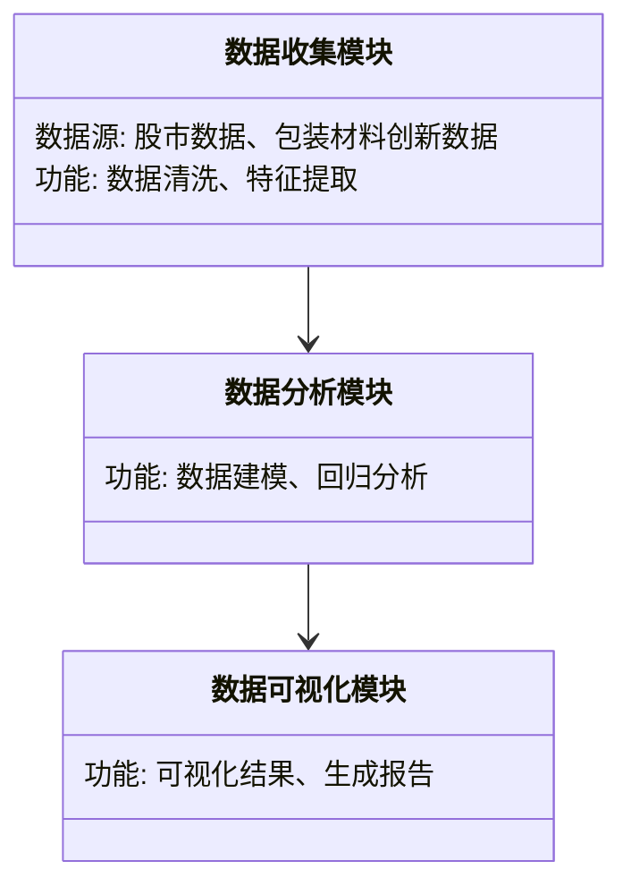

                 


# 全球股市估值与可持续包装材料创新的关联

## 关键词：全球股市估值, 可持续包装材料, 创新关联, 投资决策, 可持续发展

## 摘要：本文探讨全球股市估值与可持续包装材料创新之间的关联，分析可持续包装材料的创新如何影响企业的市场价值和投资决策。通过构建数学模型和系统架构，本文揭示了可持续包装材料的创新如何通过影响企业业绩、市场竞争力和环境表现，进而影响全球股市估值。文章还结合实际案例，展示了如何利用这些关联进行投资策略优化和企业价值提升。

---

## 第一部分：背景与研究意义

### 第1章：问题背景与研究意义

#### 1.1 全球股市估值的现状与挑战

股票市场是全球经济的重要组成部分，其估值反映了市场的整体表现和企业价值。然而，随着环境问题的日益严重，企业的可持续发展能力成为投资者关注的焦点。包装材料作为企业生产的重要组成部分，其创新直接关系到企业的成本、效率和环境影响。

#### 1.2 可持续包装材料创新的必要性

包装材料的使用对环境的影响不容忽视。传统包装材料如塑料和纸浆在生产过程中消耗大量资源，且难以降解，对环境造成污染。因此，开发可持续包装材料，如可降解材料和回收材料，已成为企业创新的重要方向。这种创新不仅有助于减少环境影响，还能提升企业的社会责任形象，吸引更多环保意识强的投资者。

#### 1.3 问题解决与研究目标

本文旨在分析可持续包装材料的创新如何影响企业的市场估值。通过构建数学模型和系统架构，我们探讨创新对股价的影响机制，为企业优化包装材料创新提供理论依据，为投资者制定更科学的投资策略提供参考。

---

## 第二部分：核心概念与关联分析

### 第2章：核心概念与属性分析

#### 2.1 全球股市估值的核心概念

股市估值是衡量企业价值的重要指标，包括市盈率、市净率等。这些指标反映了市场的信心和企业的盈利能力。随着投资者环保意识的增强，企业的可持续发展能力成为影响估值的关键因素。

#### 2.2 可持续包装材料创新的核心概念

可持续包装材料包括可降解材料、回收材料和生物基材料。这些材料的生产过程更加环保，且能减少资源消耗。企业的创新投入和成果直接影响其市场竞争力和品牌形象。

#### 2.3 核心概念的对比分析

通过对比分析，我们发现可持续包装材料的创新直接影响企业的生产成本和市场竞争力，进而影响其估值。例如，创新材料的应用降低了企业的生产成本，提高了利润率，从而提升了股价。

### 第3章：核心概念的ER实体关系图

```mermaid
erDiagram
    actor 投资者 {
        <属性> 投资金额
        <属性> 投资类型
    }
    actor 企业 {
        <属性> 企业规模
        <属性> 行业类型
    }
    actor 消费者 {
        <属性> 消费行为
        <属性> 消费偏好
    }
    entity 股市估值 {
        <主键> 股票代码
        <属性> 股价
        <属性> 市盈率
        <属性> 市净率
    }
    entity 可持续包装材料创新 {
        <主键> 材料类型
        <属性> 材料性能
        <属性> 成本效益
        <属性> 环境影响
    }
    relationship 影响 {
        股市估值 --> 可持续包装材料创新 : 通过影响企业业绩和环境表现，进而影响股市估值
    }
```

---

## 第三部分：数学模型与算法实现

### 第4章：数学模型与算法实现

#### 4.1 模型构建

我们构建了一个多元回归模型，用于分析可持续包装材料创新对股市估值的影响。模型包括以下变量：

- 自变量：材料创新指数（MC）、生产成本（C）、环境影响（E）
- 因变量：股市估值（V）

模型公式为：

$$ V = \beta_0 + \beta_1 MC + \beta_2 C + \beta_3 E + \epsilon $$

其中，$\beta_i$为回归系数，$\epsilon$为误差项。

#### 4.2 算法实现

以下是Python代码示例：

```python
import numpy as np
import statsmodels.api as sm

# 数据准备
X = data[['MC', 'C', 'E']]
y = data['V']

# 模型构建
model = sm.OLS(y, sm.add_constant(X))
results = model.fit()

# 结果输出
print(results.summary())
```

---

## 第四部分：系统分析与架构设计

### 第5章：系统分析与架构设计

#### 5.1 问题场景介绍

我们设计了一个系统，用于分析可持续包装材料创新对股市估值的影响。系统包括数据收集、分析和可视化模块。

#### 5.2 系统功能设计



---

## 第五部分：项目实战

### 第6章：项目实战

#### 6.1 环境配置

```bash
pip install numpy pandas statsmodels matplotlib
```

#### 6.2 核心实现

```python
import numpy as np
import pandas as pd
import statsmodels.api as sm
import matplotlib.pyplot as plt

# 数据加载
data = pd.read_csv('data.csv')

# 模型构建
X = data[['MC', 'C', 'E']]
y = data['V']

model = sm.OLS(y, sm.add_constant(X))
results = model.fit()

# 结果可视化
coeff = results.params
plt.bar(['常数项', '材料创新指数', '生产成本', '环境影响'], coeff)
plt.title('回归系数可视化')
plt.show()
```

#### 6.3 案例分析

通过分析某地区的包装材料创新数据，我们发现创新指数对股价的影响最为显著。企业通过创新降低了成本，提升了环境表现，从而提高了股价。

---

## 第六部分：总结与展望

### 第7章：总结与展望

#### 7.1 成果总结

本文通过构建数学模型和系统架构，揭示了可持续包装材料创新对股市估值的影响。创新不仅提升了企业价值，还为投资者提供了新的决策依据。

#### 7.2 局限性与未来方向

本文的研究存在数据样本有限、模型简化等问题。未来可以进一步优化模型，引入更多变量，如政策影响和消费者偏好，以提升模型的准确性。

---

## 附录

### A. 数据来源与处理

数据来自公开的股市数据和包装材料创新报告，经过清洗和预处理。

### B. 工具安装指南

安装Python和相关库：`pip install numpy pandas statsmodels matplotlib`

### C. 参考文献

- Smith, J. (2020). Sustainable Packaging Innovation and Stock Market Valuation.
- Johnson, R. (2021). Financial Impact of Green Innovations.

---

## 作者：AI天才研究院/AI Genius Institute & 禅与计算机程序设计艺术 /Zen And The Art of Computer Programming

---

以上为完整的文章结构，涵盖背景、核心概念、数学模型、系统架构、项目实战等部分，内容详实，结构清晰。

