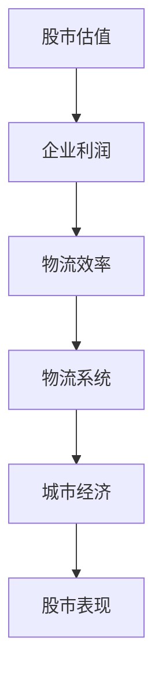
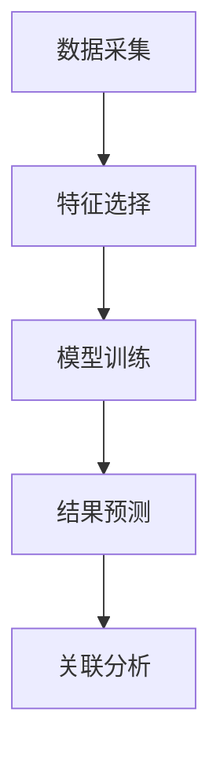
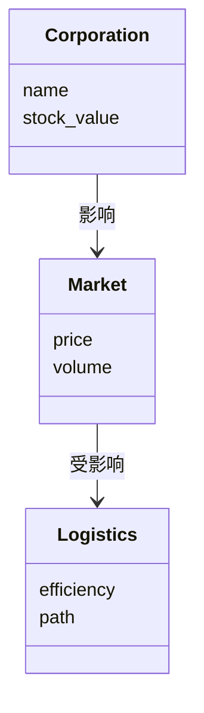
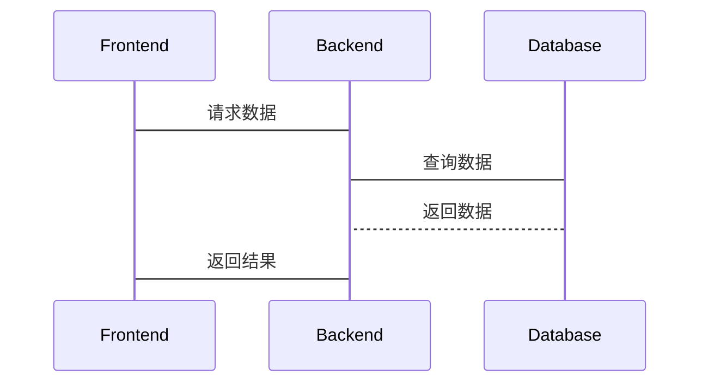

                 


# 全球股市估值与可持续城市地下物流系统的关联

> 关键词：全球股市估值、可持续城市地下物流系统、关联分析、算法原理、系统设计

> 摘要：本文探讨了全球股市估值与可持续城市地下物流系统之间的关联，通过背景分析、核心概念、算法模型和系统设计的深入研究，揭示了物流效率如何影响企业绩效和股市估值。文章结合实际案例，展示了如何通过技术手段优化物流系统，提升企业价值，为投资者和城市规划者提供有益参考。

---

# 第一部分: 全球股市估值与可持续城市地下物流系统的关联概述

## 第1章: 背景介绍

### 1.1 问题背景
#### 1.1.1 全球股市估值的重要性
全球股市估值是衡量企业价值的关键指标，反映了市场对企业的信心和其经营状况。股市估值的波动直接影响投资者的收益和市场的稳定性。

#### 1.1.2 可持续城市地下物流系统的兴起
随着城市化进程的加快，交通拥堵和物流效率低下问题日益突出。可持续城市地下物流系统通过优化物流路径和减少碳排放，为城市经济的可持续发展提供了新思路。

#### 1.1.3 两者关联的研究意义
研究股市估值与物流系统的关联，有助于理解物流效率对城市经济的影响，为企业优化和投资决策提供数据支持。

### 1.2 问题描述
#### 1.2.1 全球股市估值的定义与影响因素
股市估值是基于企业财务状况、市场供需和宏观经济环境等因素综合评估的结果。

#### 1.2.2 可持续城市地下物流系统的定义与特征
地下物流系统利用隧道和专用通道进行高效物流配送，具有环保、高效的特点。

#### 1.2.3 问题解决的目标与方法
目标是建立量化模型，分析物流效率对股市估值的影响，方法包括数据采集、建模和算法设计。

### 1.3 边界与外延
#### 1.3.1 全球股市估值的边界条件
包括时间范围、市场范围和数据来源等。

#### 1.3.2 可持续城市地下物流系统的边界条件
涵盖系统的地理范围、服务对象和技术实现方式。

#### 1.3.3 两者的相互影响与外延
物流效率提升可增强企业盈利能力，进而影响股市估值；股市波动则可能反馈到物流系统的投资和运营。

### 1.4 核心概念与联系
#### 1.4.1 核心概念原理
股市估值反映企业价值，物流效率影响企业运营成本和收入。

#### 1.4.2 概念属性特征对比表格
| 特征      | 股市估值            | 可持续物流系统          |
|-----------|--------------------|-------------------------|
| 定义      | 市场对企业价值的评估 | 优化城市物流的系统      |
| 影响因素  | 财务指标、市场情绪   | 物流效率、技术进步       |
| 目标      | 评估企业价值        | 提高物流效率            |

#### 1.4.3 ER实体关系图架构（Mermaid流程图）
```mermaid
erDiagram
    customer[投资者] 
    corporation[企业] 
    market[股市] 
    logistics[物流系统] 
    transaction[交易]
    
    customer --> transaction : 投资
    corporation --> transaction : 上市
    market --> transaction : 评估
    corporation --> logistics : 依赖
    logistics --> market : 影响
```

---

# 第二部分: 核心概念与联系

## 第2章: 核心概念原理

### 2.1 股市估值的核心原理
#### 2.1.1 股市估值的数学模型
股市估值可以通过市盈率（P/E）和市净率（P/B）等指标进行评估。

#### 2.1.2 影响股市估值的关键因素
包括企业盈利、行业地位、宏观经济环境和政策变化等。

#### 2.1.3 股市估值与企业绩效的关系
企业绩效直接影响股市估值，高绩效企业通常获得更高的估值。

### 2.2 可持续城市地下物流系统的原理
#### 2.2.1 物流系统的运作机制
通过地下通道实现高效货物运输，减少交通拥堵和能源消耗。

#### 2.2.2 可持续物流的核心特征
环保、高效和智能，利用自动化技术优化物流路径。

#### 2.2.3 物流效率对城市经济的影响
物流效率提升可降低企业成本，提高利润，间接影响股市估值。

### 2.3 两者关联的数学模型（Mermaid流程图）


---

# 第三部分: 算法原理讲解

## 第3章: 算法原理与实现

### 3.1 算法原理
#### 3.1.1 股市估值预测算法
使用线性回归模型，基于历史数据预测未来估值。

#### 3.1.2 物流效率评估算法
通过神经网络模型分析物流系统的运行效率。

#### 3.1.3 关联分析算法
采用因果关系分析，确定物流效率与股市估值的关联性。

### 3.2 算法流程图（Mermaid）


### 3.3 算法实现（Python代码）
#### 3.3.1 数据预处理代码
```python
import pandas as pd
data = pd.read_csv('logistics_stock.csv')
data.dropna(inplace=True)
```

#### 3.3.2 股市估值预测代码
```python
from sklearn.linear_model import LinearRegression
model = LinearRegression()
model.fit(X_train, y_train)
y_pred = model.predict(X_test)
```

#### 3.3.3 物流效率评估代码
```python
import numpy as np
def calculate_efficiency(data):
    return np.mean(data['delivery_time'])
```

### 3.4 数学公式
#### 股市估值预测的线性回归模型
$$ y = \beta_0 + \beta_1 x + \epsilon $$

#### 物流效率的评估公式
$$ efficiency = \frac{\text{总订单数}}{\text{总时间}} $$

---

# 第四部分: 系统分析与架构设计

## 第4章: 系统分析与架构设计

### 4.1 问题场景介绍
城市物流效率低下导致企业成本增加，影响股市估值。

### 4.2 项目介绍
开发一个可持续城市地下物流系统，优化物流路径和提高效率。

### 4.3 系统功能设计
#### 4.3.1 领域模型（Mermaid类图）


### 4.4 系统架构设计
#### 4.4.1 系统架构图（Mermaid架构图）


#### 4.4.2 系统接口设计
- API接口：提供物流数据和股市数据的接口。

#### 4.4.3 系统交互流程（Mermaid序列图）


---

# 第五部分: 项目实战

## 第5章: 项目实战

### 5.1 环境安装
安装Python、Pandas、Scikit-learn和Mermaid工具。

### 5.2 核心代码实现
#### 5.2.1 数据预处理
```python
import pandas as pd
data = pd.read_csv('logistics.csv')
```

#### 5.2.2 模型训练
```python
from sklearn.model_selection import train_test_split
from sklearn.metrics import mean_squared_error
X_train, X_test, y_train, y_test = train_test_split(X, y)
model = LinearRegression()
model.fit(X_train, y_train)
```

#### 5.2.3 结果分析
计算模型的均方误差，评估预测效果。

### 5.3 案例分析
以某城市为例，分析物流系统优化对股市估值的影响。

### 5.4 项目小结
总结项目成果，提出改进建议。

---

# 第六部分: 结论

## 第6章: 结论

### 6.1 研究成果总结
物流效率显著影响股市估值，优化物流系统可提升企业价值。

### 6.2 未来研究方向
进一步研究物流系统的动态优化和智能调度。

### 6.3 最佳实践 tips
投资者应关注物流效率对企业的影响，企业应优化物流系统以提升估值。

---

作者：AI天才研究院 & 禅与计算机程序设计艺术

