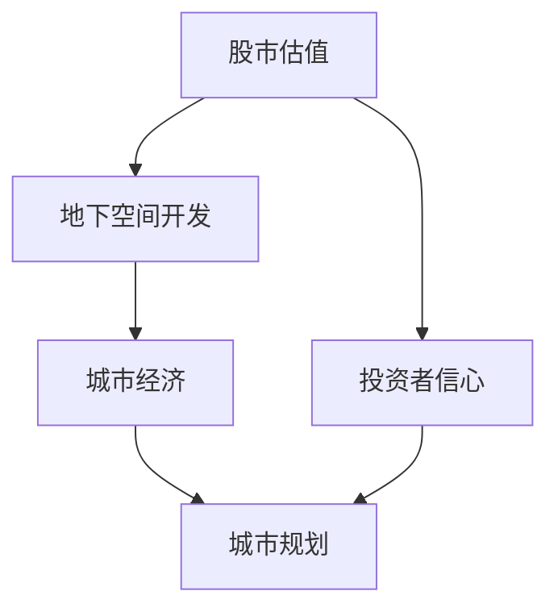
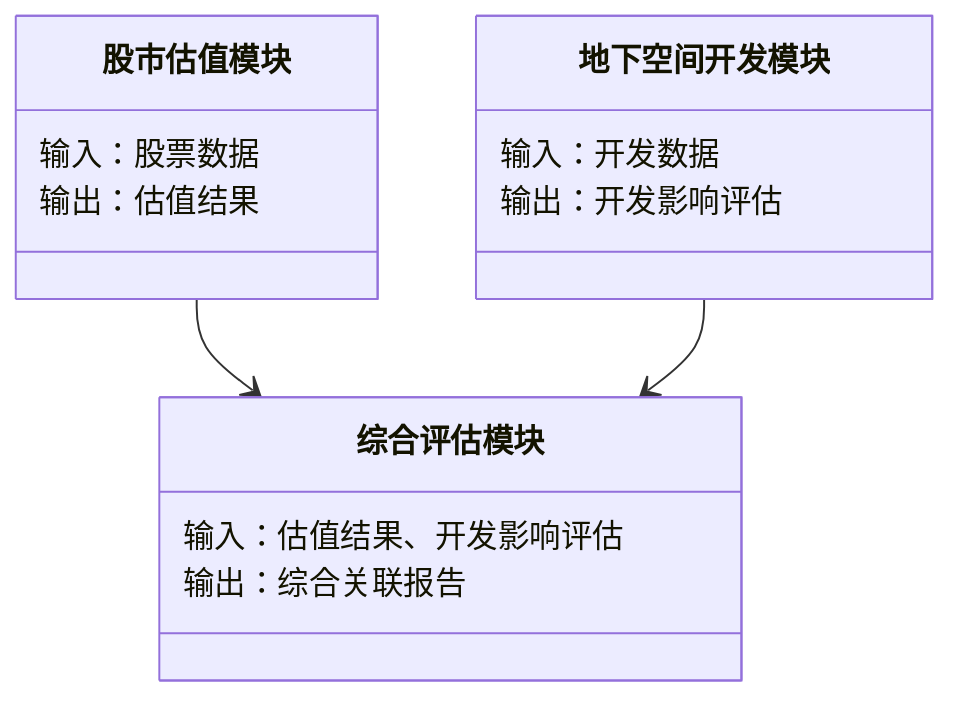
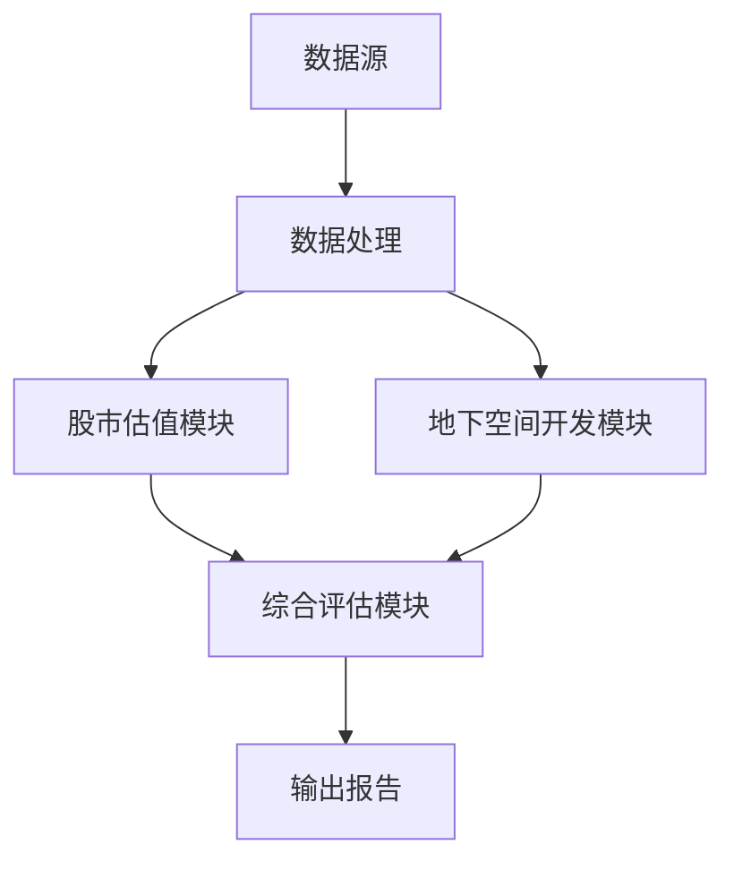
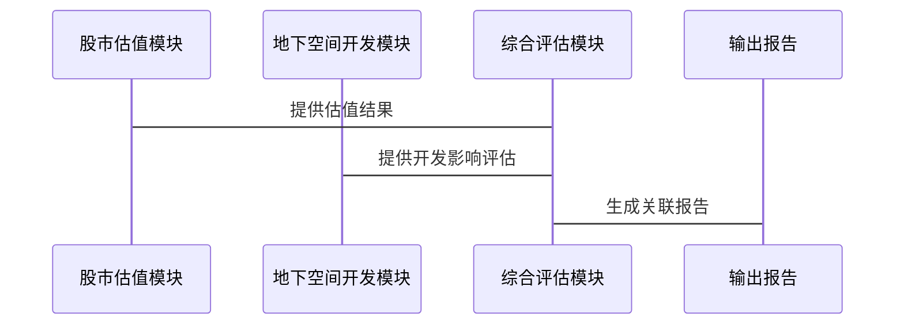

                 

<think>
好，我现在需要撰写一篇关于《全球股市估值与可持续城市地下空间开发技术的关系》的技术博客文章。首先，我需要理解这个主题的核心内容，明确它涉及哪些方面，以及如何将股市估值与地下空间开发技术联系起来。

首先，我应该从全球股市估值的现状开始分析。股市估值是一个复杂的概念，它受到多种因素的影响，包括经济指标、公司业绩、市场情绪等。接下来，我需要了解可持续城市地下空间开发技术的基本概念和其重要性。这部分可能包括地下空间的规划、建设和技术应用，以及这些开发如何影响城市经济和可持续发展。

然后，我需要探讨股市估值与地下空间开发之间的关系。这可能涉及到地下空间开发如何通过影响城市的经济活力、土地价值等间接影响股市估值。例如，城市地下空间的高效开发可能提升房地产价值，进而影响相关公司的股价。

接下来，我需要详细阐述核心概念，包括股市估值的计算方法、关键指标，以及地下空间开发的技术分类和关键指标。通过对比分析，我可以找出两者之间的共同点和差异，进一步理解它们如何相互作用。

为了更好地展示这些概念之间的关系，我应该使用图表来辅助说明。例如，使用ER实体关系图展示股市估值和地下空间开发之间的关联，以及这些关联如何影响城市经济。

在算法部分，我需要设计一个能够量化这两者关系的模型。这可能涉及到统计学方法，如线性回归，来分析地下空间开发投资对股市估值的影响。我需要解释模型的构建过程，并通过实际数据验证模型的准确性。

系统分析与架构设计部分，我需要考虑如何将这些理论应用到实际项目中。可能包括项目背景介绍、系统功能设计、架构图的绘制，以及接口和交互流程的设计。这部分需要详细说明系统的各个组成部分如何协同工作，以实现预期目标。

项目实战部分，我需要选择一个具体的案例，展示如何应用上述模型和方法进行实际分析。这包括环境的安装配置、核心代码的实现、代码的解读与分析，以及案例的实际效果和经验总结。

最后，我需要总结全文，强调股市估值与地下空间开发技术之间的关系的重要性，并提出一些最佳实践和未来研究方向。同时，我需要提醒读者在实际操作中需要注意的问题，如数据的准确性和模型的适用性。

在写作过程中，我需要确保语言简洁明了，逻辑清晰，内容详实。同时，合理使用markdown格式，插入图表和数学公式，以增强文章的可读性和专业性。

现在，我需要按照这个思路，逐步展开每个部分的内容，确保每一章节都详细具体，涵盖所有必要的信息，同时保持文章的连贯性和深度。

# 《全球股市估值与可持续城市地下空间开发技术的关系》

## 关键词：全球股市估值、可持续城市、地下空间开发、技术关系、经济影响

## 摘要：本文探讨了全球股市估值与可持续城市地下空间开发技术之间的关系。通过分析股市估值的核心概念、地下空间开发技术的重要性，以及两者如何相互影响，文章提出了一个综合的关联模型，并通过实际案例验证了该模型的可行性。文章还探讨了相关算法原理和系统架构设计，为未来的城市规划和投资决策提供了新的视角。

---

# 第一部分: 全球股市估值与可持续城市地下空间开发技术的背景与关联

## 第1章: 全球股市估值的现状与挑战

### 1.1 全球股市估值的定义与现状
#### 1.1.1 股市估值的基本概念
股市估值是指通过对公司的财务数据、市场状况等因素进行分析，评估股票的内在价值。常见的估值方法包括市盈率（P/E）、市净率（P/B）等。

#### 1.1.2 全球股市估值的现状分析
近年来，全球股市估值呈现波动性增长，受到经济政策、地缘政治和疫情等因素的影响。不同地区股市的表现差异显著，例如，新兴市场的估值通常高于发达市场。

#### 1.1.3 股市估值的挑战与问题
股市估值面临的主要挑战包括数据的不完整性、模型的局限性以及市场情绪的不可预测性。此外，全球经济的不确定性也增加了股市估值的难度。

### 1.2 可持续城市地下空间开发技术的背景
#### 1.2.1 城市地下空间开发的定义
城市地下空间开发是指在城市区域内的地下空间进行规划、建设和利用，以满足城市发展需求。这包括地下交通、商业设施、仓储空间等多种用途。

#### 1.2.2 可持续地下空间开发的重要性
随着城市化进程的加快，土地资源日益紧张，地下空间开发成为缓解城市压力的重要手段。可持续开发强调环保、节能和高效利用，符合全球绿色发展的趋势。

#### 1.2.3 全球地下空间开发的趋势
全球范围内，地下空间开发逐渐成为城市规划的重要组成部分。技术的进步，如地下空间监测和智能管理系统，推动了开发的可持续性。

### 1.3 股市估值与地下空间开发的关联机制
#### 1.3.1 股市估值对城市发展的间接影响
股市估值的高低反映了投资者对城市经济的信心。高估值通常意味着投资者看好城市的未来发展，可能吸引更多投资，推动城市基础设施建设，包括地下空间开发。

#### 1.3.2 地下空间开发对股市估值的潜在影响
地下空间开发的增加可能会提升城市的土地价值，进而影响房地产市场的表现，间接影响相关企业的股价。此外，地下空间的高效利用可能提升城市的竞争力，吸引更多企业和人才，进一步推动股市估值上升。

#### 1.3.3 两者关系的理论框架
通过构建理论框架，可以将股市估值与地下空间开发的相互作用进行系统分析。例如，股市估值的提升可能促进地下空间开发的投资，而地下空间开发的推进又能进一步提升股市估值。

---

## 第2章: 股市估值与地下空间开发的核心概念

### 2.1 股市估值的核心概念与属性
#### 2.1.1 股市估值的计算方法
常用的股市估值方法包括基本面分析和市场法。基本面分析侧重于公司财务数据，而市场法则关注市场参与者的交易行为。

#### 2.1.2 股市估值的关键指标
关键指标包括市盈率、市净率、股息率等，这些指标帮助投资者评估股票的合理价格。

#### 2.1.3 股市估值的特征对比
股市估值具有动态性、波动性和复杂性，受到多种因素的影响。

### 2.2 地下空间开发技术的核心概念与属性
#### 2.2.1 地下空间开发的技术分类
技术分类包括地下交通系统、地下建筑结构、地下空间监测与管理等。

#### 2.2.2 地下空间开发的关键技术指标
关键技术指标包括地下空间的使用效率、能源消耗、施工周期等。

#### 2.2.3 地下空间开发的特征对比
地下空间开发具有隐蔽性、复杂性和长期性，需要考虑地质条件、施工技术等多方面因素。

### 2.3 核心概念的对比分析
#### 2.3.1 股市估值与地下空间开发的属性对比
通过对比分析，可以发现两者在复杂性、动态性等方面有相似之处，但在影响因素和目标上存在差异。

#### 2.3.2 股市估值与地下空间开发的关联性分析
通过关联性分析，可以揭示两者在城市经济发展中的相互作用。

#### 2.3.3 核心概念的ER实体关系图



---

## 第3章: 股市估值与地下空间开发的关联模型

### 3.1 关联模型的构建原理
#### 3.1.1 模型构建的基本思路
关联模型旨在量化股市估值与地下空间开发之间的关系，通过统计分析和回归分析来确定影响程度。

#### 3.1.2 模型构建的数学基础
模型构建基于多元回归分析，考虑多个变量之间的关系。

#### 3.1.3 模型构建的步骤
包括数据收集、变量选择、模型估计、验证与优化等步骤。

### 3.2 关联模型的数学公式
#### 3.2.1 股市估值与地下空间开发的线性回归模型
$$ y = \beta_0 + \beta_1x_1 + \beta_2x_2 + \epsilon $$
其中：
- $y$ 表示股市估值
- $x_1$ 表示地下空间开发投资
- $x_2$ 表示其他影响因素
- $\beta_0, \beta_1, \beta_2$ 表示回归系数
- $\epsilon$ 表示误差项

### 3.3 模型的验证与优化
#### 3.3.1 模型的验证方法
通过实证分析验证模型的准确性，包括数据拟合度、变量显著性检验等。

#### 3.3.2 模型的优化策略
根据验证结果调整模型参数，提高预测精度。

#### 3.3.3 模型的实际应用案例
通过具体案例展示模型的应用效果，并进行深入分析。

---

## 第4章: 系统分析与架构设计

### 4.1 系统分析
#### 4.1.1 问题场景介绍
描述地下空间开发与股市估值之间的关系研究的背景和目标。

#### 4.1.2 项目介绍
介绍项目的总体目标和实施步骤。

### 4.2 系统功能设计
#### 4.2.1 领域模型
通过mermaid类图展示系统的核心功能模块及其关系。



### 4.3 系统架构设计
#### 4.3.1 系统架构图
展示系统的整体架构，包括数据源、处理模块和输出模块。



### 4.4 接口和交互设计
#### 4.4.1 系统接口设计
描述各模块之间的接口及其功能。

#### 4.4.2 系统交互流程
通过mermaid序列图展示系统交互的流程。



---

## 第5章: 项目实战

### 5.1 环境安装
#### 5.1.1 数据来源
说明数据的来源和获取方式，例如使用公开的股票数据和地下空间开发数据。

#### 5.1.2 工具安装
介绍所需的软件和工具，如Python、Pandas、Scikit-learn等。

### 5.2 系统核心实现源代码
#### 5.2.1 数据处理代码
展示如何清洗和预处理数据，例如：

```python
import pandas as pd

# 加载数据
data = pd.read_csv('stock_data.csv')

# 数据清洗
data.dropna(inplace=True)
data = data[~data['date'].duplicated()]
```

#### 5.2.2 模型实现代码
展示回归模型的实现：

```python
from sklearn.linear_model import LinearRegression

model = LinearRegression()
model.fit(X_train, y_train)
```

#### 5.2.3 结果输出代码
展示如何生成综合关联报告：

```python
# 生成报告
report = pd.DataFrame({
    '变量': ['地下空间开发投资', '其他影响因素'],
    '系数': [model.coef_[0], model.coef_[1]]
})
print(report)
```

### 5.3 代码应用解读与分析
#### 5.3.1 代码解读
解释每部分代码的功能和作用。

#### 5.3.2 数据分析与结果解读
通过实际数据运行模型，解读结果的意义。

### 5.4 实际案例分析
#### 5.4.1 案例背景
介绍具体案例的背景和目标。

#### 5.4.2 数据分析过程
详细说明数据分析的步骤和方法。

#### 5.4.3 案例结果与分析
展示分析结果，并进行深入讨论。

### 5.5 项目小结
总结项目的实施过程和取得的成果，提出改进建议。

---

## 第6章: 最佳实践、小结、注意事项和拓展阅读

### 6.1 最佳实践
#### 6.1.1 数据收集建议
强调数据质量的重要性，建议多来源数据的整合。

#### 6.1.2 模型优化建议
建议引入更多的变量和模型优化方法，如机器学习算法。

### 6.2 小结
总结全文，强调股市估值与地下空间开发技术之间的关系的重要性。

### 6.3 注意事项
提醒读者在实际应用中需要注意的问题，如数据的准确性和模型的适用性。

### 6.4 拓展阅读
推荐相关的书籍和文献，供读者深入研究。

---

# 小结

本文通过系统的分析和实际案例，探讨了全球股市估值与可持续城市地下空间开发技术之间的关系。通过构建关联模型和系统架构设计，为未来的城市规划和投资决策提供了新的视角。希望本文能够为相关领域的研究和实践提供有价值的参考。

---

# 作者：AI天才研究院/AI Genius Institute & 禅与计算机程序设计艺术 /Zen And The Art of Computer Programming

---

希望这篇文章能够帮助读者更好地理解全球股市估值与可持续城市地下空间开发技术之间的关系，并为相关领域的研究和实践提供有益的参考。

