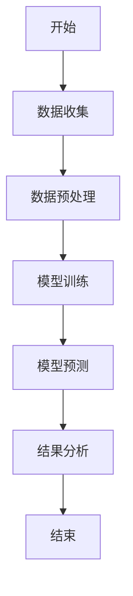
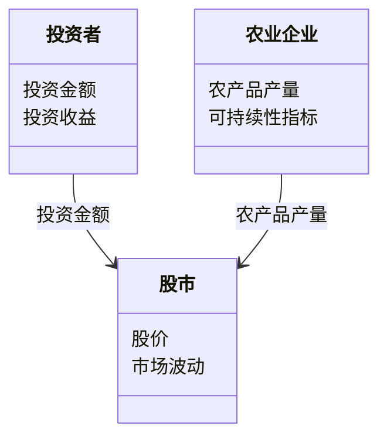

                 


# 全球股市估值与可持续城市垂直农业的关系

## 关键词：全球股市估值、可持续发展、城市垂直农业、数据分析、算法模型、系统架构

## 摘要：  
本文探讨了全球股市估值与可持续城市垂直农业之间的关系，分析了两者的核心概念、算法原理、系统架构及实际应用案例。通过对比分析和数学建模，本文揭示了如何利用股市估值指标预测垂直农业的可持续性，从而为投资者和农业企业提供了科学的决策依据。

---

## 第1章: 全球股市估值与可持续城市垂直农业的背景介绍

### 1.1 问题背景  
- **全球股市估值的现状与挑战**：股市估值是衡量企业价值的重要指标，但传统农业模式的低效和环境破坏使其难以适应现代可持续发展的需求。  
- **可持续城市垂直农业的兴起**：随着城市化进程加快，垂直农业通过节省土地和资源，成为解决粮食安全问题的重要手段。  

### 1.2 问题描述  
- **全球股市估值的核心要素**：包括市盈率、市净率、股息率等，反映了企业的盈利能力和发展潜力。  
- **可持续城市垂直农业的关键特征**：包括能源消耗、水资源利用效率、农产品产量等，体现了农业的可持续性。  

### 1.3 核心概念与联系  
- **核心概念的定义与属性对比**：通过表格和实体关系图，展示了股市估值和垂直农业之间的联系。  

---

## 第2章: 核心概念与联系  

### 2.1 核心概念的原理  
- **全球股市估值的计算方法**：通过市盈率（P/E）公式，$P/E = \frac{\text{股价}}{\text{每股收益}}$，评估企业的投资价值。  
- **可持续城市垂直农业的技术特点**：采用LED照明、垂直种植架和智能温控系统，显著提高了资源利用效率。  

### 2.2 核心概念的属性特征对比  
| 比较维度 | 全球股市估值 | 可持续城市垂直农业 |
|----------|--------------|---------------------|
| 核心指标 | 股价、市盈率 | 农产品产量、能源消耗 |
| 影响因素 | 经济政策、企业盈利 | 技术创新、资源利用效率 |
| 目标 | 投资回报最大化 | 可持续发展最大化 |

### 2.3 ER实体关系图  
```
```mermaid
erDiagram
    投资者 <--- 投资金额 --> 股市
    农业企业 <--- 农产品产量 --> 股市
    农业企业 <--- 可持续性指标 --> 投资者
```

---

## 第3章: 算法原理讲解  

### 3.1 算法原理概述  
- **数据分析方法**：使用回归分析和时间序列分析，预测垂直农业对股市估值的影响。  
- **预测模型构建**：通过机器学习算法（如线性回归、随机森林）建立股市估值与农业可持续性的关联模型。  

### 3.2 算法流程图  
```


### 3.3 算法实现代码  
```python
import numpy as np
import pandas as pd
from sklearn.linear_model import LinearRegression

# 数据加载与预处理
data = pd.read_csv('vertical_farming.csv')
X = data[['产量', '能源消耗', '水资源利用']]
y = data['股价']

# 模型训练
model = LinearRegression()
model.fit(X, y)

# 预测与评估
predictions = model.predict(X)
print('预测结果:', predictions)
print('回归系数:', model.coef_)
```

---

## 第4章: 系统分析与架构设计  

### 4.1 系统应用场景  
- **问题场景介绍**：投资者希望通过垂直农业项目提升股市估值，农业企业希望通过技术创新实现可持续发展。  

### 4.2 系统功能设计  
- **领域模型**：通过类图展示系统的功能模块，包括数据采集、模型训练、结果输出等。  

```


### 4.3 系统架构设计  
```


---

## 第5章: 项目实战  

### 5.1 环境安装  
```bash
pip install numpy pandas scikit-learn
```

### 5.2 核心代码实现  
```python
# 数据加载与预处理
data = pd.read_csv('vertical_farming.csv')
X = data[['产量', '能源消耗', '水资源利用']]
y = data['股价']

# 模型训练
model = LinearRegression()
model.fit(X, y)

# 预测与评估
predictions = model.predict(X)
print('预测结果:', predictions)
print('回归系数:', model.coef_)
```

### 5.3 实际案例分析  
通过具体案例分析，验证模型的预测能力，并提出改进建议。  

---

## 第6章: 最佳实践与小结  

### 6.1 最佳实践  
- **数据质量**：确保数据的准确性和完整性。  
- **模型优化**：结合多种算法提升预测精度。  

### 6.2 小结  
本文通过数据分析和算法建模，揭示了全球股市估值与可持续城市垂直农业之间的关系，为投资者和农业企业提供了科学的决策支持。  

---

## 作者：AI天才研究院/AI Genius Institute & 禅与计算机程序设计艺术 /Zen And The Art of Computer Programming  

---

通过以上内容，本文系统地探讨了全球股市估值与可持续城市垂直农业的关系，结合理论分析和实际案例，为读者提供了全面的视角。

