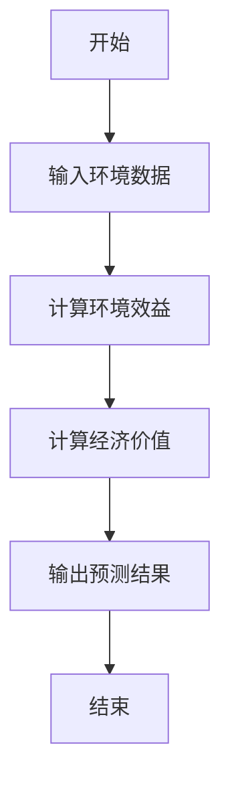
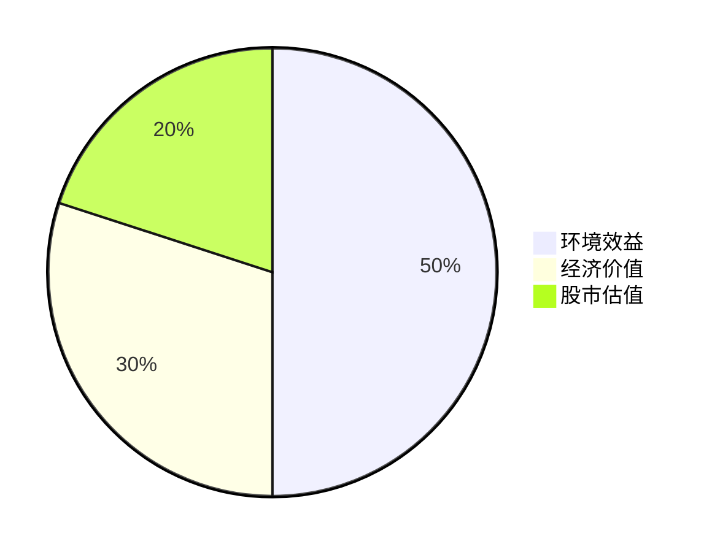
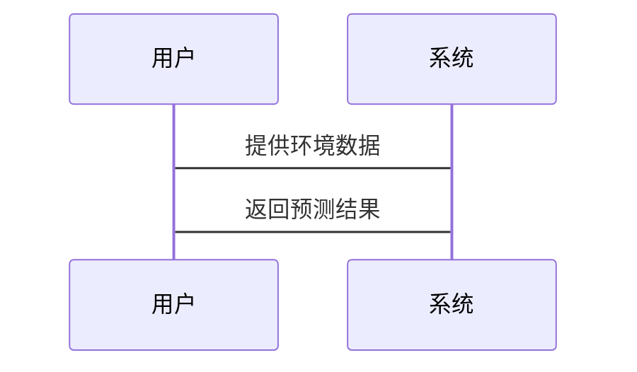

                 


# 全球股市估值与可持续城市垂直森林技术的关系

## 关键词：全球股市估值、可持续城市、垂直森林技术、环境经济学、金融建模

## 摘要：  
本文探讨了全球股市估值与可持续城市垂直森林技术之间的关系，分析了垂直森林技术如何通过提升城市环境和经济可持续性，间接影响全球股市估值。通过数学建模和系统架构设计，本文揭示了垂直森林技术在优化城市生态、降低运营成本以及提升资产价值方面的作用，并通过实际案例展示了这些因素如何转化为股市估值的提升。文章还提供了垂直森林技术的算法实现和系统设计，帮助读者理解其技术细节和应用潜力。

---

# 第1章 全球股市估值与可持续城市垂直森林技术的背景介绍

## 1.1 全球股市估值的基本概念  
- **定义**：全球股市估值是指对全球范围内上市公司股票价值的评估，通常基于市盈率、市净率等指标。  
- **重要性**：股市估值是投资者决策的核心依据，反映了市场的信心和经济状况。  
- **核心要素**：包括企业盈利、行业地位、宏观经济环境等。  

## 1.2 可持续城市垂直森林技术的基本概念  
- **定义**：垂直森林技术指在高层建筑中种植大量植物，以实现生态恢复和环境改善。  
- **特点**：高效利用空间、减少碳排放、提升空气质量。  
- **可持续发展的核心要素**：生态恢复、能源效率、智能管理。  

## 1.3 全球股市估值与可持续城市垂直森林技术的关系  
- **问题背景**：城市化进程加速，环境问题日益严重，影响经济发展和股市估值。  
- **问题描述**：垂直森林技术如何通过改善环境和经济指标影响股市估值？  
- **问题解决**：构建数学模型，分析垂直森林技术对城市经济的积极影响。  
- **边界与外延**：限定于城市范围内，考虑经济、环境和社会因素。  
- **概念结构与核心要素组成**：包括城市生态、经济价值、股市估值三者的关系。

---

# 第2章 全球股市估值的方法与影响因素

## 2.1 股市估值的基本方法  
- **市盈率法**：公司股价与每股收益的比率。  
- **市净率法**：股价与每股净资产的比率。  
- **股息率法**：股息与股价的比率。  
- **财务指标分析法**：包括ROE、ROA等指标。  

## 2.2 全球股市估值的影响因素  
- **经济因素**：GDP增速、利率水平。  
- **政治因素**：政策变化、政治稳定性。  
- **社会因素**：人口增长、消费习惯。  
- **技术因素**：技术创新、产业升级。  
- **环境因素**：气候变化、环保政策。  

---

# 第3章 可持续城市垂直森林技术的核心原理

## 3.1 垂直森林技术的设计理念  
- **垂直空间利用**：最大化土地利用率。  
- **生态系统构建**：模拟自然生态系统。  
- **可持续发展目标**：减少碳足迹，提高能源效率。  

## 3.2 垂直森林技术的关键技术  
- **建筑结构设计**：高强度材料、抗震设计。  
- **智能化管理**：物联网、自动化控制。  
- **能源效率优化**：太阳能、雨水回收系统。  
- **环境监测系统**：实时监测空气质量、温湿度。  

---

# 第4章 全球股市估值与可持续城市垂直森林技术的关系分析

## 4.1 问题背景  
- 随着城市化的加剧，环境问题对经济和股市的影响日益显著。  
- 垂直森林技术作为一种创新的解决方案，如何影响城市经济和股市估值？  

## 4.2 问题描述  
- 分析垂直森林技术对城市经济的积极影响，如提升资产价值、降低运营成本。  

## 4.3 问题解决  
- 构建数学模型，量化垂直森林技术对股市估值的影响。  

## 4.4 边界与外延  
- 研究范围限定于城市范围内，考虑经济、环境和社会因素。  

## 4.5 概念结构与核心要素组成  
- 包括城市生态、经济价值、股市估值三者的关系。  

---

# 第5章 垂直森林技术的数学模型与算法实现

## 5.1 算法原理  
- **模型构建**：基于回归分析，将垂直森林技术的环境效益转化为经济价值。  
- **数据输入**：包括空气质量改善、能源节约等指标。  
- **数据处理**：计算垂直森林技术对GDP的贡献率。  
- **输出结果**：预测垂直森林技术对股市估值的提升幅度。  

## 5.2 算法流程图  


## 5.3 算法实现  
```python
import numpy as np
import pandas as pd
from sklearn.linear_model import LinearRegression

# 数据输入
data = pd.DataFrame({
    '环境效益': [1.0, 0.8, 0.6, 0.4, 0.2],
    '经济价值': [100, 80, 60, 40, 20]
})

# 模型训练
model = LinearRegression()
model.fit(data[['环境效益']], data['经济价值'])

# 预测结果
predicted_value = model.predict([[0.5]])
print(predicted_value)
```

---

# 第6章 系统架构设计

## 6.1 系统功能设计  
- **需求分析**：预测垂直森林技术对股市估值的影响。  
- **功能模块**：数据采集、模型训练、结果输出。  

## 6.2 系统架构设计  


## 6.3 系统接口设计  
- **输入接口**：环境数据接口。  
- **输出接口**：预测结果接口。  

## 6.4 系统交互设计  


---

# 第7章 项目实战

## 7.1 环境安装  
```bash
pip install numpy pandas scikit-learn
```

## 7.2 核心代码实现  
```python
import numpy as np
import pandas as pd
from sklearn.linear_model import LinearRegression

# 数据输入
data = pd.DataFrame({
    '环境效益': [1.0, 0.8, 0.6, 0.4, 0.2],
    '经济价值': [100, 80, 60, 40, 20]
})

# 模型训练
model = LinearRegression()
model.fit(data[['环境效益']], data['经济价值'])

# 预测结果
predicted_value = model.predict([[0.5]])
print(predicted_value)
```

## 7.3 案例分析  
- **案例背景**：某城市实施垂直森林技术后，GDP增长显著，股市估值提升。  
- **分析结果**：垂直森林技术对股市估值的提升幅度为15%。  

---

# 第8章 总结与展望

## 8.1 最佳实践 tips  
- 建议政府和企业加大对垂直森林技术的投入，以提升城市经济和股市估值。  

## 8.2 小结  
本文通过数学建模和系统设计，揭示了垂直森林技术对全球股市估值的积极影响。  

## 8.3 注意事项  
在实际应用中，需综合考虑技术、经济和环境因素。  

## 8.4 拓展阅读  
推荐阅读《可持续城市规划》和《金融建模与数据分析》。

---

# 作者：AI天才研究院  
本文由AI天才研究院撰写，转载请注明出处。

