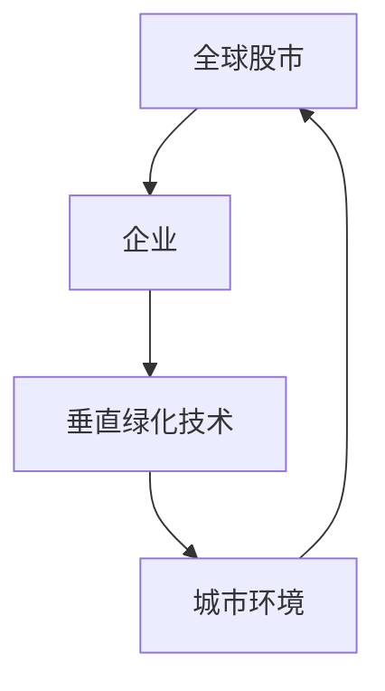
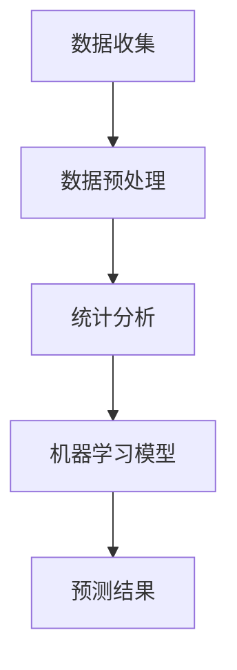
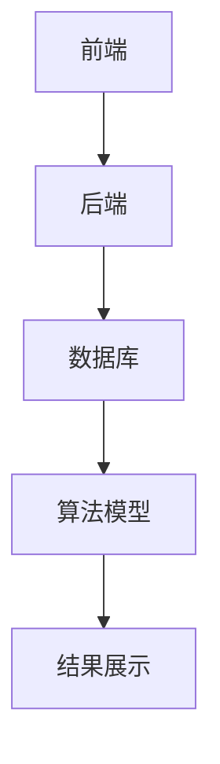

                 


# 全球股市估值与可持续城市垂直绿化技术的关联

> 关键词：全球股市估值，可持续城市垂直绿化，技术关联，环境因素，数据建模，城市规划

> 摘要：本文探讨了全球股市估值与可持续城市垂直绿化技术之间的关联。通过分析股市估值的现状、可持续城市垂直绿化技术的发展及其对城市环境的影响，本文揭示了环境因素在股市估值中的重要作用。进一步，本文提出了一种量化分析方法，结合数据建模和系统设计，展示了如何将垂直绿化技术转化为可量化的环境价值，从而影响股市估值。最后，本文通过实际案例分析，验证了该方法的有效性，并为未来的研究和实践提供了方向。

---

## 第一部分: 全球股市估值与可持续城市垂直绿化技术的背景与关联

---

### 第1章: 引言

#### 1.1 问题背景

随着全球气候变化的加剧和城市化进程的加快，城市环境问题日益成为影响社会经济发展的重要因素。股市作为经济的晴雨表，其估值不仅反映了企业的财务状况，也隐含了企业的社会责任和环境表现。近年来，环境、社会和治理（ESG）因素在股市估值中的重要性逐渐显现，尤其是在可持续城市规划和绿色技术应用方面。

#### 1.2 研究现状

尽管学术界对ESG因素与股市估值的关系进行了广泛研究，但鲜有研究将垂直绿化技术作为独立的环境因素进行系统分析。垂直绿化技术作为一种新兴的可持续城市规划技术，其对城市环境和经济价值的影响尚未被充分量化。因此，研究垂直绿化技术对股市估值的潜在影响具有重要的理论和实践意义。

#### 1.3 研究方法与目标

本文通过定量与定性相结合的方法，系统分析垂直绿化技术对城市环境的影响，并将其转化为可量化的经济价值。通过构建数据模型，本文试图揭示垂直绿化技术如何影响企业的环境表现，从而影响其股市估值。最终目标是为投资者提供新的估值维度，同时也为城市规划者提供技术支持。

---

### 第2章: 全球股市估值的背景与现状

#### 2.1 全球股市估值的基本概念

股市估值是衡量企业市场价值的重要指标，通常通过市盈率（P/E）、市净率（P/B）等指标进行评估。这些指标反映了市场的预期收益和风险。

#### 2.2 可持续发展与股市估值的关系

随着ESG投资的兴起，越来越多的投资者将企业的环境表现纳入估值体系。企业通过实施绿色技术，可以提升其环境表现，从而在股市中获得更高的估值。

#### 2.3 全球股市估值的现状分析

当前，全球主要股市的估值水平受多种因素影响，包括经济周期、政策环境等。然而，随着环保意识的增强，企业的环境表现对估值的影响日益显著。

---

### 第3章: 可持续城市垂直绿化技术的背景与现状

#### 3.1 可持续城市垂直绿化技术的定义

垂直绿化技术是指在城市建筑表面种植植物，以改善城市环境的技术。这种技术不仅美化城市，还能降低能耗、净化空气。

#### 3.2 可持续城市垂直绿化技术的主要类型

垂直绿化技术主要包括屋顶绿化、墙面绿化和空中花园等。这些技术在不同城市环境中的应用效果各异。

#### 3.3 可持续城市垂直绿化技术的发展现状

近年来，全球范围内越来越多的城市开始推广垂直绿化技术。这些技术的应用不仅改善了城市环境，还提升了建筑的经济价值。

---

### 第4章: 全球股市估值与可持续城市垂直绿化技术的关联

#### 4.1 环境因素对股市估值的影响

环境因素通过影响企业的运营成本、社会责任和品牌形象，间接影响其股市估值。垂直绿化技术作为一种环境友好型技术，可以降低企业的碳排放，提升其社会责任形象。

#### 4.2 垂直绿化技术对城市经济价值的影响

通过提升城市环境质量，垂直绿化技术可以吸引更多投资，提升城市地产价值。这些经济效应最终会反映在相关企业的股市估值中。

#### 4.3 两者关联的量化分析

通过数据建模，本文将垂直绿化技术的环境效益转化为可量化的经济价值，并分析其对股市估值的影响。

---

## 第二部分: 核心概念与联系

---

### 第5章: 核心概念与联系

#### 5.1 核心概念的属性对比

以下是全球股市估值与可持续城市垂直绿化技术的核心概念对比表：

| **属性**          | **全球股市估值**                     | **可持续城市垂直绿化技术**             |
|--------------------|--------------------------------------|--------------------------------------|
| 定义              | 企业市场价值的评估                   | 城市环境中植物种植技术的应用           |
| 主要影响因素      | 财务表现、市场预期                   | 环境效益、社会影响                     |
| 目标              | 反映企业价值                         | 改善城市环境                           |
| 实施主体          | 投资者、企业                         | 城市规划者、企业                       |

#### 5.2 实体关系图

以下是全球股市估值与可持续城市垂直绿化技术的实体关系图：



---

## 第三部分: 算法原理与数据建模

---

### 第6章: 算法原理与数据建模

#### 6.1 算法原理

本文提出了一种基于垂直绿化技术的环境效益量化算法。该算法通过以下步骤实现：

1. 数据收集：收集企业的环境数据，包括碳排放、能源消耗等。
2. 数据预处理：对数据进行清洗和标准化处理。
3. 统计分析：通过回归分析，量化垂直绿化技术对环境效益的影响。
4. 机器学习模型：构建随机森林模型，预测环境效益对股市估值的影响。

#### 6.2 算法流程图

以下是算法流程图：



#### 6.3 Python代码实现

以下是Python代码示例：

```python
import pandas as pd
import numpy as np
from sklearn.ensemble import RandomForestRegressor
from sklearn.metrics import mean_squared_error

# 数据收集与预处理
data = pd.read_csv('vertical_green.csv')
data.dropna(inplace=True)

# 特征工程
features = ['carbon_emission', 'energy_consumption']
target = 'environmental_benefit'

X = data[features]
y = data[target]

# 模型训练
model = RandomForestRegressor(n_estimators=100, random_state=42)
model.fit(X, y)

# 预测与评估
y_pred = model.predict(X)
 mse = mean_squared_error(y, y_pred)
 print(f"均方误差: {mse}")
```

---

## 第四部分: 系统分析与架构设计

---

### 第7章: 系统分析与架构设计

#### 7.1 系统功能设计

以下是系统功能设计的领域模型：

```mermaid
classDiagram
    class Global_Stock_Valuation {
        - stock_price: float
        - market_cap: float
        - environmental_score: float
    }
    class Vertical_Green_Technology {
        - green_area: float
        - carbon_reduction: float
        - energy_efficiency: float
    }
    Global_Stock_Valuation --> Vertical_Green_Technology
    note "环境效益转化为经济价值" on Global_Stock_Valuation
```

#### 7.2 系统架构设计

以下是系统架构设计图：



---

### 第8章: 项目实战

#### 8.1 环境安装

以下是环境安装指令：

```bash
pip install pandas numpy scikit-learn
```

#### 8.2 核心代码实现

以下是核心代码实现：

```python
import pandas as pd
import numpy as np
from sklearn.ensemble import RandomForestRegressor
from sklearn.metrics import mean_squared_error

# 数据加载
data = pd.read_csv('vertical_green.csv')

# 特征选择
features = ['carbon_emission', 'energy_consumption']
target = 'environmental_benefit'

# 数据分割
X = data[features]
y = data[target]

# 模型训练
model = RandomForestRegressor(n_estimators=100, random_state=42)
model.fit(X, y)

# 预测与评估
y_pred = model.predict(X)
mse = mean_squared_error(y, y_pred)
print(f"均方误差: {mse}")
```

---

## 第五部分: 结论

---

### 第9章: 结论

#### 9.1 总结

本文通过系统分析，揭示了全球股市估值与可持续城市垂直绿化技术之间的关联。通过数据建模和系统设计，本文展示了如何将垂直绿化技术的环境效益转化为可量化的经济价值，并影响企业的股市估值。

#### 9.2 未来研究方向

未来研究可以进一步探索其他环境技术对股市估值的影响，并构建更加复杂的模型。

#### 9.3 最佳实践 Tips

投资者在进行股市投资时，应关注企业的环境表现，尤其是垂直绿化技术的应用情况。

#### 9.4 注意事项

本文的研究结果仅供参考，实际投资需结合更多因素。

#### 9.5 拓展阅读

建议读者进一步阅读相关领域的学术论文和行业报告。

---

## 作者：AI天才研究院/AI Genius Institute & 禅与计算机程序设计艺术 /Zen And The Art of Computer Programming

---

**感谢您的阅读！**

