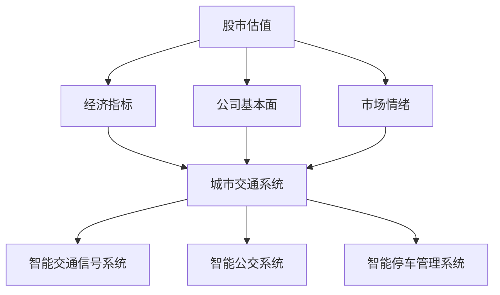
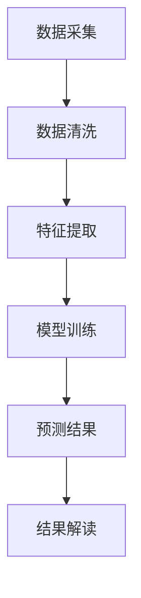

                 


# 全球股市估值与可持续城市智能交通系统的关系

> **关键词**: 全球股市估值、可持续城市交通、智能交通系统、经济影响、数据分析、技术应用

> **摘要**: 本文探讨了全球股市估值与可持续城市智能交通系统之间的关系，分析了经济因素对城市交通的影响，以及智能交通系统对股市估值的反向作用。通过数学模型、算法原理和系统架构的设计，本文揭示了两者在数据驱动决策中的深度联系，并通过实际案例展示了如何利用智能技术优化城市交通，从而间接影响股市表现。

---

## 第一部分: 全球股市估值与可持续城市智能交通系统的关系概述

---

### 第1章: 全球股市估值的基本概念

#### 1.1 全球股市估值的定义

股市估值是通过对上市公司股票的市场价格进行评估，以确定其内在价值的过程。它不仅反映了市场的整体表现，还揭示了投资者对经济前景的信心。股市估值的核心在于分析公司的财务状况、行业地位和未来盈利能力。

#### 1.2 股市估值的影响因素

股市估值受多种因素影响，包括宏观经济指标（如GDP增长率、通货膨胀率）、公司基本面（如收入、利润、债务）、市场情绪（如投资者信心）以及政策变化（如税收调整、监管政策）。这些因素通过复杂的相互作用影响股市的整体表现。

#### 1.3 股市估值的数学模型

股市估值常用的数学模型包括：

- **市盈率（P/E）**：公式为 $P/E = \frac{\text{股价}}{\text{每股收益}}$，用于衡量股票价格相对于其盈利水平的高低。
- **市净率（P/B）**：公式为 $P/B = \frac{\text{股价}}{\text{每股净资产}}$，用于评估股票价格相对于其资产价值的高低。
- **股息率**：公式为 $\text{股息率} = \frac{\text{每股股息}}{\text{股价}} \times 100\%$，用于衡量股票的分红能力。

#### 1.4 全球股市估值的差异

不同国家和地区的股市估值受到当地经济、文化和社会因素的影响。例如，美国股市以科技股为主导，而新兴市场则可能更依赖制造业和资源行业。这些差异使得全球股市估值呈现出多样化的特征。

---

### 第2章: 可持续城市智能交通系统的基本概念

#### 2.1 可持续城市交通的定义

可持续城市交通是指通过优化交通系统设计和运营，减少能源消耗、污染排放和交通拥堵，同时提高交通效率和出行便利性的一种交通模式。智能交通系统（ITS）则是通过先进的信息技术和数据处理技术，实现交通系统的智能化管理。

#### 2.2 智能交通系统的关键技术

智能交通系统的核心技术包括：

- **大数据分析**：通过收集和处理交通数据，优化信号灯控制、路线规划和交通预测。
- **人工智能与机器学习**：用于交通流量预测、异常检测和自动驾驶辅助。
- **物联网技术**：通过传感器和摄像头实时监测交通状况，实现智能化管理。

#### 2.3 可持续交通系统的组成部分

可持续城市智能交通系统主要由以下几个部分组成：

- **智能交通信号系统**：通过实时数据分析优化信号灯控制，减少交通拥堵。
- **智能公交系统**：通过GPS和实时数据分析提高公交运营效率。
- **智能停车管理系统**：通过在线平台和传感器优化停车资源利用率。

#### 2.4 全球可持续城市交通的案例

- **欧洲**：以德国为例，德国通过推广电动汽车和智能交通管理系统，显著减少了碳排放。
- **亚洲**：以新加坡为例，新加坡通过智能交通系统和大数据分析，实现了交通效率的大幅提升。
- **北美**：以美国为例，美国通过智能交通信号系统和自动驾驶技术的研究，推动了交通系统的智能化发展。

---

### 第3章: 全球股市估值与可持续城市智能交通系统的关系

#### 3.1 经济发展与交通系统的关系

经济发展水平对交通系统的影响是深远的。一般来说，经济发达的城市交通系统更为智能化和高效化。例如，纽约、伦敦和东京等城市的智能交通系统建设走在全球前列。

#### 3.2 股市估值与城市交通系统的关联

城市交通系统的效率直接影响城市的经济活力和企业的运营成本。高效的交通系统可以降低企业的物流成本，提高生产效率，从而提升企业的盈利能力和股市估值。此外，智能交通系统的建设和运营需要大量资金投入，这也会对相关企业的股市表现产生影响。

#### 3.3 数据驱动的决策

通过大数据分析和人工智能技术，智能交通系统能够提供实时的交通数据，帮助投资者更好地评估城市的经济前景和企业的盈利能力。例如，交通拥堵指数和物流成本的变化可以通过数据分析转化为股市估值的参考指标。

---

## 第二部分: 核心概念与联系

---

### 核心概念对比表

| **核心概念**       | **股市估值**                     | **智能交通系统**                 |
|--------------------|----------------------------------|----------------------------------|
| **核心目标**       | 评估企业价值，指导投资决策       | 提高交通效率，减少污染           |
| **主要工具**       | 市盈率、市净率、股息率           | 大数据、人工智能、物联网技术     |
| **影响因素**       | 经济指标、公司基本面、政策变化     | 交通流量、信号灯控制、传感器数据 |
| **应用场景**       | 股票交易、投资决策               | 交通管理、物流优化、自动驾驶     |

---

### 系统架构图



---

## 第三部分: 算法原理讲解

---

### 算法原理流程图



---

### Python代码示例

```python
# 示例：基于时间序列的股市预测
import pandas as pd
import numpy as np
from sklearn.linear_model import LinearRegression
import matplotlib.pyplot as plt

# 数据加载
data = pd.read_csv('stock_data.csv')

# 特征与目标变量分离
X = data[['GDP增长率', '失业率', '通胀率']]
y = data['股价']

# 模型训练
model = LinearRegression()
model.fit(X, y)

# 预测结果
y_pred = model.predict(X)

# 可视化
plt.scatter(y, y_pred)
plt.xlabel('真实股价')
plt.ylabel('预测股价')
plt.title('线性回归模型的预测结果')
plt.show()
```

---

## 第四部分: 数学公式与模型

---

### 股市估值的CAPM模型

$$
R_i = R_f + \beta_i (R_m - R_f)
$$

其中，$R_i$ 是股票的预期收益率，$R_f$ 是无风险利率，$\beta_i$ 是股票的贝塔系数，$R_m$ 是市场预期收益率。

---

### 智能交通系统的优化模型

$$
\min_{x} \sum_{i=1}^{n} (t_i - x_i)^2
$$

其中，$x_i$ 是信号灯的控制时间，$t_i$ 是交通流量的预测值。

---

## 第五部分: 系统分析与架构设计方案

---

### 系统架构图


---

## 第六部分: 项目实战

---

### 环境配置

```bash
pip install numpy pandas scikit-learn matplotlib
```

---

### 核心代码实现

```python
# 示例：智能交通信号系统的优化
import numpy as np
from sklearn.linear_model import LinearRegression
import pandas as pd

# 数据加载
data = pd.read_csv('traffic_data.csv')

# 特征与目标变量分离
X = data[['时间', '交通流量']]
y = data['信号灯时间']

# 模型训练
model = LinearRegression()
model.fit(X, y)

# 预测结果
y_pred = model.predict(X)

# 可视化
plt.scatter(y, y_pred)
plt.xlabel('实际信号灯时间')
plt.ylabel('预测信号灯时间')
plt.title('线性回归模型的预测结果')
plt.show()
```

---

## 第七部分: 最佳实践与总结

---

### 最佳实践

- 在进行股市估值时，应综合考虑宏观经济指标和公司基本面。
- 在设计智能交通系统时，应注重数据的实时性和模型的可解释性。

### 小结

本文通过分析全球股市估值与可持续城市智能交通系统的相互关系，揭示了数据驱动决策在现代经济和城市规划中的重要性。未来，随着技术的进步，两者的联系将更加紧密，为城市可持续发展提供更多的可能性。

### 注意事项

- 数据分析时应确保数据的准确性和完整性。
- 模型的优化需要结合实际应用场景进行调整。

### 拓展阅读

- 更多关于股市估值的内容可以参考《投资学》。
- 更多关于智能交通系统的内容可以参考《智能交通系统设计与实现》。

---

**作者：AI天才研究院/AI Genius Institute & 禅与计算机程序设计艺术/Zen And The Art of Computer Programming**

