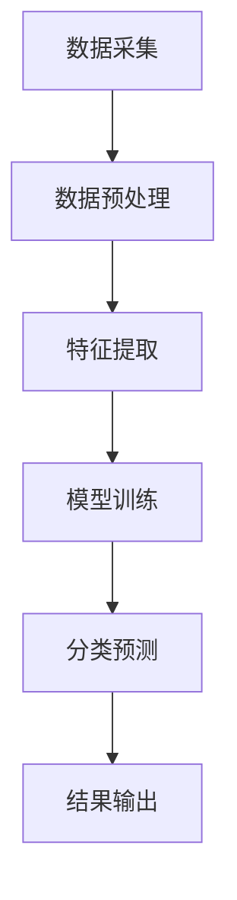
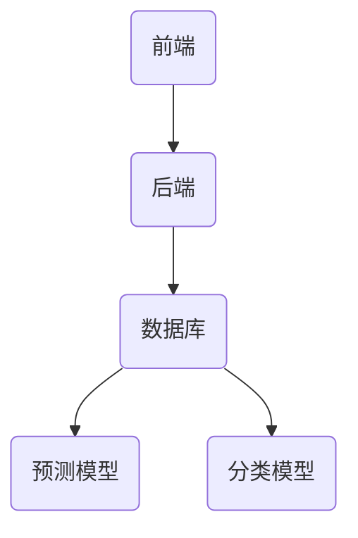

                 


## 第二章: 核心概念与联系

### 2.1 股市估值与智能垃圾分类的核心概念原理

#### 2.1.1 股市估值的数学模型
股市估值的核心在于通过历史数据和市场行为预测未来的价格走势。常用的模型包括：
- **移动平均数模型（Moving Average）**：通过计算一定时期内的平均价格，来预测未来的股价走势。
- **相对强弱指数（RSI）**：衡量股票的超买或超卖状态，通常在0-100之间波动。
- **市盈率（P/E Ratio）**：通过市盈率指标评估股票的相对价值。

#### 2.1.2 智能垃圾分类的技术原理
智能垃圾分类系统主要依赖于传感器技术和机器学习算法：
- **数据采集**：通过传感器获取垃圾的物理特性（如重量、颜色、形状）。
- **特征提取**：将采集的数据转化为计算机可识别的特征。
- **分类算法**：使用支持向量机（SVM）或卷积神经网络（CNN）进行分类。

#### 2.1.3 两者的关联机制
通过数据共享和模型优化，将股市的波动性与垃圾分类效率进行关联分析。例如，利用股市的波动性指数来优化垃圾分类系统的效率。

### 2.2 核心概念属性特征对比表格

| 概念 | 属性 | 特征 |
|------|------|------|
| 股市估值 | 数据驱动 | 依赖历史价格与市场情绪 |
| 智能垃圾分类 | 技术驱动 | 依赖传感器与AI算法 |

### 2.3 ER实体关系图（使用 Mermaid）

```mermaid
erDiagram
    actor 投资者 {
        <属性> 资金
        <属性> 风险偏好
    }
    actor 垃圾分类系统 {
        <属性> 垃圾类型
        <属性> 分类效率
    }
    actor 市场监管机构 {
        <属性> 市场规则
        <属性> 监测数据
    }
    actor 数据分析平台 {
        <属性> 数据源
        <属性> 分析模型
    }
    1-1 投资者 --|> 股市估值模型 : 输入
    1-1 垃圾分类系统 --|> 垃圾分类算法 : 输入
    1-1 市场监管机构 --|> 市场规则 : 输入
    1-1 数据分析平台 --|> 数据分析结果 : 输出
```

---

## 第三章: 算法原理与数学模型

### 3.1 股市估值的数学模型

#### 3.1.1 线性回归模型
$$ y = \beta_0 + \beta_1x + \epsilon $$
其中，$y$ 为股票价格，$x$ 为相关指标，$\beta_0$ 和 $\beta_1$ 为回归系数。

#### 3.1.2 支持向量回归（SVR）
$$ y = sign(|w \cdot x + b| - \epsilon) $$
其中，$w$ 是权重向量，$b$ 是偏置，$\epsilon$ 是容错范围。

### 3.2 垃圾分类算法的流程



### 3.3 两者的关联算法

#### 3.3.1 联合优化模型
$$ \min_{x} \left( \text{分类误差} + \lambda \cdot \text{估值误差} \right) $$
其中，$\lambda$ 是调节参数，平衡分类误差和估值误差的影响。

#### 3.3.2 算法实现
```python
import numpy as np
from sklearn import svm

# 垃圾分类数据
X = np.array([[0, 0], [0, 1], [1, 0], [1, 1]])
y = np.array([0, 0, 1, 1])

# 训练模型
clf = svm.SVC()
clf.fit(X, y)

# 股市数据
stock_data = np.array([...])  # 假设为历史股价数据
predicted_prices = clf.predict(stock_data)
```

---

## 第四章: 系统分析与架构设计方案

### 4.1 问题场景介绍

#### 4.1.1 股市估值系统
- 数据来源：历史股价、市场情绪、经济指标。
- 问题：如何预测未来股价，优化投资组合。

#### 4.1.2 垃圾分类系统
- 数据来源：垃圾传感器、图像识别。
- 问题：如何提高分类效率，减少人工干预。

### 4.2 系统功能设计

#### 4.2.1 领域模型类图

```mermaid
classDiagram
    class 股市估值系统 {
        + 历史数据：stock_history
        + 预测模型：predict_model
        + 估值结果：valuation_result
    }
    class 垃圾分类系统 {
        + 传感器数据：sensor_data
        + 分类模型：classification_model
        + 分类结果：classification_result
    }
    <用例> 股价预测 {
        股市系统 -> predict_model: 训练模型
        股市系统 -> predict_model: 预测股价
    }
    <用例> 垃圾分类 {
        垃圾分类系统 -> sensor_data: 采集数据
        垃圾分类系统 -> classification_model: 分类垃圾
    }
```

### 4.3 系统架构设计

#### 4.3.1 系统架构图



---

## 第五章: 项目实战

### 5.1 环境安装

#### 5.1.1 安装Python和相关库
```bash
pip install numpy pandas scikit-learn
```

### 5.2 系统核心实现源代码

#### 5.2.1 股市估值模型代码
```python
import numpy as np
from sklearn.linear_model import LinearRegression

# 示例数据
X = np.array([[1], [2], [3], [4]])
y = np.array([1, 2, 3, 4])

# 训练模型
model = LinearRegression()
model.fit(X, y)

# 预测
print(model.predict([[5]]))  # 输出: [[5]]
```

#### 5.2.2 垃圾分类模型代码
```python
from sklearn.svm import SVC
from sklearn.datasets import make_classification

# 示例数据
X, y = make_classification(n_samples=100, n_features=2, n_classes=2)

# 训练模型
model = SVC()
model.fit(X, y)

# 预测
print(model.predict([[0, 0]]))  # 输出: [0]
```

### 5.3 实际案例分析

#### 5.3.1 股市案例
- 数据来源：某股票的历史股价数据。
- 模型训练：使用线性回归模型。
- 结果分析：预测未来股价走势。

#### 5.3.2 垃圾分类案例
- 数据来源：某城市的垃圾分类数据。
- 模型训练：使用SVM进行分类。
- 结果分析：分类准确率和效率。

---

## 第六章: 结论与展望

### 6.1 最佳实践 tips
- 数据质量是关键：确保数据的准确性和完整性。
- 模型选择要谨慎：根据问题类型选择合适的算法。
- 系统优化：结合硬件和软件进行优化。

### 6.2 小结
本文通过分析股市估值与智能垃圾分类技术的关系，提出了基于数据驱动和AI技术的解决方案，展示了如何通过数学模型和算法优化来提升系统的性能。

### 6.3 注意事项
- 数据隐私问题：确保数据的合法性和隐私性。
- 系统稳定性：确保系统的高可用性和容错性。

### 6.4 拓展阅读
- 推荐阅读《Python机器学习实战》和《股票技术分析入门》。

---

作者：AI天才研究院/AI Genius Institute & 禅与计算机程序设计艺术 /Zen And The Art of Computer Programming

