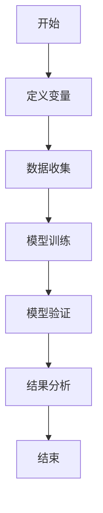

                 


# 全球股市估值与可持续城市规划的关联

## 关键词：
- 全球股市估值
- 可持续城市规划
- 经济影响
- 投资模型
- 城市设计

## 摘要：
本文探讨全球股市估值与可持续城市规划之间的关联，分析两者在经济、环境和社会层面的互动。通过建立数学模型，研究城市规划对股市的影响，反之亦然。文章结合实际案例，提出可持续城市规划对股市长期价值的影响，并展望未来投资趋势。

---

# 第一部分: 全球股市估值与可持续城市规划的背景与概念

## 第1章: 全球股市估值的现状与趋势

### 1.1 全球股市的基本概念

#### 1.1.1 股市的定义与功能
股市是金融市场的重要组成部分，提供企业融资和投资者资产配置的平台。股市估值是衡量企业价值的关键指标，反映了市场对企业的信心和未来盈利能力的预期。

#### 1.1.2 全球主要股市指数
全球主要股市指数包括标准普尔500指数（S&P 500）、纳斯达克指数、道琼斯指数、富时100指数等。这些指数代表了不同市场的整体表现，是投资者评估市场健康状况的重要工具。

#### 1.1.3 股市估值的基本方法
常用的基本方法包括市盈率（P/E）、市净率（P/B）、市销率（P/S）等，这些指标帮助投资者评估企业的价值和成长潜力。

### 1.2 股市估值的核心指标

#### 1.2.1 市盈率（P/E Ratio）
市盈率=股价/每股收益，反映了投资者对每股收益的支付意愿。低P/E可能意味着低估，高P/E可能意味着高成长或投机。

#### 1.2.2 市净率（P/B Ratio）
市净率=股价/每股净资产，适用于评估银行、房地产等资产密集型企业。低P/B可能意味着低估。

#### 1.2.3 市销率（P/S Ratio）
市销率=股价/每股收入，适用于亏损企业或成长型企业。

---

## 第2章: 可持续城市规划的定义与原则

### 2.1 可持续城市规划的背景

#### 2.1.1 城市化与环境问题
城市化带来环境污染、资源消耗等问题，推动可持续城市规划的发展。

#### 2.1.2 可持续发展的概念
可持续发展强调经济、社会和环境的平衡发展，避免过度消耗资源和破坏环境。

#### 2.1.3 可持续城市规划的目标
通过优化土地使用、交通系统、能源消耗等，构建生态友好、经济高效、社会公平的城市。

### 2.2 可持续城市规划的核心原则

#### 2.2.1 环境保护原则
减少碳排放、保护自然资源、提高能源使用效率。

#### 2.2.2 社会公平原则
确保所有居民享有平等的教育、医疗、住房等资源，减少社会不平等。

#### 2.2.3 经济效率原则
通过优化资源配置，提高经济产出，确保城市的可持续发展。

---

# 第二部分: 全球股市估值与可持续城市规划的关联分析

## 第3章: 全球股市估值与可持续城市规划的共同点与差异

### 3.1 共同点分析

#### 3.1.1 长期投资视角
两者都关注长期发展，股市估值注重企业的长期盈利能力，城市规划注重城市的长期可持续性。

#### 3.1.2 系统性与复杂性
股市估值涉及多因素分析，城市规划涉及多领域协同，两者都需要系统性思维。

#### 3.1.3 对未来收益的预测
股市估值基于对企业未来收益的预测，城市规划基于对城市未来发展潜力的评估。

### 3.2 差异点分析

#### 3.2.1 股市估值的金融属性
股市估值受市场情绪、宏观经济政策等因素影响，具有较强的波动性。

#### 3.2.2 城市规划的政策属性
城市规划受政府政策、法规的影响较大，具有较强的确定性。

#### 3.2.3 两者关注的主体与目标差异
股市估值关注企业和投资者，城市规划关注城市居民和政府。

---

## 第4章: 全球股市估值与可持续城市规划的相互作用

### 4.1 可持续城市规划对股市估值的影响

#### 4.1.1 绿色投资的兴起
随着环保意识的增强，投资者越来越关注企业的环境表现，绿色投资成为趋势。

#### 4.1.2 可持续城市发展对企业价值的影响
可持续的城市规划提高了企业的运营效率，降低了成本，增强了企业的竞争力。

#### 4.1.3 政策支持与股市估值的关系
政府对可持续城市规划的政策支持，如税收优惠、补贴等，提升了企业的估值。

### 4.2 全球股市估值对可持续城市规划的反馈作用

#### 4.2.1 股市资金对城市项目的支持
股市资金为城市基础设施建设、绿色能源项目等提供了资金支持。

#### 4.2.2 投资者行为对城市规划的影响
投资者的偏好影响城市规划的方向，如绿色建筑、公共交通的优先发展。

#### 4.2.3 股市波动对城市发展的潜在风险
股市波动可能影响城市的财政收入，进而影响城市的可持续发展。

---

# 第三部分: 全球股市估值与可持续城市规划的关联模型

## 第5章: 全球股市估值与可持续城市规划的关联模型构建

### 5.1 模型构建的基本思路

#### 5.1.1 确定核心变量
核心变量包括GDP增长率、 unemployment rate、环保投资、绿色技术应用等。

#### 5.1.2 确定变量之间的关系
通过回归分析等方法，确定变量之间的关系。

#### 5.1.3 模型的数学表达
构建多元回归模型：$$ Y = \beta_0 + \beta_1X_1 + \beta_2X_2 + ... + \beta_nX_n + \epsilon $$

### 5.2 使用mermaid画出算法流程图



### 5.3 算法实现

```python
import numpy as np
import pandas as pd
from sklearn.linear_model import LinearRegression

# 数据加载
data = pd.read_csv('data.csv')

# 定义自变量和因变量
X = data[['GDP增长率', '失业率', '环保投资']]
y = data['股市估值']

# 模型训练
model = LinearRegression()
model.fit(X, y)

# 输出系数
print(model.coef_)
```

### 5.4 系统架构设计


---

## 第6章: 项目实战

### 6.1 环境安装

```bash
pip install numpy pandas scikit-learn
```

### 6.2 核心实现

```python
import numpy as np
import pandas as pd
from sklearn.linear_model import LinearRegression
from sklearn.metrics import r2_score

# 数据加载
data = pd.read_csv('data.csv')

# 数据清洗
data.dropna()

# 划分训练集和测试集
X_train = data[['GDP增长率', '失业率', '环保投资']]
y_train = data['股市估值']

X_test = data[['GDP增长率', '失业率', '环保投资']].tail(10)
y_test = data['股市估值'].tail(10)

# 模型训练
model = LinearRegression()
model.fit(X_train, y_train)

# 模型预测
y_pred = model.predict(X_test)

# 模型评估
print(r2_score(y_test, y_pred))
```

---

## 第7章: 总结与展望

### 7.1 总结
本文通过分析全球股市估值与可持续城市规划的关联，提出了数学模型，并通过案例分析验证了模型的可行性。研究表明，可持续城市规划对股市估值有显著影响，绿色投资成为未来趋势。

### 7.2 展望
未来研究可以进一步探索更多影响因素，如技术创新、政策变化等，构建更复杂的模型，为投资者和城市规划者提供更好的决策支持。

---

作者：AI天才研究院/AI Genius Institute & 禅与计算机程序设计艺术 /Zen And The Art of Computer Programming

