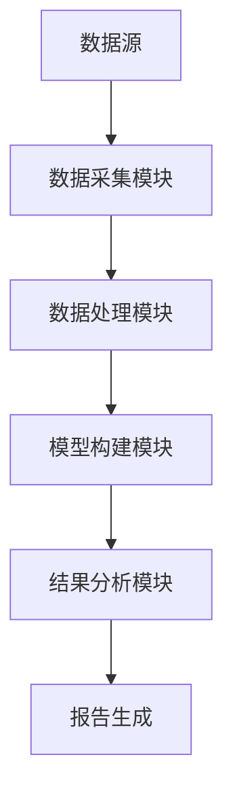

                 


# 全球股市估值与可持续建筑智能外墙技术的关系

> 关键词：全球股市估值, 可持续建筑, 智能外墙技术, 技术创新, 股票市场, 可持续发展, 股市分析

> 摘要：本文探讨了智能外墙技术在可持续建筑中的应用及其对全球股市估值的影响。通过分析技术创新如何改善建筑性能、降低成本，并提升企业的市场竞争力，进而影响其股价表现。文章结合实际案例，揭示了技术创新与股市估值之间的复杂关系，为投资者和企业提供有价值的参考。

---

## 第一部分：背景介绍

### 第1章：全球股市估值与可持续建筑智能外墙技术的关系概述

#### 1.1 问题背景
- **全球股市的波动与经济指标的关系**：股市估值受多种经济指标影响，包括企业盈利、行业趋势和宏观经济环境。
- **可持续建筑的发展趋势**：随着环保意识的增强，可持续建筑成为全球建筑行业的重要方向，智能外墙技术是其关键组成部分。
- **智能外墙技术的出现及其重要性**：智能外墙技术通过自动化和智能化手段，提升建筑能效，降低成本，成为推动可持续建筑发展的重要技术。

#### 1.2 问题描述
- **什么是智能外墙技术**：智能外墙技术利用传感器、自动化系统和智能控制，实现对外墙的智能化管理，优化能源使用。
- **可持续建筑对环境的影响**：通过减少能源消耗和碳排放，可持续建筑有助于缓解气候变化，符合全球环保目标。
- **全球股市估值的计算方法**：股市估值通常基于市盈率、市净率等指标，反映了市场对企业的信心和前景预期。

#### 1.3 问题解决
- **智能外墙技术如何影响建筑成本**：通过降低能源消耗和维护费用，智能外墙技术可以减少建筑的生命周期成本。
- **可持续建筑对能源消耗的影响**：智能外墙技术优化了建筑的能源使用，降低了运营成本。
- **如何将这些因素转化为股市估值**：企业采用智能外墙技术后，可能因为能效提升和成本降低而提高利润，从而提升股价。

#### 1.4 边界与外延
- **智能外墙技术的适用范围**：适用于新建筑和既有建筑的改造，尤其在商业和公共建筑中应用广泛。
- **可持续建筑的经济和社会影响**：不仅带来经济效益，还具有显著的社会和环境价值。
- **全球股市估值的局限性**：股市估值受多种因素影响，包括市场情绪和宏观经济环境，技术影响并非唯一因素。

#### 1.5 概念结构与核心要素
- **智能外墙技术的核心要素**：包括传感器、自动化系统、智能控制算法等。
- **可持续建筑的经济价值**：体现在能源成本降低、维护费用减少和资产价值提升。
- **全球股市估值的计算模型**：结合企业财务指标和市场预期，评估技术对股价的影响。

---

## 第二部分：核心概念与联系

### 第2章：智能外墙技术的核心原理

#### 2.1 智能外墙技术的定义与特点
- **智能外墙的基本定义**：利用自动化和智能化技术，实现对外墙功能的智能控制，如温控、湿度控制和光线调节。
- **智能外墙的技术特征**：包括高能效、自动化控制、远程监控和自适应调节。
- **智能外墙的优势与劣势**：优势在于能效高、维护方便，劣势是初期投资较高。

#### 2.2 可持续建筑的核心要素
- **环保材料的使用**：采用可回收和低挥发性材料，减少环境影响。
- **能源效率的提升**：通过智能外墙技术优化能源使用，降低碳排放。
- **建筑寿命的延长**：智能外墙技术提高了建筑的耐久性和维护效率，延长使用寿命。

#### 2.3 智能外墙技术与可持续建筑的关系
- **智能外墙技术在可持续建筑中的应用**：作为关键组成部分，提升建筑的能效和环保性能。
- **可持续建筑对智能外墙技术的需求**：推动技术创新，满足建筑行业对绿色技术的需求。
- **两者结合对建筑行业的影响**：推动建筑行业向可持续、智能化方向发展，促进技术创新和产业升级。

---

## 第三部分：算法原理讲解

### 第3章：智能外墙技术对股市估值的影响模型

#### 3.1 数据收集与预处理
- **数据来源**：收集建筑企业的财务数据、智能外墙技术应用情况、股市估值数据。
- **数据清洗**：处理缺失值、异常值，确保数据质量。
- **数据特征选择**：选择关键特征，如能源消耗、维护成本、股价波动等。

#### 3.2 模型建立与训练
- **线性回归模型**：建立回归模型，分析智能外墙技术对股价的影响。
  $$ y = \beta_0 + \beta_1x_1 + \beta_2x_2 + \epsilon $$
  其中，$y$为股价，$x_1$为能效提升，$x_2$为成本降低。
- **机器学习算法**：使用随机森林或支持向量机，提升模型预测准确性。

#### 3.3 模型验证与评估
- **模型评估指标**：R²值、均方误差（MSE）、准确率等。
- **模型验证**：通过交叉验证和实际案例验证模型的可靠性。

---

## 第四部分：系统分析与架构设计

### 第4章：系统架构设计

#### 4.1 系统功能设计
- **数据采集模块**：收集建筑能效数据和股价数据。
- **数据处理模块**：清洗和特征选择。
- **模型构建模块**：建立回归模型和机器学习模型。
- **结果分析模块**：评估模型并生成报告。

#### 4.2 系统架构图


---

## 第五部分：项目实战

### 第5章：项目实战与案例分析

#### 5.1 环境安装
- 安装Python和相关库（如pandas、scikit-learn）。
- 数据源获取：通过公开数据库或API获取相关数据。

#### 5.2 核心代码实现
```python
import pandas as pd
from sklearn.linear_model import LinearRegression
from sklearn.metrics import mean_squared_error

# 数据加载
data = pd.read_csv('building_data.csv')

# 特征与目标变量分离
X = data[['energy_efficiency', 'cost_reduction']]
y = data['stock_price']

# 模型训练
model = LinearRegression()
model.fit(X, y)

# 预测与评估
y_pred = model.predict(X)
mse = mean_squared_error(y, y_pred)
print(f"均方误差: {mse}")
print(f"决定系数 R²: {model.score(X, y)}")
```

#### 5.3 案例分析
- 分析某公司采用智能外墙技术后的股价变化，验证模型预测的准确性。

---

## 第六部分：总结与展望

### 第6章：总结与展望

#### 6.1 最佳实践
- 投资者应关注技术创新对企业财务的影响。
- 企业应评估技术的经济性和可行性。

#### 6.2 小结
智能外墙技术通过提升能效和降低成本，显著影响企业的财务表现和市场估值。投资者和企业需综合考虑技术的经济性和市场接受度。

#### 6.3 注意事项
- 技术创新的初期投入可能影响短期财务表现。
- 市场接受度和政策支持也是影响技术应用的重要因素。

#### 6.4 拓展阅读
- 建议进一步研究智能外墙技术的具体应用案例及其对股价的长期影响。

---

## 作者

作者：AI天才研究院/AI Genius Institute & 禅与计算机程序设计艺术 /Zen And The Art of Computer Programming

---

以上是《全球股市估值与可持续建筑智能外墙技术的关系》的完整目录和内容框架。

