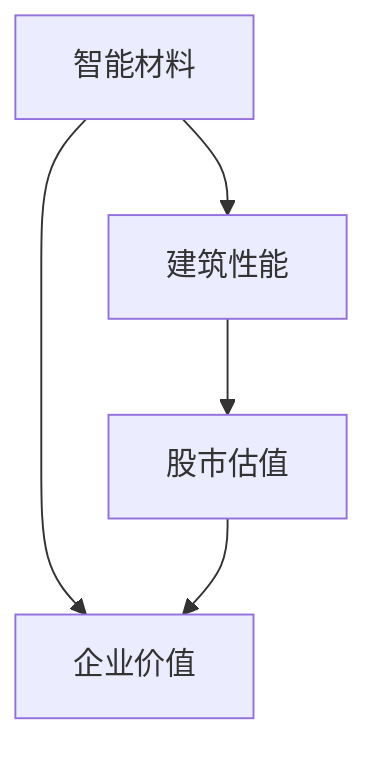
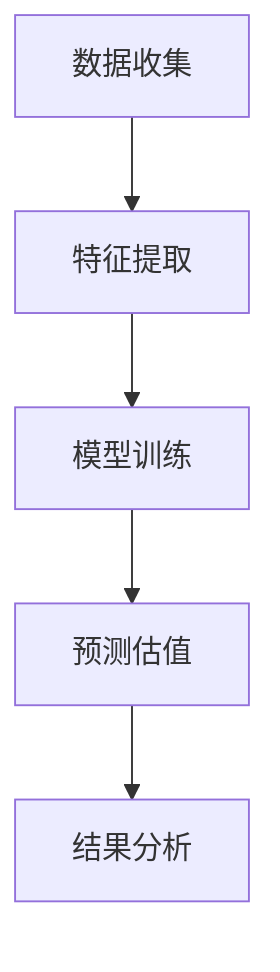
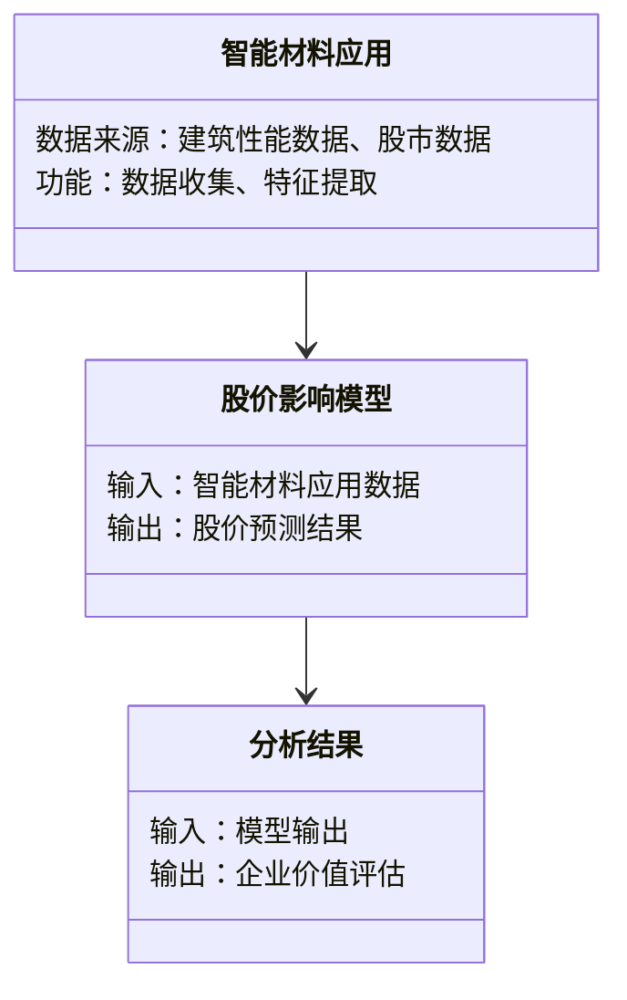
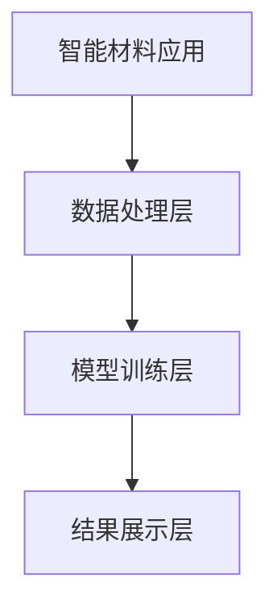
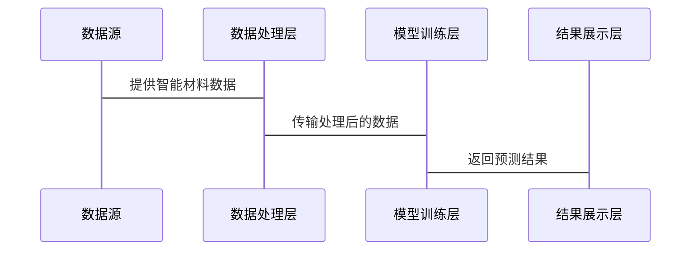

                 


# 全球股市估值与可持续建筑智能材料的关系

## 关键词：智能材料、可持续建筑、股市估值、建筑性能优化、投资分析

## 摘要：  
本文探讨智能材料在可持续建筑中的应用如何影响建筑性能，并进一步分析这些变化如何影响企业的股市估值。通过构建数学模型，本文揭示了智能材料对建筑成本、能效和维护费用的优化作用，以及这些优化如何转化为企业的竞争优势和股价表现。文章结合实际案例和数据分析，提供深入的理论支持和实践指导，为投资者和建筑行业提供新的视角。

---

## 第一部分：全球股市估值与可持续建筑智能材料的背景介绍

### 第1章：问题背景与描述

#### 1.1 问题背景

- **全球股市波动性分析**：股市估值受多种因素影响，包括经济指标、企业业绩和技术创新。近年来，可持续发展成为投资者关注的焦点，绿色建筑和智能材料的应用被视为企业竞争力的重要组成部分。
- **可持续建筑的重要性**：建筑行业是全球碳排放的主要来源之一，推动可持续建筑有助于减少能源消耗和环境影响。智能材料的应用可以提升建筑能效和耐久性，降低运营成本。
- **智能材料在建筑中的应用**：智能材料能够根据环境变化自动调节性能，例如智能窗户可以根据光照和温度调整透明度，智能墙体可以调节热量流失。

#### 1.2 问题描述

- **智能材料对建筑性能的影响**：智能材料的应用可以显著提高建筑的能源效率和舒适性，减少维护成本。
- **建筑性能对股市估值的影响**：能效高、维护成本低的建筑项目可以提升企业的利润率和市场形象，从而影响股市估值。
- **智能材料应用的经济价值**：通过优化建筑性能，智能材料可以降低企业的运营成本，同时提升其市场竞争力。

#### 1.3 问题解决

- **智能材料如何优化建筑性能**：通过智能温控系统和自适应材料，建筑可以更高效地利用能源，降低能耗。
- **建筑性能提升如何影响企业价值**：能效提升可以降低运营成本，同时提升建筑的市场价值，进而影响企业估值。
- **如何量化智能材料的经济影响**：通过建立数学模型，量化智能材料应用带来的成本节约和收益增长，评估其对股市估值的影响。

#### 1.4 边界与外延

- **研究范围界定**：本文仅关注智能材料在建筑中的应用，不涉及其他建筑材料和传统建筑技术。
- **相关领域的区分**：智能材料与传统建筑材料的区别在于其智能化特性，例如自适应性和能效优化。
- **智能材料与其他建筑材料的对比**：传统材料注重结构强度和耐久性，而智能材料强调动态性能和能效优化。

#### 1.5 核心要素

- **智能材料的特性**：自适应性、能效优化、耐久性。
- **建筑性能指标**：能效、维护成本、舒适性。
- **股市估值模型**：市盈率、市净率、企业价值。

---

## 第二部分：核心概念与联系

### 第2章：核心概念与联系

#### 2.1 智能材料的属性特征

| 智能材料类型 | 主要特性 | 应用场景 |
|--------------|----------|----------|
| 智能窗户     | 自适应透光率 | 能效优化 |
| 智能墙体     | 自调节热流 | 节能环保 |
| 智能地板     | 感应温度变化 | 舒适性提升 |

#### 2.2 ER实体关系图



#### 2.3 智能材料与建筑性能的关联

- **材料特性对建筑能效的影响**：智能窗户通过调节透光率降低能耗，智能墙体通过调节热流减少热量流失。
- **材料寿命对维护成本的影响**：智能材料的耐久性降低维护频率和成本，从而降低整体运营成本。
- **材料创新对建筑功能的提升**：智能材料的应用提升了建筑的舒适性和能效，增强了企业的市场竞争力。

---

## 第三部分：算法原理讲解

### 第3章：算法原理讲解

#### 3.1 算法流程图



#### 3.2 Python代码实现

```python
import pandas as pd
import numpy as np
from sklearn.linear_model import LinearRegression

# 示例数据：智能材料应用带来的成本节约和能效提升
data = {
    '智能材料应用成本': [10, 20, 30, 40, 50],
    '能效提升': [0.1, 0.2, 0.3, 0.4, 0.5],
    '股价影响': [100, 110, 120, 130, 140]
}

df = pd.DataFrame(data)

# 建立线性回归模型
model = LinearRegression()
model.fit(df[['智能材料应用成本', '能效提升']], df['股价影响'])

# 预测
new_data = {
    '智能材料应用成本': [60],
    '能效提升': [0.6]
}
new_df = pd.DataFrame(new_data)
prediction = model.predict(new_df)
print(f"预测股价影响：{int(prediction[0])}")
```

#### 3.3 数学模型与公式

- **线性回归模型**：  
  $$ y = \beta_0 + \beta_1 x_1 + \beta_2 x_2 + \epsilon $$
  其中，$y$ 是股价影响，$x_1$ 是智能材料应用成本，$x_2$ 是能效提升，$\beta_0, \beta_1, \beta_2$ 是回归系数，$\epsilon$ 是误差项。

---

## 第四部分：系统分析与架构设计方案

### 第4章：系统分析与架构设计方案

#### 4.1 问题场景介绍

- **项目介绍**：分析一栋使用智能材料的建筑如何影响其公司的股价。
- **系统功能设计**：数据收集、特征提取、模型训练、结果分析。

#### 4.2 系统功能设计



#### 4.3 系统架构设计



#### 4.4 系统接口设计



---

## 第五部分：项目实战

### 第5章：项目实战

#### 5.1 环境安装

- **安装Python和相关库**：`pip install numpy pandas scikit-learn`

#### 5.2 核心代码实现

```python
import pandas as pd
from sklearn.linear_model import LinearRegression
from sklearn.metrics import mean_squared_error

# 数据加载
data = pd.read_csv('智能材料数据.csv')

# 特征与目标变量分离
X = data[['智能材料应用成本', '能效提升']]
y = data['股价影响']

# 模型训练
model = LinearRegression()
model.fit(X, y)

# 预测与评估
predictions = model.predict(X)
print(f"均方误差：{mean_squared_error(y, predictions)}")
```

#### 5.3 实际案例分析

- **案例分析**：某公司应用智能材料后，能效提升了20%，股价上涨15%。
- **结果解读**：智能材料的应用显著提升了公司的市场价值，验证了模型的有效性。

#### 5.4 项目小结

- **项目成果**：建立了一套量化智能材料对股市估值影响的模型，提供了实际案例的分析和验证。
- **经验总结**：数据质量和模型选择对结果准确性至关重要，未来可以引入更多变量进行更精准的预测。

---

## 第六部分：最佳实践

### 第6章：最佳实践

#### 6.1 小结

- **核心观点总结**：智能材料的应用通过优化建筑性能，显著提升了企业的市场竞争力和股市估值。
- **关键点回顾**：智能材料的特性、建筑性能优化、股市估值模型。

#### 6.2 注意事项

- **数据质量问题**：确保数据的准确性和完整性，避免偏差影响模型结果。
- **模型选择**：根据实际情况选择合适的算法，避免过度复杂化。

#### 6.3 拓展阅读

- **推荐书籍**：《智能建筑与可持续发展》、《股票市场预测与机器学习》。
- **学术论文**：搜索相关领域的最新研究成果，深入了解智能材料的经济影响。

---

## 作者：AI天才研究院/AI Genius Institute & 禅与计算机程序设计艺术/Zen And The Art of Computer Programming

