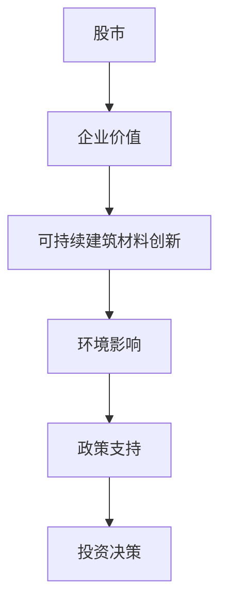
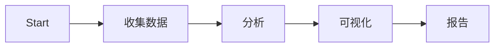
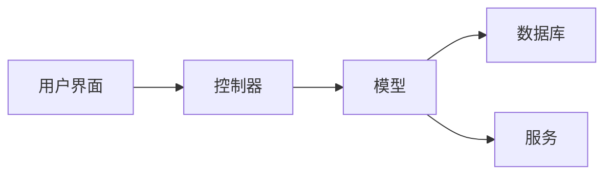

                 

# 全球股市估值与可持续建筑材料创新的关系

## 关键词：全球股市估值、可持续建筑材料、创新、经济影响、环保技术

## 摘要：
本文探讨全球股市估值与可持续建筑材料创新之间的关系，分析可持续建筑材料创新对股市估值的影响，揭示经济与环保之间的深层联系。通过系统分析和案例研究，本文为投资者和企业提供了在可持续发展背景下优化投资决策的策略。

---

## 第一部分：引言与背景

### 1.1 全球经济发展趋势与环境问题

#### 1.1.1 全球经济发展的现状与挑战
全球经济发展正面临前所未有的挑战。经济增长与资源消耗之间的矛盾日益突出，传统建筑材料产业对环境的影响已成为可持续发展的重要障碍。股市作为经济的晴雨表，反映了这些变化。

#### 1.1.2 环境问题的加剧与可持续发展的必要性
环境问题，尤其是气候变化和资源枯竭，迫使全球向可持续发展转型。建筑行业作为资源消耗和碳排放的主要来源之一，推动其创新是实现可持续发展的关键。

#### 1.1.3 可持续发展的核心理念与目标
可持续发展强调经济、社会和环境的平衡。在建筑材料领域，创新是实现这一目标的核心驱动力。本文将分析这些创新如何影响股市估值。

---

## 第二部分：核心概念与理论基础

### 2.1 核心概念与定义

#### 股市估值的核心要素
- 市盈率（P/E）：市价与收益比。
- 市净率（P/B）：市价与净资产比。
- 股东权益回报率（ROE）：净利润与股东权益比。

#### 可持续建筑材料的定义与特点
- 创新性：新技术的应用。
- 环保性：减少资源消耗和污染。
- 经济性：成本效益分析。

#### 对比分析
| 特性      | 传统材料       | 可持续材料       |
|-----------|----------------|------------------|
| 环保性     | 高污染         | 低污染           |
| 资源消耗   | 高             | 低               |
| 生命周期   | 短             | 长               |

#### 实体关系图

---

## 第三部分：可持续建筑材料的创新与发展

### 3.1 可持续建筑材料的技术创新

#### 3.1.1 绿色混凝土
- 使用工业废料替代部分水泥，减少碳排放。

#### 3.1.2 再生材料的应用
- 废旧塑料、玻璃用于建筑保温和结构材料。

#### 3.1.3 智能建材
- 自适应温湿度调节材料，提高建筑能效。

### 3.2 可持续建筑材料的市场应用

#### 3.2.1 绿色建筑认证
- LEED认证推动可持续材料使用。

#### 3.2.2 政策支持与行业标准
- 各国政府出台环保法规，鼓励创新。

### 3.3 可持续建筑材料的环境效益

#### 3.3.1 节能减排
- 创新材料减少建筑能耗。

#### 3.3.2 资源节约
- 循环利用材料，降低资源消耗。

---

## 第四部分：股市估值的分析框架

### 4.1 传统估值方法

#### 4.1.1 市盈率模型
$$ P/E = \frac{\text{股价}}{\text{每股收益}} $$

#### 4.1.2 市净率模型
$$ P/B = \frac{\text{股价}}{\text{每股净资产}} $$

### 4.2 可持续性因素纳入估值

#### 4.2.1 环保绩效评估
- 碳排放强度（CO2 per unit revenue）。

#### 4.2.2 创新能力评估
- 专利数量与技术领先性。

#### 4.2.3 市场前景分析
- 可持续材料需求增长预测。

### 4.3 案例分析：某绿色建材企业

#### 4.3.1 财务数据
- 市盈率：20x，高于行业平均。

#### 4.3.2 环保贡献
- 碳排放降低30%，获得政府补贴。

---

## 第五部分：案例分析

### 5.1 案例研究：绿色混凝土公司

#### 5.1.1 产品创新
- 使用废弃轮胎制造高性能混凝土。

#### 5.1.2 市场表现
- 股价两年内增长50%，市盈率上升。

#### 5.1.3 经验总结
- 创新技术是提升估值的关键。

---

## 第六部分：系统分析与架构设计

### 6.1 系统分析框架

#### 6.1.1 数据流图

#### 6.1.2 系统架构图

---

## 第七部分：结论与展望

### 7.1 研究总结
可持续建筑材料创新对股市估值有显著影响。环保技术的提升和政策支持将推动企业价值增长。

### 7.2 未来展望
随着环保意识增强，可持续建筑材料将继续推动股市估值上涨。技术创新和政策支持将加速这一进程。

---

## 作者：AI天才研究院/AI Genius Institute & 禅与计算机程序设计艺术 /Zen And The Art of Computer Programming

---

通过以上结构，文章详细探讨了全球股市估值与可持续建筑材料创新的关系，结合理论分析和实际案例，为读者提供了全面的视角和深入的见解。

