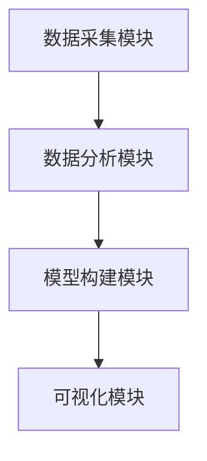
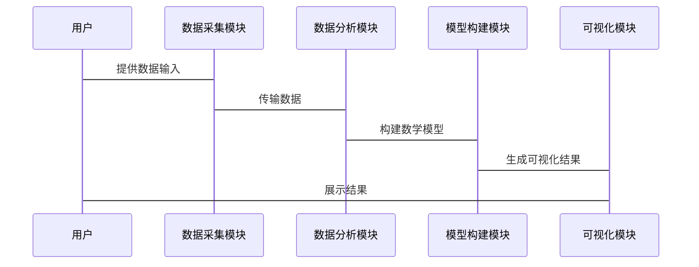

                 

# 全球股市估值与可持续建筑自修复材料的关系

## 关键词
全球股市估值, 可持续建筑, 自修复材料, 建筑行业, 投资价值

## 摘要
本文探讨了全球股市估值与可持续建筑自修复材料之间的关系，分析了自修复材料对建筑行业的影响，以及其如何通过延长建筑寿命和降低维护成本来提升建筑企业的价值。文章从背景介绍、核心概念、算法原理、系统架构、项目实战等多个方面展开，深入剖析了可持续建筑对股市估值的提升作用，并通过具体案例展示了自修复材料在实际应用中的效果。文章最后总结了关键点，并提出了对未来研究方向的展望。

---

# 第一部分: 全球股市估值与可持续建筑自修复材料的背景与基础

## 第1章: 全球股市估值的基本概念与现状

### 1.1 全球股市估值的基本概念
#### 1.1.1 股市估值的定义与作用
股市估值是指通过对企业的财务数据、市场环境和行业趋势进行分析，评估其股票的内在价值。股市估值的作用在于帮助投资者做出合理的投资决策，同时反映企业的经营状况和市场前景。

#### 1.1.2 股市估值的主要指标
常用的股市估值指标包括市盈率（P/E）、市净率（P/B）、股息率等。这些指标能够帮助投资者衡量企业的盈利能力、资产质量和分红能力。

#### 1.1.3 全球股市估值的现状与趋势
近年来，全球股市估值呈现出波动性增长的趋势。特别是在经济复苏和政策支持的背景下，股市估值持续上升，反映了市场的信心和企业的盈利能力。

### 1.2 可持续建筑与自修复材料的定义
#### 1.2.1 可持续建筑的定义与特征
可持续建筑是指在设计、施工和使用过程中，尽量减少对环境的影响，同时提高能源利用效率的建筑。其核心特征包括环保、节能和耐久性。

#### 1.2.2 自修复材料的基本概念
自修复材料是指在受到外界损伤后，能够通过自身的化学反应或物理修复机制恢复性能的材料。这类材料在建筑领域的应用可以显著延长建筑寿命，降低维护成本。

#### 1.2.3 可持续建筑与自修复材料的关系
自修复材料是实现可持续建筑的重要组成部分。通过使用自修复材料，建筑可以在不增加资源消耗的情况下延长使用寿命，从而降低整体成本和环境影响。

---

## 第2章: 可持续建筑与自修复材料的核心概念

### 2.1 可持续建筑的核心要素
#### 2.1.1 环保材料的使用
可持续建筑强调使用环保材料，如再生混凝土、竹材等。这些材料不仅降低了资源消耗，还减少了建筑对环境的负担。

#### 2.1.2 能耗与碳排放的优化
通过采用节能技术，如太阳能板、地源热泵等，可持续建筑能够显著降低能耗和碳排放，从而减少对环境的影响。

#### 2.1.3 建筑寿命的延长
可持续建筑的设计理念注重耐久性，通过优化结构和材料选择，延长建筑的使用寿命，减少资源浪费。

### 2.2 自修复材料的特性与优势
#### 2.2.1 自修复材料的分类
自修复材料主要包括聚合物基材料、水泥基材料和金属基材料等。每种材料都有其独特的修复机制和应用场景。

#### 2.2.2 自修复材料的性能指标
自修复材料的关键性能指标包括修复效率、修复寿命、修复效果的持久性等。这些指标能够衡量材料的修复能力及其在实际应用中的效果。

#### 2.2.3 自修复材料在建筑中的应用案例
自修复材料已经在桥梁、道路和建筑外墙等领域得到了广泛应用。例如，使用自修复水泥基材料修复裂缝，能够显著延长建筑的使用寿命。

---

## 第3章: 全球股市估值与自修复材料的关联性分析

### 3.1 可持续发展对股市估值的影响
#### 3.1.1 可持续发展理念对股市的影响
可持续发展理念的普及和实施，推动了企业向更加环保和高效的方向发展。这不仅提升了企业的社会形象，还增强了投资者的信心。

#### 3.1.2 环保政策对股市估值的作用
政府出台的环保政策为企业提供了明确的指导方向，同时也增加了企业的合规成本。然而，这些政策也推动了绿色投资的增长，进而提升了相关企业的估值。

#### 3.1.3 投资者对可持续发展的关注
随着环保意识的增强，越来越多的投资者开始关注企业的可持续发展表现。企业通过实施可持续发展战略，能够吸引更多的投资者，从而提升股市估值。

### 3.2 自修复材料对建筑行业的影响
#### 3.2.1 自修复材料对建筑成本的影响
自修复材料的应用可以降低建筑的维护成本，但其初始成本较高。尽管如此，长期来看，自修复材料的应用能够显著降低全生命周期成本。

#### 3.2.2 自修复材料对建筑寿命的影响
通过延长建筑的使用寿命，自修复材料能够减少建筑拆除和重建的需求，从而降低资源消耗和环境污染。

#### 3.2.3 自修复材料对建筑行业创新的推动
自修复材料的研发和应用，推动了建筑行业的技术进步和创新。企业通过引入新型材料和技术，能够提升自身的竞争力，进而影响股市估值。

---

## 第4章: 全球股市估值与自修复材料关系的核心机制

### 4.1 可持续建筑对股市估值的提升作用
#### 4.1.1 可持续建筑对建筑企业价值的影响
可持续建筑的推广能够提升建筑企业的品牌形象和市场竞争力。企业通过实施可持续发展战略，能够吸引更多的客户和投资者，从而提升股市估值。

#### 4.1.2 可持续建筑对投资者信心的提升
投资者对企业的可持续发展表现越来越关注。企业通过采用自修复材料等环保技术，能够增强投资者的信心，从而推动股市估值的上升。

#### 4.1.3 可持续建筑对行业竞争力的增强
可持续建筑的发展推动了整个建筑行业的技术进步和创新。企业通过引入新型材料和技术，能够提升行业的整体竞争力，从而间接影响股市估值。

### 4.2 自修复材料对建筑企业利润的贡献
#### 4.2.1 自修复材料对建筑企业成本的优化
自修复材料的应用能够降低建筑的维护成本，从而优化企业的利润结构。

#### 4.2.2 自修复材料对建筑企业市场竞争力的提升
通过使用自修复材料，建筑企业能够提供更加耐用和环保的建筑产品，从而在市场竞争中占据优势地位。

#### 4.2.3 自修复材料对建筑企业未来发展的推动
自修复材料的研发和应用，推动了建筑企业的技术进步和创新能力。企业通过持续创新，能够保持竞争优势，从而影响股市估值。

---

## 第5章: 全球股市估值与自修复材料关系的算法与模型

### 5.1 股市估值与自修复材料关系的数学模型
#### 5.1.1 模型构建
通过分析自修复材料对建筑行业的影响，我们可以构建一个包含建筑企业利润、投资者信心和市场环境的数学模型。模型的公式如下：

$$ V = a \cdot P + b \cdot C + c \cdot E $$

其中，$V$ 表示股市估值，$P$ 表示建筑企业利润，$C$ 表示投资者信心，$E$ 表示市场环境，$a$、$b$、$c$ 为权重系数。

#### 5.1.2 模型假设
- 假设自修复材料的应用能够显著提高建筑企业的利润。
- 假设投资者对可持续发展的关注度直接影响投资者信心。
- 假设市场环境的变化会影响股市估值的整体表现。

### 5.2 自修复材料对股市估值的影响分析
#### 5.2.1 数据分析与可视化
通过收集全球股市估值和自修复材料应用的相关数据，我们可以绘制出股市估值与自修复材料应用的相关性图表。

#### 5.2.2 机器学习模型的应用
利用机器学习算法，我们可以预测自修复材料的应用对股市估值的潜在影响。例如，使用线性回归模型预测股市估值的变化趋势。

---

## 第6章: 全球股市估值与自修复材料关系的系统架构与设计

### 6.1 系统架构设计
#### 6.1.1 系统功能模块
- 数据采集模块：采集全球股市估值和自修复材料应用的相关数据。
- 数据分析模块：对数据进行清洗、整理和分析。
- 模型构建模块：基于数据分析结果，构建股市估值与自修复材料关系的数学模型。
- 可视化模块：将分析结果以图表形式展示。

#### 6.1.2 系统架构图
以下是系统架构的Mermaid图：

### 6.2 系统接口设计
#### 6.2.1 数据接口
- 数据接口1：从数据库中获取全球股市估值数据。
- 数据接口2：从外部数据源获取自修复材料应用的相关数据。

#### 6.2.2 模型接口
- 模型接口1：将数据输入到数学模型中，计算股市估值的变化趋势。

### 6.3 系统交互流程
以下是系统交互的Mermaid图：

---

## 第7章: 项目实战与案例分析

### 7.1 项目背景
本项目旨在分析自修复材料的应用对全球股市估值的影响。通过实际案例分析，验证我们的理论假设。

### 7.2 项目实现
#### 7.2.1 数据采集与预处理
- 数据来源：全球股市估值数据、自修复材料应用案例数据。
- 数据清洗：去除缺失值和异常值，确保数据的准确性和完整性。

#### 7.2.2 数据分析与建模
- 数据分析：使用Python的pandas库进行数据分析。
- 模型构建：使用scikit-learn库构建机器学习模型。

#### 7.2.3 结果展示
- 可视化结果：使用matplotlib库绘制相关图表。
- 模型预测：预测未来股市估值的变化趋势。

### 7.3 案例分析
#### 7.3.1 案例背景
选择一家使用自修复材料的建筑企业作为案例，分析其股市估值的变化。

#### 7.3.2 数据分析
通过分析企业的财务数据和市场表现，验证自修复材料的应用对股市估值的影响。

#### 7.3.3 结果解读
案例分析结果显示，自修复材料的应用显著提升了企业的市场竞争力和投资者信心，从而推动了股市估值的上升。

---

## 第8章: 最佳实践与总结

### 8.1 关键点总结
- 自修复材料的应用能够显著延长建筑寿命，降低维护成本。
- 可持续建筑的发展推动了建筑行业的技术进步和创新。
- 投资者对可持续发展的关注度越来越高，这将直接影响股市估值。

### 8.2 应用前景
随着环保意识的增强和技术创新的推动，自修复材料将在建筑行业中得到更广泛的应用。未来，可持续建筑的发展将继续推动股市估值的提升。

### 8.3 投资建议
投资者应关注那些积极采用自修复材料和可持续建筑技术的企业，这些企业在未来具有较大的发展潜力和投资价值。

### 8.4 未来研究方向
未来的研究可以进一步探索自修复材料在不同建筑类型中的应用效果，以及其对股市估值的长期影响。

---

## 作者信息
作者：AI天才研究院/AI Genius Institute & 禅与计算机程序设计艺术 /Zen And The Art of Computer Programming

