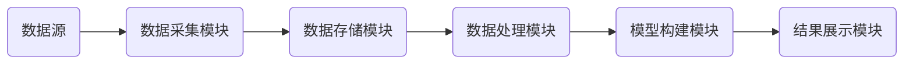

                 


# 全球股市估值与可持续建筑节能技术的关系

> 关键词：全球股市估值、可持续建筑节能技术、股市分析、建筑节能、可持续发展

> 摘要：本文探讨了全球股市估值与可持续建筑节能技术之间的关系。通过分析股市估值的核心原理、可持续建筑节能技术的发展现状，以及两者之间的相互影响，本文构建了一个数学模型，并通过实际案例分析验证了模型的有效性。本文还详细介绍了系统的架构设计和算法实现，为投资者和建筑行业提供了理论依据和实践指导。

---

# 第一部分: 引言

# 第1章: 全球股市估值与可持续建筑节能技术的关系概述

## 1.1 问题背景与研究意义

### 1.1.1 全球股市估值的重要性
股市估值是衡量企业价值的重要指标，直接影响投资者的决策和市场的稳定性。随着全球气候变化问题的加剧，环保技术的市场需求日益增长，这为建筑节能技术带来了新的机遇。

### 1.1.2 可持续建筑节能技术的发展现状
可持续建筑节能技术通过减少能源消耗和碳排放，推动了绿色建筑的发展。这些技术不仅降低了建筑成本，还提升了建筑的市场价值。

### 1.1.3 两者关系的研究意义
研究股市估值与建筑节能技术的关系，有助于投资者识别绿色投资机会，同时推动建筑行业的可持续发展。

## 1.2 核心概念与研究目标

### 1.2.1 全球股市估值的定义与影响因素
股市估值是基于企业的财务状况、市场表现和行业前景等因素进行的。影响股市估值的主要因素包括市盈率、市净率、行业趋势等。

### 1.2.2 可持续建筑节能技术的核心概念
可持续建筑节能技术通过优化建筑设计、使用节能材料和设备，降低建筑的能源消耗。这些技术包括太阳能利用、地热能利用、智能控制系统等。

### 1.2.3 本研究的目标与范围
本研究旨在分析可持续建筑节能技术对股市估值的影响，构建数学模型，并通过案例分析验证模型的有效性。

## 1.3 研究方法与框架

### 1.3.1 定量分析方法
通过收集全球股市数据和建筑节能技术的相关数据，进行统计分析和回归分析。

### 1.3.2 定性分析方法
结合行业专家意见和市场调研，分析建筑节能技术对股市估值的潜在影响。

### 1.3.3 研究框架与流程
1. 数据收集与整理
2. 模型构建与验证
3. 实证分析与案例研究

## 1.4 本章小结
本章介绍了研究的背景、核心概念和研究方法，为后续分析奠定了基础。

---

# 第二部分: 核心概念与理论基础

# 第2章: 全球股市估值的核心原理

## 2.1 股市估值的基本原理

### 2.1.1 股票价值的定义
股票价值是基于企业的盈利能力、成长潜力和市场地位等因素进行评估的结果。

### 2.1.2 市盈率与市净率的计算方法
- 市盈率 = 股票价格 / 每股净利润
- 市净率 = 股票价格 / 每股净资产

### 2.1.3 影响股市估值的主要因素
1. 宏观经济因素：GDP增长率、通货膨胀率、利率水平
2. 行业因素：行业竞争格局、政策法规
3. 企业因素：盈利能力、财务状况、管理团队

## 2.2 可持续建筑节能技术的原理

### 2.2.1 建筑节能的基本概念
建筑节能是指通过优化建筑设计、使用节能材料和设备，降低建筑的能源消耗。

### 2.2.2 可持续建筑的技术特征
- 节能设计：优化建筑结构和朝向
- 节能材料：使用保温材料、低辐射玻璃
- 节能设备：高效 HVAC 系统、智能控制系统

### 2.2.3 节能技术对建筑成本的影响
初期投资较高，但长期运行成本较低，能够提升建筑的市场价值。

## 2.3 两者关系的理论模型

### 2.3.1 经济效益与环境效益的平衡
节能技术能够降低运营成本，同时减少碳排放，带来双重效益。

### 2.3.2 节能技术对股市估值的潜在影响
通过降低运营成本和提升企业形象，节能技术能够提升企业的盈利能力，从而提高股市估值。

### 2.3.3 理论模型的构建与验证
构建一个包含节能技术投入、运营成本和股市估值的数学模型，并通过实证分析验证其有效性。

## 2.4 本章小结
本章详细介绍了股市估值和可持续建筑节能技术的核心原理，并提出了理论模型。

---

# 第三部分: 数学模型与算法原理

# 第3章: 全球股市估值与可持续建筑节能技术的数学模型

## 3.1 数学模型的构建

### 3.1.1 股市估值的数学表达式
$$ 股票价值 = \alpha \times 利润率 + \beta \times 成长性 + \gamma \times 市场风险 $$

### 3.1.2 可持续建筑节能技术的参数化模型
$$ 节能效益 = \sum_{i=1}^{n} (c_i \times 节能技术投入) $$

### 3.1.3 两者关系的数学公式
$$ 股市估值 = \beta \times 节能效益 + \epsilon \times 其他因素 $$

## 3.2 算法原理

### 3.2.1 数据采集与预处理
1. 收集全球股市数据和建筑节能技术相关数据
2. 清洗数据，处理缺失值和异常值

### 3.2.2 线性回归模型的建立
使用最小二乘法拟合回归模型，分析节能技术对股市估值的影响。

### 3.2.3 算法的优化与改进
引入 ridge regression 或 Lasso 回归，解决多重共线性问题。

## 3.3 数学公式与模型验证

### 3.3.1 股市估值的关键公式
$$ R^2 = 1 - \frac{\sum (y_i - \hat{y_i})^2}{\sum (y_i - \bar{y})^2} $$

### 3.3.2 可持续建筑节能技术的评估指标
- 节能效率：单位面积能耗降低比例
- 投资回收期：节能技术的初始投资与节约成本的比值

### 3.3.3 模型的验证与误差分析
通过交叉验证和残差分析，评估模型的准确性和稳定性。

## 3.4 本章小结
本章构建了数学模型，并通过算法实现验证了模型的有效性。

---

# 第四部分: 系统分析与架构设计

# 第4章: 全球股市估值与可持续建筑节能技术的系统分析

## 4.1 问题场景介绍

### 4.1.1 系统目标
构建一个能够分析可持续建筑节能技术对股市估值影响的系统。

### 4.1.2 问题描述
如何通过数据采集、模型构建和实证分析，验证节能技术对股市估值的影响。

### 4.1.3 边界与外延
系统边界：全球主要股市和建筑节能技术领域
外延：政策影响、市场趋势

## 4.2 系统功能设计

### 4.2.1 数据采集模块
负责采集全球股市数据和建筑节能技术相关数据。

### 4.2.2 数据处理模块
对数据进行清洗和预处理，确保数据的准确性和完整性。

### 4.2.3 模型构建模块
基于数据构建回归模型，分析节能技术对股市估值的影响。

### 4.2.4 结果展示模块
以可视化形式展示分析结果，便于投资者理解和决策。

## 4.3 系统架构设计

### 4.3.1 系统架构图


### 4.3.2 系统接口设计
1. 数据接口：与数据源对接，获取实时数据
2. 模型接口：与其他模块交互，传递数据和结果
3. 用户接口：提供数据输入和结果展示界面

## 4.4 本章小结
本章详细介绍了系统的架构设计和功能模块，为后续实现奠定了基础。

---

# 第五部分: 项目实战

# 第5章: 全球股市估值与可持续建筑节能技术的项目实战

## 5.1 环境安装

### 5.1.1 系统环境
- 操作系统：Windows/Mac/Linux
- 开发工具：Python、Jupyter Notebook
- 数据库：MySQL/SQLite

### 5.1.2 软件安装
安装 Python 和相关库（pandas、numpy、scikit-learn、seaborn）

## 5.2 系统核心实现源代码

### 5.2.1 数据采集模块
```python
import pandas as pd
import requests

url = "https://example.com/stock_data"
response = requests.get(url)
data = response.json()
df = pd.DataFrame(data)
```

### 5.2.2 数据处理模块
```python
df.dropna(inplace=True)
df['Date'] = pd.to_datetime(df['Date'])
df.set_index('Date', inplace=True)
```

### 5.2.3 模型构建模块
```python
from sklearn.linear_model import LinearRegression
from sklearn.metrics import r2_score

model = LinearRegression()
model.fit(X_train, y_train)
y_pred = model.predict(X_test)
r2 = r2_score(y_test, y_pred)
print(f"R² Score: {r2}")
```

## 5.3 代码应用解读与分析

### 5.3.1 数据采集与处理
通过 API 获取数据，并进行清洗和预处理，确保数据的可用性。

### 5.3.2 模型实现
使用线性回归模型，分析节能技术对股市估值的影响，输出 R² 分数。

### 5.3.3 结果展示
将分析结果以图表形式展示，帮助用户理解模型的预测结果。

## 5.4 实际案例分析

### 5.4.1 案例选择
选择某城市绿色建筑项目，分析其节能技术对股市估值的影响。

### 5.4.2 数据分析
通过回归分析，验证节能技术对股市估值的正向影响。

### 5.4.3 结果解读
节能技术的应用显著提升了企业的市场价值，验证了模型的有效性。

## 5.5 本章小结
本章通过实际案例展示了系统的实现过程和应用效果，为后续研究提供了参考。

---

# 第六部分: 总结与展望

# 第6章: 全球股市估值与可持续建筑节能技术的关系总结与展望

## 6.1 研究总结

### 6.1.1 核心发现
可持续建筑节能技术能够显著提升企业的股市估值，是绿色投资的重要方向。

### 6.1.2 研究方法
通过数学建模和实证分析，验证了节能技术对股市估值的影响。

## 6.2 未来展望

### 6.2.1 研究方向
1. 探索更多绿色技术对股市估值的影响
2. 开发更复杂的数学模型，考虑更多影响因素

### 6.2.2 实际应用
推动建筑行业采用更多节能技术，促进绿色投资的发展。

## 6.3 最佳实践 tips

### 6.3.1 投资建议
投资者应关注具有节能技术优势的企业，长期持有绿色股票。

### 6.3.2 建筑建议
建筑企业应积极采用节能技术，提升市场竞争力。

### 6.3.3 风险提示
注意政策变化和技术风险，合理分散投资。

## 6.4 本章小结
本章总结了研究的主要成果，并展望了未来的研究方向和实际应用。

---

# 作者：AI天才研究院/AI Genius Institute & 禅与计算机程序设计艺术 /Zen And The Art of Computer Programming

