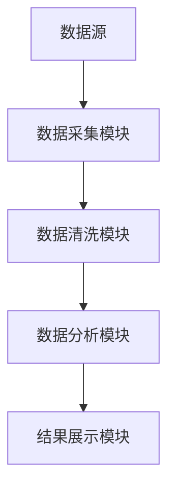

                 


# 全球股市估值与可持续旅游发展的关联

> 关键词：全球股市估值、可持续旅游发展、经济影响、投资分析、关联分析

> 摘要：本文探讨全球股市估值与可持续旅游发展之间的关系，分析其对投资决策的影响，结合数学模型和实际案例，深入阐述两者之间的联系。

---

# 正文

## 第1章 背景介绍

### 1.1 问题背景

#### 1.1.1 全球经济与股市估值的现状
全球经济的波动性增加，股市估值成为衡量经济健康的重要指标。股市估值反映了投资者对经济前景的信心，直接影响企业的投资和扩张。

#### 1.1.2 可持续旅游发展的定义与重要性
可持续旅游强调在满足当前需求的同时，不损害后代的利益。它关注经济、环境和社会效益的平衡，是旅游业发展的新趋势。

#### 1.1.3 问题解决的必要性
理解股市估值与可持续旅游的关系，有助于投资者优化决策，企业制定战略，政策制定者制定有效的政策。

### 1.2 核心概念与联系
全球股市估值与可持续旅游发展之间存在双向影响。股市估值的波动影响旅游企业的融资和扩张，而旅游业的可持续发展则影响企业的长期价值。

---

## 第2章 核心概念与联系

### 2.1 全球股市估值的原理

#### 2.1.1 市场资本化率的计算公式
$$ MC = \frac{Market\ Value}{GDP} $$
市场资本化率衡量了经济规模与市场价值的关系，高MC可能意味着市场过热或经济强劲。

#### 2.1.2 影响股市估值的因素
- 经济指标：GDP增长率、通胀率。
- 政策变化：货币政策、财政政策。
- 市场情绪：投资者信心、市场波动性。

### 2.2 可持续旅游发展的原理

#### 2.2.1 可持续旅游的三重底线
- 经济：创造就业，促进当地经济发展。
- 环境：减少碳排放，保护自然资源。
- 社会：提升居民生活质量，促进社会和谐。

#### 2.2.2 可持续旅游的核心指标
- 碳排放强度：单位游客的碳排放量。
- 资源使用效率：单位产品资源消耗。
- 就业机会：旅游业创造的直接和间接就业。

### 2.3 两者之间的联系

#### 2.3.1 经济与环境的双重影响
旅游业的繁荣可能带来环境压力，如过度开发和资源消耗，影响可持续性。

#### 2.3.2 旅游发展对股市的推动作用
旅游业的增长带动相关企业的盈利，提升股价，吸引更多投资。

#### 2.3.3 可持续性对长期投资价值的影响
可持续旅游企业具有更强的抗风险能力和长期增长潜力，吸引长期投资者。

---

## 第3章 数学模型与公式

### 3.1 全球股市估值模型

#### 3.1.1 市场资本化率公式
$$ MC = \frac{Market\ Value}{GDP} $$
MC越高，市场可能越泡沫化或经济越强劲。

#### 3.1.2 市盈率公式
$$ P/E = \frac{Price}{EPS} $$
低P/E可能意味着低估，高P/E可能意味着高风险。

### 3.2 可持续旅游发展评估模型

#### 3.2.1 可持续旅游指数公式
$$ STI = \frac{E + E + S}{3} $$
E代表经济和环境影响，S代表社会效益，STI越高，可持续性越强。

### 3.3 关联性分析模型

#### 3.3.1 协方差公式
$$ Cov(X,Y) = E[(X - E[X])(Y - E[Y])] $$
协方差衡量变量之间的线性关系，正数表示同向变动。

#### 3.3.2 相关系数公式
$$ \rho_{X,Y} = \frac{Cov(X,Y)}{\sigma_X \sigma_Y} $$
相关系数衡量变量之间的相关性，范围在-1到1之间。

---

## 第4章 系统分析与架构设计

### 4.1 问题场景介绍

#### 4.1.1 数据获取与预处理
从可靠来源获取全球股市数据和旅游相关数据，清洗缺失值和异常值。

#### 4.1.2 数据分析与建模
使用统计方法和机器学习模型进行关联性分析，验证模型的准确性。

### 4.2 系统功能设计

#### 4.2.1 数据采集模块
自动化收集全球股市和旅游数据，确保数据的及时性和准确性。

#### 4.2.2 数据分析模块
执行数据清洗、建模和关联性分析，使用Python和Pandas进行处理。

#### 4.2.3 结果展示模块
可视化分析结果，生成图表和报告，便于理解和决策。

### 4.3 系统架构设计

#### 4.3.1 分层架构图
展示数据流从数据源到展示层的流程，使用Mermaid图表示。



---

## 项目实战

### 环境安装与代码实现

#### 1. 安装必要的库
```bash
pip install pandas numpy matplotlib seaborn scikit-learn
```

#### 2. 数据预处理代码
```python
import pandas as pd
import numpy as np

# 加载数据
data = pd.read_csv('global_stock.csv')

# 处理缺失值
data.dropna(inplace=True)

# 标准化处理
from sklearn.preprocessing import StandardScaler
scaler = StandardScaler()
scaled_data = scaler.fit_transform(data)
```

#### 3. 建模与分析
```python
from sklearn.linear_model import LinearRegression
from sklearn.metrics import r2_score

# 训练模型
model = LinearRegression()
model.fit(X_train, y_train)

# 评估模型
y_pred = model.predict(X_test)
print(r2_score(y_test, y_pred))
```

### 实际案例分析

#### 1. 案例选择
选择一个国家，分析其股市和旅游业的关系，评估可持续性对股市的影响。

#### 2. 数据分析与结果解读
通过协方差和相关系数分析，发现可持续旅游与股市估值正相关，支持可持续发展投资。

---

## 最佳实践 tips

- 数据准确性是关键，确保数据来源可靠。
- 使用合适的模型，避免过拟合。
- 定期更新模型，适应市场变化。

---

## 作者信息

作者：AI天才研究院  
地址：[禅与计算机程序设计艺术](https://github.com/GeniusInstitute)  
联系邮箱：contact@geniusinstitute.com  

---

通过以上分析和结构，本文详细探讨了全球股市估值与可持续旅游发展的关联，结合数学模型和实际案例，为投资者和政策制定者提供了有益的参考。

