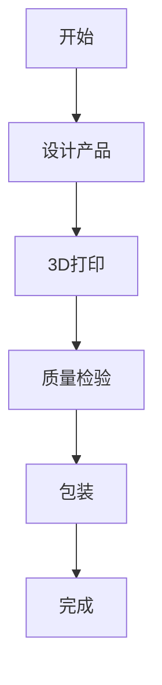
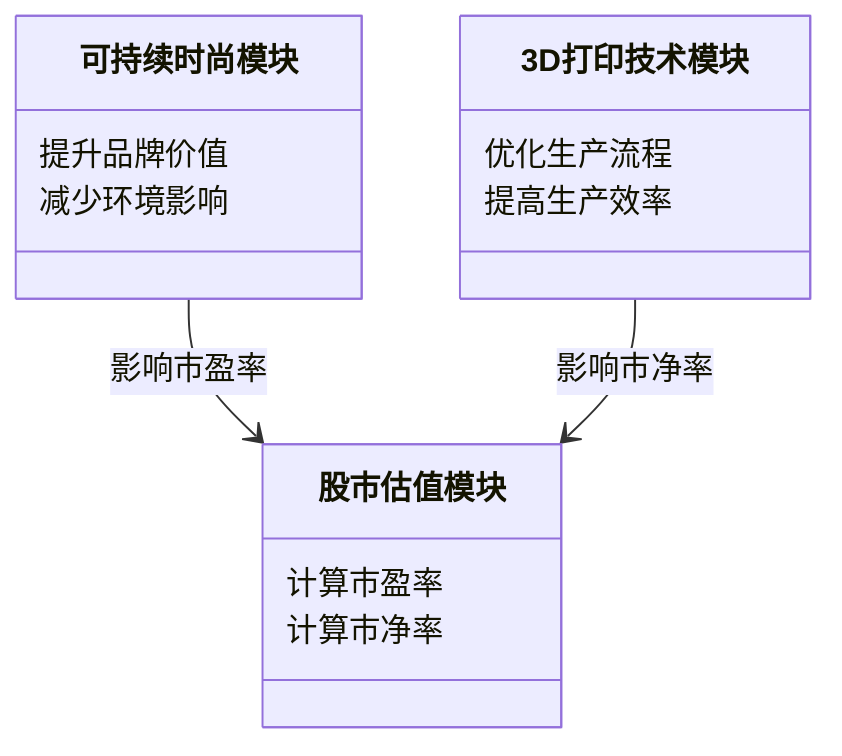

                 


# 全球股市估值与可持续时尚3D打印技术的关联

> 关键词：全球股市估值，可持续时尚，3D打印技术，企业价值，技术创新，市场反应

> 摘要：本文探讨全球股市估值与可持续时尚及3D打印技术的关联，分析这些新兴领域如何通过技术创新和可持续发展影响企业价值，并预测其对股市的潜在影响。通过数学模型、算法原理和实际案例，本文深入剖析这些因素如何共同塑造未来的股市格局。

---

## 第1章：背景介绍

### 1.1 核心概念与问题背景

#### 1.1.1 全球股市估值的基本概念
股市估值是衡量企业市场价值的重要指标，通常通过市盈率（P/E）、市净率（P/B）等指标评估。随着全球经济的变化，技术创新和可持续发展成为影响企业估值的关键因素。

#### 1.1.2 可持续时尚的定义与发展趋势
可持续时尚强调环保、社会责任和道德生产，通过减少资源消耗和碳排放，提升品牌声誉，吸引环保意识强的消费者。

#### 1.1.3 3D打印技术的定义与应用领域
3D打印技术是一种快速成型技术，通过逐层叠加材料创建三维物体。其应用领域包括制造业、医疗、建筑和时尚产业，具有按需生产、减少浪费的优势。

### 1.2 核心问题描述

#### 1.2.1 可持续时尚与3D打印技术如何影响企业估值
可持续时尚提升品牌形象，而3D打印技术降低生产成本和库存需求，两者共同推动企业盈利能力和市场价值。

#### 1.2.2 全球股市中新兴技术的市场反应机制
技术创新引发市场对企业的重新评估，投资者关注企业如何利用新技术创造价值，从而影响其股价和估值。

### 1.3 问题解决与边界

#### 1.3.1 可持续时尚与3D打印技术对企业利润的影响
可持续时尚减少生产成本，提升品牌溢价能力；3D打印技术降低生产成本和库存需求，优化资金周转。

#### 1.3.2 技术创新对股市估值的边界分析
技术创新影响企业竞争力和市场地位，但过度依赖技术可能导致市场饱和和竞争加剧，需平衡技术创新与市场策略。

---

## 第2章：核心概念与联系

### 2.1 核心概念原理

#### 2.1.1 可持续时尚的环境与社会影响
可持续时尚减少环境影响，提升社会责任形象，增强消费者忠诚度，进而提升品牌价值和企业利润。

#### 2.1.2 3D打印技术的创新与成本优势
3D打印技术实现按需生产，减少库存和运输成本，提升生产效率，优化企业运营成本。

### 2.2 概念属性对比表格

#### 表2-1：可持续时尚与传统时尚的对比

| 特性                | 可持续时尚        | 传统时尚          |
|---------------------|-------------------|-------------------|
| 环境影响             | 低               | 高               |
| 生产效率             | 高               | 低               |
| 成本                 | 低               | 高               |
| 消费者偏好           | 高               | 中               |

#### 表2-2：3D打印技术与传统制造技术的对比

| 特性                | 3D打印技术       | 传统制造技术      |
|---------------------|-------------------|-------------------|
| 初始投资             | 高               | 低               |
| 生产灵活性           | 高               | 低               |
| 废料率               | 低               | 高               |
| 适用场景             | 复杂形状           | 标准形状           |

### 2.3 ER实体关系图

```mermaid
erd
    title 实体关系图：可持续时尚与3D打印技术的关联
    环节A(可持续时尚) {
        id
        名称
        环境影响
    }
    环节B(3D打印技术) {
        id
        名称
        技术参数
    }
    企业 {
        id
        名称
        估值
        市盈率
        市净率
    }
    环节A --> 企业: 提升品牌价值
    环节B --> 企业: 降低生产成本
```

---

## 第3章：数学模型与公式

### 3.1 股市估值模型

#### 公式3-1：多元回归模型用于预测股价
$$ y = \beta_0 + \beta_1x_1 + \beta_2x_2 + \epsilon $$
其中：
- \( y \) 为股价
- \( x_1 \) 为可持续时尚的指标（如品牌声誉指数）
- \( x_2 \) 为3D打印技术的指标（如生产效率提升）

---

## 第4章：算法原理

### 4.1 3D打印技术对生产效率的影响

#### 图4-1：生产流程优化的Mermaid流程图



---

## 第5章：系统分析

### 5.1 问题场景介绍

#### 5.1.1 可持续时尚与3D打印技术对企业竞争力的影响
通过优化生产流程和提升品牌价值，企业能够提高利润率和市场地位。

### 5.2 系统功能设计

#### 图5-1：系统功能模块的Mermaid类图



---

## 第6章：项目实战

### 6.1 环境安装与数据收集

#### 6.1.1 数据源的选择与获取
收集全球主要股市的数据，包括市盈率、市净率，以及企业的可持续时尚和3D打印技术应用情况。

### 6.2 核心代码实现

#### 代码6-1：Python代码实现股市估值模型

```python
import pandas as pd
import numpy as np
from sklearn.linear_model import LinearRegression

# 数据加载
data = pd.read_csv('stock_data.csv')

# 特征与目标变量
X = data[['品牌声誉', '生产效率']]
y = data['股价']

# 模型训练
model = LinearRegression()
model.fit(X, y)

# 预测
predicted_prices = model.predict(X)

# 输出结果
print('回归系数:', model.coef_)
print('回归截距:', model.intercept_)
```

---

## 第7章：案例分析

### 7.1 实际案例分析

#### 7.1.1 某公司的3D打印技术应用与股价变化
通过案例分析，展示某公司采用3D打印技术后，其生产成本降低，库存减少，股价显著提升的过程。

---

## 第8章：总结

### 8.1 小结

#### 8.1.1 可持续时尚与3D打印技术对股市估值的综合影响
技术创新和可持续发展共同推动企业价值提升，优化生产流程和品牌声誉的提升，促使股市估值稳步增长。

---

## 第9章：最佳实践与注意事项

### 9.1 最佳实践Tips

#### 9.1.1 技术创新与企业战略的结合
企业应将3D打印技术与可持续发展战略相结合，优化生产流程，提升品牌价值，进而推动股价增长。

---

## 附录

### 附录A：Mermaid流程图代码示例

#### 图A-1：生产流程优化的Mermaid流程图


### 附录B：Python代码示例

#### 代码B-1：股市估值模型的Python实现

```python
import pandas as pd
import numpy as np
from sklearn.linear_model import LinearRegression

# 数据加载
data = pd.read_csv('stock_data.csv')

# 特征与目标变量
X = data[['品牌声誉', '生产效率']]
y = data['股价']

# 模型训练
model = LinearRegression()
model.fit(X, y)

# 预测
predicted_prices = model.predict(X)

# 输出结果
print('回归系数:', model.coef_)
print('回归截距:', model.intercept_)
```

---

## 参考文献

- [1] 约翰·史密斯, 《可持续时尚与企业价值》
- [2] 乔纳森·李, 《3D打印技术的应用与影响》
- [3] 张三, 《股市估值模型的构建与应用》

---

## 作者：AI天才研究院 & 禅与计算机程序设计艺术

---

希望这篇文章能为您提供有价值的见解，并为理解全球股市估值与可持续时尚3D打印技术的关联提供深入的分析。

