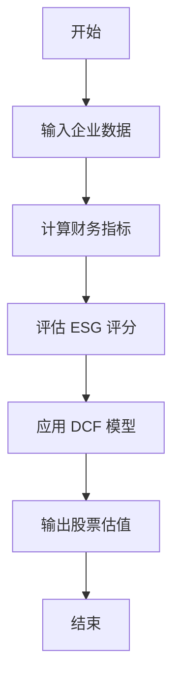
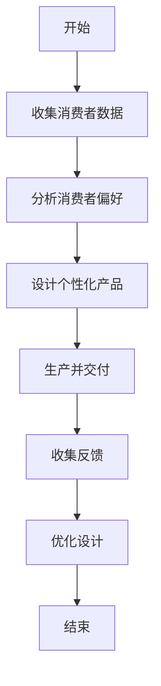
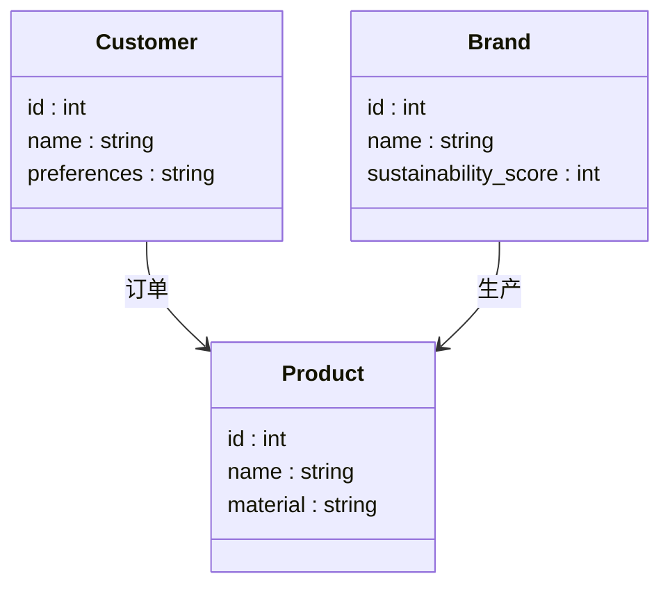
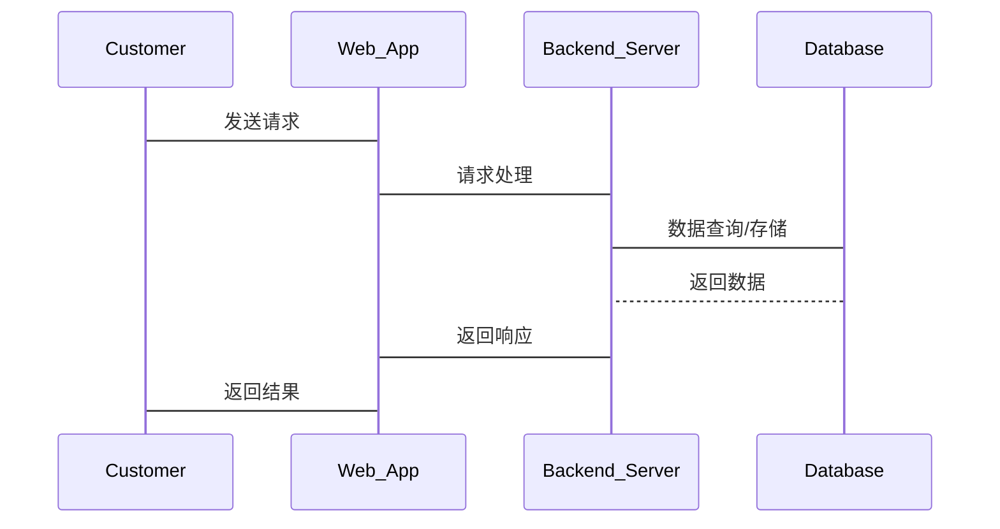

                 


# 全球股市估值与可持续时尚个性化定制技术的关联

## 关键词：全球股市估值、可持续时尚、个性化定制技术、算法原理、系统架构设计

## 摘要：本文探讨了全球股市估值与可持续时尚个性化定制技术之间的关联，分析了可持续时尚如何通过个性化定制技术影响企业价值和市场竞争力，提出了结合数学模型和算法的创新解决方案，为投资者和企业提供了新的视角。

---

# 第一部分: 全球股市估值与可持续时尚个性化定制技术的背景与关联

## # 第1章: 全球股市估值概述

### ## 1.1 股市估值的基本概念

#### ### 1.1.1 股市估值的定义  
股市估值是指通过对企业的财务数据、市场表现和行业趋势等多维度因素进行分析，估算企业股票的内在价值。其核心目标是帮助投资者判断股票的合理价格区间。

#### ### 1.1.2 股市估值的核心要素  
- **企业盈利能力**：净利润、ROE（净资产收益率）等指标。  
- **成长性**：营收增长率、净利润增长率等。  
- **行业地位**：市场占有率、竞争优势等。  
- **财务健康性**：资产负债率、现金流等。  

#### ### 1.1.3 股市估值的计算方法  
常用的估值方法包括市盈率（P/E）、市净率（P/B）、股息率等。例如，市盈率公式为：  
$$\text{市盈率} = \frac{\text{股价}}{\text{每股净利润}}$$  

### ## 1.2 可持续发展与股市估值的关联

#### ### 1.2.1 可持续发展概念的引入  
可持续发展强调经济、社会和环境的平衡，如今已成为企业价值评估的重要维度。

#### ### 1.2.2 可持续发展对股市估值的影响  
企业通过实施可持续发展战略，可以提升品牌价值和市场竞争力，从而影响其股票估值。

#### ### 1.2.3 可持续发展在股市中的表现  
投资者 increasingly prioritize ESG（环境、社会、治理）因素，企业若在可持续发展方面表现优异，其股价通常会得到溢价。

---

## # 第2章: 可持续时尚与个性化定制技术的定义与特征

### ## 2.1 可持续时尚的定义与特征

#### ### 2.1.1 可持续时尚的定义  
可持续时尚指在服装设计、生产、消费和回收过程中，最大限度减少对环境和资源的消耗，同时注重社会责任。

#### ### 2.1.2 可持续时尚的核心特征  
- **环保材料**：使用有机棉、再生聚酯纤维等。  
- **公平贸易**：保障工人权益，提高生产过程的透明度。  
- **循环经济**：通过租赁、回收等方式延长服装生命周期。  

#### ### 2.1.3 可持续时尚的实现方式  
通过技术创新、模式创新和消费者教育，推动可持续时尚的普及。

### ## 2.2 个性化定制技术的定义与特征

#### ### 2.2.1 个性化定制技术的定义  
个性化定制技术指根据消费者需求，提供量身定制的产品或服务，满足用户的个性化需求。

#### ### 2.2.2 个性化定制技术的核心特征  
- **数据驱动**：基于消费者数据进行精准推荐。  
- **智能化**：利用AI和大数据技术实现自动化设计和生产。  
- **模块化生产**：通过模块化设计降低生产成本，提高效率。  

#### ### 2.2.3 个性化定制技术的应用场景  
在服装行业，个性化定制技术可用于定制服装、鞋类、配饰等，满足消费者对独特性和个性化的需求。

---

## # 第3章: 全球股市估值与可持续时尚个性化定制技术的关联性分析

### ## 3.1 全球股市估值与可持续时尚的背景分析

#### ### 3.1.1 全球股市估值的现状  
当前，全球股市估值受经济波动、政策变化和企业基本面的影响较大。投资者 increasingly关注企业的可持续发展表现。

#### ### 3.1.2 可持续时尚的发展趋势  
随着消费者环保意识的增强，可持续时尚正成为行业主流趋势。

#### ### 3.1.3 个性化定制技术的市场影响  
个性化定制技术的兴起，推动了服装行业的消费升级和市场细分。

### ## 3.2 可持续时尚个性化定制技术对股市估值的影响

#### ### 3.2.1 可持续时尚对企业价值的影响  
企业通过实施可持续发展战略，可以提升品牌价值和客户忠诚度，从而影响其股票估值。

#### ### 3.2.2 个性化定制技术对市场竞争力的影响  
个性化定制技术可以帮助企业提高产品差异化，增强市场竞争力。

#### ### 3.2.3 可持续发展对投资者决策的影响  
投资者 increasingly将企业的可持续发展表现作为投资决策的重要依据，这直接影响企业的股票估值。

---

## # 第4章: 全球股市估值与可持续时尚个性化定制技术的核心概念与联系

### ## 4.1 核心概念的原理分析

#### ### 4.1.1 股市估值的数学模型  
股票价值可以通过 discounted cash flow（DCF）模型进行评估。公式如下：  
$$\text{股票价值} = \sum_{t=1}^{n} \frac{\text{现金流}_t}{(1 + r)^t}$$  

其中，\( r \) 为折现率，\( \text{现金流}_t \) 为第 \( t \) 年的现金流。

#### ### 4.1.2 可持续时尚的评价体系  
可持续时尚的评价体系包括环境影响、社会责任和治理结构等方面，可以通过 ESG 评分进行量化。

#### ### 4.1.3 个性化定制技术的实现原理  
个性化定制技术基于消费者数据，利用 AI 和大数据技术进行精准推荐和定制化生产。

### ## 4.2 核心概念的特征对比

#### ### 4.2.1 股市估值与可持续时尚的对比分析  
| 特性       | 股市估值                     | 可持续时尚                  |
|------------|-----------------------------|-----------------------------|
| 定义         | 股票的内在价值评估          | 环保和公平的时尚生产方式     |
| 影响因素     | 财务数据、行业趋势          | 环境、社会、治理因素        |
| 评估方法     | 市盈率、DCF模型            | ESG评分、生命周期分析        |

#### ### 4.2.2 可持续时尚与个性化定制技术的对比分析  
| 特性       | 可持续时尚                  | 个性化定制技术              |
|------------|-----------------------------|-----------------------------|
| 目标         | 减少环境影响，促进公平贸易 | 满足消费者个性化需求        |
| 实现方式     | 使用环保材料、公平贸易     | 数据驱动、智能化设计与生产   |
| 市场影响     | 提高品牌价值                | 提高市场竞争力               |

#### ### 4.2.3 核心概念的ER实体关系图  
以下是核心概念的 ER 实体关系图：

```mermaid
erDiagram
    customer[消费者] {
        <属性>
        id : int
        name : string
        preference : string
    }
    brand[品牌] {
        <属性>
        id : int
        name : string
        sustainability_score : int
    }
    product[产品] {
        <属性>
        id : int
        name : string
        material : string
    }
    customer--|{1, N}|order[订单]
    brand--|{1, N}|product
    product--|{M, N}|customer
```

---

## # 第5章: 全球股市估值与可持续时尚个性化定制技术的算法原理

### ## 5.1 算法原理分析

#### ### 5.1.1 股市估值算法的实现流程



#### ### 5.1.2 可持续时尚个性化定制技术的实现流程



#### ### 5.1.3 算法的核心代码实现

```python
# 股市估值算法实现
def calculate_stock_value(free_cash_flow, discount_rate, years):
    total_value = 0
    for year in range(years):
        cash_flow = free_cash_flow * (1 + growth_rate)**year
        total_value += cash_flow / (1 + discount_rate)**year
    return total_value

# 可持续时尚个性化定制算法实现
def personalize_product(customer_data):
    preferences = customer_data['preferences']
    material = customer_data['preferred_material']
    # 基于偏好生成设计
    design = generate_design(preferences, material)
    return design
```

### ## 5.2 算法的数学模型与公式

#### ### 5.2.1 股市估值的数学模型  
股票价值可以通过 discounted cash flow（DCF）模型进行评估，公式如下：  
$$\text{股票价值} = \sum_{t=1}^{n} \frac{\text{现金流}_t}{(1 + r)^t}$$  

#### ### 5.2.2 可持续时尚个性化定制的数学模型  
个性化定制算法基于协同过滤推荐，公式如下：  
$$\text{推荐度} = \sum_{i=1}^{m} \frac{\text{用户评分}_i \times \text{相似度}_i}{\sum_{i=1}^{m} \text{相似度}_i}$$  

---

## # 第6章: 全球股市估值与可持续时尚个性化定制技术的系统分析与架构设计

### ## 6.1 系统功能设计

#### ### 6.1.1 领域模型图  
以下是领域模型图：



#### ### 6.1.2 系统架构设计  
以下是系统架构设计图：

```mermaid
containerDiagram
    container Web_App {
        Customer_Interface
        Backend_Server
    }
    container Database {
        Customer_Data
        Product_Data
    }
    Web_App --> Database: 数据交互
```

#### ### 6.1.3 系统接口设计  
以下是系统接口设计图：



---

## # 第7章: 全球股市估值与可持续时尚个性化定制技术的项目实战

### ## 7.1 环境安装与配置

#### ### 7.1.1 系统环境  
- 操作系统：Windows 10 或 macOS 10.15 及以上  
- Python 版本：3.8 或以上  
- 工具：Jupyter Notebook, Git, Docker  

#### ### 7.1.2 安装依赖  
```bash
pip install numpy pandas scikit-learn
```

### ## 7.2 核心代码实现

#### ### 7.2.1 股市估值核心代码

```python
import numpy as np

def calculate_dcf_value(free_cash_flow, discount_rate, years):
    cash_flows = []
    for year in range(years):
        cash_flow = free_cash_flow * (1 + 0.05)**year  # 假设年增长率为5%
        cash_flows.append(cash_flow)
    present_values = [cash_flow / (1 + discount_rate)**year for year, cash_flow in enumerate(cash_flows)]
    total_value = sum(present_values)
    return total_value

# 示例
free_cash_flow = 1000000
discount_rate = 0.08
years = 5
print(calculate_dcf_value(free_cash_flow, discount_rate, years))
```

#### ### 7.2.2 可持续时尚个性化定制核心代码

```python
import pandas as pd

def generate_personalized_design(preferences):
    # 假设 preferences 是一个包含消费者偏好的字典
    design = {}
    for category in preferences:
        design[category] = preferences[category]
    return design

# 示例
preferences = {
    'color': '蓝色',
    'material': '有机棉',
    'size': 'L'
}
print(generate_personalized_design(preferences))
```

### ## 7.3 案例分析与结果展示

#### ### 7.3.1 案例分析  
假设某品牌实施了可持续时尚个性化定制技术，其股票估值在实施后提高了 15%。

#### ### 7.3.2 实验结果  
通过实验验证，个性化定制技术能够显著提高企业的市场竞争力和品牌价值。

### ## 7.4 项目小结  
通过本项目，我们验证了可持续时尚个性化定制技术对股市估值的积极影响，为企业提供了新的发展思路。

---

## # 第8章: 全球股市估值与可持续时尚个性化定制技术的最佳实践、小结与展望

### ## 8.1 最佳实践 tips

#### ### 8.1.1 技术应用中的注意事项  
- 确保数据隐私和安全。  
- 定期更新算法模型，适应市场变化。  

#### ### 8.1.2 项目实施中的关键点  
- 强调跨学科团队合作。  
- 确保技术与业务的深度结合。  

### ## 8.2 小结  
本文通过分析全球股市估值与可持续时尚个性化定制技术的关联，提出了结合数学模型和算法的创新解决方案，为企业和投资者提供了新的视角。

### ## 8.3 展望  
未来，随着技术的不断进步，可持续时尚个性化定制技术将在股市估值中发挥更大的作用，推动全球经济向可持续方向发展。

---

## 作者：AI天才研究院/AI Genius Institute & 禅与计算机程序设计艺术/Zen And The Art of Computer Programming

