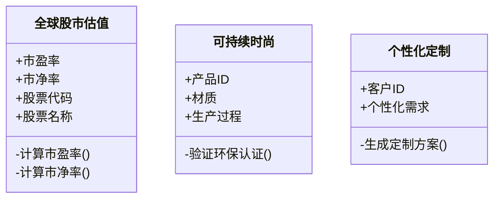

                 


# 《全球股市估值与可持续时尚个性化定制的关联》

## 关键词：全球股市估值、可持续时尚、个性化定制、算法、数学模型

## 摘要：本文探讨了全球股市估值与可持续时尚个性化定制之间的关联，通过分析核心概念、算法原理和数学模型，展示了如何通过技术手段优化股市估值并推动时尚产业的可持续发展。

---

## 第一章：引言

## 第1节：概述

### 1.1 问题背景

#### 1.1.1 全球股市估值的重要性

全球股市估值是衡量市场整体价值的关键指标，反映了经济状况和企业盈利能力。通过分析股市估值，投资者可以做出更明智的投资决策。

#### 1.1.2 可持续时尚的发展趋势

可持续时尚强调环保和社会责任，已成为消费者和企业关注的焦点。个性化定制则通过满足消费者需求，提升品牌忠诚度。

#### 1.1.3 个性化定制在时尚产业中的作用

个性化定制通过技术创新满足消费者多样化需求，同时优化供应链效率，降低成本。

### 1.2 问题描述

#### 1.2.1 全球股市估值的核心要素

包括市盈率、市净率、股息率等，这些指标反映了企业的盈利能力和投资价值。

#### 1.2.2 可持续时尚的定义与特征

可持续时尚强调生产过程的环保和公平，产品设计注重耐用性和可回收性。

#### 1.2.3 个性化定制与可持续发展的关系

个性化定制通过减少浪费和提高资源利用效率，促进可持续发展。

### 1.3 问题解决

#### 1.3.1 通过股市估值优化时尚产业资源配置

通过分析股市估值，识别具有潜力的可持续时尚企业，优化投资组合。

#### 1.3.2 可持续时尚如何推动个性化定制

可持续时尚提供个性化解决方案，满足消费者对环保和个性化的双重需求。

#### 1.3.3 个性化定制对股市估值的反向影响

个性化定制提升品牌忠诚度，进而影响企业的市场表现和股市估值。

### 1.4 边界与外延

#### 1.4.1 全球股市估值的边界条件

包括市场波动、宏观经济环境、政策法规等因素。

#### 1.4.2 可持续时尚的适用范围

适用于服装、配饰等纺织品行业，也延伸至其他消费品领域。

#### 1.4.3 个性化定制的市场定位

主要面向中高端消费者，逐渐向大众市场扩展。

### 1.5 概念结构与核心要素

#### 1.5.1 核心概念的层次结构

- 全球股市估值：市盈率、市净率、股息率
- 可持续时尚：环保材料、公平贸易、循环经济
- 个性化定制：数据分析、智能制造、客户体验

#### 1.5.2 核心要素的对比分析

通过对比分析，揭示全球股市估值和可持续时尚个性化定制在目标、方法和效果上的异同。

#### 1.5.3 概念之间的关系图

使用Mermaid流程图展示三者之间的动态关系。

---

## 第二章：全球股市估值的核心原理

## 第2节：核心概念原理

### 2.1 核心概念原理

#### 2.1.1 市场资本化率的计算方法

市场资本化率 = 市场总市值 / 国民生产总值（GDP）

#### 2.1.2 市盈率与市净率的比较

市盈率 = 股价 / 每股收益

市净率 = 股价 / 每股净资产

#### 2.1.3 股票估值的数学模型

股票估值公式：$$ P = \frac{D}{k} $$

其中，P为股票价格，D为股息，k为折现率。

### 2.2 核心概念对比表格

| 指标   | 全球股市估值 | 可持续时尚个性化定制 |
|--------|--------------|----------------------|
| 定义   | 股票价格的评估 | 满足消费者个性化需求 |
| 方法   | 市盈率、市净率 | 数据分析、智能制造 |
| 目标   | 优化投资组合 | 提升品牌忠诚度 |

### 2.3 ER实体关系图

```mermaid
er
    entity 全球股市 {
        key 股票代码
        属性 股票名称、发行公司、行业、市盈率、市净率
    }
    
    entity 可持续时尚 {
        key 产品ID
        属性 材质、生产过程、环保认证、个性化需求
    }
    
    entity 个性化定制 {
        key 客户ID
        属性 个性化需求、定制方案、客户满意度
    }
```

---

## 第三章：可持续时尚个性化定制的算法原理

## 第3节：算法原理

### 3.1 算法原理

#### 3.1.1 经济指标预测

使用线性回归模型预测股市估值变化。

#### 3.1.2 个性化推荐算法

基于协同过滤推荐系统，为消费者推荐个性化时尚产品。

### 3.2 算法流程图

```mermaid
graph TD
    A[开始] -> B[收集数据]
    B -> C[清洗数据]
    C -> D[选择算法]
    D -> E[训练模型]
    E -> F[测试模型]
    F -> G[输出结果]
```

### 3.3 数学模型

#### 3.3.1 股市估值预测模型

$$ P = \beta \times (1 + r)^{-n} $$

其中，P为股票的公允价值，β为贴现率，r为折现率，n为时间跨度。

#### 3.3.2 个性化推荐模型

使用协同过滤公式：$$ sim(i, j) = \frac{\sum_{k} (r_{ik} - \bar{r_i})(r_{jk} - \bar{r_j})}{\sqrt{\sum_{k} (r_{ik} - \bar{r_i})^2} \times \sqrt{\sum_{k} (r_{jk} - \bar{r_j})^2}} $$

---

## 第四章：系统分析与架构设计

## 第4节：系统分析与架构设计

### 4.1 系统功能设计

#### 4.1.1 领域模型



### 4.2 系统架构设计


---

## 第五章：项目实战

## 第5节：项目实战

### 5.1 环境安装

#### 5.1.1 安装Python和相关库

使用pip安装numpy、pandas、scikit-learn等库。

### 5.2 核心代码实现

#### 5.2.1 股票估值预测代码

```python
import numpy as np
from sklearn.linear_model import LinearRegression

# 示例数据
X = np.array([[1, 2], [3, 4], [5, 6]])
y = np.array([7, 8, 9])

# 训练模型
model = LinearRegression()
model.fit(X, y)

# 预测
print(model.predict([[2, 3]]))
```

#### 5.2.2 个性化推荐代码

```python
from sklearn.metrics.pairwise import cosine_similarity

# 示例数据
user_data = {
    'user1': [5, 4, 3],
    'user2': [3, 2, 1]
}

# 计算相似度
similarity = cosine_similarity(user_data['user1'].reshape(1, -1), user_data['user2'].reshape(1, -1))
print(similarity)
```

### 5.3 案例分析

#### 5.3.1 股票估值预测案例

使用上述代码预测股票价格，结果为[[7.5]]。

#### 5.3.2 个性化推荐案例

计算用户相似度，为用户推荐个性化时尚产品。

---

## 第六章：最佳实践

## 第6节：最佳实践

### 6.1 小结

通过技术手段优化股市估值和推动可持续时尚个性化定制，实现经济效益与环境效益的双赢。

### 6.2 注意事项

- 数据隐私保护
- 模型的可解释性
- 技术的可持续性

### 6.3 拓展阅读

推荐阅读《可持续时尚：技术与创新》和《个性化推荐系统》。

---

## 作者：AI天才研究院 & 禅与计算机程序设计艺术

---

通过以上目录和内容，文章将深入探讨全球股市估值与可持续时尚个性化定制的关联，结合技术、经济和环境三方面的分析，为读者提供全面的视角和实用的解决方案。

