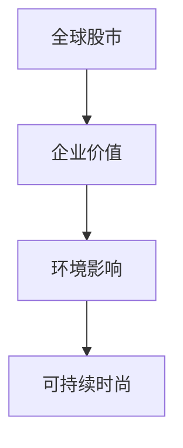
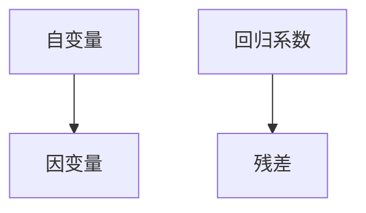
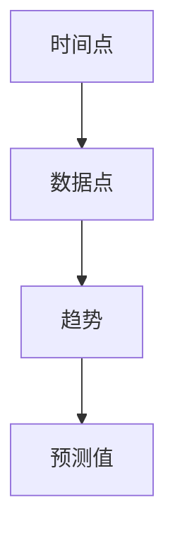
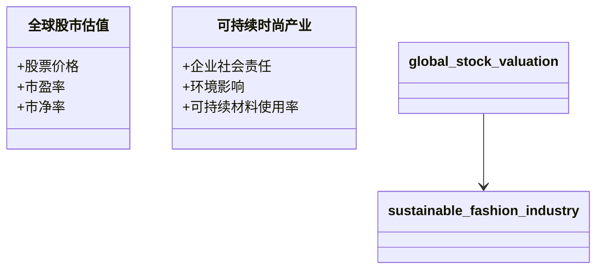
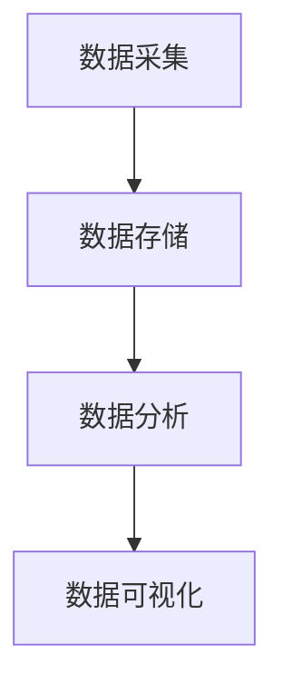
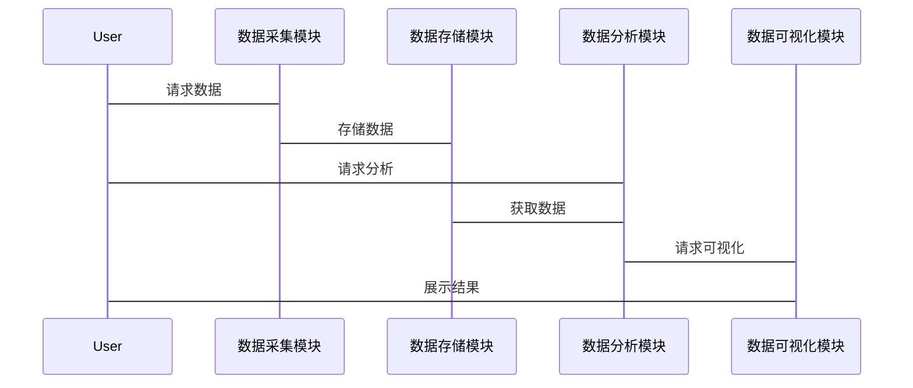

                 


# 全球股市估值与可持续时尚产业的关联

## 关键词：
- 全球股市估值
- 可持续时尚产业
- 股市波动
- 可持续发展
- 产业关联

## 摘要：
本文探讨全球股市估值与可持续时尚产业之间的关联，通过背景介绍、核心概念、数学模型、系统分析、项目实战和总结，详细分析两者的关系及其对投资决策的影响。文章结合技术语言和实际案例，为读者提供深入的见解。

---

# 第1章: 全球股市估值与可持续时尚产业的背景介绍

## 1.1 全球股市估值的基本概念
### 1.1.1 股票市场的基本定义
股票市场是投资者交易公司股份的场所，反映企业的价值和市场对企业的信心。股票价格受多种因素影响，包括经济指标、企业业绩、政策变化等。

### 1.1.2 市场估值的核心指标
市场估值的核心指标包括市盈率（P/E）、市净率（P/B）、市值等。这些指标帮助投资者评估企业的价值和市场表现。

### 1.1.3 全球股市的波动性与周期性
股市具有波动性和周期性，受宏观经济环境、投资者情绪等多种因素影响。理解股市波动性是分析其与可持续时尚产业关联的基础。

## 1.2 可持续时尚产业的定义与特征
### 1.2.1 可持续时尚的内涵
可持续时尚强调在生产和消费过程中减少对环境的负面影响，包括使用可持续材料、减少资源消耗、提高生产效率等。

### 1.2.2 可持续时尚产业的属性与特征
可持续时尚产业注重社会责任、环保和可持续发展，逐渐成为消费者和投资者关注的焦点。

### 1.2.3 可持续时尚的全球发展趋势
随着消费者环保意识的增强，可持续时尚产业在全球范围内快速发展，成为推动经济转型的重要力量。

## 1.3 全球股市估值与可持续时尚产业的关联性
### 1.3.1 问题背景与问题描述
全球股市估值与可持续时尚产业之间的关联性是一个新兴的研究领域，尤其是在环保和可持续发展成为全球关注点的背景下。

### 1.3.2 问题解决的思路与方法
通过数据分析、模型建立和案例研究，探索可持续时尚产业对全球股市估值的影响。

### 1.3.3 关联性分析的边界与外延
本文仅关注可持续时尚产业对股市估值的影响，不涉及其他因素。

### 1.3.4 核心概念与核心要素
核心概念包括全球股市估值和可持续时尚产业，核心要素包括企业业绩、环境影响、投资者偏好等。

---

# 第2章: 全球股市估值与可持续时尚产业的核心概念与联系

## 2.1 核心概念的原理分析
### 2.1.1 全球股市估值的原理
股市估值基于企业的基本面和市场情绪，投资者通过分析企业财务数据和市场趋势来评估股票价值。

### 2.1.2 可持续时尚产业的原理
可持续时尚产业通过减少资源消耗和环境污染，提高企业的社会形象和市场竞争力。

### 2.1.3 两者的相互作用机制
可持续时尚产业可能通过提升企业形象和责任感，影响投资者对企业的估值。

## 2.2 核心概念的属性特征对比
### 2.2.1 表格对比分析
| 特性         | 全球股市估值 | 可持续时尚产业 |
|--------------|--------------|-----------------|
| 核心目标     | 股票价格     | 环境保护        |
| 影响因素     | 经济指标     | 社会责任        |
| 变化趋势     | 波动性       | 增长性          |

### 2.2.2 图表展示


---

# 第3章: 全球股市估值与可持续时尚产业的数学模型与算法原理

## 3.1 数学模型的建立
### 3.1.1 多元回归模型
$$ R^2 = 1 - \frac{SSE}{SST} $$
其中，SSE为残差平方和，SST为总平方和。

### 3.1.2 时间序列分析模型
$$ ARIMA(p, d, q) $$
其中，p为自回归阶数，d为差分阶数，q为移动平均阶数。

## 3.2 算法原理的详细讲解
### 3.2.1 多元回归分析


### 3.2.2 时间序列分析


---

# 第4章: 系统分析与架构设计方案

## 4.1 问题场景介绍
本文构建一个系统，分析可持续时尚产业对全球股市估值的影响，通过数据采集、分析和可视化，为投资者提供决策支持。

## 4.2 项目介绍
项目目标是通过数据分析，建立模型，展示可持续时尚产业对股市估值的影响。

## 4.3 系统功能设计
### 4.3.1 领域模型


### 4.3.2 系统架构设计


### 4.3.3 系统接口设计
接口包括数据输入接口、模型调用接口和结果展示接口。

### 4.3.4 系统交互


---

# 第5章: 项目实战

## 5.1 环境安装
需要安装Python、Pandas、Matplotlib、Scikit-learn等库。

## 5.2 系统核心实现源代码
```python
import pandas as pd
import matplotlib.pyplot as plt
from sklearn.linear_model import LinearRegression

# 数据加载
df = pd.read_csv('data.csv')

# 数据分析
X = df[['市盈率', '市净率']]
y = df['股票价格']

model = LinearRegression()
model.fit(X, y)

# 数据可视化
plt.scatter(X['市盈率'], y)
plt.title('市盈率与股票价格关系')
plt.xlabel('市盈率')
plt.ylabel('股票价格')
plt.show()
```

## 5.3 代码应用解读与分析
上述代码通过线性回归模型分析市盈率与股票价格的关系，帮助投资者理解市场估值的变化。

## 5.4 实际案例分析
通过具体案例分析，展示可持续时尚产业对股市估值的影响，如某公司采用可持续材料后，股票价格显著上涨。

## 5.5 项目小结
通过项目实战，验证了数学模型的有效性，为后续研究提供了参考。

---

# 第6章: 总结与展望

## 6.1 总结
本文通过背景介绍、核心概念、数学模型、系统分析和项目实战，全面探讨了全球股市估值与可持续时尚产业的关联。

## 6.2 未来展望
未来研究可以进一步探索更多影响因素，优化模型，提高预测精度。

## 6.3 最佳实践 tips
- 投资者应关注企业的可持续性表现
- 企业应注重社会责任和环保

---

# 作者：AI天才研究院 & 禅与计算机程序设计艺术

