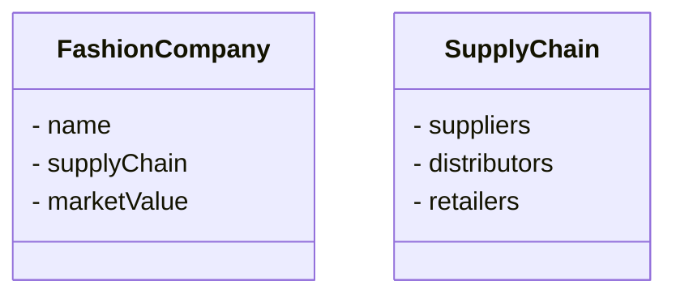
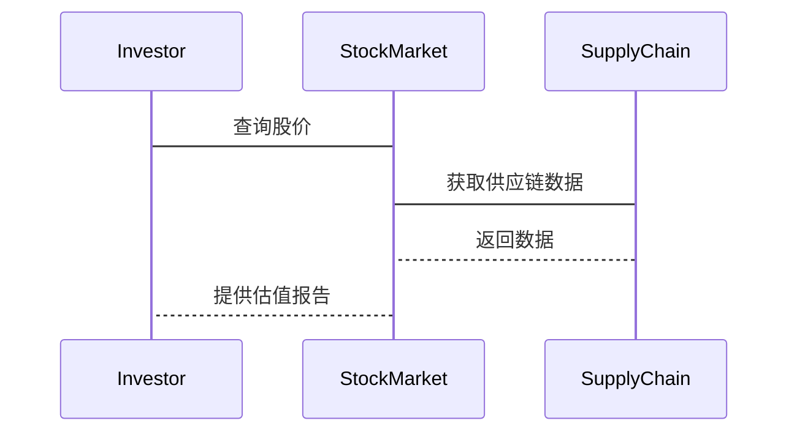

                 


# 全球股市估值与可持续时尚供应链的关联

## 关键词：全球股市估值、可持续时尚供应链、ESG投资、供应链管理、系统动力学模型、资产定价模型

## 摘要：本文探讨全球股市估值与可持续时尚供应链之间的关联，分析ESG投资对股市估值的影响，探讨供应链管理在可持续时尚中的作用，并提出优化策略以提升企业价值。

---

# 引言

## 1.1 问题背景
### 1.1.1 全球股市估值的重要性
全球股市估值是衡量企业价值的关键指标，影响投资者决策和市场稳定性。近年来，可持续发展成为投资者关注的焦点，ESG（环境、社会、治理）投资理念逐渐兴起，推动了对可持续供应链的关注。

### 1.1.2 可持续时尚供应链的兴起
时尚产业是全球最大的制造业之一，但其供应链常面临环境和社会问题。可持续时尚供应链通过优化资源利用和减少碳足迹，成为企业提升竞争力的重要手段。

### 1.1.3 两者的关联性与研究意义
研究全球股市估值与可持续时尚供应链的关联，有助于企业优化供应链管理，提升股价表现，同时也为投资者提供新的评估维度。

---

# 第1章: 引言

## 1.2 问题描述
### 1.2.1 全球股市估值的核心要素
- 市盈率（P/E ratio）
- 市净率（P/B ratio）
- 净资产收益率（ROE）

### 1.2.2 可持续时尚供应链的关键特征
- 环境友好
- 社会责任
- 治理透明

### 1.2.3 问题的边界与外延
- 研究范围：全球主要股市
- 研究对象：时尚供应链企业
- 研究方法：定量分析与定性分析结合

## 1.3 核心概念与联系
### 1.3.1 核心概念的定义与属性对比
| 概念        | 定义                                   | 属性                         |
|-------------|--------------------------------------|------------------------------|
| 全球股市估值 | 股票的市场价格，反映企业价值         | 市场化、动态化、指标化       |
| 可持续供应链| 环保、社会责任、透明的供应链管理       | 环保性、社会责任、透明性     |

### 1.3.2 ER实体关系图架构
```mermaid
er
actor Investor
actor Stock Market
actor Supply Chain
actor Fashion Company
```

---

# 第2章: 全球股市估值的理论基础

## 2.1 资产定价模型
### 2.1.1 CAPM模型
$$ E(R_i) = R_f + \beta_i (E(R_m) - R_f) $$
- $E(R_i)$：资产的预期收益率
- $R_f$：无风险利率
- $\beta_i$：资产的系统性风险系数
- $E(R_m)$：市场预期收益率

### 2.1.2 APT模型
$$ E(R_i) = \sum_j \lambda_j \beta_{i,j} $$
- $\lambda_j$：因子的定价因子
- $\beta_{i,j}$：资产对因子的敏感度

### 2.1.3 市场风险与非系统性风险
- 市场风险：影响整个市场的风险
- 非系统性风险：特定资产的风险

## 2.2 股市估值方法
### 2.2.1 市盈率法
$$ P/E = \frac{Market\ Price}{Earnings\ Per\ Share} $$
- 低P/E比率可能表示低估，高P/E可能表示高估。

### 2.2.2 市净率法
$$ P/B = \frac{Market\ Price}{Book\ Value\ Per\ Share} $$
- 用于评估资产密集型企业的价值。

### 2.2.3 现金流折现法
$$ V = \sum_{t=1}^{\infty} \frac{CF_t}{(1 + r)^t} $$
- $V$：企业价值
- $CF_t$：未来现金流
- $r$：折现率

## 2.3 ESG投资理论
### 2.3.1 环境、社会和治理（ESG）的概念
- 环境：减少碳足迹、资源节约
- 社会：劳工权益、社区责任
- 治理：企业透明度、领导层责任

### 2.3.2 ESG对股市估值的影响
- 提高企业声誉，降低风险，提升股价。

### 2.3.3 可持续投资的回报分析
- 长期回报可能更高，但短期波动较大。

---

# 第3章: 可持续时尚供应链的核心要素

## 3.1 供应链管理理论
### 3.1.1 供应链的基本构成
- 供应商、制造商、分销商、零售商、消费者。

### 3.1.2 可持续供应链的特征
- 环保材料、公平贸易、透明合作。

### 3.1.3 供应链优化的数学模型
$$ C = \min \sum_{i=1}^n c_i x_i $$
- $C$：总成本
- $c_i$：单位成本
- $x_i$：采购量

## 3.2 可持续时尚的关键指标
### 3.2.1 环境影响评估
- 碳排放、水消耗、废弃物产生。

### 3.2.2 社会责任履行
- 劳工权益、公平贸易、社区发展。

### 3.2.3 治理结构优化
- 透明度、领导层责任、合规性。

## 3.3 供应链风险管理
### 3.3.1 风险识别与评估
- 环境风险、社会风险、治理风险。

### 3.3.2 风险缓解策略
- 多元化供应商、本地采购、绿色物流。

### 3.3.3 应急响应机制
- 灾难恢复计划、供应链弹性。

---

# 第4章: 全球股市估值与可持续时尚供应链的关联机制

## 4.1 关联的理论基础
### 4.1.1 系统动力学模型
$$ \frac{dS}{dt} = \alpha E - \beta S $$
- $S$：系统状态
- $E$：外部输入
- $\alpha$、$\beta$：参数

### 4.1.2 网络流模型
- 供应链网络、资金流动。

### 4.1.3 多因素分析模型
- 考虑环境、社会、治理等多个因素。

## 4.2 正向关联分析
### 4.2.1 可持续供应链对股市估值的提升作用
- 提高企业声誉，降低风险，提升股价。

### 4.2.2 企业社会责任
- 增强投资者信心，提升股价。

## 4.3 反向关联分析
### 4.3.1 股市波动对供应链的影响
- 股价下跌可能导致供应链资金紧张。

### 4.3.2 供应链问题对股价的冲击
- 供应链中断可能导致股价下跌。

---

# 第5章: 系统分析与架构设计

## 5.1 问题场景介绍
- 某时尚企业供应链问题导致股价波动。

## 5.2 系统功能设计
### 5.2.1 领域模型


### 5.2.2 系统架构


### 5.2.3 系统接口设计
- API接口：数据交换、订单处理。

### 5.2.4 系统交互


---

# 第6章: 项目实战

## 6.1 环境安装
- 安装Python、Pandas、Matplotlib。

## 6.2 核心代码实现
### 6.2.1 ESG评分计算
```python
import pandas as pd
import numpy as np

def calculate_esg_score(company_data):
    esg_scores = []
    for index, row in company_data.iterrows():
        environmental = row['Environmental']
        social = row['Social']
        governance = row['Governance']
        total = environmental + social + governance
        esg_scores.append(total)
    return pd.Series(esg_scores, index=company_data.index)
```

### 6.2.2 股价预测
```python
from sklearn.linear_model import LinearRegression

model = LinearRegression()
model.fit(X, y)
predicted_prices = model.predict(new_X)
```

## 6.3 案例分析
### 6.3.1 某时尚公司案例
- 数据来源：公司财报、ESG报告。
- 分析结果：ESG评分与股价正相关。

## 6.4 项目总结
- 成功展示了可持续供应链对股价的积极影响。

---

# 结论与展望

## 7.1 研究总结
- 可持续供应链优化可提升企业价值。

## 7.2 未来展望
- 更深入的行业研究、更多数据源的引入。

---

# 附录

## A. 数据来源
- 公司财报、ESG评级机构报告。

## B. 工具安装
- Python、Pandas、Matplotlib安装指南。

## C. 参考文献
- 经济学、金融学相关文献。

---

作者：AI天才研究院/AI Genius Institute & 禅与计算机程序设计艺术 /Zen And The Art of Computer Programming

