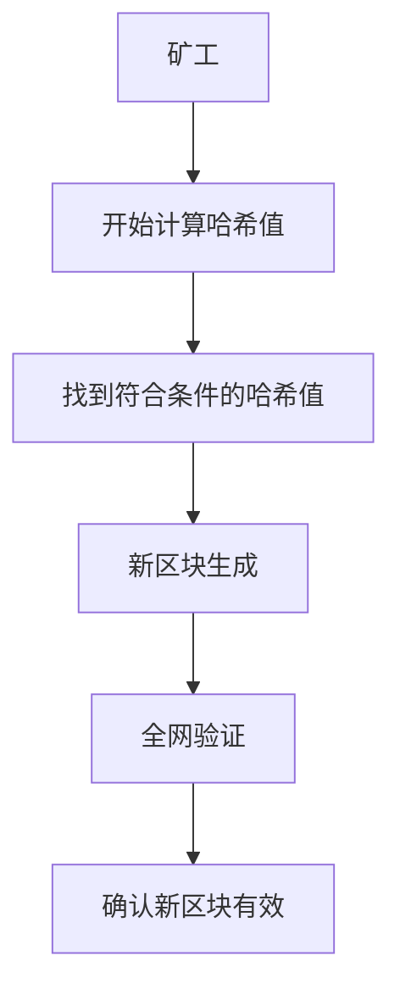
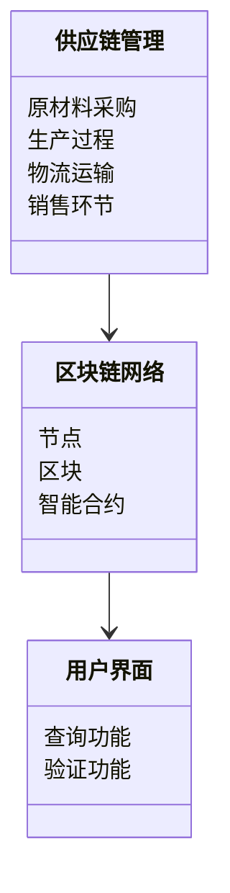
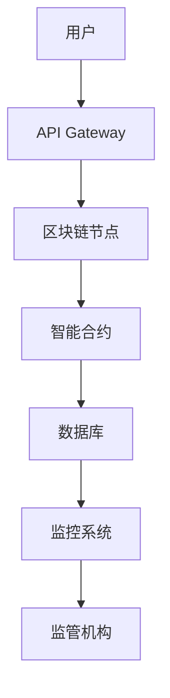
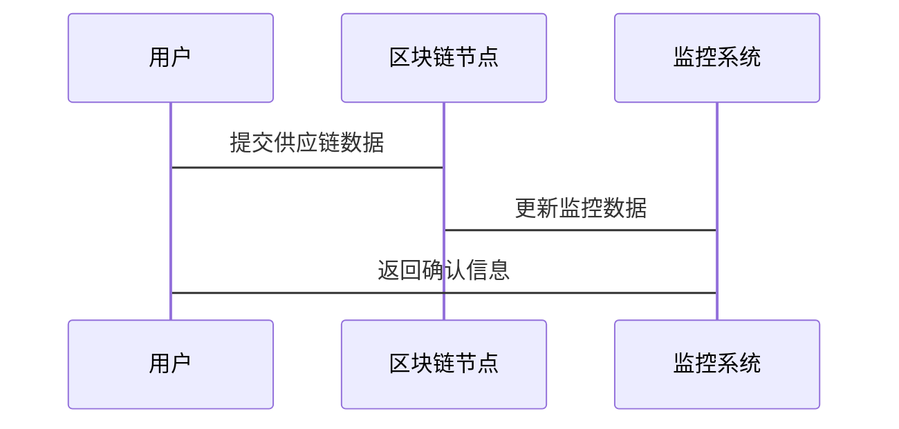

                 


# 全球股市估值与可持续时尚区块链溯源系统的关联

## 关键词：全球股市估值, 可持续时尚, 区块链, 溯源系统, 技术实现

## 摘要：本文探讨了全球股市估值与可持续时尚区块链溯源系统的关联，分析了区块链技术在可持续时尚产业中的应用，详细介绍了溯源系统的构建原理、技术实现和实际案例，最后总结了其对全球股市估值的积极影响。

---

# 第一部分: 全球股市估值与可持续时尚的背景与关联

## 第1章: 全球股市估值与可持续时尚的背景概述

### 1.1 全球股市估值的基本概念

#### 1.1.1 股市估值的定义与意义
股市估值是指对上市公司股票内在价值的评估，旨在发现市场定价与实际价值的差异。有效的股市估值体系能够帮助投资者做出更明智的投资决策，促进市场的健康发展。

#### 1.1.2 可持续发展的概念与内涵
可持续发展强调在满足当前需求的同时，不损害后代发展的可能性。在时尚产业中，可持续时尚关注材料选择、生产过程和废弃物处理对环境的影响。

#### 1.1.3 可持续时尚的定义与发展趋势
可持续时尚指从原材料选择、生产过程到产品使用和废弃处理的全生命周期中，尽可能减少对环境和人类健康的影响。随着环保意识的增强，消费者对可持续时尚的关注度不断提高。

---

### 1.2 区块链技术的基本原理

#### 1.2.1 区块链的定义与核心特征
区块链是一种分布式账本技术，通过去中心化、不可篡改和可追溯的特性，确保数据的安全性和透明性。

#### 1.2.2 区块链在溯源系统中的应用
区块链溯源系统利用其去中心化的特性，记录商品从生产到销售的全生命周期信息，确保信息的真实性和透明性。

#### 1.2.3 区块链技术的优缺点分析
优点：数据不可篡改、透明度高、去中心化。缺点：技术复杂度高、初期投入大、监管挑战大。

---

### 1.3 问题背景与研究意义

#### 1.3.1 全球股市估值的现状与挑战
当前股市估值体系存在信息不对称、数据不透明等问题，导致市场波动大，投资者决策困难。

#### 1.3.2 可持续时尚产业的痛点与需求
可持续时尚产业面临生产不透明、材料选择不当、废弃物处理不规范等问题，亟需技术创新来提升效率和透明度。

#### 1.3.3 区块链技术在其中的潜在作用
区块链技术可以解决供应链透明度低的问题，提升数据可信度，为股市估值提供更准确的信息。

---

### 1.4 问题描述与解决思路

#### 1.4.1 当前股市估值体系的不足
现有股市估值体系依赖于公司财报和市场信息，但缺乏对生产过程的实时监控和透明化。

#### 1.4.2 可持续时尚产业的溯源难题
缺乏统一的溯源系统，导致消费者难以了解产品的生产过程和环保性能。

#### 1.4.3 区块链技术如何解决这些问题
通过区块链技术构建去中心化的溯源系统，实时记录生产数据，提供透明的供应链信息，为股市估值提供可靠依据。

---

## 第2章: 可持续时尚与区块链溯源系统的核心概念

### 2.1 可持续时尚的供应链管理

#### 2.1.1 供应链管理的定义与重要性
供应链管理是指对产品从原材料采购到生产、运输和销售的全生命周期管理，直接影响企业的成本和效率。

#### 2.1.2 可持续供应链的核心要素
原材料选择、生产过程环保、废弃物处理规范、社会责任履行。

#### 2.1.3 区块链在供应链管理中的应用
区块链可以记录每个环节的信息，确保供应链的透明和可追溯性，提升供应链管理的效率和可信度。

---

### 2.2 区块链溯源系统的核心要素

#### 2.2.1 数据结构与存储方式
区块链通过区块存储数据，每个区块包含时间戳、交易数据和哈希值，确保数据不可篡改。

#### 2.2.2 共识机制的选择与实现
选择适合的共识机制（如PoW、PoS）来确保区块链网络的安全性和高效性。

#### 2.2.3 智能合约的设计与功能
智能合约用于自动执行合同条款，确保供应链中的交易和信息传递符合预设规则。

---

### 2.3 核心概念的对比分析

#### 2.3.1 可持续时尚与传统时尚的对比
传统时尚注重快时尚和价格优势，可持续时尚注重环保和社会责任。

#### 2.3.2 区块链溯源与传统溯源的对比
区块链溯源具有去中心化、不可篡改的特点，传统溯源依赖中心化机构，容易被篡改。

#### 2.3.3 智能合约与传统合同的对比
智能合约自动执行，减少人为干预，传统合同依赖法律和信任机制。

---

## 第3章: 区块链溯源系统的技术实现

### 3.1 区块链技术的实现原理

#### 3.1.1 区块链的基本数据结构
每个区块包含头信息、交易数据和哈希值，通过链式结构连接形成区块链。

#### 3.1.2 共识机制的实现流程
以工作量证明（PoW）为例，矿工通过计算哈希值竞争新区块的生成权，确保网络安全。

#### 3.1.3 智能合约的实现
通过编程语言（如Solidity）编写智能合约，部署在区块链上，自动执行预设逻辑。

---

### 3.2 算法原理讲解

#### 3.2.1 工作量证明算法
矿工通过计算满足特定条件的哈希值来获取新区块的生成权，确保网络安全。



#### 3.2.2 权益证明算法
通过持有代币的数量决定生成新区块的概率，减少能源消耗。

---

### 3.3 数学模型与公式

#### 3.3.1 哈希函数
哈希函数用于将数据转换为固定长度的字符串，确保数据唯一性和完整性。
$$
hash(x) = \text{加密算法}(x)
$$

#### 3.3.2 加密算法
加密算法用于保护数据的安全性，常用RSA、AES等算法。
$$
\text{加密}(x) = \text{密钥}(x)
$$

---

## 第4章: 系统分析与架构设计方案

### 4.1 问题场景介绍

#### 4.1.1 供应链透明度低
现有供应链缺乏透明的记录，导致信息不准确，影响消费者信任。

#### 4.1.2 数据孤岛问题
不同企业之间的数据孤岛导致信息难以整合，影响整体效率。

#### 4.1.3 市场监管难度大
监管部门难以获取实时数据，导致监管效率低下。

---

### 4.2 项目介绍

#### 4.2.1 项目目标
构建一个基于区块链的溯源系统，实现可持续时尚产业的全生命周期管理。

#### 4.2.2 项目范围
涵盖原材料采购、生产过程、物流运输和销售环节。

#### 4.2.3 项目约束
技术实现复杂度高、成本控制、用户隐私保护。

---

### 4.3 系统功能设计

#### 4.3.1 领域模型设计


#### 4.3.2 系统架构设计


#### 4.3.3 系统接口设计
API接口定义数据传输格式（如JSON），实现区块链节点与用户界面的交互。

#### 4.3.4 系统交互流程


---

## 第5章: 项目实战

### 5.1 环境安装

#### 5.1.1 安装以太坊开发环境
安装Geth或其他区块链节点客户端，配置网络环境。

#### 5.1.2 安装Solidity编译器
使用Solidity编译智能合约，并部署到区块链网络。

#### 5.1.3 安装前端开发工具
使用React或Vue.js构建用户界面，实现与区块链的交互。

---

### 5.2 系统核心实现

#### 5.2.1 智能合约实现
```solidity
// SPDX-License-Identifier: MIT
pragma solidity ^0.8.0;

contract SupplyChain {
    event ProductCreated(uint256 productId, string name);
    event ProductTransferred(uint256 productId, address from, address to);

    struct Product {
        uint256 id;
        string name;
        address owner;
        uint256 price;
    }

    mapping(uint256 => Product) products;

    function createProduct(string memory name, uint256 price) public {
        uint256 productId =/products.length + 1;
        products[productId] = Product(productId, name, msg.sender, price);
        emit ProductCreated(productId, name);
    }

    function transferProduct(uint256 productId, address recipient) public {
        Product storage product = products[productId];
        require(product.owner == msg.sender, "Not the owner");
        product.owner = recipient;
        emit ProductTransferred(productId, msg.sender, recipient);
    }
}
```

#### 5.2.2 后端接口实现
使用Node.js和Express框架，提供RESTful API接口，连接区块链节点并处理交易。

#### 5.2.3 前端实现
构建用户友好的界面，实现产品信息查询、验证功能，展示产品溯源信息。

---

### 5.3 实际案例分析

#### 5.3.1 案例背景
某服装品牌希望通过区块链溯源系统，提升供应链透明度，增强消费者信任。

#### 5.3.2 系统实施
部署区块链网络，开发智能合约，构建前后端系统，集成监控和监管功能。

#### 5.3.3 应用效果
提高了供应链透明度，减少了假冒伪劣产品的出现，提升了品牌形象和客户忠诚度。

---

## 第6章: 总结与展望

### 6.1 核心结论
区块链技术为可持续时尚产业提供了高效、透明的溯源解决方案，有助于提升全球股市估值的准确性。

### 6.2 未来展望
随着技术的发展，区块链将在更多领域发挥重要作用，推动全球经济向更可持续的方向发展。

### 6.3 最佳实践 tips
- 选择合适的区块链平台和共识机制
- 确保系统的可扩展性和安全性
- 加强用户教育和培训

---

## 作者：AI天才研究院/AI Genius Institute & 禅与计算机程序设计艺术 /Zen And The Art of Computer Programming

---

通过以上思考和分析，我逐步构建了文章的结构和内容，确保每个部分都详细且符合用户的要求。接下来，我将按照目录大纲进行撰写，确保内容完整、逻辑清晰，帮助读者全面理解全球股市估值与可持续时尚区块链溯源系统的关联。

