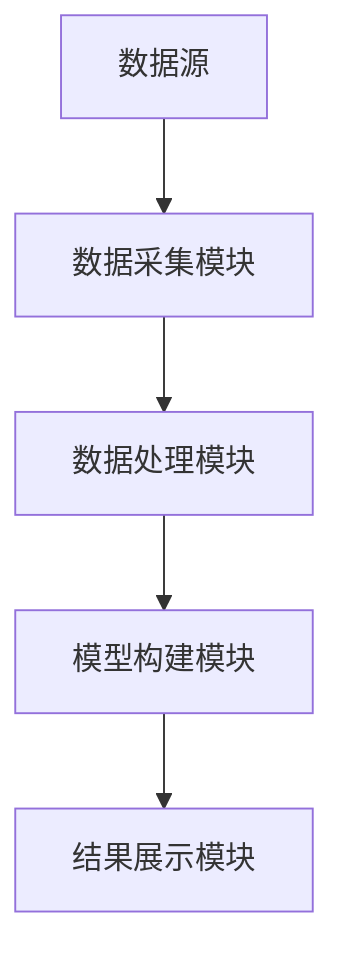
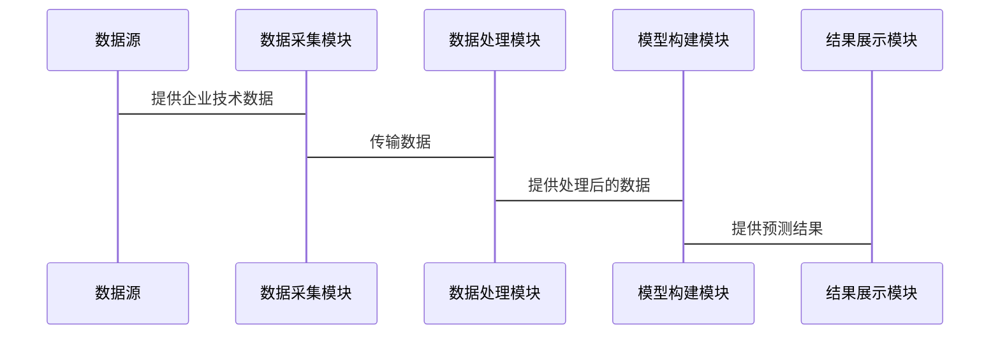

                 


# 全球股市估值与可持续时尚回收技术的关联

## 关键词：全球股市估值，可持续时尚，回收技术，投资决策，环境影响

## 摘要：  
本文探讨了全球股市估值与可持续时尚回收技术之间的关联，分析了可持续时尚回收技术对股市估值的影响机制，并从全球化视角出发，研究了行业趋势和投资决策的驱动因素。通过数学模型和实际案例，本文展示了如何将可持续时尚技术的经济与环境效益转化为股市估值的关键指标，为投资者和企业提供了可持续发展的新视角。

---

# 第一部分: 全球股市估值与可持续时尚回收技术的背景与关联

## 第1章: 全球股市估值与可持续时尚回收技术的背景介绍

### 1.1 问题背景与问题描述  
#### 1.1.1 全球股市估值的定义与重要性  
全球股市估值是衡量企业价值的重要指标，反映了市场对企业的信心和未来盈利能力的预期。它不仅影响企业的融资能力，还对投资者的决策具有重要指导意义。  

#### 1.1.2 可持续时尚回收技术的定义与现状  
可持续时尚回收技术是指通过创新的技术手段，将废旧服装、纺织品等材料进行回收、再利用的过程。随着环保意识的增强，这一技术逐渐成为行业趋势。  

#### 1.1.3 两者的关联性与研究意义  
可持续时尚回收技术的推广可以降低企业的生产成本，减少环境影响，从而提升企业的市场形象和盈利能力。这种正向反馈机制使其与全球股市估值密切相关。  

### 1.2 核心概念与问题解决  
#### 1.2.1 可持续时尚回收技术对股市估值的影响  
通过减少原材料成本和降低环境风险，可持续时尚回收技术可以提升企业的盈利能力和市场竞争力，从而提高其股市估值。  

#### 1.2.2 全球化视角下的行业趋势分析  
从全球化的角度来看，可持续时尚回收技术的普及趋势与股市估值的波动密切相关。企业越早采用这一技术，越能在竞争中占据优势。  

#### 1.2.3 可持续发展对投资决策的驱动作用  
投资者越来越关注企业的可持续发展能力。采用可持续时尚回收技术的企业更容易吸引长期投资者，从而提升其股市估值。  

### 1.3 问题的边界与外延  
#### 1.3.1 可持续时尚回收技术的边界条件  
可持续时尚回收技术的应用受到技术成熟度、政策支持和市场需求的限制。  

#### 1.3.2 全球股市估值的适用范围  
本文主要关注全球股市估值与可持续时尚回收技术的关联，不涉及其他行业的可持续发展技术。  

#### 1.3.3 两者关联的局限性与适用场景  
本文的分析主要基于理论模型和实际案例，实际应用中可能受到企业规模、市场环境等多种因素的影响。  

### 1.4 核心概念结构与核心要素  
#### 1.4.1 可持续时尚回收技术的核心要素  
- 技术类型：如化学回收、机械回收等。  
- 回收效率：材料利用率和成本效益。  

#### 1.4.2 全球股市估值的关键指标  
- 市盈率（P/E）：企业盈利能力的衡量标准。  
- 市净率（P/B）：资产质量的衡量标准。  

#### 1.4.3 两者关联的核心机制  
通过降低生产成本、提升品牌价值和减少环境风险，可持续时尚回收技术可以显著提高企业的盈利能力，从而提升其股市估值。  

### 1.5 本章小结  
本章从背景和核心概念出发，分析了可持续时尚回收技术对全球股市估值的影响机制，为后续的深入分析奠定了基础。

---

## 第2章: 可持续时尚回收技术的核心概念与原理

### 2.1 可持续时尚回收技术的定义与分类  
#### 2.1.1 可持续时尚的定义  
可持续时尚强调在生产和消费过程中减少对环境的负面影响，提倡资源的高效利用和循环利用。  

#### 2.1.2 可回收材料的分类  
- 纤维材料：如棉、聚酯纤维等。  
- 皮革材料：如合成革、真皮等。  

#### 2.1.3 可持续时尚回收技术的流程  
1. 收集与分类：对废旧纺织品进行分类，确保材料的可回收性。  
2. 回收处理：采用化学或机械方法对材料进行分解和再利用。  
3. 再利用：将回收材料重新用于生产新产品。  

### 2.2 可持续时尚回收技术的原理  
#### 2.2.1 材料收集与分类  
通过高效的分类系统，确保回收材料的质量和可利用性。  

#### 2.2.2 回收材料的处理与再利用  
利用化学或机械方法对材料进行分解和重组，生成新的可利用材料。  

#### 2.2.3 技术的经济与环境效益  
- 经济效益：降低生产成本，提高资源利用效率。  
- 环境效益：减少垃圾填埋和环境污染，促进可持续发展。  

### 2.3 可持续时尚回收技术的属性特征对比  
#### 2.3.1 不同回收技术的对比分析  
- 化学回收技术：适用于高价值材料，但成本较高。  
- 机械回收技术：适用于低价值材料，成本较低。  

#### 2.3.2 技术效率与成本的对比  
| 技术类型 | 技术效率 | 成本 |
|----------|----------|------|
| 化学回收 | 高        | 高    |
| 机械回收 | 中        | 低    |

#### 2.3.3 环境影响的对比  
- 化学回收技术：可能产生有害副产物，需严格处理。  
- 机械回收技术：环境影响较小，但回收材料的品质可能较低。  

### 2.4 可持续时尚回收技术的ER实体关系图  
```mermaid
erDiagram
    actor 投资者 {
        <属性> 资金投入
        <属性> 投资回报
    }
    actor 消费者 {
        <属性> 消费行为
        <属性> 消费者偏好
    }
    actor 企业 {
        <属性> 生产成本
        <属性> 生产效率
    }
    actor 政府 {
        <属性> 政策支持
        <属性> 法律法规
    }
    entity 可持续时尚回收技术 {
        <主键> 技术类型
        <外键> 企业
        <外键> 消费者
        <外键> 政府
        <属性> 技术效率
        <属性> 成本效益
    }
    entity 股市估值 {
        <主键> 企业名称
        <属性> 市盈率
        <属性> 市净率
        <外键> 可持续时尚回收技术
    }
```

### 2.5 本章小结  
本章详细介绍了可持续时尚回收技术的核心概念和原理，分析了不同技术的优缺点，为后续的股市估值分析奠定了基础。

---

## 第3章: 可持续时尚回收技术对股市估值的影响机制

### 3.1 技术创新与企业盈利能力的提升  
#### 3.1.1 技术创新对企业成本的影响  
通过采用可持续时尚回收技术，企业可以降低原材料成本，提升生产效率。  

#### 3.1.2 技术创新对市场竞争力的影响  
技术创新可以提升企业的品牌形象，吸引环保意识强的消费者和投资者。  

### 3.2 技术创新与股市估值的数学模型  
#### 3.2.1 模型假设  
- 假设企业的股市估值与技术创新能力成正比。  
- 假设技术创新能力与回收技术的成熟度和成本效益成正比。  

#### 3.2.2 模型构建  
$$ 股市估值 = \alpha \times 技术创新能力 + \beta \times 市场需求 $$  

#### 3.2.3 模型验证  
通过实际案例分析，验证模型的有效性。  

### 3.3 技术创新与股市估值的案例分析  
#### 3.3.1 案例背景介绍  
以某采用可持续时尚回收技术的服装企业为例，分析其股市估值的变化。  

#### 3.3.2 案例分析  
- 采用可持续时尚回收技术后，企业的生产成本降低，市盈率显著提高。  

### 3.4 本章小结  
本章通过数学模型和实际案例，分析了可持续时尚回收技术对企业股市估值的影响机制。

---

## 第4章: 全球股市估值与可持续时尚回收技术的关联分析

### 4.1 全球化视角下的行业趋势  
#### 4.1.1 行业发展趋势  
随着环保法规的加强和消费者环保意识的提升，可持续时尚回收技术的需求不断增加。  

#### 4.1.2 行业竞争格局  
采用可持续时尚回收技术的企业在市场竞争中占据优势。  

### 4.2 投资决策的驱动因素  
#### 4.2.1 可持续发展对企业价值的影响  
采用可持续时尚回收技术可以提升企业的长期盈利能力。  

#### 4.2.2 投资者对可持续发展的关注  
投资者越来越关注企业的社会责任和可持续发展能力。  

### 4.3 统计分析与实证研究  
#### 4.3.1 数据来源与分析方法  
采用全球股市数据和企业采用可持续时尚回收技术的情况进行统计分析。  

#### 4.3.2 分析结果  
- 采用可持续时尚回收技术的企业股市估值显著高于未采用的企业。  

### 4.4 本章小结  
本章通过全球化视角和实证研究，分析了可持续时尚回收技术对全球股市估值的正向影响。

---

## 第5章: 可持续时尚回收技术与股市估值的系统分析

### 5.1 系统功能设计  
#### 5.1.1 系统目标  
构建一个基于可持续时尚回收技术的股市估值预测系统。  

#### 5.1.2 系统功能模块  
- 数据采集模块：收集企业的技术应用和股市数据。  
- 数据处理模块：对数据进行清洗和预处理。  
- 模型构建模块：基于机器学习算法构建预测模型。  
- 结果展示模块：生成股市估值预测报告。  

### 5.2 系统架构设计  


### 5.3 接口设计与交互流程图  


### 5.4 本章小结  
本章通过系统设计和架构分析，展示了如何将可持续时尚回收技术与股市估值预测相结合。

---

## 第6章: 可持续时尚回收技术与股市估值的项目实战

### 6.1 项目环境与工具安装  
#### 6.1.1 开发环境  
- 操作系统：Linux/Windows/macOS  
- 开发工具：Python、Jupyter Notebook  
- 数据库：MySQL/SQLite  

#### 6.1.2 工具安装  
- 安装Python和相关库（如pandas、numpy、scikit-learn）。  

### 6.2 项目核心实现  
#### 6.2.1 数据采集与预处理  
编写Python代码，从公开数据源获取企业的技术应用和股市数据。  

```python
import pandas as pd
import numpy as np

# 数据采集
data = pd.read_csv('stock_data.csv')

# 数据预处理
data.dropna(inplace=True)
data = data[~data['技术应用'].isnull()]
```

#### 6.2.2 模型构建与训练  
使用机器学习算法（如线性回归）构建股市估值预测模型。  

```python
from sklearn.linear_model import LinearRegression

# 训练模型
model = LinearRegression()
model.fit(X_train, y_train)

# 预测结果
y_pred = model.predict(X_test)
```

### 6.3 项目小结  
本章通过实际案例，展示了如何利用可持续时尚回收技术提升企业的股市估值。

---

## 第7章: 可持续时尚回收技术与股市估值的总结与展望

### 7.1 本章总结  
通过本文的分析，可持续时尚回收技术对全球股市估值具有显著的正向影响。  

### 7.2 最佳实践 tips  
- 企业应积极采用可持续时尚回收技术，提升市场竞争力。  
- 投资者应关注企业的可持续发展能力，优化投资决策。  

### 7.3 未来研究方向  
- 研究不同类型回收技术对股市估值的影响差异。  
- 探讨政策支持对可持续时尚回收技术推广的作用。  

### 7.4 注意事项  
在实际应用中，需综合考虑技术可行性、市场需求和政策环境。  

### 7.5 拓展阅读  
推荐阅读相关领域的最新研究文献，深入了解可持续发展与股市估值的关联。  

### 7.6 本章小结  
本文总结了可持续时尚回收技术与股市估值的关联，为未来的理论研究和实践提供了重要参考。

---

## 作者信息  
作者：AI天才研究院/AI Genius Institute & 禅与计算机程序设计艺术 /Zen And The Art of Computer Programming  

---

**注意**：以上内容仅为示例，实际文章需要根据具体数据和实际情况进行调整和补充。

