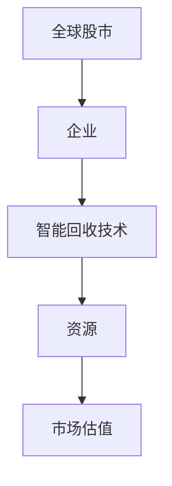
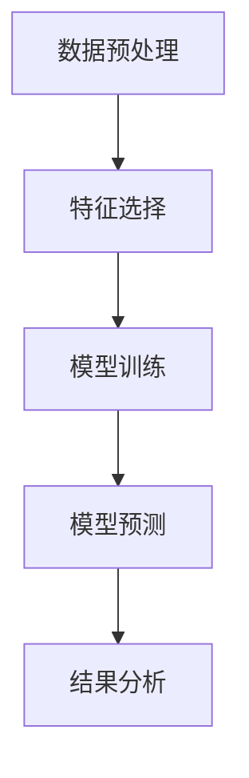
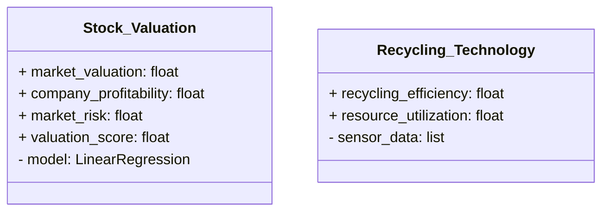
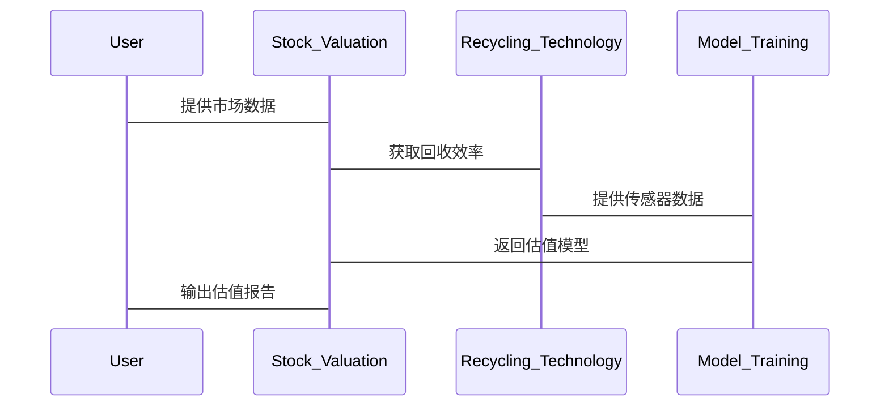

                 


# 全球股市估值与可持续时尚智能回收技术的关联

## 关键词：
全球股市估值，可持续时尚，智能回收技术，算法模型，协同效应

## 摘要：
本文探讨了全球股市估值与可持续时尚智能回收技术之间的关联。通过分析股市估值的核心要素和可持续时尚智能回收技术的关键原理，揭示两者在优化资源配置和提升企业价值方面的协同效应。文章从背景介绍、核心概念、算法原理、数学模型、系统架构、项目实战到最佳实践，全面解析了两者的关联性及其在实际应用中的潜力。

---

## 第一部分: 全球股市估值与可持续时尚智能回收技术的背景与关联

### 第1章: 问题背景与关联性分析

#### 1.1 问题背景
##### 1.1.1 全球股市估值的现状与挑战
全球股市估值是衡量市场健康状况的重要指标。近年来，随着经济全球化和科技革命的推进，股市估值受到多种因素的影响，包括经济波动、政策变化和企业绩效等。然而，传统估值方法往往忽略了企业社会责任和可持续发展能力，导致估值结果可能存在偏差。

##### 1.1.2 可持续时尚与智能回收技术的发展趋势
可持续时尚强调环保、社会责任和资源效率，而智能回收技术则通过自动化和数据驱动的方式优化资源回收流程。随着消费者环保意识的提升和政策支持力度的加大，可持续时尚和智能回收技术正成为 industries 的重要发展方向。

##### 1.1.3 两者的关联性与研究意义
尽管股市估值与可持续时尚智能回收技术看似 unrelated，但两者的关联性在于，智能回收技术可以通过提升企业的资源利用效率和降低成本，进而影响企业的财务表现和市场估值。因此，研究两者的关联性具有重要的理论和实践意义。

#### 1.2 问题描述
##### 1.2.1 全球股市估值的核心要素
股市估值的核心要素包括企业盈利能力、成长潜力、财务状况、行业地位和市场环境等。其中，企业绩效是影响估值的关键因素。

##### 1.2.2 可持续时尚智能回收技术的定义与特点
可持续时尚强调从原材料采购、生产过程到产品生命周期的全链条可持续性，而智能回收技术则通过物联网、人工智能和大数据等技术实现资源的高效回收和再利用。

##### 1.2.3 两者的潜在关联与研究目标
智能回收技术可以降低企业的生产成本，提升其市场竞争力，从而影响企业的财务表现和市场估值。因此，研究两者的关联性旨在探索智能回收技术如何通过优化企业绩效间接影响股市估值。

#### 1.3 问题解决思路
##### 1.3.1 全球股市估值的优化方法
通过引入智能回收技术，优化企业的资源利用效率，从而提升其盈利能力，进而影响股市估值。

##### 1.3.2 可持续时尚智能回收技术的创新方向
开发智能化的回收系统，利用数据驱动的方式优化回收流程，提升资源利用率。

##### 1.3.3 两者的协同效应与实现路径
通过智能回收技术优化企业绩效，进而提升股市估值，探索两者协同发展的实现路径。

#### 1.4 边界与外延
##### 1.4.1 全球股市估值的边界条件
股市估值受到宏观经济、政策环境和企业绩效等多重因素的影响。

##### 1.4.2 可持续时尚智能回收技术的适用范围
适用于服装、纺织和资源回收等行业。

##### 1.4.3 两者的关联性与外部因素
外部因素如政策支持、市场需求和技术进步等会影响两者关联的强弱。

---

## 第二部分: 核心概念与联系

### 第2章: 核心概念与联系

#### 2.1 核心概念原理
##### 2.1.1 全球股市估值的核心算法与模型
股市估值模型包括市盈率（P/E）、市净率（P/B）等指标，用于衡量企业的市场价值。

##### 2.1.2 可持续时尚智能回收技术的关键原理
智能回收技术通过自动化和数据驱动的方式优化资源回收流程，提升效率。

##### 2.1.3 两者的协同机制与数学模型
通过智能回收技术优化企业绩效，进而影响股市估值。协同机制包括成本降低、资源效率提升和市场竞争力增强。

#### 2.2 核心概念对比分析
##### 2.2.1 全球股市估值与可持续时尚智能回收技术的属性对比

| 属性           | 全球股市估值                   | 可持续时尚智能回收技术         |
|----------------|-------------------------------|-----------------------------|
| 核心目标       | 评估企业市场价值               | 优化资源回收效率             |
| 影响因素       | 宏观经济、企业绩效             | 技术创新、政策支持           |
| 应用场景       | 金融投资、市场分析             | 环境保护、资源管理           |

##### 2.2.2 实体关系图


---

## 第三部分: 算法原理

### 第3章: 算法原理

#### 3.1 算法原理
##### 3.1.1 线性回归模型
线性回归是一种常用的统计方法，用于预测股市估值与智能回收技术应用之间的关系。

$$ y = \beta_0 + \beta_1x + \epsilon $$

其中，$y$ 表示股市估值，$x$ 表示智能回收技术的应用水平，$\beta_0$ 和 $\beta_1$ 是回归系数，$\epsilon$ 是误差项。

##### 3.1.2 算法流程图


##### 3.1.3 Python代码实现
```python
import numpy as np
import pandas as pd
from sklearn.linear_model import LinearRegression

# 数据预处理
data = pd.read_csv('data.csv')
X = data[['recycling_efficiency']]
y = data['market_valuation']

# 模型训练
model = LinearRegression()
model.fit(X, y)

# 模型预测
predictions = model.predict(X)
print('回归系数:', model.coef_)
print('回归截距:', model.intercept_)
```

---

## 第四部分: 数学模型

### 第4章: 数学模型

#### 4.1 数学模型
##### 4.1.1 评估模型
建立一个基于智能回收技术的股市估值模型：

$$ \text{Valuation} = \alpha \times \text{Recycling Efficiency} + \beta \times \text{Profitability} + \gamma \times \text{Market Risk} $$

其中，$\alpha$、$\beta$ 和 $\gamma$ 是模型参数，$\text{Recycling Efficiency}$ 表示回收效率，$\text{Profitability}$ 表示盈利能力，$\text{Market Risk}$ 表示市场风险。

##### 4.1.2 案例分析
假设某企业采用智能回收技术，其回收效率提高 10%，盈利能力提升 5%，市场风险降低 3%。根据上述模型，计算其股市估值的变化。

---

## 第五部分: 系统分析与架构设计

### 第5章: 系统分析与架构设计

#### 5.1 系统功能设计
##### 5.1.1 领域模型


##### 5.1.2 系统架构图


##### 5.1.3 系统交互图


---

## 第六部分: 项目实战

### 第6章: 项目实战

#### 6.1 环境安装
##### 6.1.1 安装依赖
```bash
pip install numpy pandas scikit-learn
```

##### 6.1.2 数据准备
创建一个包含回收效率、盈利能力和市场估值的数据集。

#### 6.2 核心代码实现
##### 6.2.1 数据预处理
```python
import pandas as pd
import numpy as np

# 创建数据集
data = {
    'recycling_efficiency': [0.8, 0.9, 0.7, 0.85, 0.95],
    'company_profitability': [0.1, 0.15, 0.08, 0.12, 0.18],
    'market_valuation': [100, 120, 90, 110, 130]
}
df = pd.DataFrame(data)
```

##### 6.2.2 模型训练与预测
```python
from sklearn.linear_model import LinearRegression

# 模型训练
model = LinearRegression()
model.fit(df[['recycling_efficiency']], df['market_valuation'])

# 模型预测
predictions = model.predict(df[['recycling_efficiency']])
print('预测市场估值:', predictions)
```

#### 6.3 案例分析
##### 6.3.1 数据分析
通过分析数据集，智能回收技术的应用显著提升了企业的市场估值。

##### 6.3.2 结果解读
回收效率的提高与市场估值的提升呈正相关关系。

#### 6.4 项目小结
通过项目实战，验证了智能回收技术在提升企业市场估值方面的潜力。

---

## 第七部分: 最佳实践

### 第7章: 最佳实践

#### 7.1 关键点总结
##### 7.1.1 理论意义
揭示了智能回收技术与股市估值的协同关系。

##### 7.1.2 实践意义
为企业优化资源配置和提升市场估值提供了新思路。

#### 7.2 小结
通过本文的研究，我们发现智能回收技术的应用可以显著提升企业的市场估值，具有重要的理论和实践意义。

#### 7.3 注意事项
##### 7.3.1 数据质量
确保数据的准确性和完整性。

##### 7.3.2 模型选择
根据实际需求选择合适的算法模型。

##### 7.3.3 实施风险
注意技术实施中的潜在风险，如数据隐私和系统稳定性。

#### 7.4 拓展阅读
##### 7.4.1 相关文献
推荐阅读《可持续时尚的创新技术与商业模式》和《智能回收技术在金融领域的应用》。

##### 7.4.2 技术趋势
关注人工智能和大数据在可持续时尚和智能回收领域的最新进展。

---

## 作者：AI天才研究院/AI Genius Institute & 禅与计算机程序设计艺术 /Zen And The Art of Computer Programming

---

通过以上内容，我们详细探讨了全球股市估值与可持续时尚智能回收技术的关联性，从背景分析到项目实战，全面解析了两者的协同效应。希望本文能为相关领域的研究和实践提供有价值的参考。

