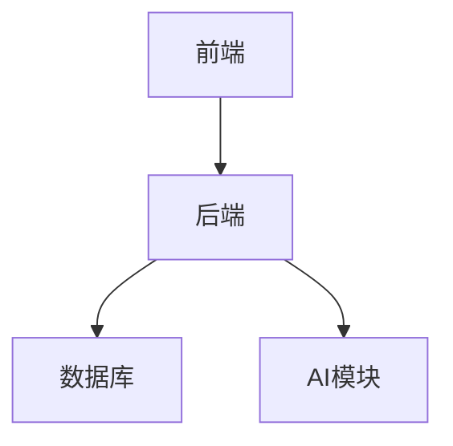
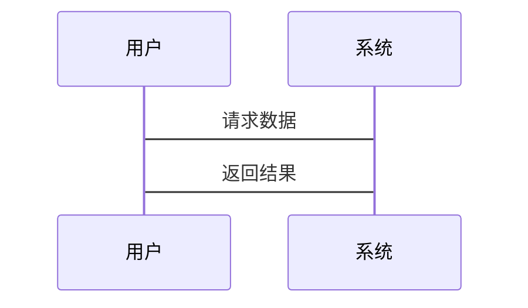

                 


# 全球股市估值与可持续时尚智能回收系统的关联

> 关键词：全球股市估值、可持续时尚、智能回收系统、算法原理、系统架构

> 摘要：本文探讨了全球股市估值与可持续时尚智能回收系统的关联，分析了两者的关联性原理、核心概念、算法实现、系统架构及项目实战，提供了深入的技术见解和实践指导。

---

## 第1章: 背景介绍与核心概念

### 1.1 问题背景与描述

#### 1.1.1 全球股市估值的重要性
全球股市估值是衡量市场健康状况的重要指标，反映经济趋势和企业盈利能力。通过分析股市估值，投资者可以做出更明智的决策。

#### 1.1.2 可持续时尚与智能回收系统的兴起
可持续时尚强调环保和资源效率，智能回收系统通过技术手段提高回收效率，减少资源浪费。

#### 1.1.3 两者的关联性与研究意义
研究股市估值与可持续时尚回收系统的关联，有助于优化资源配置，推动可持续发展。

### 1.2 核心概念与定义

#### 1.2.1 全球股市估值的定义与影响因素
股市估值是市场总值，受经济指标、政策和企业盈利等因素影响。

#### 1.2.2 可持续时尚的定义与发展趋势
可持续时尚通过环保材料和工艺减少环境影响，是行业发展趋势。

#### 1.2.3 智能回收系统的定义与技术特征
智能回收系统利用AI和物联网技术，提高回收效率和资源利用率。

### 1.3 问题解决与边界

#### 1.3.1 通过智能回收提升可持续时尚的效率
智能系统优化回收流程，降低生产成本。

#### 1.3.2 全球股市估值与可持续时尚的双向影响
股市估值影响企业投资，可持续时尚推动企业转型，两者相互作用。

#### 1.3.3 系统的边界与外延
系统仅考虑股市估值和智能回收，不涉及其他因素。

### 1.4 核心要素与概念结构

#### 1.4.1 全球股市估值的核心要素分析
- 市场总值
- 影响因素

#### 1.4.2 可持续时尚智能回收系统的构成要素
- 技术支持
- 回收流程

#### 1.4.3 两者的关联性分析与对比
- 技术应用
- 经济影响

---

## 第2章: 核心概念与联系

### 2.1 核心概念原理

#### 2.1.1 全球股市估值的计算原理
市场总值=股价×股数。

#### 2.1.2 可持续时尚智能回收系统的运行机制
AI识别、分类和处理废弃物。

#### 2.1.3 两者的关联性原理
技术提升回收效率，影响企业利润，进而影响股市估值。

### 2.2 概念属性特征对比

| 属性       | 全球股市估值              | 可持续时尚智能回收系统       |
|------------|---------------------------|----------------------------|
| 核心目标   | 反映市场价值               | 提高回收效率                 |
| 技术依赖   | 金融分析、大数据           | AI、物联网                   |
| 影响因素   | 经济指标、政策             | 材料成本、技术效率           |

---

## 第3章: 算法原理与数学模型

### 3.1 数据流处理算法

#### 3.1.1 数据预处理流程
- 数据清洗
- 特征提取

#### 3.1.2 数据清洗与特征提取
- 删除缺失值
- 提取相关特征

#### 3.1.3 数据流处理的mermaid流程图
```mermaid
graph TD
A[数据输入] -> B[数据清洗] -> C[特征提取] -> D[模型训练]
```

### 3.2 机器学习模型

#### 3.2.1 算法选择与原理
使用回归算法预测股市估值。

#### 3.2.2 模型训练流程
1. 数据分割
2. 模型训练
3. 模型评估

#### 3.2.3 模型评估与优化
- 均方误差
- 调参优化

---

## 第4章: 系统分析与架构设计

### 4.1 问题场景介绍

#### 4.1.1 全球股市估值分析场景
分析市场趋势，预测企业价值。

#### 4.1.2 可持续时尚智能回收系统场景
优化回收流程，降低资源消耗。

#### 4.1.3 两者的关联场景
技术提升企业利润，影响股市估值。

### 4.2 项目介绍

#### 4.2.1 项目目标
建立关联模型，优化回收系统。

#### 4.2.2 项目范围
限定数据范围和应用场景。

### 4.3 系统功能设计

#### 4.3.1 领域模型mermaid类图
```mermaid
classDiagram
    class 股市估值 {
        市场总值
        股价
    }
    class 回收系统 {
        废弃物分类
        回收效率
    }
    股市估值 <-- 关联 --> 回收系统
```

#### 4.3.2 系统架构设计mermaid架构图


### 4.4 系统接口设计

#### 4.4.1 接口描述
- API接口定义
- 接口调用方式

### 4.5 系统交互mermaid序列图


---

## 第5章: 项目实战

### 5.1 环境安装与配置

#### 5.1.1 开发环境搭建
安装Python、Jupyter Notebook。

#### 5.1.2 工具安装与配置
安装Scikit-learn、Pandas。

### 5.2 核心代码实现

#### 5.2.1 数据处理代码
```python
import pandas as pd

# 数据清洗
data = pd.read_csv('data.csv')
data = data.dropna()
```

#### 5.2.2 模型训练代码
```python
from sklearn.linear_model import LinearRegression

model = LinearRegression()
model.fit(X_train, y_train)
```

#### 5.2.3 系统接口实现
```python
def get_prediction(data):
    return model.predict(data)
```

### 5.3 案例分析与解读

#### 5.3.1 案例背景与数据准备
使用历史数据训练模型。

#### 5.3.2 案例分析过程
- 数据分析
- 模型训练
- 结果解读

#### 5.3.3 案例结果与解读
模型预测股市估值，验证回收系统效率。

---

## 第6章: 最佳实践与小结

### 6.1 最佳实践tips

#### 6.1.1 数据处理建议
- 清洗数据
- 特征选择

#### 6.1.2 模型优化建议
- 调参
- 交叉验证

### 6.2 小结

本文分析了全球股市估值与可持续时尚智能回收系统的关联，探讨了算法实现和系统架构设计，提供了实战案例和最佳实践。

### 6.3 注意事项

- 数据质量影响结果
- 模型选择需结合实际场景

### 6.4 拓展阅读

- 《机器学习实战》
- 《可持续时尚的未来》

---

作者：AI天才研究院/AI Genius Institute & 禅与计算机程序设计艺术 /Zen And The Art of Computer Programming

