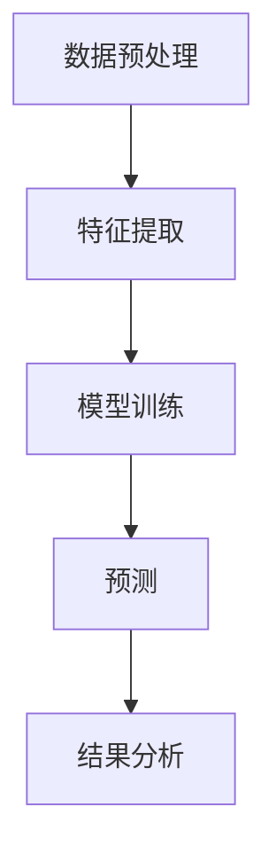
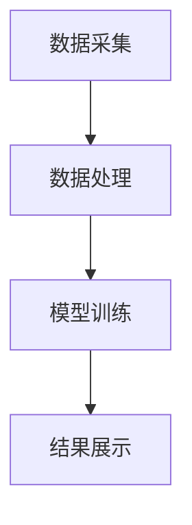

                 


# 全球股市估值与可持续时尚智能面料技术的关联

> **关键词**：全球股市估值、可持续时尚、智能面料技术、数据分析、机器学习、系统架构

> **摘要**：本文探讨了全球股市估值与可持续时尚智能面料技术之间的关联，分析了智能面料技术如何影响股市估值，并提出了基于机器学习的数学模型来预测这种影响。文章从背景介绍、核心概念、算法原理、系统架构到项目实战，全面解析了这一跨领域的关联性。

---

## 第1章 全球股市估值与可持续时尚智能面料技术的背景

### 1.1 全球股市估值的背景与重要性

#### 1.1.1 全球股市估值的基本概念
股市估值是衡量公司价值的重要指标，常用的指标包括市盈率（P/E）、市净率（P/B）等。这些指标反映了市场的信心和对公司未来表现的预期。

#### 1.1.2 全球股市估值的重要性
股市估值影响投资者决策，也反映了宏观经济状况。通过分析股市估值，可以洞察经济趋势和行业动态。

#### 1.1.3 全球股市估值的演变历程
从早期的道琼斯指数到现代的复杂金融模型，股市估值方法不断进化，反映了金融理论的发展。

### 1.2 可持续时尚与智能面料技术的背景

#### 1.2.1 可持续时尚的定义与发展趋势
可持续时尚强调环保和伦理，智能面料技术通过科技创新提升服装的功能性和可持续性。

#### 1.2.2 智能面料技术的基本概念
智能面料集成了传感器、数据处理和反馈系统，能够实时监测环境和用户数据。

#### 1.2.3 智能面料技术在时尚产业中的应用
智能面料用于智能服装、健康监测和交互设计，推动了服装产业的智能化和可持续发展。

### 1.3 本章小结
本章介绍了全球股市估值和可持续时尚智能面料技术的背景，为后续分析奠定了基础。

---

## 第2章 全球股市估值与可持续时尚智能面料技术的核心概念

### 2.1 全球股市估值的核心概念

#### 2.1.1 股票估值的基本原理
股票估值基于公司财务状况、行业地位和市场前景。常用的模型包括DCF模型和EV/EBITDA模型。

#### 2.1.2 市盈率、市净率等关键指标
市盈率=股价/每股收益，市净率=股价/每股净资产，这些指标反映了市场对公司的估值。

#### 2.1.3 股市估值与宏观经济的关系
宏观经济指标如GDP增长率和利率直接影响股市估值，是投资者的重要参考。

### 2.2 可持续时尚与智能面料技术的核心概念

#### 2.2.1 可持续时尚的核心要素
可持续时尚包括材料选择、生产过程和产品生命周期的可持续性，强调减少环境影响。

#### 2.2.2 智能面料技术的关键特征
智能面料具备实时监测、数据处理和反馈的功能，能够感知环境变化并做出响应。

#### 2.2.3 智能面料技术与传统面料的对比
智能面料在功能性和环保性上优于传统面料，但成本和技术门槛较高。

### 2.3 全球股市估值与智能面料技术的关联性

#### 2.3.1 智能面料技术对股市估值的影响路径
技术创新提升公司竞争力，可能提高股价和市盈率。

#### 2.3.2 可持续时尚对股市估值的潜在影响
消费者对环保产品的需求增加，可能提升相关公司的估值。

#### 2.3.3 全球股市与智能面料技术的互动关系
智能面料技术推动股市估值上升，而股市资金支持技术发展，形成良性循环。

### 2.4 本章小结
本章详细阐述了全球股市估值和智能面料技术的核心概念，及其相互关联。

---

## 第3章 全球股市估值与智能面料技术的关联机制

### 3.1 智能面料技术对股市估值的影响路径

#### 3.1.1 技术创新对股市估值的推动作用
技术创新提升产品附加值，可能提升公司股价和市盈率。

#### 3.1.2 市场需求变化对股市估值的影响
消费者对智能面料的需求增加，可能推高相关公司的股价。

#### 3.1.3 企业竞争力的提升
智能面料技术增强企业竞争力，可能提升市净率和市盈率。

### 3.2 数学模型与算法分析

#### 3.2.1 数据流与关联分析
使用关联规则挖掘分析智能面料技术与股市估值的关系。

#### 3.2.2 机器学习模型构建
基于历史数据，构建回归模型预测智能面料技术对股市估值的影响。

#### 3.2.3 算法流程图
以下是算法流程图：



---

## 第4章 系统分析与架构设计

### 4.1 问题场景介绍
分析智能面料技术对股市估值的影响，构建预测模型。

### 4.2 项目介绍
开发一个智能面料技术影响股市估值的预测系统。

### 4.3 系统功能设计

#### 4.3.1 领域模型类图
以下是领域模型类图：

```mermaid
classDiagram
    class 股市数据 {
        String 股票代码
        Double 收盘价
        Double 市盈率
        Double 市净率
    }
    class 智能面料数据 {
        String 技术类型
        Double 技术成熟度
        Double 成本
    }
    class 预测模型 {
        void 训练模型()
        Double 预测估值()
    }
    股市数据 -->> 预测模型
    智能面料数据 -->> 预测模型
```

### 4.4 系统架构设计

#### 4.4.1 系统架构图
以下是系统架构图：



### 4.5 系统接口设计
接口包括数据输入、模型训练和结果输出。

### 4.6 系统交互流程

#### 4.6.1 交互流程图
以下是交互流程图：

```mermaid
sequenceDiagram
    User -> 数据采集模块: 提供股票和智能面料数据
    数据采集模块 -> 数据处理模块: 请求处理数据
    数据处理模块 -> 模型训练模块: 请求训练模型
    模型训练模块 -> 结果展示模块: 提供预测结果
    User <- 结果展示模块: 显示预测结果
```

---

## 第5章 项目实战

### 5.1 环境安装

#### 5.1.1 Python环境
安装Python 3.8及以上版本，安装必要的库如pandas、scikit-learn。

### 5.2 核心代码实现

#### 5.2.1 数据预处理
```python
import pandas as pd

# 加载数据
df_stock = pd.read_csv('stock_data.csv')
df_fabric = pd.read_csv('fabric_data.csv')

# 合并数据
merged_data = pd.merge(df_stock, df_fabric, on='日期')
```

#### 5.2.2 模型训练
```python
from sklearn.linear_model import LinearRegression

# 特征选择
X = merged_data[['市盈率', '技术成熟度']]
y = merged_data['预测估值']

# 训练模型
model = LinearRegression()
model.fit(X, y)

# 预测
y_pred = model.predict(X)
```

#### 5.2.3 模型评估
```python
from sklearn.metrics import r2_score

r2_score(y, y_pred)
```

### 5.3 案例分析与解读
分析预测结果，评估模型的准确性，调整参数优化性能。

### 5.4 项目小结
项目成功展示了如何利用机器学习预测智能面料技术对股市估值的影响。

---

## 第6章 最佳实践与总结

### 6.1 小结
本文分析了智能面料技术对股市估值的影响，构建了数学模型并进行了案例分析。

### 6.2 最佳实践 tips
- 数据清洗和特征选择是关键。
- 使用交叉验证优化模型性能。
- 结合领域知识提升模型解释性。

### 6.3 注意事项
- 数据质量影响结果准确性。
- 模型选择需结合实际场景。
- 持续监控和更新数据。

### 6.4 拓展阅读
推荐相关书籍和论文，深入学习智能面料技术和股市估值分析。

---

## 作者信息

**作者：AI天才研究院/AI Genius Institute & 禅与计算机程序设计艺术 /Zen And The Art of Computer Programming**

---

通过以上结构，文章详细探讨了全球股市估值与可持续时尚智能面料技术的关联，从背景、理论到实践，为读者提供了全面的视角。

