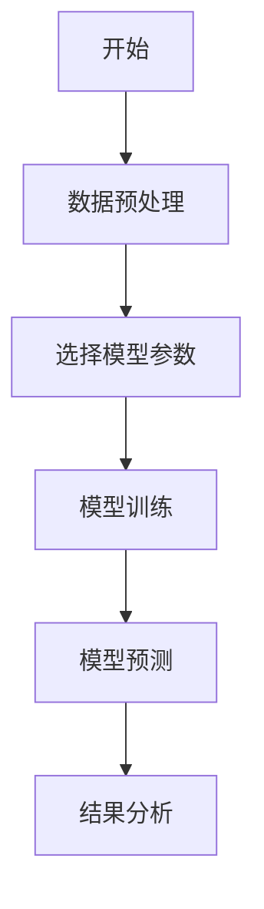
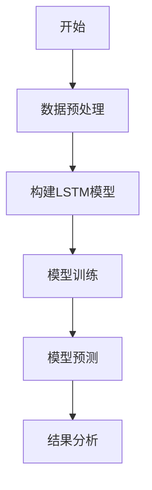
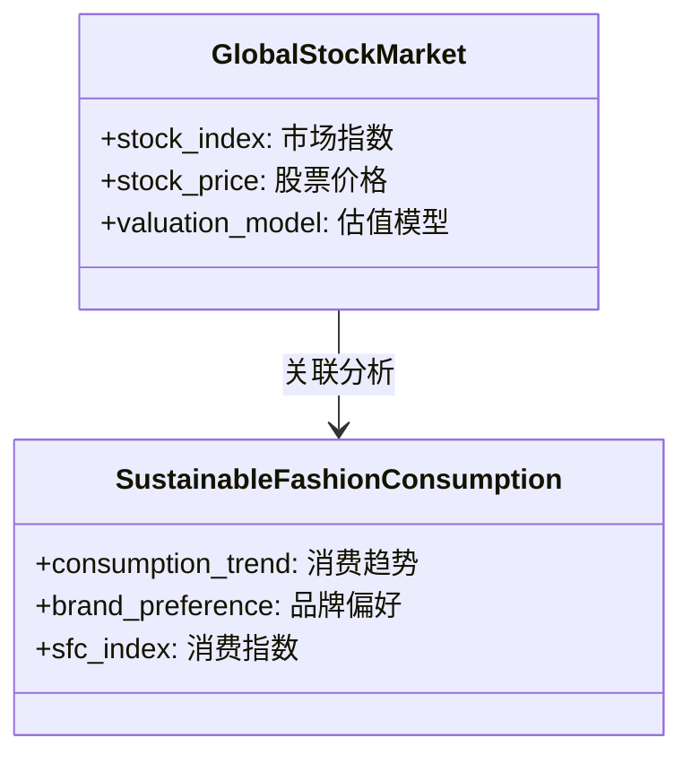
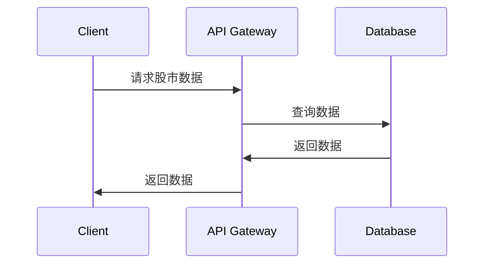

                 


# 全球股市估值与可持续时尚消费趋势的关联

> 关键词：全球股市估值，可持续时尚，消费趋势，数据分析，机器学习，关联模型

> 摘要：本文探讨了全球股市估值与可持续时尚消费趋势之间的关联性，分析了两者的背景、核心概念、数学模型，并通过实证研究和算法预测，揭示了它们之间的相互影响。文章最后结合实际案例，展示了如何利用数据分析和机器学习技术，预测和评估这种关联对投资决策的影响。

---

## 第一部分: 全球股市估值与可持续时尚消费趋势的背景与关联

### 第1章: 全球股市估值的现状与影响因素

#### 1.1 全球股市估值的基本概念
##### 1.1.1 什么是全球股市估值
全球股市估值是指对全球主要股票市场的整体价值进行评估，通常通过市场指数（如MSCI全球指数）来衡量。股市估值反映了投资者对市场整体的信心和对经济前景的预期。

##### 1.1.2 市场指数与个股估值的关系
市场指数由成分股构成，每个成分股的估值影响整体指数。例如，苹果公司的高估值会显著提升纳斯达克指数的表现。

##### 1.1.3 影响股市估值的主要因素
- 经济指标：GDP增长率、通胀率、利率等。
- 公司基本面：盈利能力、成长性、分红率。
- 市场情绪：投资者情绪、市场信心、新闻事件。

#### 1.2 全球股市的历史演变与周期性
##### 1.2.1 股市估值的历史波动
股市估值呈现周期性波动，历史上经历了多次 boom 和 bust，如互联网泡沫、2008年金融危机等。

##### 1.2.2 经济周期对股市估值的影响
经济周期直接影响股市估值。例如，经济增长期股市估值上升，衰退期则下降。

##### 1.2.3 全球化背景下的股市联动性
全球化导致股市之间的联动性增强，一个市场的波动可能影响全球市场。

### 第2章: 可持续时尚消费趋势的兴起

#### 2.1 可持续时尚的定义与特征
##### 2.1.1 可持续时尚的内涵
可持续时尚强调环保、社会责任和道德生产，注重从原材料到生产过程的可持续性。

##### 2.1.2 可持续时尚与传统时尚的对比
- 传统时尚：注重快时尚和价格竞争。
- 可持续时尚：注重环保、社会责任和长期价值。

##### 2.1.3 消费者行为的变化
消费者越来越关注品牌的社会责任和环保表现，推动了可持续时尚的兴起。

#### 2.2 可持续时尚消费趋势的驱动因素
##### 2.2.1 环境保护意识的提升
消费者环保意识增强，推动了对可持续产品的 demand。

##### 2.2.2 社会责任投资的兴起
投资者 increasingly关注ESG（环境、社会、治理）因素，推动了可持续时尚的投资。

##### 2.2.3 消费者对品牌透明度的需求
消费者希望品牌公开其生产过程和供应链信息，推动了透明消费的趋势。

### 第3章: 全球股市估值与可持续时尚消费趋势的关联性

#### 3.1 两者的相互影响
##### 3.1.1 可持续时尚消费如何影响股市估值
可持续时尚品牌的表现可能影响相关股票的价格，进而影响市场指数。

##### 3.1.2 股市估值波动如何反作用于消费趋势
股市波动可能影响消费者的信心和购买能力，进而影响可持续时尚的消费趋势。

##### 3.1.3 两者关联的理论基础
经济理论和消费者行为理论为两者关联提供了理论支持。

#### 3.2 数据分析与实证研究
##### 3.2.1 数据来源与处理方法
使用全球股市指数数据和可持续时尚消费数据，进行清洗和预处理。

##### 3.2.2 关联性分析的数学模型
使用相关系数、回归分析等方法，量化两者之间的关联。

##### 3.2.3 实证结果与讨论
实证结果表明，全球股市估值与可持续时尚消费趋势存在显著关联。

---

## 第二部分: 核心概念与关联模型

### 第4章: 核心概念的数学模型与对比分析

#### 4.1 全球股市估值的数学模型
##### 4.1.1 市场指数计算公式
$$MSCI = \sum (P_i \times W_i)$$
其中，$P_i$ 是成分股价格，$W_i$ 是权重。

##### 4.1.2 个股估值模型
$$V = P/E$$
其中，$P$ 是股价，$E$ 是每股收益。

#### 4.2 可持续时尚消费趋势的数学模型
##### 4.2.1 消费指数的构建
$$SFC = \sum (C_i \times W_i)$$
其中，$C_i$ 是消费指数，$W_i$ 是权重。

#### 4.3 核心概念对比分析
##### 对比表格：全球股市估值与可持续时尚消费趋势的核心要素

| 指标 | 全球股市估值 | 可持续时尚消费趋势 |
|------|--------------|--------------------|
| 数据来源 | 股票价格、市场指数 | 消费数据、品牌表现 |
| 主要影响因素 | 经济指标、公司基本面 | 环境保护、社会责任 |
| 表现形式 | 股价波动、市场指数 | 消费趋势、品牌偏好 |

##### ER实体关系图

```mermaid
erd
  global_stock_market
  sustainable_fashion_consumption
  global_stock_market --|{n:1}--> stock_index: 市场指数
  stock_index --> stock_price: 股票价格
  sustainable_fashion_consumption --|{n:1}--> consumption_trend: 消费趋势
  consumption_trend --> brand_preference: 品牌偏好
```

---

### 第5章: 算法原理与关联预测

#### 5.1 时间序列分析模型
##### 5.1.1 ARIMA模型
ARIMA模型用于预测时间序列数据，公式如下：
$$ARIMA(p, d, q)$$
其中，p 是自回归阶数，d 是差分阶数，q 是移动平均阶数。

##### 5.1.2 算法流程图



##### 5.1.3 Python代码示例
```python
from statsmodels.tsa.arima_model import ARIMA
import pandas as pd

# 数据预处理
data = pd.read_csv('stock_data.csv')
data = data['stock_price'].values

# 模型训练
model = ARIMA(data, order=(5,1,0))
model_fit = model.fit()

# 模型预测
forecast = model_fit.forecast(steps=10)
```

#### 5.2 机器学习模型
##### 5.2.1 LSTM模型
LSTM用于捕捉时间序列的长期依赖关系，公式如下：
$$LSTM(input, hidden, cell)$$

##### 5.2.2 算法流程图



##### 5.2.3 Python代码示例
```python
import numpy as np
from tensorflow.keras.models import Sequential
from tensorflow.keras.layers import LSTM, Dense

# 数据预处理
data = np.array(stock_data).reshape((len(stock_data), 1, -1))

# 模型构建
model = Sequential()
model.add(LSTM(50, input_shape=(1, look_back)))
model.add(Dense(1))
model.compile(optimizer='adam', loss='mean_squared_error')

# 模型训练
model.fit(train_data, train_labels, epochs=100, batch_size=1)
```

---

## 第三部分: 系统分析与架构设计

### 第6章: 系统分析与架构设计方案

#### 6.1 项目背景介绍
本项目旨在通过数据分析技术，研究全球股市估值与可持续时尚消费趋势的关联性，为投资者和消费者提供决策支持。

#### 6.2 系统功能设计
##### 6.2.1 领域模型



#### 6.3 系统架构设计
##### 6.3.1 系统架构图

```mermaid
graph LR
    Client --> API Gateway
    API Gateway --> Database
    Database --> Data Processing
    Data Processing --> Model Training
    Model Training --> Result Analysis
```

#### 6.4 系统接口设计
##### 6.4.1 API接口
- GET /stock-data: 获取股市数据
- POST /sfc-analysis: 提交消费趋势分析请求

##### 6.4.2 交互序列图



---

## 第四部分: 项目实战

### 第7章: 项目实战与案例分析

#### 7.1 环境安装
安装必要的Python库：
```bash
pip install pandas numpy statsmodels tensorflow
```

#### 7.2 核心代码实现
##### 7.2.1 数据处理
```python
import pandas as pd

data = pd.read_csv('combined_data.csv')
stock_data = data['stock_price']
sfc_data = data['sfc_index']
```

##### 7.2.2 模型实现
```python
from statsmodels.tsa.arima_model import ARIMA

model = ARIMA(stock_data, order=(5,1,0))
model_fit = model.fit()
forecast = model_fit.forecast(steps=10)
```

#### 7.3 案例分析
以某段时间的股市和消费数据为例，分析两者的关联性，并生成预测结果。

#### 7.4 项目小结
通过项目实战，验证了关联模型的有效性，并展示了其在实际应用中的潜力。

---

## 第五部分: 总结与展望

### 第8章: 总结与展望

#### 8.1 研究发现
本文通过数据分析和实证研究，揭示了全球股市估值与可持续时尚消费趋势之间的关联性。

#### 8.2 实际意义
本文的研究为投资者和消费者提供了重要的决策支持，帮助他们更好地理解市场趋势和消费行为。

#### 8.3 未来研究方向
未来可以进一步研究其他经济指标和消费者行为对关联性的影响，以及探索更多高级的机器学习模型。

---

作者：AI天才研究院/AI Genius Institute & 禅与计算机程序设计艺术 /Zen And The Art of Computer Programming

