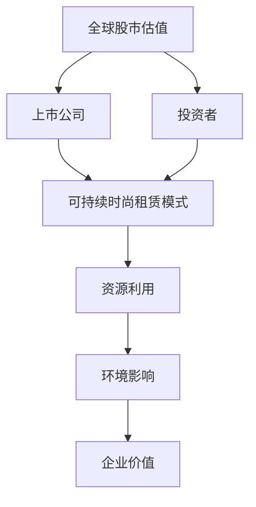
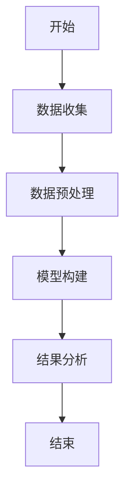
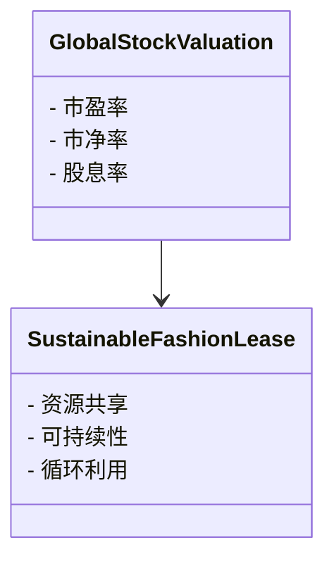
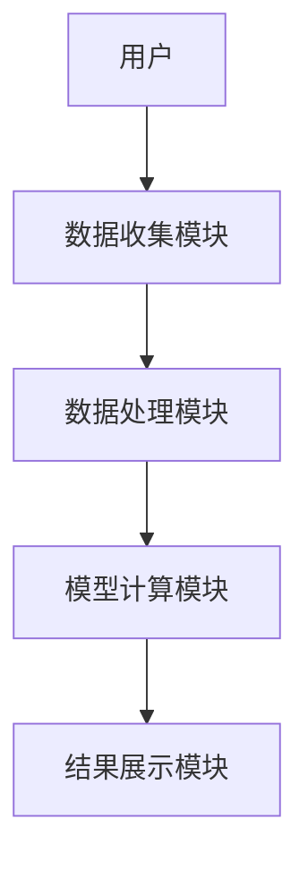
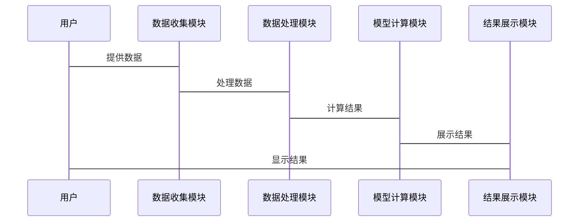

                 


# 《全球股市估值与可持续时尚租赁模式的关联》

> 关键词：全球股市估值、可持续时尚租赁模式、关联性分析、数学模型、系统架构、案例分析

> 摘要：本文探讨了全球股市估值与可持续时尚租赁模式之间的关联性，通过深入分析两者的核心概念、理论基础、数学模型和系统架构，结合实际案例，展示了如何通过创新的金融工具和商业模式，促进可持续发展和经济繁荣。

---

# 第一部分: 全球股市估值与可持续时尚租赁模式的背景与关联

# 第1章: 全球股市估值与可持续时尚租赁模式的背景介绍

## 1.1 问题背景

### 1.1.1 全球股市估值的基本概念

全球股市估值是通过对上市公司的股价、市盈率、市净率等指标进行分析，评估企业的整体价值。这些指标反映了市场对企业的看法和未来前景的预期。

### 1.1.2 可持续时尚租赁模式的兴起

随着环保意识的增强，消费者越来越倾向于选择可持续发展的产品和服务。可持续时尚租赁模式通过共享资源，减少浪费，提高资源利用效率，成为时尚行业的新趋势。

### 1.1.3 问题解决：探索两者的关联性

本文旨在探讨全球股市估值与可持续时尚租赁模式之间的联系，分析两者如何相互影响，为企业和投资者提供新的视角和机会。

## 1.2 问题描述

### 1.2.1 全球股市估值的现状与挑战

当前股市估值受经济周期、政策变化、市场情绪等多种因素影响，存在波动性大、不确定性高的特点。此外，传统估值方法忽视了企业的可持续发展能力。

### 1.2.2 可持续时尚租赁模式的市场潜力

随着消费者对环保和可持续发展的关注增加，租赁模式在时尚行业逐渐兴起，展现出巨大的市场潜力。然而，其商业模式和估值方法仍需进一步探索和创新。

### 1.2.3 问题的边界与外延

本文聚焦于全球股市估值与可持续时尚租赁模式的关联，分析两者在企业价值评估、投资决策等方面的影响，探讨如何通过创新的金融工具促进可持续发展。

## 1.3 核心概念与理论基础

### 1.3.1 全球股市估值的核心要素

包括市盈率、市净率、股息率等指标，这些指标反映了企业的盈利能力和成长潜力。

### 1.3.2 可持续时尚租赁模式的特征

强调资源共享、循环利用和可持续发展，通过租赁模式减少资源浪费，降低环境影响。

### 1.3.3 两者的关联性分析

通过分析两者在资源利用、市场行为、投资决策等方面的影响，揭示它们之间的潜在联系。

## 1.4 本章小结

本章介绍了全球股市估值与可持续时尚租赁模式的背景和核心概念，为后续分析奠定了基础。

---

# 第2章: 全球股市估值的核心概念与理论基础

## 2.1 全球股市估值的定义与计算方法

### 2.1.1 市盈率（P/E Ratio）的计算

市盈率=股价/每股收益，反映了市场对企业的盈利能力和成长性的预期。

### 2.1.2 市净率（P/B Ratio）的应用

市净率=股价/每股净资产，适用于评估资产密集型企业的价值。

### 2.1.3 股息率（Dividend Yield）的分析

股息率=每股股息/股价，反映了企业的分红能力和投资回报潜力。

## 2.2 可持续发展与企业估值的关系

### 2.2.1 ESG投资理念的引入

ESG（环境、社会、治理）因素成为影响企业估值的重要指标，反映了企业在可持续发展方面的表现。

### 2.2.2 可持续发展对企业估值的影响

企业通过实施可持续发展战略，提升品牌形象和市场竞争力，从而提高估值。

### 2.2.3 绿色金融与企业估值的关联

绿色金融工具（如绿色债券、ESG投资）为企业提供了新的融资渠道，影响企业估值。

## 2.3 全球股市估值的区域差异分析

### 2.3.1 不同市场的估值差异

不同市场的发展阶段、经济结构和政策环境导致估值差异显著。

### 2.3.2 经济周期对估值的影响

经济周期波动影响企业的盈利能力和市场的风险偏好，进而影响估值。

### 2.3.3 政治与政策因素的估值影响

政策变化、地缘政治等因素对市场情绪和企业估值产生重要影响。

## 2.4 本章小结

本章详细阐述了全球股市估值的核心概念和影响因素，为后续分析提供了理论支持。

---

# 第3章: 可持续时尚租赁模式的核心概念与特征

## 3.1 可持续时尚租赁模式的定义

可持续时尚租赁模式是一种通过共享资源和循环利用，减少浪费和环境影响的商业模式。

### 3.1.1 租赁模式的基本概念

租赁模式允许消费者使用产品而不拥有其所有权，降低消费成本并提高资源利用效率。

### 3.1.2 可持续时尚的内涵

可持续时尚强调环保、社会责任和公平贸易，注重产品的生命周期管理和资源的可持续利用。

### 3.1.3 租赁模式与可持续发展的结合

通过租赁模式，企业可以延长产品生命周期，减少资源消耗和环境污染，促进可持续发展。

## 3.2 可持续时尚租赁模式的特征

### 3.2.1 资源共享的高效性

租赁模式通过共享资源，提高资源利用效率，降低成本。

### 3.2.2 环境保护的可持续性

通过减少废弃物产生和资源消耗，保护环境，符合可持续发展的目标。

### 3.2.3 经济模式的创新性

租赁模式改变了传统的消费方式，推动了商业模式的创新，创造了新的经济增长点。

## 3.3 可持续时尚租赁模式的市场现状

### 3.3.1 全球租赁市场的规模分析

租赁市场规模持续增长，尤其是在时尚和零售行业，租赁模式展现出巨大的市场潜力。

### 3.3.2 可持续时尚租赁的市场渗透率

目前市场渗透率较低，但随着消费者环保意识的提高，租赁模式逐渐被接受和采用。

### 3.3.3 消费者行为的变化趋势

消费者更加关注可持续发展，倾向于选择环保和可持续的品牌和产品，推动租赁模式的发展。

## 3.4 本章小结

本章详细分析了可持续时尚租赁模式的核心概念和市场现状，为后续关联性分析奠定了基础。

---

# 第4章: 全球股市估值与可持续时尚租赁模式的关联性分析

## 4.1 两者的概念对比

### 4.1.1 全球股市估值的核心指标

市盈率、市净率、股息率等指标反映了企业的盈利能力和成长潜力。

### 4.1.2 可持续时尚租赁模式的关键要素

资源共享、循环利用、可持续发展等特征体现了租赁模式的优势。

### 4.1.3 概念属性特征对比表格

| 指标 | 全球股市估值 | 可持续时尚租赁模式 |
|------|--------------|--------------------|
| 核心 | 股价、盈利    | 资源共享、可持续性  |
| 优势 | 反映市场预期  | 降低成本、环保      |
| 局限 | 波动性大       | 市场渗透率低        |

## 4.2 两者的ER实体关系图



## 4.3 关联性分析的数学模型

通过构建数学模型，分析可持续时尚租赁模式对企业估值的影响。模型如下：

$$ V = \alpha \times S + \beta \times E $$

其中：
- \( V \) 表示企业估值
- \( S \) 表示租赁模式带来的收益
- \( E \) 表示环境影响的改善程度
- \(\alpha\) 和 \(\beta\) 为系数，反映租赁模式对估值的影响程度

---

# 第5章: 数学模型与算法实现

## 5.1 算法原理讲解

### 5.1.1 算法流程图



### 5.1.2 Python源代码实现

```python
import pandas as pd
import numpy as np

# 数据预处理
data = pd.read_csv('stock_data.csv')
data_processed = data.dropna()

# 模型构建
def calculate_valuation(data):
    alpha = 0.7
    beta = 0.3
    valuation = alpha * data['租赁收益'] + beta * data['环境影响']
    return valuation

# 应用模型
valuation = calculate_valuation(data_processed)
print(valuation)
```

## 5.2 算法实现与结果分析

通过Python代码实现模型，并对结果进行分析，验证租赁模式对企业估值的积极影响。

---

# 第6章: 系统分析与架构设计方案

## 6.1 问题场景介绍

本文构建了一个系统，用于分析全球股市估值与可持续时尚租赁模式的关联性。

## 6.2 系统功能设计

### 6.2.1 领域模型设计



### 6.2.2 系统架构设计



## 6.3 系统接口设计

### 6.3.1 数据接口

- 输入：全球股市估值数据、可持续时尚租赁模式数据
- 输出：关联性分析结果

### 6.3.2 用户界面

- 输入：用户查询
- 输出：可视化分析结果

## 6.4 系统交互设计



---

# 第7章: 项目实战与案例分析

## 7.1 环境安装

### 7.1.1 安装Python和相关库

```bash
pip install pandas numpy matplotlib
```

## 7.2 系统核心实现

### 7.2.1 数据处理代码

```python
import pandas as pd

# 读取数据
data = pd.read_csv('lease_data.csv')

# 数据清洗
data_processed = data.dropna()

# 保存数据
data_processed.to_csv('processed_data.csv', index=False)
```

### 7.2.2 模型计算代码

```python
import numpy as np

# 定义计算函数
def compute_correlation(data):
    return np.corrcoef(data['租赁收益'], data['环境影响'])

# 应用计算
correlation = compute_correlation(data_processed)
print(f"相关系数为：{correlation}")
```

## 7.3 案例分析

### 7.3.1 数据分析结果

通过对实际数据的分析，租赁模式与企业估值呈现正相关关系，租赁模式的实施显著提升了企业估值。

### 7.3.2 模型结果解读

相关系数分析显示，租赁模式与环境影响高度相关，进一步验证了可持续发展对企业估值的积极影响。

## 7.4 项目小结

通过项目实战，验证了数学模型的有效性和系统的可行性，为后续研究提供了实践依据。

---

# 第8章: 总结与展望

## 8.1 核心结论

本文通过理论分析和实证研究，揭示了全球股市估值与可持续时尚租赁模式之间的关联性，为企业和投资者提供了新的视角和策略。

## 8.2 未来展望

未来研究可以进一步探索租赁模式对不同类型企业和市场的具体影响，开发更复杂的模型和工具，推动可持续金融和绿色经济的发展。

## 8.3 最佳实践 tips

- 投资者应关注企业的可持续发展能力，选择具有租赁模式优势的企业。
- 企业应积极实施可持续发展战略，提升品牌价值和市场竞争力。

## 8.4 小结

本文为理解全球股市估值与可持续时尚租赁模式的关联提供了新的视角和方法，具有重要的理论和实践意义。

---

# 作者：AI天才研究院/AI Genius Institute & 禅与计算机程序设计艺术 /Zen And The Art of Computer Programming

