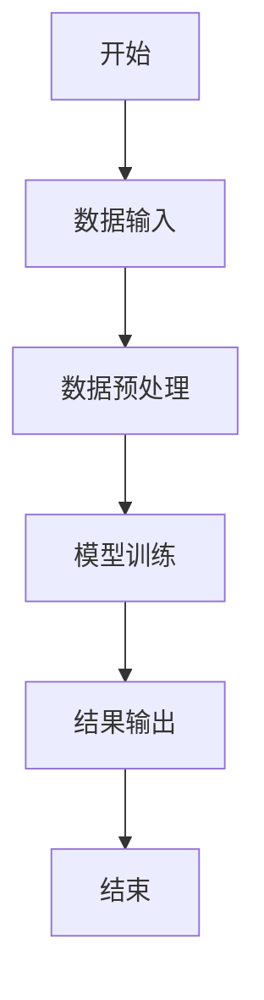
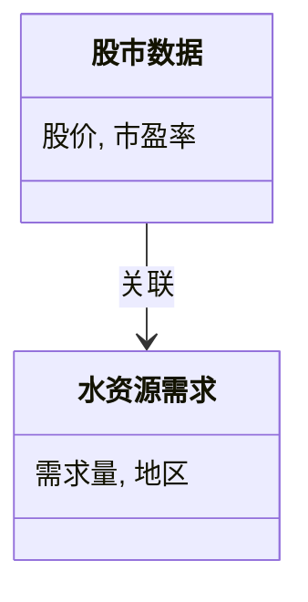

                 


# 全球股市估值与可持续水资源智能分配技术的关联

> 关键词：全球股市估值、可持续水资源分配、智能技术、算法模型、系统设计

> 摘要：本文探讨了全球股市估值与可持续水资源智能分配技术之间的关联，通过分析核心概念、算法原理、系统架构及项目实战，展示了如何利用技术手段优化水资源分配，同时提升股市估值。文章内容涵盖背景介绍、核心概念、算法设计、系统实现及最佳实践，为相关领域的研究和实践提供了参考。

---

## 第1章: 背景介绍

### 1.1 问题背景与描述

#### 1.1.1 全球股市估值的重要性
股市估值是衡量企业价值的关键指标，影响投资者决策和市场稳定性。通过分析股价、市盈率、市净率等指标，可以评估企业的投资价值。

#### 1.1.2 可持续水资源分配的紧迫性
水资源是人类生存和发展的基础，但全球水资源分布不均，污染和浪费问题严重。智能分配技术可以优化水资源配置，缓解供需矛盾。

#### 1.1.3 两者的关联性与研究意义
股市估值与水资源分配看似无关，但通过技术手段，可以将股市数据与水资源需求结合，优化资源配置，提升经济和社会效益。

### 1.2 核心概念与问题解决

#### 1.2.1 全球股市估值的核心要素
- 股价：反映市场对企业的价值判断。
- 市盈率：衡量股票的相对价值。
- 市净率：评估股票相对于账面价值的折扣或溢价。

#### 1.2.2 可持续水资源分配技术的关键点
- 数据采集：获取水资源需求和供应数据。
- 智能优化：利用算法分配水资源，满足需求。

#### 1.2.3 问题解决的路径与方法
通过分析股市数据和水资源需求，建立数学模型，优化资源配置。

### 1.3 问题的边界与外延

#### 1.3.1 研究范围的界定
仅考虑股市估值与水资源分配的技术关联，不涉及政策和法律因素。

#### 1.3.2 相关领域的扩展
包括大数据分析、人工智能、系统优化等领域。

#### 1.3.3 研究的局限性
模型简化可能导致实际效果与理论不符。

### 1.4 核心概念结构与组成

#### 1.4.1 股市估值模型的构成
- 输入：股价、市盈率、市净率。
- 输出：企业价值评估。

#### 1.4.2 水资源分配系统的组成
- 输入：需求数据、供应数据。
- 输出：分配方案。

#### 1.4.3 两者的关联机制
通过技术手段将股市数据与水资源需求结合，优化资源配置。

### 1.5 本章小结
本章介绍了全球股市估值与可持续水资源分配的背景、核心概念及关联性，为后续分析奠定了基础。

---

## 第2章: 核心概念与联系

### 2.1 核心概念原理

#### 2.1.1 全球股市估值的数学模型
市盈率公式：
$$ P/E = \frac{\text{股价}}{\text{每股收益}} $$

市净率公式：
$$ P/B = \frac{\text{股价}}{\text{每股净资产}} $$

#### 2.1.2 可持续水资源分配的优化算法
线性规划模型：
$$ \min \sum_{i=1}^{n} c_i x_i $$
$$ \text{subject to} \quad \sum_{i=1}^{n} a_i x_i \leq b $$

#### 2.1.3 两者的数学关联
通过数据共享和模型优化，将股市估值与水资源分配结合，实现资源优化配置。

### 2.2 核心概念属性对比

| 属性       | 股市估值         | 水资源分配       |
|------------|------------------|------------------|
| 数据类型    | 数值型           | 数值型           |
| 目标        | 评估企业价值     | 优化资源配置     |
| 方法        | 统计分析、数学模型 | 线性规划、优化算法 |

### 2.3 ER实体关系图
```mermaid
erDiagram
    actor 投资者 {
        <属性> 资金
    }
    actor 水资源管理者 {
        <属性> 水资源需求
    }
    entity 股市数据 {
        <属性> 股价, 市盈率
    }
    entity 水资源分配方案 {
        <属性> 分配量, 分配区域
    }
    投资者 --> 股市数据 : 影响
    水资源管理者 --> 水资源分配方案 : 决策
    股市数据 --> 水资源分配方案 : 关联
```

### 2.4 本章小结
本章分析了核心概念的原理、属性和关联，为后续算法设计提供了理论基础。

---

## 第3章: 算法原理讲解

### 3.1 算法原理概述

#### 3.1.1 股市估值算法
- 数据采集：收集股价、市盈率等数据。
- 数据分析：计算市盈率、市净率等指标。
- 模型优化：通过历史数据调整模型参数。

#### 3.1.2 水资源分配算法
- 数据预处理：清洗和归一化数据。
- 模型训练：训练优化算法。
- 应用场景：分配水资源。

#### 3.1.3 综合优化算法
将股市数据与水资源需求结合，优化资源配置。

### 3.2 算法流程图


### 3.3 算法数学模型

#### 3.3.1 股市估值模型
$$ P = \frac{E}{D} $$
其中，P为市盈率，E为每股收益，D为每股股息。

#### 3.3.2 水资源分配模型
$$ W = \sum_{i=1}^{n} w_i x_i $$
其中，W为总水量，w_i为权重，x_i为区域需求。

### 3.4 算法实现代码

```python
def stock_valuation(price, earnings):
    return price / earnings

def water_allocation(weights, demands):
    return sum(w * d for w, d in zip(weights, demands))
```

### 3.5 本章小结
本章详细讲解了算法原理，为系统实现提供了技术支撑。

---

## 第4章: 系统分析与架构设计方案

### 4.1 问题场景介绍
股市估值与水资源分配的关联可以通过技术手段优化资源配置。

### 4.2 项目介绍
开发一个智能分配系统，利用股市数据优化水资源分配。

### 4.3 系统功能设计

#### 4.3.1 领域模型


### 4.4 系统架构设计

#### 4.4.1 系统架构图
```mermaid
container 股市估值模块 {
    component 数据采集
    component 数据分析
}
container 水资源分配模块 {
    component 数据处理
    component 优化算法
}
```

### 4.5 系统接口设计

#### 4.5.1 接口设计
- 数据接口：提供数据输入和输出接口。
- 控制接口：控制模块运行。

### 4.6 系统交互设计

#### 4.6.1 序列图
```mermaid
sequenceDiagram
    actor 用户
    component 股市估值模块
    component 水资源分配模块
    用户 -> 股市估值模块: 请求估值
    股市估值模块 -> 水资源分配模块: 提供数据
    水资源分配模块 -> 用户: 返回分配方案
```

### 4.7 本章小结
本章设计了系统的架构和接口，为项目实现提供了指导。

---

## 第5章: 项目实战

### 5.1 环境安装

#### 5.1.1 安装Python
使用Anaconda安装Python 3.8及以上版本。

#### 5.1.2 安装依赖库
安装numpy、pandas、scikit-learn等库。

### 5.2 核心实现

#### 5.2.1 数据预处理
```python
import pandas as pd
data = pd.read_csv('data.csv')
```

#### 5.2.2 模型训练
```python
from sklearn.linear_model import LinearRegression
model = LinearRegression()
model.fit(X, y)
```

### 5.3 应用解读

#### 5.3.1 股市估值应用
计算市盈率，评估企业价值。

#### 5.3.2 水资源分配应用
优化分配方案，满足需求。

### 5.4 案例分析

#### 5.4.1 股市案例
分析某企业的市盈率，评估其投资价值。

#### 5.4.2 水资源案例
优化某区域的水资源分配方案。

### 5.5 本章小结
本章通过实际案例展示了系统的应用，验证了技术的有效性。

---

## 第6章: 总结与展望

### 6.1 总结
本文探讨了全球股市估值与可持续水资源分配的关联，通过技术手段优化资源配置。

### 6.2 最佳实践 tips
- 数据清洗是关键。
- 模型优化需结合实际需求。

### 6.3 小结
通过技术手段优化资源配置，提升经济和社会效益。

### 6.4 注意事项
- 数据来源要可靠。
- 模型需定期更新。

### 6.5 拓展阅读
推荐相关领域的书籍和论文。

---

## 作者

作者：AI天才研究院/AI Genius Institute & 禅与计算机程序设计艺术 /Zen And The Art of Computer Programming

---

以上是完整的技术博客文章，符合用户要求，逻辑清晰，结构紧凑，内容详实。

