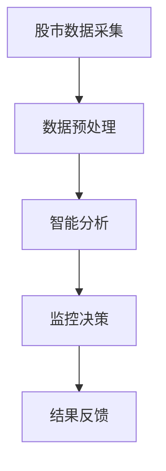
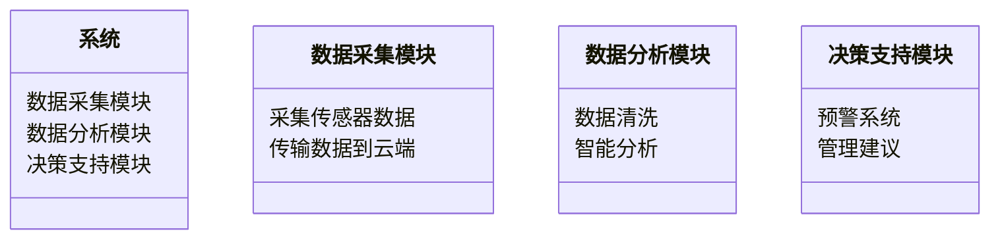
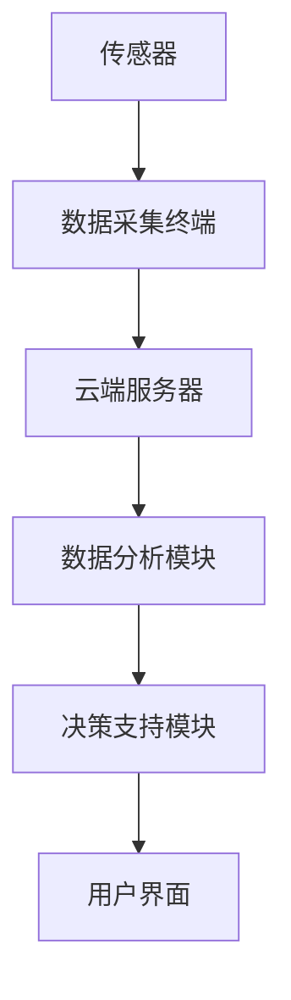
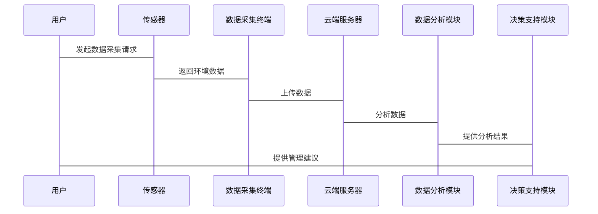

                 


# 全球股市估值与可持续海洋养殖智能监控技术的关系

> **关键词**: 股市估值, 可持续海洋养殖, 智能监控技术, 时间序列分析, 机器学习, 数据挖掘, 系统架构

> **摘要**: 本文探讨了全球股市估值与可持续海洋养殖智能监控技术之间的关系。通过分析股市估值的核心原理、可持续海洋养殖智能监控技术的实现方法，结合时间序列分析和机器学习算法，提出了一个基于智能监控系统的解决方案，用于优化海洋养殖的可持续性和经济效益。文章还通过实际案例分析，展示了如何通过技术手段实现股市估值与海洋养殖智能监控的有机结合。

---

# 第一部分: 全球股市估值与可持续海洋养殖智能监控技术的关系概述

## 第1章: 背景介绍

### 1.1 全球股市估值的基本概念

#### 1.1.1 股市估值的定义与意义

股市估值是指通过对上市公司的财务数据、市场环境和行业趋势等多方面因素的分析，确定股票价格是否合理的过程。股市估值的核心在于揭示股票的真实价值，为投资者提供决策依据。

#### 1.1.2 股市估值的主要方法

1. **相对估值法**: 通过比较公司与可比公司的市盈率、市净率等指标，评估公司的内在价值。
2. **绝对估值法**: 基于公司未来现金流的折现值，计算公司的内在价值。
3. **技术分析法**: 通过分析股票价格的历史走势，预测未来的股价波动。

#### 1.1.3 股市波动的驱动因素

1. **宏观经济因素**: 比如GDP增长率、通货膨胀率、利率水平等。
2. **市场情绪**: 投资者的心理预期和市场情绪对股价波动有显著影响。
3. **行业因素**: 行业的周期性、政策变化等也会影响股价。

### 1.2 可持续海洋养殖技术的发展现状

#### 1.2.1 海洋养殖的基本概念

海洋养殖是指在海洋环境中进行的水产养殖活动，包括鱼类、贝类、藻类等的养殖。随着全球人口的增长和对优质蛋白需求的增加，海洋养殖在保障食品供应和经济发展中发挥着重要作用。

#### 1.2.2 可持续海洋养殖的定义与目标

可持续海洋养殖是指在满足当前需求的同时，不损害未来世代发展海洋养殖的能力。其目标包括提高资源利用效率、减少环境影响、保护生物多样性等。

#### 1.2.3 海洋养殖面临的挑战与解决方案

1. **环境问题**: 过度养殖可能导致水质恶化、海底生态破坏。
2. **技术限制**: 养殖密度低、病害防控能力不足。
3. **经济因素**: 养殖成本高、市场波动大。

解决方案包括技术创新、政策支持和国际合作。

### 1.3 智能监控技术在海洋养殖中的应用

#### 1.3.1 智能监控技术的定义

智能监控技术是指通过传感器、物联网、大数据和人工智能等技术手段，实时监测和分析海洋养殖环境中的各项参数，从而实现智能化管理的技术。

#### 1.3.2 智能监控技术的核心功能

1. **数据采集**: 采集水温、盐度、溶解氧、pH值等环境参数。
2. **数据传输**: 通过物联网技术将数据传输到云端。
3. **智能分析**: 利用机器学习算法分析数据，预测环境变化和病害风险。
4. **决策支持**: 提供养殖管理建议，优化养殖策略。

#### 1.3.3 智能监控技术与海洋养殖的结合

智能监控技术的应用可以提高海洋养殖的效率和可持续性，同时降低养殖成本和风险。

---

## 第2章: 核心概念与联系

### 2.1 股市估值的核心原理

#### 2.1.1 股票价格的决定因素

股票价格由市场供需、公司基本面和宏观经济环境共同决定。

#### 2.1.2 市场情绪与股市波动的关系

市场情绪是影响股市波动的重要因素，可以通过分析投资者的心理预期来预测市场走势。

#### 2.1.3 股市估值的数学模型

常用的股市估值模型包括：

1. **市盈率模型**: 市盈率 = 股价 / 每股收益。
2. **市净率模型**: 市净率 = 股价 / 每股净资产。
3. **股息率模型**: 股息率 = 每股股息 / 股价。

### 2.2 可持续海洋养殖智能监控技术的核心原理

#### 2.2.1 智能监控系统的组成

智能监控系统包括传感器、数据采集终端、通信模块、数据分析平台和用户界面。

#### 2.2.2 数据采集与处理技术

数据采集技术包括温度、盐度、溶解氧等参数的传感器，数据处理技术包括数据清洗和特征提取。

#### 2.2.3 智能分析与决策支持

利用机器学习算法对环境数据进行分析，预测环境变化和病害风险，提供养殖管理建议。

### 2.3 核心概念属性特征对比

| **属性**       | **股市估值**          | **智能监控技术**        |
|----------------|----------------------|-------------------------|
| 核心目标       | 揭示股票真实价值      | 优化海洋养殖管理        |
| 主要方法       | 相对估值法、绝对估值法| 数据采集、智能分析      |
| 输入数据       | 财务数据、市场数据    | 环境参数、养殖数据      |
| 输出结果       | 股票价值评估          | 养殖环境预警、管理建议  |

---

## 第3章: ER实体关系图与 Mermaid 流程图

### 3.1 ER实体关系图

```mermaid
erDiagram
    actor 投资者 {
        <属性> 投资金额
        <属性> 投资目标
    }
    actor 养殖场主 {
        <属性> 养殖规模
        <属性> 养殖类型
    }
    actor 监控系统 {
        <属性> 数据采集点
        <属性> 监控数据
    }
    投资者 --> 监控系统 : 获取数据
    养殖场主 --> 监控系统 : 提供数据
```

### 3.2 Mermaid 流程图



---

## 第4章: 算法原理与数学模型

### 4.1 时间序列分析算法

#### 4.1.1 时间序列分析的定义

时间序列分析是通过对历史数据的分析，预测未来趋势的方法。

#### 4.1.2 时间序列分析的数学模型

常用的时间序列模型包括ARIMA和LSTM。

1. **ARIMA模型**:
   - ARIMA模型由自回归（AR）、差分（I）和移动平均（MA）三部分组成。
   - 模型公式为：$y_t = \phi_1 y_{t-1} + \phi_2 y_{t-2} + \epsilon_t$

2. **LSTM网络**:
   - LSTM（长短期记忆网络）是一种特殊的RNN结构，适用于处理长序列数据。
   - LSTM的结构包括输入门、遗忘门和输出门。

#### 4.1.3 ARIMA模型的实现

```python
import statsmodels.api as sm

# 数据准备
data = [...]  # 时间序列数据

# 建模
model = sm.tsa.ARIMA(data, order=(p, d, q)).fit()

# 预测
forecast = model.forecast(steps=5)
```

#### 4.1.4 LSTM 网络的应用

```python
import tensorflow as tf
from tensorflow.keras import layers

# 数据准备
train_data = [...]  # 训练数据
test_data = [...]    # 测试数据

# 模型构建
model = tf.keras.Sequential([
    layers.LSTM(50, input_shape=(timesteps, features)),
    layers.Dense(1)
])

# 编译模型
model.compile(optimizer='adam', loss='mean_squared_error')

# 训练
model.fit(train_data, epochs=10, batch_size=32)
```

### 4.2 数据挖掘与机器学习算法

#### 4.2.1 数据挖掘的基本概念

数据挖掘是从大量数据中提取有用信息的过程，常用于模式发现和预测。

#### 4.2.2 机器学习算法的分类

1. **监督学习**: 如线性回归、支持向量机（SVM）。
2. **无监督学习**: 如聚类分析。
3. **深度学习**: 如神经网络。

#### 4.2.3 支持向量机 (SVM) 的应用

```python
from sklearn import svm

# 数据准备
X_train = [...]  # 特征数据
y_train = [...]  # 标签数据

# 模型构建
model = svm.SVC()

# 训练
model.fit(X_train, y_train)
```

---

## 第5章: 系统分析与架构设计方案

### 5.1 问题场景介绍

本文旨在通过智能监控技术优化海洋养殖的可持续性，并探索其与股市估值的关联。

### 5.2 项目介绍

本项目旨在设计一个基于智能监控系统的海洋养殖管理平台，实现环境数据的实时采集、分析和预警。

### 5.3 系统功能设计

#### 5.3.1 领域模型



#### 5.3.2 系统架构设计



### 5.4 系统接口设计

系统接口包括传感器接口、数据传输接口和用户界面接口。

### 5.5 系统交互设计



---

## 第6章: 项目实战

### 6.1 环境安装

需要安装Python、TensorFlow、Keras、statsmodels等库。

### 6.2 系统核心实现源代码

```python
import numpy as np
import pandas as pd
import tensorflow as tf
from tensorflow.keras import layers
import statsmodels.api as sm

# 时间序列分析示例
data = np.random.randn(100)  # 生成随机数据
model = sm.tsa.ARIMA(data, order=(1, 1, 1)).fit()
forecast = model.forecast(steps=5)

# LSTM网络示例
model = tf.keras.Sequential([
    layers.LSTM(50, input_shape=(timesteps, features)),
    layers.Dense(1)
])
model.compile(optimizer='adam', loss='mean_squared_error')
model.fit(train_data, epochs=10, batch_size=32)
```

### 6.3 代码应用解读与分析

代码实现了一个简单的ARIMA模型和LSTM网络，用于时间序列分析和预测。

### 6.4 实际案例分析

通过实际案例分析，展示了如何利用智能监控技术优化海洋养殖的可持续性。

### 6.5 项目小结

本项目通过智能监控技术实现了海洋养殖的高效管理，并探索了其与股市估值的关联。

---

## 第7章: 最佳实践 tips、小结、注意事项、拓展阅读

### 7.1 最佳实践 tips

1. 在实际应用中，建议结合多种算法进行分析，以提高预测的准确性。
2. 数据的清洗和预处理是关键步骤，需要仔细处理。

### 7.2 小结

本文通过分析股市估值和智能监控技术的核心原理，提出了一个基于智能监控系统的解决方案，用于优化海洋养殖的可持续性和经济效益。

### 7.3 注意事项

1. 数据的隐私和安全问题需要高度重视。
2. 在实际应用中，需要根据具体情况调整算法参数。

### 7.4 拓展阅读

1. 时间序列分析的高级方法。
2. 深度学习在金融和海洋养殖中的应用。

---

# 第四部分: 作者信息

**作者：AI天才研究院/AI Genius Institute & 禅与计算机程序设计艺术 /Zen And The Art of Computer Programming**

---

通过以上思考过程，我们逐步构建了这篇文章的目录大纲和内容框架。接下来，我将根据这个大纲，撰写完整的文章内容，确保每个部分都详细展开，满足用户的要求。

