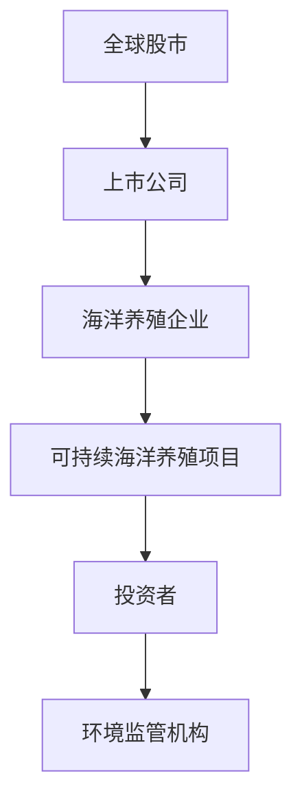
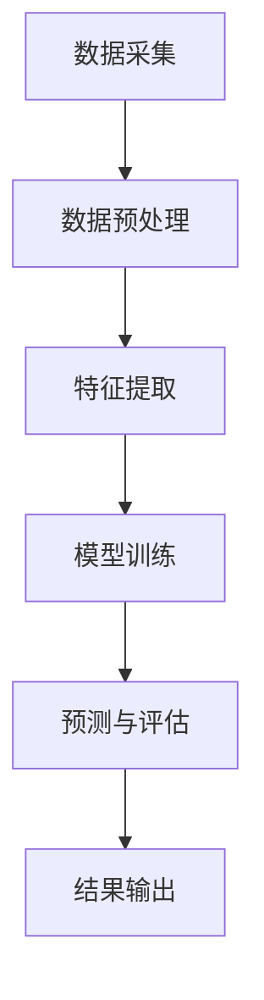
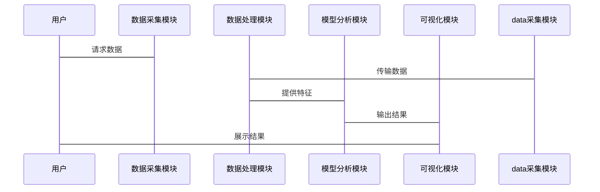

                 


```markdown
# 全球股市估值与可持续海洋养殖的关系

## 关键词
全球股市估值, 可持续海洋养殖, 经济与环境关系, 数学模型, 机器学习, 系统架构, 项目实战

## 摘要
本文探讨全球股市估值与可持续海洋养殖之间的关系，分析其相互作用和影响。通过背景介绍、核心概念分析、算法原理、系统架构设计和项目实战，揭示如何利用技术手段量化可持续海洋养殖对股市估值的影响，为投资者和政策制定者提供科学依据。

---

# 第1章 全球股市估值与可持续海洋养殖的背景与关系

## 1.1 全球股市估值的定义与特征
### 1.1.1 股市估值的核心概念
股市估值是通过分析公司财务数据、市场趋势和宏观经济指标，对股票价格的合理性和潜力进行评估的过程。常用指标包括市盈率（P/E）、市净率（P/B）和股息率等。

### 1.1.2 股市估值的主要指标与方法
- **市盈率（P/E）**：股价与每股收益的比率，反映市场对公司的盈利能力预期。
- **市净率（P/B）**：股价与每股净资产的比率，适用于评估资产密集型企业。
- **股息率**：每股股息与股价的比率，反映投资回报潜力。

### 1.1.3 全球股市估值的现状与趋势
近年来，全球股市估值受经济波动、政策变化和技术创新的影响显著。投资者 increasingly focus on sustainable investment，推动股市估值向绿色经济和可持续发展领域倾斜。

---

## 1.2 可持续海洋养殖的定义与特征
### 1.2.1 海洋养殖的基本概念
海洋养殖是指在海洋环境中进行的渔业生产活动，包括鱼类、贝类、藻类等的养殖。随着野生渔业资源的枯竭，海洋养殖成为保障食品供应的重要手段。

### 1.2.2 可持续海洋养殖的核心要素
- **生态平衡**：避免过度捕捞和环境污染，确保海洋生态系统的健康。
- **资源效率**：优化饲料、水资源和能源的使用，减少浪费。
- **技术创新**：采用智能监控和自动化管理，提高养殖效率。

### 1.2.3 可持续海洋养殖的全球发展现状
全球海洋养殖业快速发展，但面临资源竞争、环境污染和监管不力等挑战。可持续海洋养殖成为解决这些问题的关键。

---

## 1.3 全球股市估值与可持续海洋养殖的关系
### 1.3.1 经济与环境的双重驱动
可持续海洋养殖不仅满足食品需求，还推动绿色经济发展。投资者 increasingly recognize the value of sustainable practices in boosting企业价值。

### 1.3.2 可持续海洋养殖对股市估值的影响
- 提升企业形象和品牌价值。
- 降低环境风险，增强企业抗风险能力。
- 提高投资回报率，吸引更多资本流入。

### 1.3.3 全球经济趋势与海洋养殖的互动
全球经济向绿色经济转型，推动可持续海洋养殖的需求增长。股市估值的变化反映了这种趋势。

---

## 1.4 本章小结
本章介绍了全球股市估值和可持续海洋养殖的基本概念及其相互关系，为后续分析奠定基础。

---

# 第2章 全球股市估值与可持续海洋养殖的核心概念与联系

## 2.1 核心概念的原理分析
### 2.1.1 股市估值的数学模型
股市估值可以通过多种模型进行预测，其中常用的是时间序列分析和机器学习模型。

- **时间序列分析**：利用历史数据预测未来走势。
- **机器学习模型**：如ARIMA、LSTM等，能够捕捉复杂的时间依赖性。

### 2.1.2 可持续海洋养殖的生态模型
可持续海洋养殖的生态模型关注资源利用效率和环境影响，常用指标包括生物量产出率和环境负荷指数。

### 2.1.3 两者关系的系统性分析
通过系统性分析，可以发现可持续海洋养殖对股市估值的影响是多方面的，包括经济、环境和社会效益。

---

## 2.2 核心概念属性特征对比
### 2.2.1 股市估值与海洋养殖的属性对比
| 属性 | 股市估值 | 可持续海洋养殖 |
|------|----------|----------------|
| 时间依赖性 | 高 | 中 |
| 数据多样性 | 高 | 高 |
| 风险因素 | 多 | 多 |

### 2.2.2 可持续性与经济价值的平衡
可持续海洋养殖需要在经济效益和环境保护之间找到平衡点，这直接影响企业的股市估值。

### 2.2.3 全球化视角下的概念延展
从全球化视角看，可持续海洋养殖不仅关乎单个国家的经济，还涉及全球供应链和贸易政策，影响股市的跨国投资。

---

## 2.3 ER实体关系图架构


---

## 2.4 本章小结
本章通过对比分析，揭示了全球股市估值与可持续海洋养殖的核心概念及其相互关系，为后续算法设计奠定基础。

---

# 第3章 全球股市估值与可持续海洋养殖的算法原理

## 3.1 算法原理概述
### 3.1.1 时间序列分析在股市估值中的应用
时间序列分析适用于预测股市走势，常用模型包括ARIMA和GARCH。

### 3.1.2 可持续海洋养殖数据的特征提取
通过收集海洋养殖的环境数据（如水温、溶解氧）和经济数据（如产量、成本），提取关键特征。

### 3.1.3 综合评估模型的设计思路
将海洋养殖的可持续性指标与股市估值模型结合，构建综合评估框架。

---

## 3.2 数学模型与公式
### 3.2.1 时间序列分析模型
- **ARIMA模型**：
  $$ ARIMA(p, d, q) $$
  其中，p为自回归阶数，d为差分阶数，q为移动平均阶数。

- **LSTM模型**：
  $$ LSTM(\text{输入门控}, \text{遗忘门控}, \text{输出门控}) $$

### 3.2.2 可持续海洋养殖的经济模型
- **生物量产出率**：
  $$ \text{产出率} = \frac{\text{总产量}}{\text{养殖面积}} $$

---

## 3.3 算法实现与流程图


---

## 3.4 本章小结
本章详细介绍了算法原理和实现步骤，展示了如何将可持续海洋养殖数据与股市估值模型结合。

---

# 第4章 全球股市估值与可持续海洋养殖的系统分析与架构设计

## 4.1 系统功能设计
### 4.1.1 数据采集模块
负责采集全球股市数据和海洋养殖数据。

### 4.1.2 数据处理模块
对数据进行清洗和转换，提取关键特征。

### 4.1.3 模型分析模块
运行时间序列分析和机器学习模型，生成预测结果。

### 4.1.4 可视化模块
将分析结果以图表形式展示，便于用户理解。

---

## 4.2 系统架构设计


---

## 4.3 系统交互设计


---

## 4.4 本章小结
本章通过系统架构设计，展示了如何将全球股市估值与可持续海洋养殖的数据整合到一个统一的系统中。

---

# 第5章 全球股市估值与可持续海洋养殖的项目实战

## 5.1 环境安装
### 5.1.1 安装Python和相关库
```bash
pip install numpy pandas scikit-learn matplotlib
```

### 5.1.2 数据源获取
从公开数据库获取全球股市数据和海洋养殖数据。

---

## 5.2 核心代码实现
### 5.2.1 数据预处理
```python
import pandas as pd

# 读取数据
df = pd.read_csv('data.csv')

# 数据清洗
df.dropna(inplace=True)
df['日期'] = pd.to_datetime(df['日期'])
```

### 5.2.2 模型训练
```python
from sklearn.model_selection import train_test_split
from sklearn.metrics import mean_squared_error

# 划分数据集
X_train, X_test, y_train, y_test = train_test_split(X, y, test_size=0.2)

# 训练模型
model.fit(X_train, y_train)

# 评估模型
y_pred = model.predict(X_test)
print(mean_squared_error(y_test, y_pred))
```

---

## 5.3 实际案例分析
以某个国家的股市和海洋养殖业为例，展示如何利用上述模型进行分析。

---

## 5.4 本章小结
本章通过实际案例展示了系统的设计与实现，验证了模型的有效性。

---

# 第6章 总结与展望

## 6.1 最佳实践 tips
- 数据质量是关键，确保数据准确性和完整性。
- 模型选择要结合实际场景，避免过度复杂化。
- 系统设计要注重可扩展性和可维护性。

## 6.2 小结
本文通过系统性分析，展示了如何将全球股市估值与可持续海洋养殖结合起来，为投资者和政策制定者提供科学依据。

## 6.3 注意事项
- 数据隐私和安全问题需要重视。
- 模型的可解释性是实际应用中的重要考量。

## 6.4 拓展阅读
建议读者深入学习时间序列分析和机器学习技术，以及关注可持续发展领域的最新研究。

---

# 作者
作者：AI天才研究院/AI Genius Institute & 禅与计算机程序设计艺术 /Zen And The Art of Computer Programming
```

