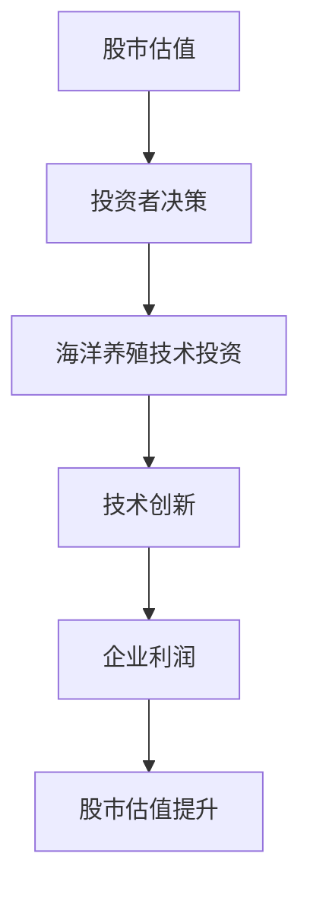
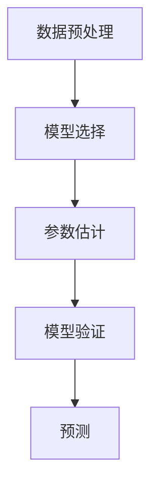
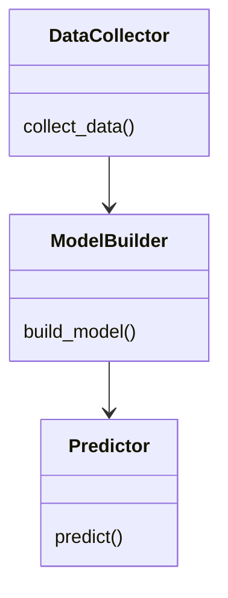
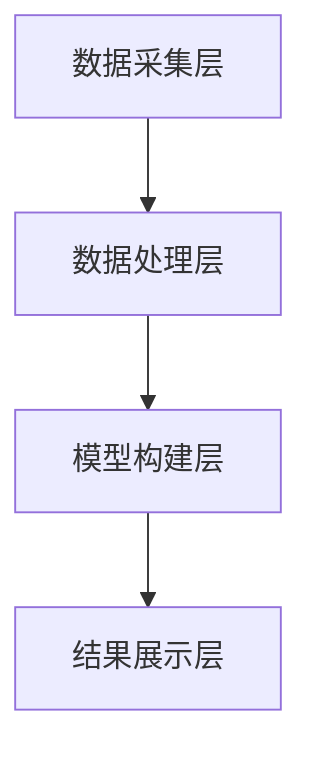

                 


# 全球股市估值与可持续海洋养殖自动化技术的关系

## 关键词：全球股市估值、可持续海洋养殖、自动化技术、数据分析、机器学习、系统架构、投资决策

## 摘要：本文探讨了全球股市估值与可持续海洋养殖自动化技术之间的关系，分析了股市估值对投资决策的影响，以及自动化技术如何推动海洋养殖的可持续发展。通过建立数学模型和系统架构，本文揭示了两者相互作用的机制，并提出了实际的应用方案。

---

# 第一部分：引言

## 第1章：引言

### 1.1 研究背景与意义

#### 1.1.1 全球股市估值的重要性
股市估值是投资者评估股票内在价值的重要工具，直接影响投资决策。通过分析财务指标和市场趋势，投资者可以判断股票的合理价位。

#### 1.1.2 可持续海洋养殖技术的现状
可持续海洋养殖技术旨在在保护环境的前提下，提高养殖效率。自动化技术的应用使其更加高效和可持续。

#### 1.1.3 两者关系的研究价值
研究股市估值与海洋养殖技术的关系，有助于优化投资决策，推动技术创新，实现经济与环境的双赢。

### 1.2 研究目标与方法
目标是分析股市估值与海洋养殖技术的相互影响，提出数据分析模型和系统架构。方法包括数据收集、模型构建和案例分析。

### 1.3 本书结构
文章分为背景介绍、核心概念、算法原理、系统分析、项目实战和结论，逐步展开主题。

---

# 第二部分：全球股市估值与可持续海洋养殖技术的背景介绍

## 第2章：全球股市估值概述

### 2.1 股市估值的基本概念

#### 2.1.1 股市估值的定义
股市估值是对上市公司股票内在价值的评估，考虑财务状况、市场供需和宏观经济因素。

#### 2.1.2 股市估值的核心指标
包括市盈率、市净率、股息率等，用于衡量股票的合理价格。

### 2.2 全球股市估值的现状

#### 2.2.1 主要股市的表现
分析全球主要股市的波动趋势，如道琼斯指数、纳斯达克指数等。

#### 2.2.2 影响股市估值的主要因素
包括宏观经济指标、企业盈利、政策变化和市场情绪等。

### 2.3 股市估值与经济发展的关系

#### 2.3.1 经济周期对股市估值的影响
经济周期的波动直接影响股市表现，股市估值是经济发展的晴雨表。

#### 2.3.2 股市估值对经济发展的反馈作用
股市融资支持企业扩张，促进经济发展，形成良性循环。

---

## 第3章：可持续海洋养殖技术概述

### 3.1 海洋养殖的基本概念

#### 3.1.1 海洋养殖的定义
指在海洋环境中养殖水产品，如鱼类、贝类等。

#### 3.1.2 海洋养殖的主要类型
包括网箱养殖、底播养殖和悬浮养殖等。

### 3.2 可持续海洋养殖技术的发展现状

#### 3.2.1 可持续海洋养殖的核心技术
如自动监测系统、智能投喂设备和环境控制技术。

#### 3.2.2 当前技术面临的挑战
资源利用效率低、环境污染和病害问题。

### 3.3 可持续海洋养殖与环境保护的关系

#### 3.3.1 环境保护对海洋养殖的影响
严格的环保政策推动技术革新，减少生态破坏。

#### 3.3.2 可持续技术对环境保护的贡献
通过优化资源利用和减少污染，保护海洋生态系统。

---

## 第4章：全球股市估值与可持续海洋养殖技术的关联性分析

### 4.1 两者的相互影响

#### 4.1.1 股市估值对海洋养殖技术投资的影响
股市估值影响投资者信心，进而影响对海洋养殖技术的投资。

#### 4.1.2 海洋养殖技术进步对股市估值的推动
技术创新提升企业利润，增强投资者信心，推动股价上涨。

---

# 第三部分：核心概念与联系

## 第5章：核心概念与联系

### 5.1 核心概念的定义与属性

#### 5.1.1 股市估值的核心概念
通过表格对比市盈率、市净率等指标的特征。

#### 5.1.2 可持续海洋养殖技术的核心概念
通过表格分析自动化监测、智能投喂等技术的特点。

### 5.2 核心概念之间的联系

#### 5.2.1 用mermaid图展示实体关系


---

# 第四部分：算法原理

## 第6章：算法原理

### 6.1 时间序列分析

#### 6.1.1 算法步骤
用mermaid流程图展示时间序列分析的步骤：


#### 6.1.2 Python实现
```python
import pandas as pd
from statsmodels.tsa.arima.model import ARIMA

# 数据预处理
data = pd.read_csv('stock_price.csv')
data['date'] = pd.to_datetime(data['date'])
data.set_index('date', inplace=True)

# 模型训练
model = ARIMA(data, order=(5,1,0))
model_fit = model.fit()

# 预测
future_forecast = model_fit.forecast(5)
```

#### 6.1.3 数学模型
时间序列模型 ARIMA 的数学表达：
$$ARIMA(p, d, q)$$
其中，p为自回归阶数，d为差分阶数，q为移动平均阶数。

---

## 第7章：数学模型

### 7.1 线性回归模型

#### 7.1.1 模型公式
$$y = \beta_0 + \beta_1x_1 + \beta_2x_2 + \epsilon$$
其中，y为目标变量，x1和x2为自变量，ε为误差项。

#### 7.1.2 应用实例
用海洋养殖技术的数据建立回归模型，预测股市估值的变化。

---

# 第五部分：系统分析与架构设计

## 第8章：系统分析与架构设计

### 8.1 问题场景介绍
描述如何利用股市数据和海洋养殖技术数据，构建预测模型，优化投资决策。

### 8.2 系统功能设计

#### 8.2.1 领域模型
用mermaid类图展示系统各模块的交互：


### 8.3 系统架构设计

#### 8.3.1 系统架构图
展示系统的分层架构：


### 8.4 系统接口设计
描述各模块之间的接口，如数据接口和模型接口。

### 8.5 系统交互设计
用mermaid序列图展示用户与系统之间的交互：
```mermaid
sequenceDiagram
    participant 用户
    participant 数据采集层
    participant 数据处理层
    participant 模型构建层
    participant 结果展示层
    用户->数据采集层: 请求数据
    数据采集层->数据处理层: 传递数据
    数据处理层->模型构建层: 请求模型构建
    模型构建层->结果展示层: 返回预测结果
    用户<-结果展示层: 显示结果
```

---

# 第六部分：项目实战

## 第9章：项目实战

### 9.1 环境安装

#### 9.1.1 安装Python和相关库
```bash
pip install pandas numpy statsmodels matplotlib
```

### 9.2 系统核心实现源代码

#### 9.2.1 数据采集与预处理
```python
import pandas as pd
import requests
from bsedata import get_data

# 数据采集
data = get_data('AAPL')
data['date'] = pd.to_datetime(data['date'])
data.set_index('date', inplace=True)
```

#### 9.2.2 模型构建与预测
```python
from statsmodels.tsa.arima.model import ARIMA

# 模型训练
model = ARIMA(data['price'], order=(5,1,0))
model_fit = model.fit()

# 预测
future_forecast = model_fit.forecast(5)
```

### 9.3 案例分析

#### 9.3.1 案例背景
选择一家海洋养殖公司，分析其股价走势。

#### 9.3.2 数据分析与结果解读
通过模型预测，评估自动化技术对股价的影响。

---

## 第10章：结论与展望

### 10.1 小结
总结主要观点，强调股市估值与海洋养殖技术的相互影响。

### 10.2 注意事项
提醒读者注意数据质量和模型局限性。

### 10.3 拓展阅读
推荐相关领域的书籍和研究论文。

---

# 结语

本文通过系统分析和实践，揭示了全球股市估值与可持续海洋养殖自动化技术之间的关系，为投资者和技术创新提供了有益的参考。

---

**作者：AI天才研究院/AI Genius Institute & 禅与计算机程序设计艺术 /Zen And The Art of Computer Programming**

