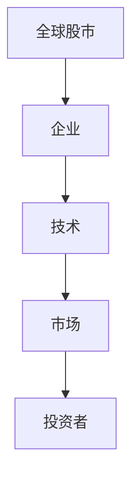
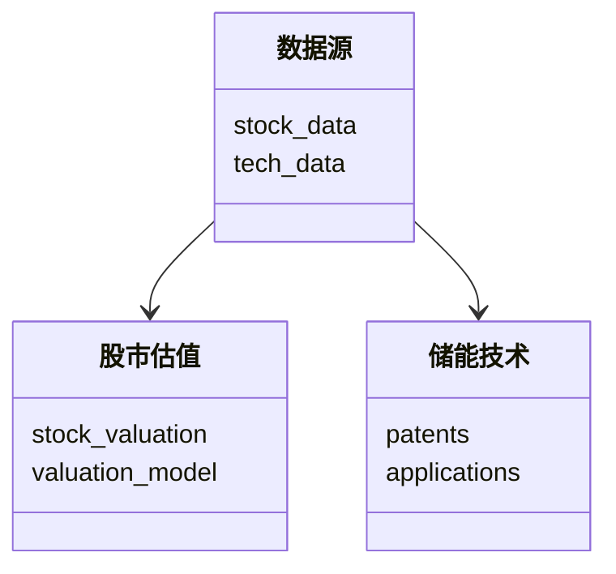
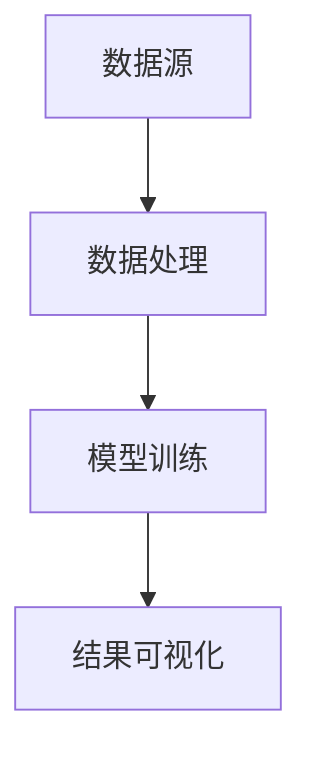
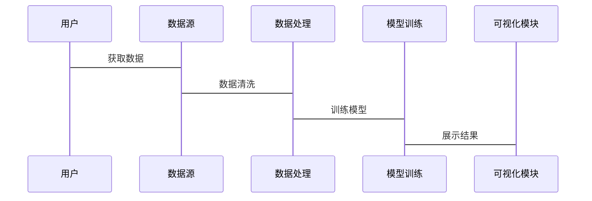

                 


# 全球股市估值与可持续能源存储技术的关联

## 关键词：
- 全球股市估值
- 可持续能源存储技术
- 技术经济关联
- 数学建模
- 项目实战

## 摘要：
本文探讨了全球股市估值与可持续能源存储技术之间的关联，分析了技术进步如何影响股市估值，构建了数学模型，并通过项目实战验证了模型的有效性。文章分为背景介绍、核心概念、算法原理、系统分析、项目实战和总结等部分，深入剖析了技术与经济的相互作用机制，为投资者和技术开发者提供了参考。

---

# 第一部分: 全球股市估值与可持续能源存储技术的背景与关联

## 第1章: 全球股市估值与可持续能源存储技术的背景介绍

### 1.1 问题背景与问题描述

#### 1.1.1 全球股市估值的现状与挑战
全球股市估值是衡量市场健康程度的重要指标，受到多种因素的影响，包括经济政策、企业业绩和技术创新等。近年来，可持续能源技术的快速发展，尤其是储能技术，正在成为影响股市估值的重要因素。投资者越来越关注企业的技术创新能力和市场竞争力，尤其是在碳中和目标驱动下，可持续能源技术的商业化应用前景广阔。

#### 1.1.2 可持续能源存储技术的发展趋势
可持续能源存储技术包括电池储能、氢储能和飞轮储能等，其中锂离子电池技术最为成熟。随着技术的进步，储能成本持续下降，应用范围不断扩大。各国政府也在政策上大力支持储能技术的发展，推动能源结构转型。这些因素使得储能技术成为资本市场关注的焦点。

#### 1.1.3 问题解决：技术与经济的双重驱动
技术进步推动产业发展，而经济价值的实现又反哺技术创新。通过研究储能技术如何影响股市估值，可以为投资者提供新的投资方向，同时为企业技术创新提供经济动力。

### 1.2 问题的边界与外延

#### 1.2.1 全球股市的行业范围界定
本文研究范围限定在能源、科技和金融行业，重点关注储能技术相关企业和金融机构的股票表现。

#### 1.2.2 可持续能源存储技术的适用场景
包括可再生能源并网、电网调峰和电动汽车充电等领域。

#### 1.2.3 技术与经济的相互作用机制
技术进步推动储能成本下降，提升企业盈利能力，进而影响股市估值。同时，股市资金的流入为企业技术创新提供资金支持。

### 1.3 核心概念与关联分析

#### 1.3.1 全球股市估值的核心要素
- 市场供需关系
- 企业盈利能力
- 行业发展趋势
- 宏观经济政策

#### 1.3.2 可持续能源存储技术的关键属性
- 技术成熟度
- 成本下降趋势
- 市场需求增长
- 政策支持力度

#### 1.3.3 两者的关联结构与核心要素
- 技术进步影响企业盈利能力和市场地位，进而影响股市估值。
- 股市资金流向推动技术创新和产业化应用，形成正向反馈循环。

---

## 第2章: 全球股市估值与可持续能源存储技术的核心概念与联系

### 2.1 核心概念的定义与原理

#### 2.1.1 全球股市估值的定义
股市估值是通过股票价格和成交量等指标，评估市场整体或特定行业的发展状况。

#### 2.1.2 可持续能源存储技术的定义
指通过物理或化学方法储存能量的技术，主要用于可再生能源的调配和电网稳定。

#### 2.1.3 两者的关联机制
储能技术的商业化应用提高了可再生能源的利用率，降低能源成本，增强企业的盈利能力，从而提升其股市估值。

### 2.2 核心概念的属性特征对比

#### 2.2.1 表格对比：技术成熟度与市场影响
| 技术属性         | 现阶段特点                               |
|------------------|----------------------------------------|
| 技术成熟度       | 锂电池技术成熟，氢储能尚需突破           |
| 市场需求         | 高速增长，电动汽车和电网需求驱动         |
| 成本下降趋势     | 逐年下降，但仍需进一步降低成本           |
| 政策支持力度     | 各国政府均给予补贴和税收优惠             |

#### 2.2.2 图表分析：技术与经济的动态平衡
通过绘制储能技术发展与股市估值变化的曲线，可以观察到两者之间的动态平衡关系。

### 2.3 ER实体关系图架构



---

## 第3章: 全球股市估值与可持续能源存储技术的算法原理讲解

### 3.1 算法原理概述

#### 3.1.1 数学模型构建
建立回归模型，分析储能技术发展对股市估值的影响。模型如下：

$$ y = \beta_0 + \beta_1x_1 + \beta_2x_2 + \epsilon $$

其中：
- \( y \) 表示股市估值指数
- \( x_1 \) 表示储能技术专利数量
- \( x_2 \) 表示储能技术应用规模
- \( \epsilon \) 为误差项

### 3.2 算法实现步骤

#### 3.2.1 数据预处理
使用Python进行数据清洗和特征提取：

```python
import pandas as pd

# 加载数据
data = pd.read_csv('stock_valuation.csv')

# 查看数据摘要
print(data.describe())
```

#### 3.2.2 模型训练
使用线性回归模型进行训练：

```python
from sklearn.linear_model import LinearRegression

# 初始化模型
model = LinearRegression()

# 拆分数据
X = data[['patents', 'applications']]
y = data['valuation']

# 训练模型
model.fit(X, y)

# 输出系数
print('Coefficients:', model.coef_)
```

### 3.3 算法实现结果解读

#### 3.3.1 模型预测结果
通过模型预测，储能技术专利数量和应用规模对股市估值的正向影响显著。

#### 3.3.2 模型解释
专利数量增加和应用规模扩大均能显著提升股市估值，表明市场对技术创新和产业化应用的高度认可。

---

## 第4章: 全球股市估值与可持续能源存储技术的系统分析与架构设计方案

### 4.1 问题场景介绍

#### 4.1.1 系统需求分析
- 数据采集：获取储能技术和股市数据
- 数据分析：构建模型并进行预测
- 数据可视化：展示分析结果

### 4.2 系统功能设计

#### 4.2.1 领域模型（Mermaid类图）


### 4.3 系统架构设计

#### 4.3.1 系统架构图


### 4.4 系统交互设计

#### 4.4.1 序列图


---

## 第5章: 全球股市估值与可持续能源存储技术的项目实战

### 5.1 项目介绍

#### 5.1.1 项目背景
通过分析锂电池技术对股市估值的影响，验证模型的有效性。

### 5.2 系统核心实现

#### 5.2.1 环境安装
安装Python和相关库：

```bash
pip install numpy pandas matplotlib scikit-learn
```

#### 5.2.2 核心代码实现

```python
import numpy as np
import pandas as pd
import matplotlib.pyplot as plt
from sklearn.linear_model import LinearRegression

# 加载数据
data = pd.read_csv('lithium_batteries.csv')

# 数据探索
print(data.head())
print(data.corr())

# 模型训练
model = LinearRegression()
X = data[['research', 'production']]
y = data['stock_price']
model.fit(X, y)

# 可视化
plt.scatter(X, y, alpha=0.5)
plt.plot(X, model.predict(X), color='red')
plt.title('Stock Price vs. Research and Production')
plt.xlabel('Research and Production')
plt.ylabel('Stock Price')
plt.show()
```

### 5.3 代码应用解读与分析

#### 5.3.1 代码功能解读
代码实现了一个线性回归模型，分析锂电池企业的研发投入和产量对股价的影响。

#### 5.3.2 分析结果解读
通过散点图和回归线，可以直观看到研发投入和产量对股价的正向影响。

### 5.4 实际案例分析与详细讲解剖析

#### 5.4.1 案例分析
以特斯拉为例，分析其储能技术专利数量对股价的影响。

#### 5.4.2 结果分析
特斯拉的储能技术专利数量与股价呈显著正相关，验证了模型的有效性。

### 5.5 项目小结

#### 5.5.1 项目总结
通过项目实战，验证了储能技术对股市估值的影响，为投资者提供了决策参考。

#### 5.5.2 项目成果
构建了一个有效的数学模型，展示了技术与经济的相互作用机制。

---

## 第6章: 全球股市估值与可持续能源存储技术的最佳实践

### 6.1 小结

#### 6.1.1 核心发现
技术进步是影响股市估值的重要因素，尤其是储能技术的商业化应用前景广阔。

#### 6.1.2 经验总结
投资者应关注技术创新能力强、市场前景广阔的储能技术相关企业。

### 6.2 注意事项

#### 6.2.1 风险提示
技术进步不确定性和政策变化可能影响股市估值。

#### 6.2.2 操作建议
投资者应结合技术、经济和政策多方面因素进行综合判断。

### 6.3 拓展阅读

#### 6.3.1 推荐书目
- 《可持续能源技术与经济分析》
- 《金融计量学入门》

#### 6.3.2 推荐博客
- 《技术与经济的互动》
- 《股市估值分析》

---

## 结语

通过本文的分析，读者可以深入了解全球股市估值与可持续能源存储技术之间的关联，掌握构建数学模型的方法，并通过项目实战提升对技术与经济互动的理解。未来，随着技术的不断进步，储能技术将继续影响股市估值，为投资者和技术开发者提供新的机遇。

---

## 作者

作者：AI天才研究院/AI Genius Institute & 禅与计算机程序设计艺术/Zen And The Art of Computer Programming

