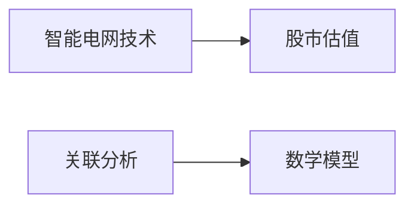
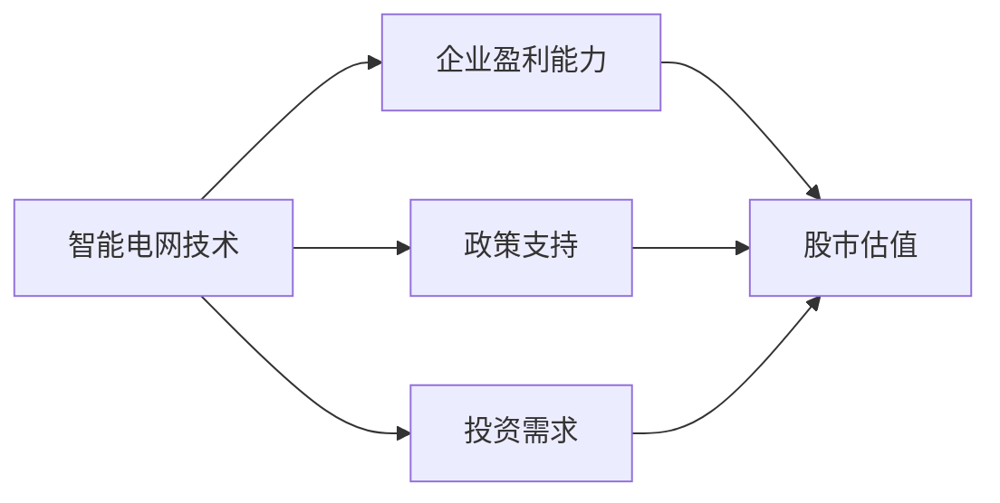
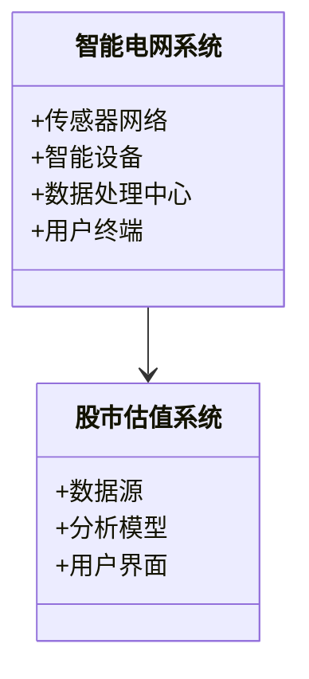
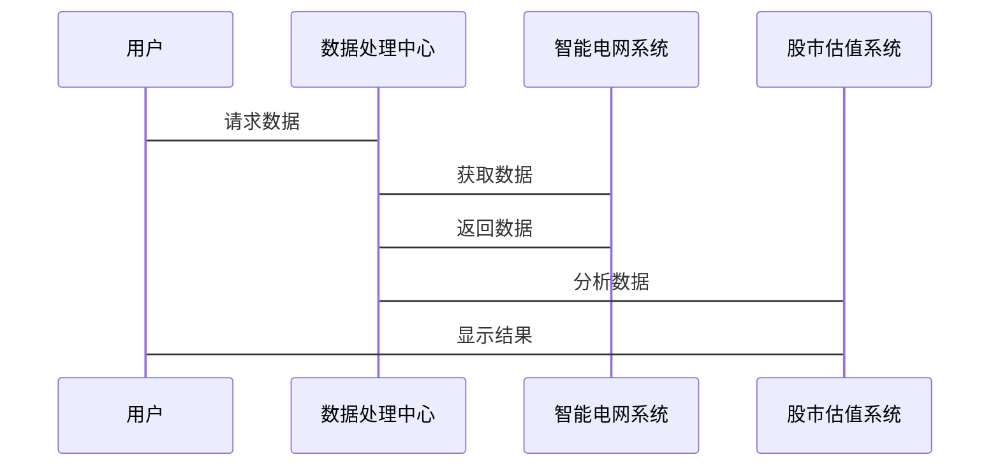

                 


# 全球股市估值与可持续能源智能电网技术的关联

## 关键词

全球股市估值，可持续能源，智能电网技术，关联分析，算法原理，系统架构，项目实战

## 摘要

本文探讨了全球股市估值与可持续能源智能电网技术之间的关联，分析了智能电网技术对股市估值的影响，提出了基于时间序列分析和机器学习模型的关联分析方法，并构建了智能电网系统的架构，展示了如何通过实际案例分析实现智能电网技术对股市估值的优化。

---

# 第一部分：背景介绍

## 第1章：全球股市估值与可持续能源智能电网技术的关联背景

### 1.1 问题背景

随着全球能源结构的转型和可持续发展的需求，智能电网技术在全球范围内的应用日益广泛。智能电网通过整合可再生能源、智能设备和数据分析，优化能源分配和管理，从而降低成本并提高效率。与此同时，股市作为经济的晴雨表，其估值受到多种因素的影响，包括宏观经济指标、政策变化和技术创新等。智能电网技术作为一项重要的技术创新，其发展对能源行业和相关企业具有深远影响，进而可能影响股市估值。

### 1.2 问题描述

本文旨在分析智能电网技术的发展对全球股市估值的影响。具体而言，探讨智能电网技术如何通过优化能源管理和降低成本，影响相关企业的盈利能力和市场地位，从而影响股市估值。同时，分析股市估值的变化如何反过来影响智能电网技术的投资和发展。

### 1.3 问题解决

为了解决上述问题，本文采用了以下方法：
1. **数据收集**：收集智能电网技术相关的数据，包括技术发展、政策支持和市场应用情况。
2. **关联分析**：利用统计学和机器学习方法，分析智能电网技术与股市估值之间的关联。
3. **模型构建**：构建数学模型，预测智能电网技术对企业盈利和股市估值的影响。

### 1.4 边界与外延

本文的研究范围主要集中在智能电网技术和股市估值之间的直接关联，不涉及其他因素（如全球经济波动、地缘政治等）的影响。同时，本文主要关注技术层面的影响，不涉及企业战略和政策层面的分析。

### 1.5 概念结构与核心要素组成

图1展示了本文的核心概念结构，包括智能电网技术、股市估值、关联分析和数学模型四个主要部分。



---

# 第二部分：核心概念与联系

## 第2章：可持续能源智能电网技术的核心概念

### 2.1 智能电网技术的基本原理

智能电网技术通过整合可再生能源、智能设备和大数据分析，实现能源的高效管理。其核心组成部分包括：
- **智能输配电系统**：通过传感器和自动化设备实时监测和调整输配电过程。
- **可再生能源整合**：通过智能电网将风能、太阳能等可再生能源整合到电力系统中。
- **需求侧管理**：通过智能设备和数据分析，优化用户的能源使用。

### 2.2 全球股市估值的机制

股市估值主要受到以下因素的影响：
- **企业盈利能力**：企业的收入和利润直接影响其股市估值。
- **行业竞争格局**：行业内的竞争状况影响企业的市场地位和估值。
- **政策支持**：政府政策和法规对行业的发展和企业估值有重要影响。

### 2.3 智能电网技术与股市估值的关联

智能电网技术通过提高能源效率和降低成本，增强了企业的盈利能力，从而影响股市估值。同时，智能电网技术的推广和应用需要大量投资，股市估值的变化也会影响技术的投资和发展。

---

## 第3章：智能电网技术与股市估值的关联分析

### 3.1 关联分析框架

本文构建了如下的关联分析框架：



---

# 第三部分：算法原理

## 第4章：算法原理

### 4.1 时间序列分析

时间序列分析是一种常用的方法，用于分析智能电网技术和股市估值之间的关系。以下是一个时间序列分析的流程图：


### 4.2 机器学习模型

机器学习模型，如随机森林和XGBoost，可用于预测股市估值的变化。以下是一个随机森林模型的流程图：


---

## 第5章：数学模型

### 5.1 负荷预测模型

负荷预测模型用于预测智能电网的电力需求：

$$ Load_{t} = \alpha Load_{t-1} + \beta Load_{t-2} + \epsilon_t $$

### 5.2 回归分析

回归分析用于分析智能电网技术对股市估值的影响：

$$ Stock_{t} = \beta_0 + \beta_1 Tech_{t} + \beta_2 Profit_{t} + \epsilon_t $$

---

# 第四部分：系统分析与架构设计

## 第6章：系统分析与架构设计

### 6.1 智能电网系统架构

智能电网系统的架构如下：



### 6.2 系统接口设计

系统接口设计包括数据接口和用户接口，数据接口用于智能电网系统和股市估值系统的数据传输，用户接口用于用户与系统的交互。

### 6.3 系统交互流程

系统交互流程如下：



---

# 第五部分：项目实战

## 第7章：项目实战

### 7.1 环境安装

安装所需的环境包括Python、Pandas、Scikit-learn和TensorFlow。

### 7.2 核心代码实现

以下是一个时间序列分析的Python代码示例：

```python
import pandas as pd
from sklearn.model_selection import train_test_split
from sklearn.ensemble import RandomForestRegressor
import joblib

# 数据加载
data = pd.read_csv('data.csv')
# 特征与目标分离
X = data.drop('Stock', axis=1)
y = data['Stock']
# 数据划分
X_train, X_test, y_train, y_test = train_test_split(X, y, test_size=0.2)
# 模型训练
model = RandomForestRegressor()
model.fit(X_train, y_train)
# 模型保存
joblib.dump(model, 'model.pkl')
```

### 7.3 案例分析

以某智能电网企业为例，分析其技术应用对股市估值的影响。

---

# 第六部分：总结

## 第8章：总结

### 8.1 内容回顾

本文分析了智能电网技术与股市估值之间的关联，提出了基于时间序列分析和机器学习模型的关联分析方法，并构建了智能电网系统的架构。

### 8.2 研究展望

未来的研究可以进一步探索智能电网技术对股市估值的长期影响，以及政策和市场因素的作用。

### 8.3 最佳实践 tips

- 数据质量是分析的基础，需确保数据的准确性和完整性。
- 模型选择需根据具体问题和数据特点进行调整。
- 系统设计需考虑可扩展性和可维护性。

---

# 作者

作者：AI天才研究院/AI Genius Institute & 禅与计算机程序设计艺术 /Zen And The Art of Computer Programming

---

感谢您的阅读！希望本文对您理解全球股市估值与可持续能源智能电网技术的关联有所帮助！

