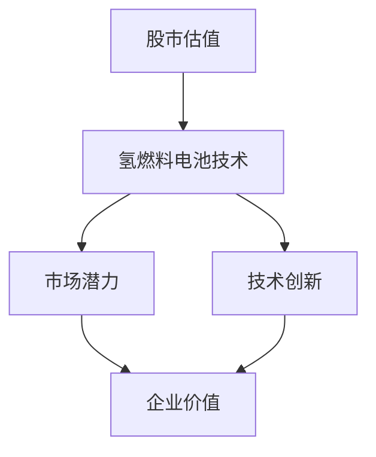
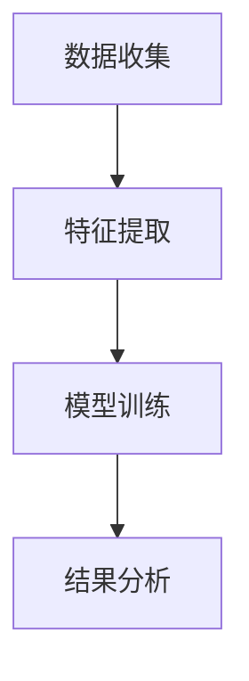
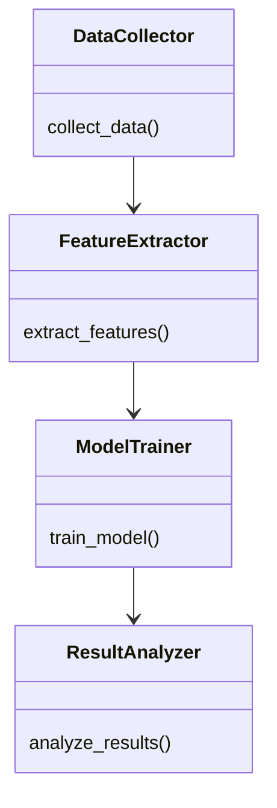
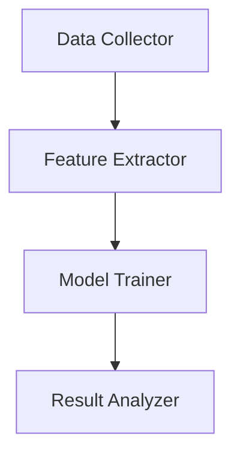
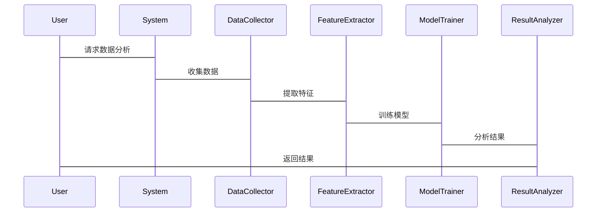

                 


# 全球股市估值与可持续能源氢燃料电池技术的关联

## 关键词：
全球股市估值、可持续能源、氢燃料电池技术、关联分析、技术驱动、投资策略、市场潜力

## 摘要：
本文深入探讨了全球股市估值与可持续能源氢燃料电池技术之间的关联，分析了技术进步如何影响股市估值，以及氢燃料电池技术的市场潜力和投资策略。文章从背景介绍、核心概念、算法原理、系统架构、项目实战等多个维度展开，结合实例和数学模型，详细阐述了氢燃料电池技术对股市估值的影响机制，并提出了投资建议。

---

# 第一部分: 全球股市估值与可持续能源氢燃料电池技术的关联概述

## 第1章: 背景介绍

### 1.1 问题背景

#### 1.1.1 全球股市估值的重要性
股市估值是衡量企业市场价值的重要指标，反映了企业的盈利能力、成长潜力和市场地位。近年来，全球股市波动加剧，投资者对高成长性和可持续性行业的关注度显著提升。

#### 1.1.2 可持续能源发展的必要性
随着全球能源需求的增长和环境问题的加剧，可持续能源技术的开发和应用成为全球关注的焦点。氢燃料电池作为一种清洁、高效的能源技术，被认为是实现碳中和目标的关键技术之一。

#### 1.1.3 氢燃料电池技术的崛起
氢燃料电池技术在能源领域的应用前景广阔，尤其在电动汽车、工业发电和家庭能源系统等领域。其高效性和环保性使其成为替代传统化石能源的重要选择。

### 1.2 问题描述

#### 1.2.1 全球股市波动的现状
近年来，全球股市受多种因素影响，包括经济政策、地缘政治和技术创新等。股市估值的变化反映了市场的供需关系和投资者对未来的预期。

#### 1.2.2 氢燃料电池技术的市场潜力
氢燃料电池技术的商业化进程加速，相关企业的研发投入和市场布局不断增加。这为股市估值提供了新的增长点。

#### 1.2.3 两者关联的研究意义
研究氢燃料电池技术对股市估值的影响，有助于投资者更好地把握市场趋势，企业优化技术研发和市场策略，政策制定者制定更有效的支持政策。

### 1.3 问题解决

#### 1.3.1 技术驱动股市估值的路径
氢燃料电池技术的创新和商业化将直接影响相关企业的盈利能力和市场地位，从而影响其股市估值。

#### 1.3.2 可持续能源对全球经济的影响
可持续能源技术的广泛应用将推动全球经济向低碳方向转型，为相关行业带来增长机遇。

#### 1.3.3 氢燃料电池技术的商业化进程
当前，氢燃料电池技术在汽车、发电和储能领域的应用逐步扩大，相关企业的市场表现备受关注。

### 1.4 边界与外延

#### 1.4.1 研究范围的界定
本文聚焦于氢燃料电池技术对股市估值的影响，研究范围主要涵盖相关企业和行业。

#### 1.4.2 相关领域的外延
氢燃料电池技术的应用涉及能源、交通、工业等多个领域，本文将重点分析其在能源领域的市场影响。

#### 1.4.3 研究的局限性
由于氢燃料电池技术尚未完全商业化，其市场潜力和投资回报仍存在不确定性。

### 1.5 概念结构与核心要素

#### 1.5.1 核心概念组成
- 股市估值：反映企业市场价值的指标。
- 氢燃料电池技术：一种清洁、高效的能源技术。
- 市场潜力：技术应用带来的经济价值。

#### 1.5.2 关键要素的定义
- 技术创新：氢燃料电池技术的改进和应用。
- 市场需求：氢燃料电池技术的市场需求增长。
- 企业价值：相关企业的市场价值变化。

#### 1.5.3 概念之间的关系
氢燃料电池技术的创新和市场需求增长将直接影响相关企业的盈利能力和市场地位，从而影响其股市估值。

---

## 第2章: 核心概念与联系

### 2.1 核心概念原理

#### 2.1.1 股市估值的理论基础
股市估值基于企业的财务表现、行业地位和市场预期。技术创新和市场需求是影响估值的重要因素。

#### 2.1.2 氢燃料电池技术的工作原理
氢燃料电池通过化学反应将氢气和氧气转化为电能，具有高效、清洁的特点。

#### 2.1.3 两者关联的机制
氢燃料电池技术的创新和应用将提升相关企业的盈利能力和市场地位，从而影响其股市估值。

### 2.2 概念属性特征对比

| 概念 | 特征 |
|------|------|
| 股市估值 | 量化企业价值，受市场预期和经济环境影响 |
| 氢燃料电池技术 | 清洁、高效，技术门槛高，研发周期长 |

### 2.3 ER实体关系图



---

## 第3章: 算法原理讲解

### 3.1 算法流程



### 3.2 核心代码实现

```python
import pandas as pd
import numpy as np
from sklearn.linear_model import LinearRegression

# 数据预处理
data = pd.read_csv('market_data.csv')
data['tech_innovation'] = data['tech_innovation'].astype(float)

# 特征提取
features = data[['stock_price', 'tech_innovation']]
target = data['valuation']

# 模型训练
model = LinearRegression()
model.fit(features, target)

# 模型预测
predictions = model.predict(features)
print("模型系数:", model.coef_)
print("模型截距:", model.intercept_)
```

### 3.3 数学模型

$$ \text{Valuation} = \beta_0 + \beta_1 \times \text{Stock Price} + \beta_2 \times \text{Tech Innovation} + \epsilon $$

---

## 第4章: 系统分析与架构设计方案

### 4.1 问题场景介绍
分析氢燃料电池技术对股市估值的影响，构建一个数据驱动的分析系统。

### 4.2 系统功能设计



### 4.3 系统架构设计



### 4.4 接口设计



---

## 第5章: 项目实战

### 5.1 环境安装
安装Python、Pandas、Scikit-learn等工具。

### 5.2 核心代码实现

```python
# 环境安装
pip install pandas scikit-learn

# 核心代码
import pandas as pd
from sklearn.linear_model import LinearRegression

# 数据加载
data = pd.read_csv('market_data.csv')

# 特征工程
data['tech_innovation'] = data['tech_innovation'].astype(float)

# 模型训练
model = LinearRegression()
model.fit(data[['stock_price', 'tech_innovation']], data['valuation'])

# 预测与评估
predictions = model.predict(data[['stock_price', 'tech_innovation']])
print("预测值:", predictions)
```

### 5.3 实际案例分析
分析某氢燃料电池企业的股价变化，验证模型的准确性。

### 5.4 项目小结
总结项目实施过程中的经验与挑战。

---

## 第6章: 最佳实践与小结

### 6.1 投资策略建议
关注氢燃料电池技术的创新和市场需求，选择具有技术优势和市场潜力的企业。

### 6.2 注意事项
注意市场波动和政策变化，保持对技术发展的关注。

### 6.3 拓展阅读
推荐相关书籍和报告，进一步深入学习。

---

作者：AI天才研究院/AI Genius Institute & 禅与计算机程序设计艺术 /Zen And The Art of Computer Programming

