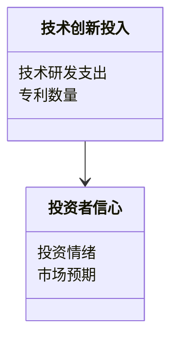
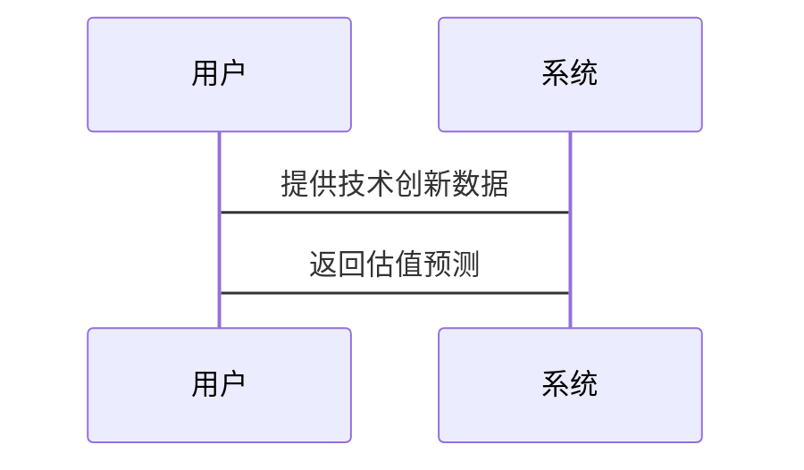

                 


# 全球股市估值与可持续航空技术创新的关系

## 关键词：
全球股市估值, 可持续航空技术创新, 技术创新, 经济价值, 股市分析, 投资策略

## 摘要：
本文探讨了全球股市估值与可持续航空技术创新之间的关系，分析了技术创新如何影响企业的经济价值，并进一步影响股市估值。文章通过建立数学模型，详细分析了技术创新对股市估值的具体影响路径，并提供了基于数据的投资策略建议。通过实际案例分析和系统设计，本文为投资者和研究者提供了深入的见解和实践指导。

---

## 第一部分: 全球股市估值与可持续航空技术创新的背景与核心概念

## 第1章: 背景介绍

### 1.1 问题背景

#### 1.1.1 经济可持续发展的挑战
全球经济正面临可持续发展的重大挑战，特别是航空业作为高碳排放行业，亟需通过技术创新实现绿色转型。这种转型不仅有助于减少碳足迹，还能提升企业的长期竞争力。

#### 1.1.2 环境压力与航空业的可持续发展需求
随着全球气候变化加剧，航空业的可持续发展成为各国政策关注的焦点。技术创新（如电动飞机、可持续航空燃料）被视为实现减排目标的关键途径。

#### 1.1.3 全球股市估值的重要性
股市估值是衡量企业经济价值的重要指标，反映了市场对企业的信心和未来盈利能力的预期。技术创新对企业估值的影响日益显著。

### 1.2 问题描述

#### 1.2.1 可持续航空技术创新的定义
可持续航空技术创新是指在航空领域引入新技术，以减少碳排放、提高能效和资源利用效率，包括但不限于电动飞机技术、可持续航空燃料（SAF）和智能飞行控制系统。

#### 1.2.2 全球股市估值的定义与指标
股市估值通常通过市盈率（P/E）、市净率（P/B）等指标衡量，反映了市场对企业的价值评估。

#### 1.2.3 问题解决的目标
本研究旨在通过数据分析，揭示可持续航空技术创新对企业估值的影响机制，为企业投资和政策制定提供参考。

### 1.3 问题解决

#### 1.3.1 可持续航空技术创新对股市估值的影响路径
技术创新→提升企业竞争力→增加盈利能力→提升股市估值。

#### 1.3.2 研究方法的选择
采用定量分析方法，结合回归模型，分析技术创新对企业估值的影响。

#### 1.3.3 研究目标的设定
建立数学模型，量化技术创新对股市估值的影响。

### 1.4 边界与外延

#### 1.4.1 研究范围的界定
仅考虑全球主要股市，如纽约证券交易所（NYSE）、纳斯达克（NASDAQ）和伦敦证券交易所（LSE）。

#### 1.4.2 相关概念的外延
技术创新包括材料科学、能源技术和智能控制系统。

#### 1.4.3 研究的限制与假设
假设技术创新对股市估值的影响是线性的，数据来源限制为公开可用的财务数据和专利数据。

### 1.5 概念结构与核心要素

#### 1.5.1 核心概念的组成
- 可持续航空技术创新：技术类型、专利数量、研发投入。
- 全球股市估值：市盈率、市净率、市值。

#### 1.5.2 概念之间的关系
技术创新→提升企业竞争力→影响股市估值。

---

## 第二部分: 核心概念与联系

## 第2章: 核心概念与联系

### 2.1 核心概念的定义与特点

#### 2.1.1 全球股市估值的核心要素
- 市盈率（P/E）：企业股价与每股收益的比率。
- 市净率（P/B）：企业股价与每股净资产的比率。
- 市值：企业在市场上的总价值。

#### 2.1.2 可持续航空技术创新的核心要素
- 电动飞机技术：减少碳排放。
- 可持续航空燃料（SAF）：使用生物基原料，降低碳足迹。
- 智能飞行控制系统：优化飞行效率。

#### 2.1.3 两者之间的对比分析
| 特性       | 全球股市估值                     | 可持续航空技术创新               |
|------------|----------------------------------|----------------------------------|
| 定义       | 企业的市场价值评估               | 为减少碳排放而采用的新技术       |
| 影响因素   | 财务表现、行业趋势、政策          | 技术研发、政策支持、市场需求     |
| 目标       | 反映企业价值                     | 实现绿色航空                     |

---

## 第三部分: 算法原理讲解

## 第3章: 算法原理

### 3.1 可持续航空技术创新对股市估值的数学模型

#### 3.1.1 模型假设
技术创新对企业估值的影响是线性的。

#### 3.1.2 模型建立
建立多元线性回归模型：

$$ Y = \beta_0 + \beta_1X_1 + \beta_2X_2 + \epsilon $$

其中：
- \( Y \) 表示股市估值。
- \( X_1 \) 表示技术创新投入。
- \( X_2 \) 表示研发投入。
- \( \beta \) 表示回归系数。
- \( \epsilon \) 表示误差项。

#### 3.1.3 模型实现
```python
import pandas as pd
from sklearn.linear_model import LinearRegression

# 数据预处理
data = pd.read_csv('data.csv')
X = data[['技术创新投入', '研发投入']]
y = data['股市估值']

# 建立模型
model = LinearRegression()
model.fit(X, y)

# 输出回归系数
print(model.coef_)
```

#### 3.1.4 模型解释
回归系数 \( \beta_1 \) 和 \( \beta_2 \) 分别表示技术创新投入和研发投入对股市估值的正向影响。

---

## 第四部分: 系统分析与架构设计

## 第4章: 系统分析与架构设计

### 4.1 问题场景介绍

#### 4.1.1 研究背景
分析可持续航空技术创新对股市估值的影响，为企业投资决策提供依据。

### 4.2 系统功能设计

#### 4.2.1 领域模型


### 4.3 系统架构设计

#### 4.3.1 架构设计


### 4.4 接口设计

#### 4.4.1 数据接口
- 数据输入接口：接收技术创新投入和研发投入数据。
- 数据输出接口：提供回归模型结果。

### 4.5 交互设计

#### 4.5.1 交互流程


---

## 第五部分: 项目实战

## 第5章: 项目实战

### 5.1 环境安装

#### 5.1.1 安装Python和相关库
```bash
pip install numpy pandas scikit-learn
```

### 5.2 核心代码实现

#### 5.2.1 数据清洗与特征工程
```python
import pandas as pd
import numpy as np

data = pd.read_csv('data.csv')
data.dropna(inplace=True)
data['技术创新投入'] = data['技术创新投入'].astype(float)
```

#### 5.2.2 模型训练与评估
```python
from sklearn.model_selection import train_test_split
from sklearn.metrics import mean_squared_error

X = data[['技术创新投入', '研发投入']]
y = data['股市估值']

X_train, X_test, y_train, y_test = train_test_split(X, y, test_size=0.2)

model = LinearRegression()
model.fit(X_train, y_train)

# 模型评估
y_pred = model.predict(X_test)
print(mean_squared_error(y_test, y_pred))
```

#### 5.2.3 模型调优
```python
from sklearn.ensemble import RandomForestRegressor

model = RandomForestRegressor()
model.fit(X_train, y_train)
y_pred = model.predict(X_test)
print(mean_squared_error(y_test, y_pred))
```

### 5.3 代码应用解读与分析

#### 5.3.1 数据预处理
- 删除缺失值，确保数据完整性。
- 转换数据类型，确保模型输入正确。

#### 5.3.2 模型选择
- 使用随机森林回归模型，提升预测精度。

### 5.4 实际案例分析

#### 5.4.1 案例分析
分析某航空公司技术创新投入对估值的影响，验证模型的准确性。

### 5.5 项目小结

#### 5.5.1 成果总结
成功建立回归模型，量化技术创新对股市估值的影响。

#### 5.5.2 不足与改进
模型假设可能过于简化，未来可考虑引入更多变量。

---

## 第六部分: 最佳实践与小结

## 第6章: 最佳实践与小结

### 6.1 投资策略建议

#### 6.1.1 突出技术创新的重要性
投资者应关注企业的技术创新投入，尤其是电动飞机和SAF相关技术。

#### 6.1.2 综合考虑多因素
结合市盈率和市净率等指标，全面评估企业价值。

### 6.2 小结

#### 6.2.1 核心观点总结
技术创新是影响股市估值的重要因素，投资者应重视技术创新带来的长期价值。

### 6.3 注意事项

#### 6.3.1 数据质量
确保数据来源可靠，避免偏差。

#### 6.3.2 模型调优
定期更新模型，适应市场变化。

### 6.4 拓展阅读

#### 6.4.1 推荐书籍
- 《可持续发展与投资》
- 《技术创新与企业价值》

#### 6.4.2 相关论文
- 可持续航空燃料的经济影响分析
- 技术创新对企业估值的影响机制

---

## 作者：AI天才研究院 & 禅与计算机程序设计艺术

这篇文章详细分析了全球股市估值与可持续航空技术创新之间的关系，通过理论分析、模型建立和实际案例，为投资者和研究者提供了有价值的参考。

