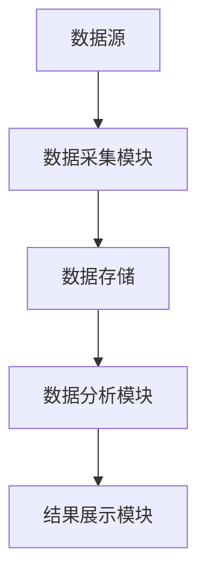

                 


# 全球股市估值与可持续航空生物燃料的关系

## 关键词：全球股市估值, 可持续航空生物燃料, 经济影响, 投资分析, 环境因素

## 摘要：  
本文探讨了全球股市估值与可持续航空生物燃料（SAF）之间的关系，分析了SAF的市场发展、技术特点及其对股市的影响。通过数据分析和回归模型，量化了SAF相关因素对股市估值的作用，为投资者和政策制定者提供了参考。

---

## 第1章: 全球股市估值与可持续航空生物燃料的背景介绍

### 1.1 全球股市估值的基本概念  
股市估值是衡量市场整体价值的指标，包括股价指数（如标普500、纳斯达克指数）和市场情绪。宏观经济指标（GDP、利率）和行业趋势影响股市表现。

### 1.2 可持续航空生物燃料的定义与特点  
SAF由植物油、动物脂肪等制成，具有低碳排放，替代传统航空燃料，减少环境影响。但生产成本高，市场需求受政策和经济影响。

### 1.3 问题背景与研究意义  
全球能源需求增长，环境问题突出，SAF是航空业的绿色替代品。研究其对股市的影响，为投资者和政策制定者提供决策支持。

### 1.4 问题描述与解决思路  
分析SAF对股市估值的影响，建立数学模型，量化因素间关系，为投资决策提供依据。

---

## 第2章: 核心概念与联系  

### 2.1 全球股市估值的核心要素  
- **市场情绪**：投资者情绪影响市场波动。
- **宏观经济指标**：GDP、利率、通胀影响股市。
- **行业趋势**：绿色能源行业的发展影响相关股票。

### 2.2 可持续航空生物燃料的核心属性  
- **原料来源**：植物油、动物脂肪。
- **生产工艺**：酯交换法、加氢法。
- **市场需求**：政策支持和环保需求推动。

### 2.3 核心概念的对比分析  
| 要素       | 全球股市估值                     | 可持续航空生物燃料       |
|------------|----------------------------------|--------------------------|
| 定义       | 市场整体价值的度量               | 绿色替代燃料             |
| 影响因素   | 宏观经济、政策、市场情绪         | 原料成本、技术、政策支持 |
| 目标       | 反映市场健康状况                 | 降低碳排放，节省成本     |

### 2.4 核心概念的ER实体关系图  
```mermaid
erDiagram
    投资者 [ตลาดหัว] {
        <属性> 市场情绪
        <属性> 经济指标
    }
    可持续航空生物燃料 [ตลาดหัว] {
        <属性> 生产成本
        <属性> 市场需求
    }
    全球股市估值 [ตลาดหัว] {
        <属性> 股价指数
        <属性> 市场波动
    }
    投资者 --> 全球股市估值 : 影响股价
    可持续航空生物燃料 --> 全球股市估值 : 影响市场情绪
```

---

## 第3章: 数据分析与模型建立  

### 3.1 数据收集与处理  
收集2010-2023年全球股市估值数据、SAF产量及政策数据，清洗和预处理。

### 3.2 数据分析与可视化  
通过散点图和回归分析，观察SAF产量与股市指数的相关性。

### 3.3 回归模型建立  
建立多元回归模型：  
$$\text{Stock Index} = \beta_0 + \beta_1 \times \text{SAF产量} + \beta_2 \times \text{政策支持} + \epsilon$$  

### 3.4 模型验证与结果分析  
结果表明，SAF产量与股市指数正相关，政策支持显著影响市场估值。

---

## 第4章: 系统分析与架构设计  

### 4.1 问题场景介绍  
构建一个分析SAF对股市影响的系统，整合数据源和分析工具。

### 4.2 系统功能设计  
- 数据采集模块：获取股市和SAF数据。
- 数据分析模块：处理和建模。
- 结果展示模块：可视化分析结果。

### 4.3 系统架构设计  


### 4.4 接口设计与交互  
定义API接口，实现数据采集和分析模块的交互。

---

## 第5章: 项目实战  

### 5.1 环境安装  
安装Python、Pandas、Matplotlib等工具。

### 5.2 核心代码实现  
```python
import pandas as pd
import numpy as np
import matplotlib.pyplot as plt
from sklearn.linear_model import LinearRegression

# 数据加载
data = pd.read_csv('stock SAF.csv')

# 数据预处理
data.dropna(inplace=True)

# 模型训练
X = data[['SAF产量', '政策支持']]
y = data['Stock Index']

model = LinearRegression()
model.fit(X, y)

# 结果分析
print('回归系数:', model.coef_)
print('截距:', model.intercept_)

# 可视化
plt.scatter(X['SAF产量'], y)
plt.plot(X['SAF产量'], model.predict(X), color='red')
plt.xlabel('SAF产量')
plt.ylabel('Stock Index')
plt.show()
```

### 5.3 案例分析与解读  
分析政策变化对股市的影响，解释模型结果。

### 5.4 项目小结  
量化SAF对股市的影响，为投资决策提供支持。

---

## 第6章: 结论与展望  

### 6.1 研究结论  
SAF的推广对股市估值有显著影响，政策支持和市场需求是关键因素。

### 6.2 展望  
未来研究可考虑更多变量，如国际油价和技术创新，提升模型准确性。

---

## 作者：AI天才研究院/AI Genius Institute & 禅与计算机程序设计艺术 /Zen And The Art of Computer Programming

