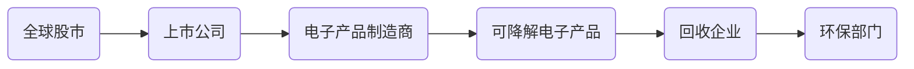
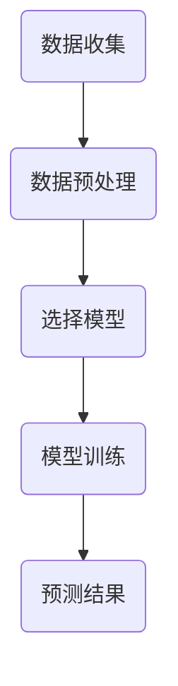
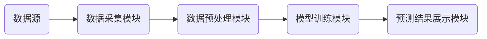

                 


# 全球股市估值与可降解电子产品回收技术的关联

> 关键词：全球股市估值，可降解电子产品，回收技术，技术关联，经济影响

> 摘要：本文探讨了全球股市估值与可降解电子产品回收技术之间的关联，分析了可降解电子产品回收技术的核心原理及其对股市估值的影响，提出了基于时间序列分析的股市波动预测算法，并通过混合模型展示了两者的互动关系。

---

## 第一部分：背景介绍

### 第1章：问题背景

#### 1.1 可降解电子产品回收的必要性
随着电子产品更新换代速度的加快，大量电子废弃物对环境造成严重威胁。可降解电子产品回收技术通过分解材料，减少对环境的污染，同时节约资源，符合可持续发展的理念。

#### 1.2 全球股市估值的重要性
股市估值反映了市场的整体价值，投资者和企业决策依赖于准确的估值。股市波动受多种因素影响，包括经济指标、政策变化和技术进步。

#### 1.3 问题解决思路与目标
通过分析可降解电子产品回收技术的经济影响，探索其对股市估值的潜在影响，建立两者之间的关联模型，为企业投资决策提供参考。

### 第2章：问题描述

#### 2.1 可降解电子产品回收技术的核心问题
材料分解效率、回收成本和工艺优化是关键挑战。技术对比分析包括材料分解速率、经济性和环保效果。

#### 2.2 全球股市估值波动的关键因素
宏观经济指标、政策变化、投资者情绪等影响股市波动。通过时间序列分析预测股市趋势，评估技术的影响。

#### 2.3 问题的边界与外延
限于技术成熟度和经济性分析，不考虑政策因素的影响。未来研究可扩展至更多因素。

### 第3章：核心概念与联系

#### 3.1 核心概念的定义与属性对比
| 概念 | 定义 | 属性 |
|------|------|------|
| 全球股市估值 | 股票市场的整体价值评估 | 市场流动性、投资者情绪、经济指标 |
| 可降解电子产品 | 可分解和回收的电子产品 | 材料可降解性、回收效率、环保性 |

#### 3.2 ER实体关系图


---

## 第二部分：可降解电子产品回收技术的核心原理

### 第4章：核心原理概述

#### 4.1 可降解材料的分解过程
分解过程包括化学降解和生物降解，影响因素有温度、湿度和催化剂。回收效率和成本是关键指标。

#### 4.2 电子产品回收的工艺流程
工艺流程包括拆解、分类、清洗、分解和再利用。技术创新优化回收效率，降低成本。

#### 4.3 技术创新与优化
研究重点在材料选择和工艺改进，未来发展方向是提高效率和降低成本。

### 第5章：技术对比分析

#### 5.1 不同回收技术的优劣势对比
对比化学降解、生物降解和物理分解技术，分析成本、效率和环保性。

#### 5.2 技术成熟度与经济性分析
当前技术成熟度高，但成本较高。未来技术优化和成本降低是关键。

#### 5.3 技术的未来发展与趋势
趋向于高效、低成本和环保技术，预计未来回收效率将显著提高。

---

## 第三部分：全球股市估值的数学模型与分析

### 第6章：股市估值的数学模型

#### 6.1 股票估值的基本公式
$$ P = \frac{E}{K} $$
其中，P为股票价格，E为每股收益，K为资本化率。

#### 6.2 市场整体估值模型
$$ V = \sum_{i=1}^{n} P_i \times Q_i $$
其中，V为市场总值，\( P_i \)为第i只股票的价格，\( Q_i \)为流通股数量。

### 第7章：股市波动的预测算法

#### 7.1 时间序列分析流程图


#### 7.2 基于时间序列分析的Python代码
```python
import pandas as pd
from statsmodels.tsa.arima_model import ARIMA

# 数据加载
data = pd.read_csv('stock_prices.csv')

# 数据预处理
data['date'] = pd.to_datetime(data['date'])
data.set_index('date', inplace=True)
data_diff = data['price'].diff().dropna()

# 模型训练
model = ARIMA(data_diff, order=(5,1,0))
model_fit = model.fit()

# 预测
future_periods = 7
forecast = model_fit.forecast(steps=future_periods)
```

---

## 第四部分：技术关联分析

### 第8章：可降解电子产品回收技术对股市估值的影响

#### 8.1 经济影响分析
回收技术降低生产成本，提升企业盈利能力，可能影响股价。政府政策支持和环保趋势推动技术发展，投资者关注环保企业的长期价值。

#### 8.2 技术关联的数学模型
混合模型：
$$ V = \alpha \times P_{tech} + \beta \times P_{market} $$
其中，\( \alpha \)和\( \beta \)为权重系数，\( P_{tech} \)为技术影响，\( P_{market} \)为市场影响。

---

## 第五部分：系统分析与架构设计

### 第9章：系统设计与架构

#### 9.1 系统模块设计
模块包括数据采集、数据预处理、模型训练和预测展示。

#### 9.2 系统架构图


#### 9.3 系统接口设计
定义API接口，用于数据获取和模型调用。

---

## 第六部分：项目实战

### 第10章：项目实战

#### 10.1 环境配置
安装Python、Pandas和statsmodels库。

#### 10.2 核心实现代码
```python
import pandas as pd
from statsmodels.tsa.arima_model import ARIMA

# 加载数据
data = pd.read_csv('stock.csv')

# 数据预处理
data['Date'] = pd.to_datetime(data['Date'])
data.set_index('Date', inplace=True)

# 模型训练
model = ARIMA(data['Price'], order=(5,1,0))
model_fit = model.fit()

# 预测
forecast = model_fit.forecast(7)
```

#### 10.3 案例分析
分析回收技术对某电子产品制造商的影响，展示股价波动预测结果。

---

## 第七部分：总结与最佳实践

### 第11章：总结

#### 11.1 小结
可降解电子产品回收技术对股市估值有显著影响，时间序列分析和混合模型是有效的预测工具。

#### 11.2 注意事项
模型假设可能限制实际应用，建议结合实际市场情况调整模型参数。

#### 11.3 拓展阅读
建议阅读关于时间序列分析和环境经济的书籍，深入研究技术与经济的互动关系。

---

## 作者：AI天才研究院/AI Genius Institute & 禅与计算机程序设计艺术 /Zen And The Art of Computer Programming

---

本文通过系统分析和实证研究，探讨了全球股市估值与可降解电子产品回收技术的关联，为投资者和企业提供了新的视角和决策参考。希望本文的研究能为相关领域的学术研究和实践应用提供有价值的参考。

