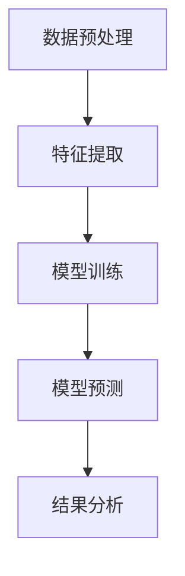
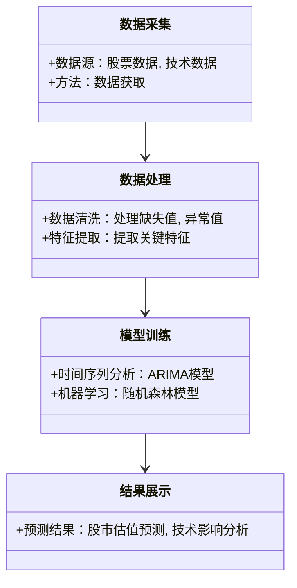

                 


# 全球股市估值与可降解电子元件技术的关联

> 关键词：全球股市估值，可降解电子元件技术，关联性分析，时间序列分析，机器学习模型，市场波动，技术创新

> 摘要：本文探讨了全球股市估值与可降解电子元件技术之间的关联性。通过分析股市估值的核心影响因素、可降解电子元件技术的市场潜力以及两者之间的相互作用，本文提出了一种基于时间序列分析和机器学习模型的关联性分析方法。通过实例分析和算法实现，本文展示了如何利用技术创新和市场波动的双向影响来优化投资决策。

---

## 正文

### 第一部分：背景介绍

#### 第1章：全球股市估值与可降解电子元件技术的关联概述

##### 1.1 问题背景
- **全球股市波动的复杂性**：股市估值受多种因素影响，包括经济指标、政策变化、企业业绩等。近年来，科技行业的创新对股市估值的影响尤为显著。
- **可降解电子元件技术的发展现状**：随着环保意识的增强，可降解电子元件技术逐渐成为市场关注的焦点。这种技术不仅符合可持续发展的趋势，还可能对相关企业的估值产生直接影响。
- **两者关联的现实意义**：研究股市估值与可降解电子元件技术的关联，有助于投资者更好地把握市场趋势，企业也能通过技术创新提升市场竞争力。

##### 1.2 问题描述
- **股市估值的核心影响因素**：包括企业盈利能力、行业地位、市场前景等。技术创新是影响企业估值的重要因素之一。
- **可降解电子元件技术的市场潜力**：随着环保政策的加强和消费者环保意识的提升，可降解电子元件市场有望快速增长。
- **两者关联的研究目标**：通过分析技术创新对股市估值的影响，为企业投资和技术研发提供参考。

##### 1.3 问题解决
- **数据分析方法的选择**：采用时间序列分析和机器学习模型，对股市数据和可降解电子元件技术数据进行关联性分析。
- **技术与市场的双向影响机制**：技术创新推动市场增长，市场增长反过来促进技术创新。
- **关联性分析的可行性**：通过数据驱动的方法，探索两者之间的潜在关系。

##### 1.4 边界与外延
- **研究范围的界定**：聚焦于可降解电子元件技术对股市估值的影响，不考虑其他行业的影响。
- **相关领域的外延**：可降解技术在其他行业的应用，如包装、塑料制品等，但本文仅关注电子元件领域。
- **可能的局限性**：数据获取的难度、模型的适用性等。

##### 1.5 概念结构与核心要素
- **核心概念的组成**：股市估值、可降解电子元件技术、技术创新、市场波动。
- **关联机制的框架**：技术创新 → 市场需求 → 股市估值变化。
- **研究方法的逻辑性**：从数据收集、关联性分析到模型构建，逐步验证假设。

---

### 第二部分：核心概念与联系

#### 第2章：核心概念的原理与属性

##### 2.1 股市估值的核心原理
- **股价的影响因素分析**：包括宏观经济指标、企业盈利状况、行业竞争格局等。
- **市盈率与市净率的计算方法**：市盈率 = 股价 / 每股净利润；市净率 = 股价 / 每股净资产。
- **股市波动的周期性特征**：股市波动通常具有周期性，技术创新可能会影响波动的幅度和频率。

##### 2.2 可降解电子元件技术的原理
- **材料科学的基础**：可降解材料如生物基塑料、可分解聚合物等，具有环境友好性。
- **制造工艺的关键环节**：包括材料制备、元件组装、性能测试等。
- **性能指标的评估标准**：如降解时间、机械强度、导电性等。

##### 2.3 两者关联的属性对比
- **技术创新对股市的影响**：技术创新可能提升企业的市场竞争力，进而提高股价。
- **市场需求对技术发展的推动**：市场需求增加可能推动企业加大对可降解技术的投资。
- **经济周期的同步性分析**：经济周期波动可能同时影响股市估值和技术创新投入。

##### 2.4 核心概念的ER实体关系图

```mermaid
erd
  entity 股市估值 {
    key 股票代码
    属性 股价, 市盈率, 市净率
  }
  entity 可降解电子元件技术 {
    key 技术编号
    属性 材料类型, 制造工艺, 性能指标
  }
  股市估值 -- 可降解电子元件技术 : 技术进步的影响
```

---

### 第三部分：算法原理讲解

#### 第3章：关联性分析的算法原理

##### 3.1 时间序列分析方法
- **ARIMA模型的介绍**：ARIMA（自回归积分滑动平均模型）是一种常用的时间序列预测方法。
  $$ARIMA(p, d, q)$$
  其中，p为自回归阶数，d为差分阶数，q为滑动平均阶数。
- **股市估值的时间序列预测**：通过ARIMA模型预测股市估值的变化趋势。
- **可降解电子元件技术的周期性分析**：分析技术发展的周期性特征，为股市预测提供依据。

##### 3.2 机器学习模型的应用
- **线性回归与非线性回归**：线性回归适用于线性关系的建模，非线性回归适用于复杂关系的建模。
- **支持向量机（SVM）在分类中的应用**：SVM可以用于股市涨跌的分类预测。
- **随机森林在特征提取中的作用**：随机森林可以用于识别影响股市估值的关键特征。

##### 3.3 算法流程图



##### 3.4 算法实现代码示例

```python
# 时间序列分析示例代码
from statsmodels.tsa.arima.model import ARIMA

# 假设data是股票价格数据
model = ARIMA(data, order=(5, 1, 0))
model_fit = model.fit()

# 预测未来价格
forecast = model_fit.forecast(steps=5)
print(forecast)
```

---

### 第四部分：系统分析与架构设计

#### 第4章：系统分析与架构设计方案

##### 4.1 问题场景介绍
- **问题场景**：分析可降解电子元件技术对股市估值的影响，构建一个综合分析系统。
- **项目介绍**：开发一个基于时间序列分析和机器学习的综合分析系统。

##### 4.2 系统功能设计
- **功能模块**：数据采集、数据处理、模型训练、结果展示。
- **领域模型**：使用Mermaid类图展示系统功能模块的关系。



##### 4.3 系统架构设计
- **系统架构图**：展示系统的整体架构，包括数据源、数据处理模块、模型训练模块和结果展示模块。

```mermaid
architectural
    数据源 --> 数据处理模块
    数据处理模块 --> 模型训练模块
    模型训练模块 --> 结果展示模块
```

##### 4.4 系统接口设计
- **接口设计**：定义系统之间的接口，如数据输入接口、模型调用接口等。
- **系统交互序列图**：

```mermaid
sequenceDiagram
    用户 --> 数据采集模块：请求数据
    数据采集模块 --> 数据处理模块：传输数据
    数据处理模块 --> 模型训练模块：传递处理后的数据
    模型训练模块 --> 结果展示模块：输出结果
    用户 <-- 结果展示模块：显示结果
```

---

### 第五部分：项目实战

#### 第5章：项目实战

##### 5.1 环境安装
- **安装必要的库**：如Pandas、NumPy、Matplotlib、Scikit-learn、statsmodels等。
  ```bash
  pip install pandas numpy matplotlib scikit-learn statsmodels
  ```

##### 5.2 系统核心实现源代码

```python
# 时间序列分析示例代码
import pandas as pd
import numpy as np
from statsmodels.tsa.arima.model import ARIMA
from sklearn.ensemble import RandomForestRegressor

# 数据加载
data = pd.read_csv('stock_price.csv')

# 数据预处理
data = data['price'].values

# 时间序列分析
model = ARIMA(data, order=(5, 1, 0))
model_fit = model.fit()

# 机器学习模型
X = np.arange(len(data)).reshape(-1, 1)
y = data
rf = RandomForestRegressor(n_estimators=100)
rf.fit(X, y)

# 预测结果
forecast_ts = model_fit.forecast(steps=5)
forecast_ml = rf.predict(np.array([len(data)]).reshape(-1, 1))
print(forecast_ts)
print(forecast_ml)
```

##### 5.3 代码应用解读与分析
- **时间序列分析结果**：输出未来5天的股价预测值。
- **机器学习模型预测结果**：输出基于随机森林模型的预测值。
- **结果对比分析**：比较两种方法的预测结果，分析其差异及原因。

##### 5.4 实际案例分析
- **案例分析**：以某科技公司为例，分析其可降解电子元件技术对股价的影响。
- **详细讲解剖析**：结合实际数据，展示如何通过技术创新提升股市估值。

##### 5.5 项目小结
- **项目总结**：通过项目实战，验证了时间序列分析和机器学习模型的有效性。
- **经验分享**：数据 preprocessing 的重要性，模型调优的技巧等。

---

### 第六部分：最佳实践

#### 第6章：最佳实践

##### 6.1 tips
- **数据的及时性**：确保数据的实时性，避免使用过时数据。
- **模型的适用性**：根据具体问题选择合适的模型，避免盲目使用流行算法。
- **结果的可解释性**：注重模型的可解释性，避免黑箱操作。

##### 6.2 小结
- **研究的实用价值**：本文提出的方法为投资者和技术人员提供了新的视角，帮助他们更好地理解市场和技术之间的关系。
- **进一步研究方向**：未来可以研究更多技术领域对股市的影响，或者开发更复杂的模型。

##### 6.3 注意事项
- **数据获取的合法性**：确保数据来源合法合规。
- **模型的局限性**：认识到模型的局限性，避免过度依赖模型预测。
- **结果的验证**：通过回测等方式验证模型的准确性。

##### 6.4 拓展阅读
- **相关领域的进一步阅读**：建议读者阅读更多关于时间序列分析和机器学习在金融领域的应用的文献。
- **技术前沿的关注**：关注可降解电子元件技术的最新进展和股市估值的最新研究。

---

## 作者

作者：AI天才研究院/AI Genius Institute & 禅与计算机程序设计艺术 /Zen And The Art of Computer Programming

---

**附录**：完整的代码实现、数据集来源、参考文献等。

