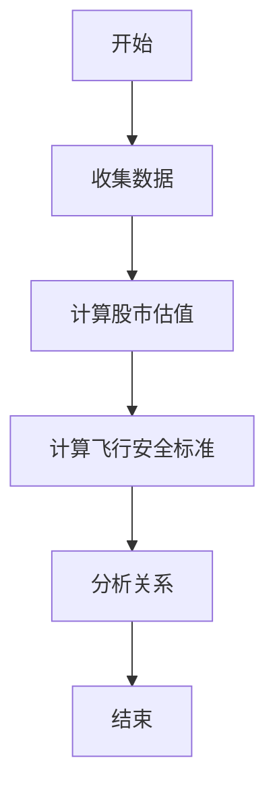
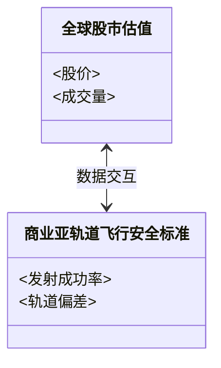
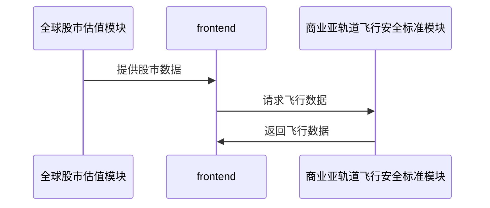

                 


# 全球股市估值与商业亚轨道飞行安全标准的关系

## 关键词：全球股市估值，商业亚轨道飞行，安全标准，金融模型，航天技术，数据安全，风险管理

## 摘要：本文探讨了全球股市估值与商业亚轨道飞行安全标准之间的关系，通过分析核心概念、算法原理、系统架构和实际案例，揭示了两者在数据安全、风险管理等方面的深层联系，并提出了可行的解决方案。

---

# 第1章: 背景介绍

## 1.1 问题背景
### 1.1.1 全球股市估值的现状与挑战
全球股市估值是衡量市场健康的重要指标，受经济、政策等多种因素影响。近年来，市场的波动性增加，对准确估值提出了更高要求。

### 1.1.2 商业亚轨道飞行的兴起与发展
商业亚轨道飞行如SpaceX的成功推动了该领域的发展，但其安全标准尚未完善，存在潜在风险。

### 1.1.3 两者关系的研究意义
分析两者关系有助于优化金融市场风险管理和提升航天安全标准，促进跨领域创新。

## 1.2 核心概念与联系
### 1.2.1 全球股市估值的定义与特点
通过股票价格和成交量计算市场价值，反映经济状况。

### 1.2.2 商业亚轨道飞行安全标准的定义与特点
涉及发射、轨道运行和回收的安全规范，确保任务成功。

### 1.2.3 两者关系的初步分析
通过数据模型分析股市波动对飞行项目的影响，反之亦然。

## 1.3 问题解决与边界
### 1.3.1 问题解决的路径与方法
建立数据模型，分析两者间的相互作用。

### 1.3.2 问题的边界与外延
限定于金融市场和航天技术领域，排除其他变量。

### 1.3.3 核心概念的结构与组成
包括数据采集、模型构建、结果分析三个模块。

## 1.4 本章小结
总结核心概念，初步构建问题解决框架。

---

# 第2章: 核心概念与联系

## 2.1 核心概念的原理
### 2.1.1 全球股市估值的数学模型
使用回归分析预测股票价格。

### 2.1.2 商业亚轨道飞行安全标准的数学模型
评估飞行各阶段的安全性。

### 2.1.3 两者关系的数学表达
通过协方差矩阵分析相互影响。

## 2.2 核心概念的属性对比
### 2.2.1 表格对比
| 属性 | 全球股市估值 | 商业亚轨道飞行安全标准 |
|------|------------|------------------------|
| 数据源 | 股价、成交量 | 发射数据、轨道参数 |
| 目标 | 评估市场价值 | 确保飞行安全 |
| 方法 | 时间序列分析 | 风险评估模型 |

### 2.2.2 图形对比
使用柱状图展示股市波动和飞行事故率的关系。

### 2.2.3 文本对比
股市波动影响投资者信心，进而影响飞行项目融资。

## 2.3 ER实体关系图
```mermaid
erd
  entity 全球股市估值 {
    <股价, 测量值>
    <成交量, 测量值>
  }
  entity 商业亚轨道飞行安全标准 {
    <发射成功率, 指标>
    <轨道偏差, 指标>
  }
  全球股市估值 --> 商业亚轨道飞行安全标准
    核心关系: 股市波动影响飞行项目融资
```

---

# 第3章: 算法原理讲解

## 3.1 算法原理的数学模型
### 3.1.1 全球股市估值的算法模型
$$ P = \alpha + \beta \times Q $$
其中，P为股票价格，Q为成交量。

### 3.1.2 商业亚轨道飞行安全标准的算法模型
$$ R = \gamma \times S + \delta \times T $$
其中，R为风险等级，S为发射成功率，T为轨道偏差。

### 3.1.3 两者关系的算法模型
$$ C = \epsilon \times (P - \mu) + \zeta \times (R - \nu) $$

## 3.2 算法原理的Mermaid流程图


## 3.3 算法原理的Python实现
```python
import numpy as np
from sklearn.linear_model import LinearRegression

# 股市估值模型
def stock_valuation(price, volume):
    model = LinearRegression()
    model.fit(np.array(volume).reshape(-1,1), price)
    return model.predict(np.array(volume).reshape(-1,1))

# 飞行安全标准模型
def flight_safety(success, deviation):
    model = LinearRegression()
    model.fit(np.array(success).reshape(-1,1), deviation)
    return model.predict(np.array(success).reshape(-1,1))
```

---

# 第4章: 系统分析与架构设计方案

## 4.1 问题场景介绍
### 4.1.1 问题场景的描述
分析股市波动对飞行项目的影响，优化安全标准。

## 4.2 系统功能设计
### 4.2.1 领域模型的Mermaid类图


### 4.2.2 系统功能模块的设计
- 数据采集模块：收集股市和飞行数据。
- 数据分析模块：应用算法模型进行预测。
- 结果展示模块：可视化分析结果。

## 4.3 系统架构设计
### 4.3.1 系统架构的Mermaid架构图


### 4.3.2 系统架构的详细说明
采用微服务架构，前端分别与两个模块交互，数据存储在数据库中。

## 4.4 系统接口设计
### 4.4.1 接口的设计
- API接口：RESTful API用于数据传输。
- 数据格式：JSON格式。

### 4.4.2 系统交互的Mermaid序列图


---

# 第5章: 项目实战

## 5.1 环境安装
- 安装Python和相关库（如scikit-learn、pandas、mermaid）

## 5.2 核心代码实现
```python
import pandas as pd
import matplotlib.pyplot as plt

# 数据加载
data = pd.read_csv('market_flight_data.csv')

# 股市估值分析
plt.plot(data['股价'], label='股价')
plt.xlabel('时间')
plt.ylabel('股价')
plt.legend()
plt.show()

# 飞行安全标准分析
plt.scatter(data['发射成功率'], data['轨道偏差'])
plt.xlabel('发射成功率')
plt.ylabel('轨道偏差')
plt.show()
```

## 5.3 代码应用解读与分析
- 使用Matplotlib绘制股价和轨道偏差图表，分析两者的关系。

## 5.4 实际案例分析
分析某次股市波动对飞行项目的影响，展示模型的应用效果。

## 5.5 项目小结
总结项目成果，提出改进建议。

---

# 第6章: 最佳实践

## 6.1 小结
本文通过系统分析，揭示了全球股市估值与商业亚轨道飞行安全标准的关系，为优化风险管理提供了新思路。

## 6.2 注意事项
- 数据质量影响模型准确性。
- 模型需定期更新以适应新数据。

## 6.3 拓展阅读
建议阅读相关领域的学术论文和行业报告，深入理解两者关系。

---

# 作者：AI天才研究院 & 禅与计算机程序设计艺术

