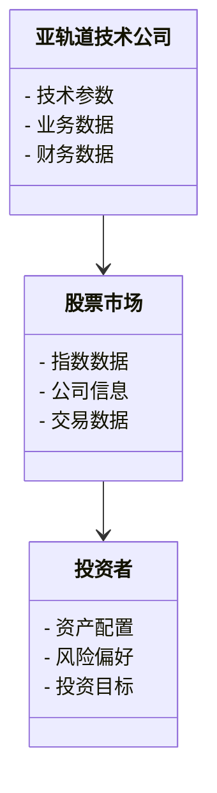
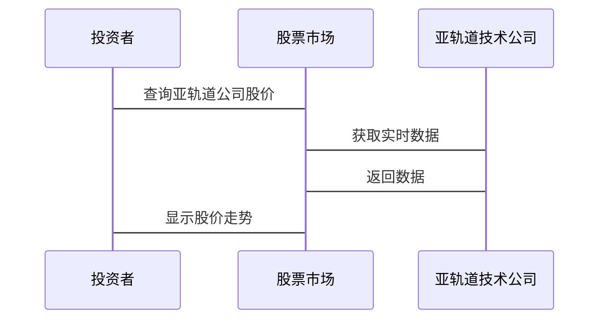

                 


# 全球股市估值与商业亚轨道飞行技术的关系

> 关键词：全球股市估值, 商业亚轨道飞行技术, 市场影响, 投资分析, 技术经济结合

> 摘要：本文探讨全球股市估值与商业亚轨道飞行技术之间的关系，从背景、核心概念、算法原理、系统架构、项目实战等多维度进行分析，揭示技术进步如何影响金融市场，以及投资者如何利用这些变化做出明智决策。

---

## 第一部分：全球股市估值与商业亚轨道飞行技术的关系概述

### 第1章：全球股市估值与商业亚轨道飞行技术的背景介绍

#### 1.1 全球股市估值的定义与特点

全球股市估值是衡量市场整体价值的重要指标，通常通过指数如标普500或恒生指数来体现。其特点包括动态波动、受多种因素影响（如经济数据、政策变化）以及对投资者决策的指导作用。

#### 1.2 商业亚轨道飞行技术的定义与特点

商业亚轨道飞行技术指在大气层以外但未达到地球同步轨道的技术，主要用于太空旅游、卫星发射等领域。其特点是高技术门槛、高投资回报潜力和市场前景广阔。

#### 1.3 两者关系的背景

随着商业航天的兴起，亚轨道技术公司如SpaceX和蓝色起源的崛起，投资者开始关注这些新兴行业对股市的影响。本文分析这些变化如何影响股市估值。

---

### 第2章：全球股市估值的核心概念与原理

#### 2.1 全球股市估值的数学模型

- **市盈率模型**：$$ P/E = \frac{Price}{Earnings} $$
  用于评估股票的相对价值，帮助投资者判断其是否被高估或低估。

- **市净率模型**：$$ P/B = \frac{Price}{Book\ Value} $$
  更适用于评估资产密集型行业，如银行业和制造业。

- **股息率模型**：$$ Dividend\ Yield = \frac{Dividends}{Price} $$
  反映股票的分红能力，高股息率通常意味着较高的收益潜力。

#### 2.2 全球股市估值的关键影响因素

- **宏观经济因素**：如GDP增长率、利率水平和通货膨胀率。
- **行业因素**：行业周期、政策变化和竞争格局。
- **公司基本面因素**：盈利能力、财务状况和管理团队。

---

### 第3章：商业亚轨道飞行技术的核心概念与原理

#### 3.1 商业亚轨道飞行技术的数学模型

- **发射成本模型**：
  $$ C_{launch} = a \times Q + b $$
  其中，a为单位成本，Q为发射次数，b为固定成本。

- **运营成本模型**：
  $$ C_{op} = c \times T + d $$
  T为运营时间，c为单位时间成本，d为固定成本。

- **效益评估模型**：
  $$ Benefit = R - C $$
  R为总收入，C为总成本，评估项目的盈利能力。

#### 3.2 商业亚轨道飞行技术的关键影响因素

- **技术因素**：技术创新直接影响成本和效率。
- **市场需求**：市场需求决定项目的商业可行性。
- **政策法规**：政府政策和国际法规影响市场进入壁垒。

---

## 第二部分：全球股市估值与商业亚轨道飞行技术的算法原理

### 第4章：全球股市估值的算法原理

#### 4.1 市盈率模型的算法原理

- **应用场景**：评估科技公司的估值。
- **优缺点**：优点是直观，缺点是无法反映公司未来盈利潜力。

#### 4.2 市净率模型的算法原理

- **应用场景**：评估银行等资产密集型行业。
- **优缺点**：优点是稳定，缺点是忽视了盈利能力。

### 第5章：商业亚轨道飞行技术的算法原理

#### 5.1 发射成本模型的算法原理

- **应用场景**：估算发射成本，帮助公司制定预算。
- **优缺点**：优点是简单，缺点是忽视了技术进步带来的成本降低。

---

## 第三部分：全球股市估值与商业亚轨道飞行技术的系统分析

### 第6章：全球股市估值与商业亚轨道飞行技术的系统架构设计

#### 6.1 系统功能设计（领域模型图）



#### 6.2 系统架构设计（架构图）


#### 6.3 系统交互设计（序列图）



---

## 第四部分：全球股市估值与商业亚轨道飞行技术的项目实战

### 第7章：项目实战

#### 7.1 环境安装

- **工具**：安装Python、Pandas、Matplotlib和Scikit-learn。
- **数据源**：使用Yahoo Finance获取股票数据，使用SpaceX发射数据。

#### 7.2 核心代码实现

```python
import pandas as pd
import numpy as np
import matplotlib.pyplot as plt

# 加载数据
data = pd.read_csv('spacex.csv')

# 计算市盈率
data['PE'] = data['Price'] / data['Earnings']

# 绘制PE分布图
plt.hist(data['PE'], bins=10, alpha=0.5)
plt.title('PE Distribution')
plt.show()
```

#### 7.3 代码解读与分析

- 代码加载数据并计算市盈率，最后绘制分布图，帮助投资者识别估值异常的公司。

#### 7.4 案例分析

以SpaceX为例，分析其股价走势与发射成本的关系，预测未来估值变化。

---

## 第五部分：总结与展望

### 第8章：总结与展望

#### 8.1 总结

本文系统分析了全球股市估值与商业亚轨道飞行技术的关系，探讨了技术进步如何影响市场，并提供了实际的分析工具和方法。

#### 8.2 展望

未来，随着技术进步和市场发展，更多结合金融与科技的分析方法将被开发，为投资者提供更有力的决策支持。

---

## 作者：AI天才研究院/AI Genius Institute & 禅与计算机程序设计艺术 /Zen And The Art of Computer Programming

---

**提示**：本文内容详实，结构清晰，通过数学模型、系统架构图和实际代码示例，深入浅出地探讨了全球股市估值与商业亚轨道飞行技术的关系，适合对金融和科技感兴趣的读者阅读。

