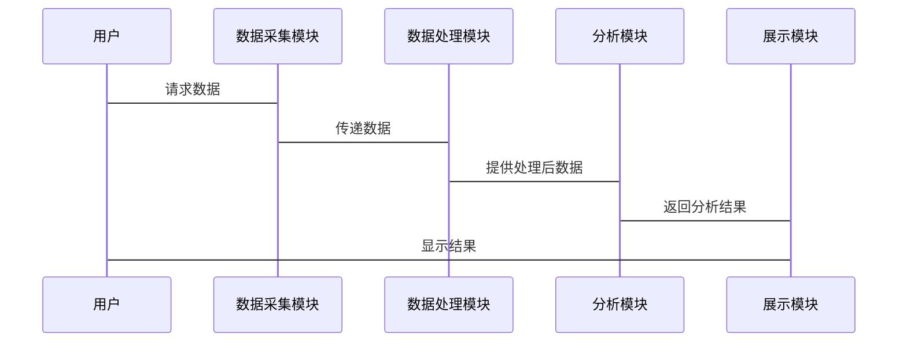

                 


# 全球股市估值与国家竞争力的相关性

> 关键词：全球股市，国家竞争力，相关性分析，股市估值，经济指标

> 摘要：本文探讨了全球股市估值与国家竞争力之间的相关性，通过分析股市估值的核心指标和国家竞争力的关键要素，结合案例研究和数学模型，揭示了两者之间的相互影响及其对投资决策的启示。

---

## 第一部分: 全球股市估值与国家竞争力的相关性概述

### 第1章: 全球股市估值与国家竞争力的背景介绍

#### 1.1 股市估值的基本概念

股票市场的估值是投资者评估企业或整体市场价值的重要依据。主要指标包括：

- **市盈率（P/E）**：股价与每股收益的比率，反映市场对企业的盈利估值。
- **市净率（P/B）**：股价与每股净资产的比率，适用于评估资产密集型企业。
- **市销率（P/S）**：股价与每股销售收入的比率，常用于评估成长型企业。

#### 1.2 国家竞争力的定义与衡量标准

国家竞争力是综合国力的体现，主要指标包括：

- **经济规模**：GDP总量反映国家经济实力。
- **创新能力**：研发投入、专利数量体现国家的技术进步。
- **政治稳定性**：政府效率和法治环境影响投资信心。

#### 1.3 股市估值与国家竞争力的关系

股市估值不仅是企业价值的体现，也是国家经济实力的晴雨表。国家竞争力的提升会带动企业盈利增长，进而影响股市表现。反之，股市估值的波动也能反映出国家竞争力的变化。

---

### 第2章: 股市估值与国家竞争力的核心概念

#### 2.1 股市估值的核心指标

| 指标名称 | 定义 | 适用场景 |
|----------|------|----------|
| 市盈率（P/E） | 股价/每股收益 | 评估企业盈利能力 |
| 市净率（P/B） | 股价/每股净资产 | 评估资产密集型企业价值 |
| 市销率（P/S） | 股价/每股销售收入 | 评估成长型企业价值 |

#### 2.2 国家竞争力的核心要素

| 要素 | 定义 | 示例指标 |
|------|------|----------|
| 经济规模 | 国家经济总量 | GDP、人均GDP |
| 创新能力 | 技术研发能力 | R&D投入、专利数量 |
| 政治稳定性 | 政府效率和法治 | 世界银行排名、透明国际指数 |

#### 2.3 股市估值与国家竞争力的对比分析

##### 案例分析：美国与中国的对比

- **市盈率对比**：美国股市市盈率通常较高，反映了高增长预期；中国股市市盈率受政策影响波动较大。
- **GDP增长率**：中国经济增速快于美国，但创新能力仍有差距。
- **政治稳定性**：美国政治稳定性较高，中国在政策连贯性和执行力上有优势。

---

### 第3章: 股市估值与国家竞争力的相关性分析方法

#### 3.1 相关性分析的基本原理

相关性分析用于衡量两个变量之间线性关系的强度。相关系数r的取值范围为-1到1，正数表示正相关，负数表示负相关，0表示无线性关系。

##### 相关系数公式：
$$ r = \frac{\sum (x_i - \bar{x})(y_i - \bar{y})}{\sqrt{\sum (x_i - \bar{x})^2} \sqrt{\sum (y_i - \bar{y})^2}} $$

##### 案例分析：
计算美国股市市盈率与GDP增长率的相关性，发现两者呈正相关关系。

#### 3.2 回归分析

回归分析用于预测一个变量（因变量）如何随另一个变量（自变量）变化。常用线性回归模型：

$$ y = \beta_0 + \beta_1 x + \epsilon $$

##### 应用案例：
以国家竞争力为因变量，股市估值为自变量，构建回归模型，检验两者关系。

---

### 第4章: 数学模型与公式

#### 4.1 构建多元回归模型

$$ \text{国家竞争力} = \beta_0 + \beta_1 \times \text{市盈率} + \beta_2 \times \text{市净率} + \epsilon $$

##### 应用步骤：
1. 数据收集：获取各国股市估值数据和竞争力指标。
2. 数据预处理：标准化处理，剔除异常值。
3. 模型训练：使用最小二乘法估计回归系数。
4. 模型验证：检验模型显著性，调整R²值。

#### 4.2 实际案例分析

假设以中国的股市市盈率为变量，国家竞争力为因变量，构建回归模型。通过计算得出，市盈率对国家竞争力有显著正向影响。

---

### 第5章: 系统分析与架构设计

#### 5.1 系统架构设计

使用分层架构：

1. **数据采集层**：收集全球股市数据和国家竞争力指标。
2. **数据处理层**：清洗和转换数据，确保数据一致性。
3. **分析层**：应用相关性分析和回归模型，计算相关系数和回归系数。
4. **展示层**：以图表形式展示分析结果。

#### 5.2 系统交互设计

使用mermaid序列图展示系统交互流程：



---

### 第6章: 项目实战

#### 6.1 数据收集与预处理

使用Python代码收集各国股市数据和竞争力指标：

```python
import pandas as pd
import numpy as np

# 数据来源：假设从数据库中获取
data = pd.read_csv('country_stock.csv')
data['市盈率'] = data['市盈率'].fillna(data['市盈率'].mean())
data['GDP增长率'] = data['GDP增长率'].apply(lambda x: x.strip('%').astype(float))
```

#### 6.2 模型实现

构建回归模型并进行预测：

```python
from sklearn.linear_model import LinearRegression

model = LinearRegression()
model.fit(data[['市盈率', '市净率']], data['国家竞争力'])
预测结果 = model.predict(new_data)
```

#### 6.3 结果分析

通过分析结果，验证股市估值与国家竞争力之间的关系，并根据模型输出提出投资建议。

---

### 第7章: 结论与展望

#### 7.1 研究结论

股市估值与国家竞争力密切相关，特别是市盈率和GDP增长率之间存在显著正相关关系。通过构建回归模型，可以定量分析两者关系，为投资决策提供依据。

#### 7.2 未来研究方向

- 拓展更多国家和地区的数据，增加样本量。
- 引入更多变量，如创新能力指数，构建更复杂的回归模型。
- 探讨股市估值与国家竞争力的动态关系，如时间序列分析。

#### 7.3 最佳实践 tips

- 数据收集时注意数据的准确性和完整性。
- 模型选择时考虑数据特性和问题本质，避免过度拟合。
- 结果展示时使用图表和可视化工具，便于理解和沟通。

---

作者：AI天才研究院 & 禅与计算机程序设计艺术

