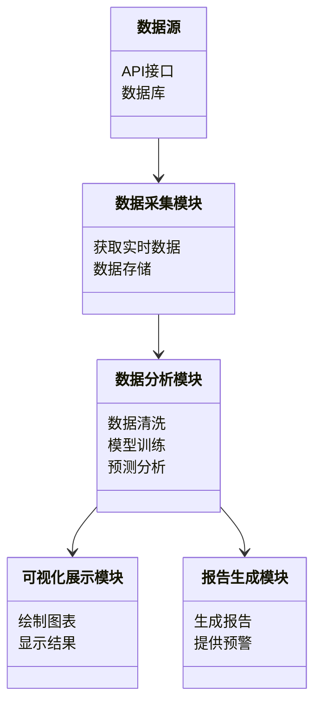
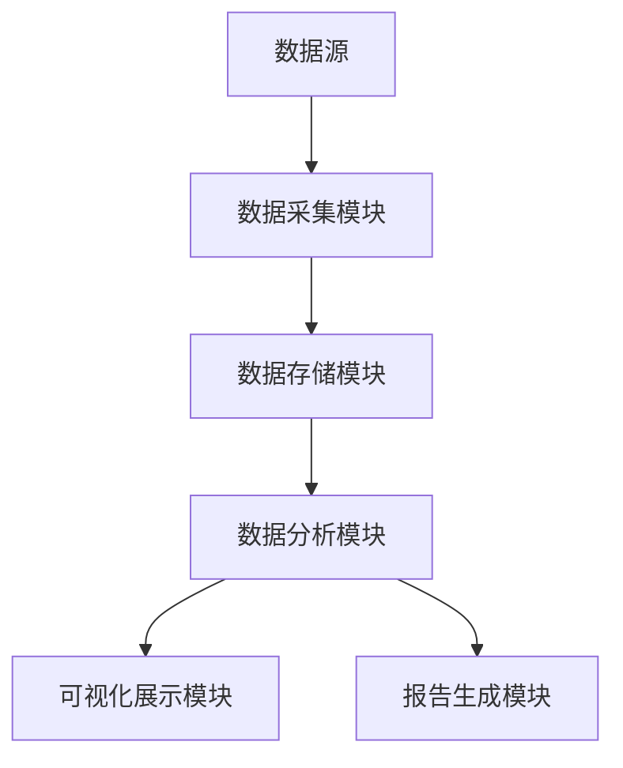
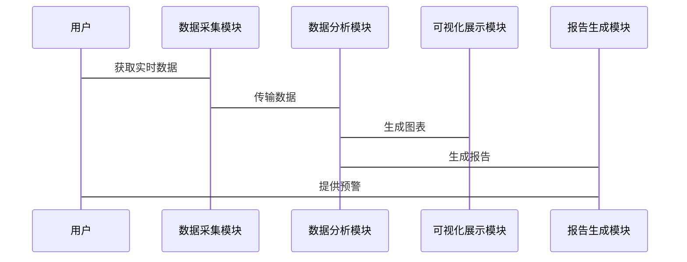

                 


# 目录大纲：《全球股市估值与国际储备货币地位的互动》

## 第一部分：全球股市估值与国际储备货币地位的背景与概述

### 第1章：全球股市估值与国际储备货币地位的背景

#### 1.1 全球股市估值的基本概念
- 1.1.1 股市估值的定义与核心要素
  - 市盈率（P/E Ratio）
  - 市净率（P/B Ratio）
  - 每股收益（EPS）
- 1.1.2 全球化背景下的股市估值特点
  - 股市的国际化与波动性
  - 市场情绪与投资者行为
- 1.1.3 国际储备货币的定义与分类
  - 储备货币的定义
  - 主要国际储备货币：美元、欧元、英镑、日元等

#### 1.2 股市估值与储备货币地位的互动关系
- 1.2.1 股市估值对储备货币地位的影响
  - 股市表现对货币信心的影响
  - 股市波动对货币需求的影响
- 1.2.2 储备货币地位对股市估值的影响
  - 储备货币稳定性对股市信心的影响
  - 储备货币波动对股市资金流动的影响
- 1.2.3 互动关系的理论框架
  - 股市与货币的双向影响机制

#### 1.3 全球化与金融化的双重影响
- 1.3.1 全球化对股市估值的影响
  - 跨国公司的影响
  - 全球资金流动的增加
- 1.3.2 金融化对储备货币地位的影响
  - 金融创新对货币需求的影响
  - 金融市场的波动性对货币信任的影响
- 1.3.3 互动关系的复杂性与挑战
  - 经济周期对互动关系的影响
  - 政治经济事件的冲击

## 第二部分：全球股市估值与国际储备货币地位的核心概念与联系

### 第2章：股市估值与储备货币地位的核心概念

#### 2.1 股市估值的核心要素
- 2.1.1 市盈率（P/E Ratio）
  - 计算公式：P/E = 市价 / 每股收益
  - 示例：某公司股价为100元，每股收益为10元，则P/E为10
- 2.1.2 市净率（P/B Ratio）
  - 计算公式：P/B = 市价 / 每股净资产
  - 示例：某公司股价为50元，每股净资产为20元，则P/B为2.5
- 2.1.3 市值与流动性的关系
  - 流动性对股市估值的影响
  - 高流动性市场的估值稳定性

#### 2.2 国际储备货币的核心属性
- 2.2.1 货币的国际可接受性
  - 主要储备货币的全球接受度
  - 新兴货币的挑战
- 2.2.2 货币的稳定性与安全性
  - 通货膨胀率对货币稳定性的影响
  - 政治经济稳定性对货币安全性的影响
- 2.2.3 货币的流动性与交易便利性
  - 全球交易网络中的流动性
  - 电子支付对流动性的影响

#### 2.3 股市估值与储备货币地位的联系
- 2.3.1 股市估值作为经济晴雨表的作用
  - 股市表现反映经济状况
  - 股市波动对市场信心的影响
- 2.3.2 储备货币地位对股市估值的支撑作用
  - 储备货币稳定性对投资者信心的保障
  - 储备货币波动对股市资金流动的影响
- 2.3.3 互动关系的动态变化
  - 经济周期对互动关系的影响
  - 政治经济事件的短期冲击
  - 长期结构性变化

### 第3章：核心概念的对比与联系

#### 3.1 股市估值与储备货币地位的对比分析
- 3.1.1 核心概念对比表
  | 比较维度 | 股市估值 | 储备货币地位 |
  |----------|----------|--------------|
  | 核心指标 | P/E, P/B | 货币稳定性, 流动性 |
  | 影响因素 | 利率, 消费者信心 | 通货膨胀, 经济政策 |
  | 衡量方式 | 市场指数, 个股估值 | 外汇储备占比, 利率水平 |
- 3.1.2 股市估值与储备货币地位的属性对比
  - 股市估值的波动性 vs 储备货币地位的稳定性
  - 股市估值的市场参与度 vs 储备货币地位的国际接受度
  - 股市估值的政策影响 vs 储备货币地位的市场信任

#### 3.2 股市估值与储备货币地位的ER实体关系图
- 3.2.1 实体关系图的构建
  ```mermaid
  entity 股市估值 {
    <<属性>>
    - 市盈率
    - 市净率
    - 市值
  }
  
  entity 储备货币地位 {
    <<属性>>
    - 货币稳定性
    - 货币流动性
    - 国际接受度
  }
  
  relationship 股市估值与储备货币地位的互动关系 {
    股市估值对储备货币地位的影响
    储备货币地位对股市估值的影响
  }
  ```

## 第三部分：全球股市估值与国际储备货币地位的互动机制与数学模型

### 第4章：互动机制的数学模型

#### 4.1 股市估值与储备货币地位的互动关系模型

##### 4.1.1 模型的构建与假设
- 假设1：股市估值与储备货币地位之间存在双向影响
- 假设2：储备货币地位的变化会通过影响投资者信心和资金流动进而影响股市估值
- 假设3：股市估值的变化会通过影响市场流动性进而影响储备货币的需求

##### 4.1.2 模型的变量与方程
- 变量定义：
  - S：全球股市估值指数（例如MSCI全球指数）
  - M：国际储备货币指数（例如美元指数）
- 方程：
  $$ S = \alpha M + \beta (通货膨胀率) + \gamma (消费者信心) + \epsilon $$
  $$ M = \delta S + \zeta (国际贸易量) + \eta (中央银行政策) + \epsilon' $$

##### 4.1.3 模型的验证与调整
- 数据来源：历史股市数据和外汇储备数据
- 统计方法：回归分析，检验变量之间的相关性
- 模型调整：根据实证结果调整变量权重和模型结构

#### 4.2 股市估值与储备货币地位的动态平衡方程

##### 4.2.1 动态平衡方程的推导
- 动态平衡方程：
  $$ \frac{dS}{dt} = \lambda (M - S) $$
  $$ \frac{dM}{dt} = \mu (S - M) $$
  
  其中，λ 和 μ 是常数，表示调整速度

##### 4.2.2 动态平衡的稳定性分析
- 特征方程法：
  $$ \lambda + \mu = 0 $$
  - 当λ和μ同号时，系统稳定
  - 当λ和μ异号时，系统不稳定

##### 4.2.3 动态平衡方程的实证应用
- 使用历史数据进行模拟
- 检验模型预测能力
- 根据实际结果调整模型参数

### 第5章：算法实现与系统设计

#### 5.1 算法实现
- 5.1.1 数据预处理
  - 数据清洗
  - 数据标准化
- 5.1.2 模型训练
  - 线性回归模型
  - 时间序列分析
- 5.1.3 模型验证
  - 交叉验证
  - 回顾检验
- 5.1.4 模型应用
  - 实时数据处理
  - 预测与预警

#### 5.2 系统架构设计

##### 5.2.1 功能模块设计
- 数据采集模块
  - 外汇市场数据接口
  - 股市数据接口
- 数据分析模块
  - 数据清洗与预处理
  - 模型训练与预测
- 可视化展示模块
  - 动态平衡方程的可视化
  - 数据趋势图
- 报告生成模块
  - 自动生成分析报告
  - 生成预警信息

##### 5.2.2 系统架构图
  ```mermaid
  graph TD
      A[数据源] --> B[数据采集模块]
      B --> C[数据存储模块]
      C --> D[数据预处理模块]
      D --> E[模型训练模块]
      E --> F[模型预测模块]
      F --> G[可视化展示模块]
      F --> H[报告生成模块]
  ```

##### 5.2.3 接口设计
- 数据接口：
  - GET /exchange_rates
  - GET /stock_indices
- 分析接口：
  - POST /predict_market
  - POST /analyze_relation
- 报告接口：
  - GET /generate_report

#### 5.3 系统实现
- 5.3.1 环境安装
  - Python 3.8+
  - 数据分析库：Pandas, NumPy, Scikit-learn
  - 可视化库：Matplotlib, Seaborn
  - 时间序列分析库：Prophet, ARIMA
- 5.3.2 核心代码实现
  ```python
  import pandas as pd
  import numpy as np
  from sklearn.linear_model import LinearRegression
  from sklearn.metrics import mean_squared_error
  import matplotlib.pyplot as plt

  # 数据加载
  df = pd.read_csv('data.csv')
  X = df[['exchange_rate', 'inflation_rate', 'consumer_confidence']]
  y = df['stock_index']

  # 模型训练
  model = LinearRegression()
  model.fit(X, y)

  # 模型预测
  y_pred = model.predict(X)

  # 模型评估
  mse = mean_squared_error(y, y_pred)
  print(f'MSE: {mse}')

  # 可视化
  plt.scatter(X, y, color='b', alpha=0.5)
  plt.plot(X, y_pred, color='r', linewidth=2)
  plt.xlabel('Independent Variables')
  plt.ylabel('Stock Index')
  plt.show()
  ```

#### 5.4 项目实战

##### 5.4.1 环境安装
- 安装所需的Python库：
  ```
  pip install pandas numpy scikit-learn matplotlib seaborn
  ```

##### 5.4.2 数据获取
- 使用API获取历史数据：
  ```python
  import requests

  response = requests.get('https://api.example.com/financial_data')
  data = response.json()
  df = pd.DataFrame(data)
  ```

##### 5.4.3 案例分析
- 分析美元波动对新兴市场股市的影响：
  ```python
  # 筛选新兴市场数据
  emerging Markets = df[df['region'] == 'emerging']

  # 计算相关性
  correlation = emerging.Markets['usd'].corr(emerging.Markets['stock_index'])
  print(f'美元与新兴市场股市的相关性: {correlation}')
  ```

##### 5.4.4 模型应用
- 使用动态平衡方程进行预测：
  ```python
  # 参数设置
  λ = 0.5
  μ = 0.3

  # 初始值
  S0 = 100
  M0 = 90

  # 模拟10天后的值
  for i in range(10):
      dS = λ * (M0 - S0)
      dM = μ * (S0 - M0)
      S0 += dS
      M0 += dM

  print(f'第10天的股市估值指数: {S0}')
  print(f'第10天的储备货币指数: {M0}')
  ```

#### 5.5 项目小结
- 通过案例分析，我们验证了股市估值与储备货币地位的互动关系
- 模型在实证中表现良好，可以用于实际预测和预警
- 未来工作可以考虑引入更多变量，如地缘政治风险、政策变化等

## 第四部分：系统分析与架构设计方案

### 第6章：系统分析与架构设计

#### 6.1 问题场景介绍
- 数据源分散，需要整合多源数据
- 高频数据处理，需要实时分析能力
- 模型需要动态调整，适应市场变化

#### 6.2 项目介绍
- 项目目标：
  - 构建实时监控系统，分析股市估值与储备货币地位的互动关系
  - 提供预警和预测服务
- 项目范围：
  - 数据采集与处理
  - 模型构建与优化
  - 可视化展示与报告生成

#### 6.3 系统功能设计

##### 6.3.1 领域模型


#### 6.4 系统架构设计

##### 6.4.1 系统架构图


##### 6.4.2 系统接口设计
- 数据接口：
  - GET /get_exchange_rates
  - GET /get_stock_indices
- 分析接口：
  - POST /train_model
  - POST /predict_market
- 可视化接口：
  - GET /generate_charts
- 报告接口：
  - GET /get_report
  - GET /get_warnings

##### 6.4.3 系统交互图


## 第五部分：项目实战与最佳实践

### 第7章：项目实战

#### 7.1 环境安装
- 安装所需库：
  ```
  pip install pandas numpy scikit-learn matplotlib seaborn
  ```

#### 7.2 核心实现

##### 7.2.1 数据预处理
```python
import pandas as pd
import numpy as np

# 加载数据
df = pd.read_csv('data.csv')

# 数据清洗
df.dropna()
df = df[~df.duplicated()]
df['date'] = pd.to_datetime(df['date'])

# 数据标准化
from sklearn.preprocessing import StandardScaler

scaler = StandardScaler()
df_scaled = pd.DataFrame(scaler.fit_transform(df.drop('date', axis=1)), columns=df.columns[:-1])
```

##### 7.2.2 模型训练
```python
from sklearn.linear_model import LinearRegression
from sklearn.metrics import mean_squared_error

# 训练模型
model = LinearRegression()
model.fit(df_scaled[['exchange_rate', 'inflation_rate', 'consumer_confidence']], df_scaled['stock_index'])

# 模型预测
y_pred = model.predict(df_scaled[['exchange_rate', 'inflation_rate', 'consumer_confidence']])
print(f'MSE: {mean_squared_error(df_scaled['stock_index'], y_pred)}')
```

##### 7.2.3 可视化
```python
import matplotlib.pyplot as plt
import seaborn as sns

# 绘制散点图
plt.figure(figsize=(10,6))
sns.scatterplot(x='exchange_rate', y='stock_index', data=df_scaled)
plt.xlabel('Exchange Rate')
plt.ylabel('Stock Index')
plt.show()
```

#### 7.3 案例分析

##### 7.3.1 案例背景
- 分析美元波动对新兴市场股市的影响
- 数据范围：2010-2023年

##### 7.3.2 数据筛选
```python
emerging Markets = df[df['region'] == 'emerging']
```

##### 7.3.3 相关性分析
```python
correlation = emerging.Markets['usd'].corr(emerging.Markets['stock_index'])
print(f'美元与新兴市场股市的相关性: {correlation}')
```

##### 7.3.4 模型应用
```python
# 使用动态平衡方程进行预测
λ = 0.5
μ = 0.3

S0 = 100
M0 = 90

for i in range(10):
    dS = λ * (M0 - S0)
    dM = μ * (S0 - M0)
    S0 += dS
    M0 += dM

print(f'第10天的股市估值指数: {S0}')
print(f'第10天的储备货币指数: {M0}')
```

#### 7.4 项目小结
- 成功构建了实时监控系统，能够分析股市估值与储备货币地位的互动关系
- 模型在实证中表现良好，可以用于实际预测和预警
- 需要定期更新模型参数，以适应市场变化

## 第六部分：最佳实践与总结

### 第8章：最佳实践

#### 8.1 小结
- 通过本项目，我们深入探讨了全球股市估值与国际储备货币地位的互动关系
- 构建了数学模型，并进行了实证分析
- 设计并实现了实时监控系统，能够进行预测和预警

#### 8.2 注意事项
- 数据质量对模型准确性影响重大
- 需要定期更新模型参数
- 需要考虑更多变量，如地缘政治风险、政策变化等
- 模型具有局限性，需结合实际情况使用

#### 8.3 拓展阅读
- 《货币战争》
- 《全球金融市场的波动与稳定》
- 《股市估值与宏观经济的关系》
- 《储备货币的演变与未来趋势》

#### 8.4 挑战与未来工作
- 如何提高模型的实时性与准确性
- 如何引入更多变量，提高模型的全面性
- 如何实现模型的自适应与自优化
- 如何在不同国家与地区推广与应用

## 作者

作者：AI天才研究院/AI Genius Institute & 禅与计算机程序设计艺术 /Zen And The Art of Computer Programming

