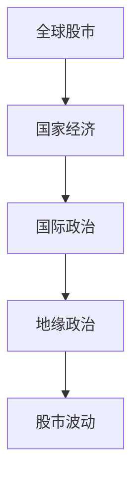
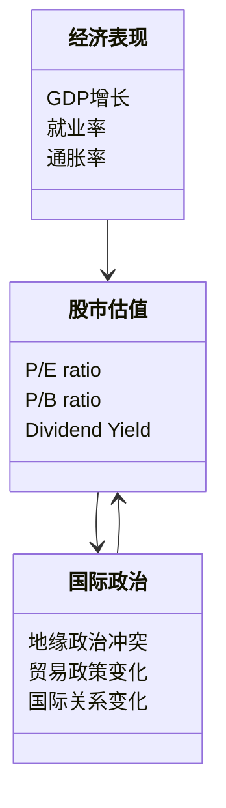
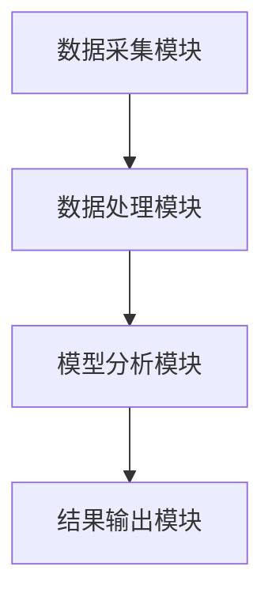
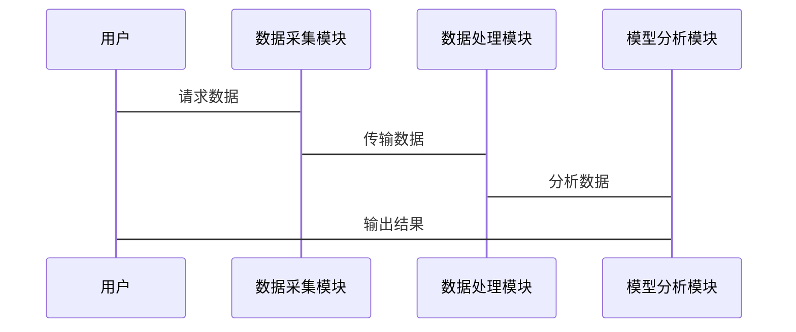

                 


# 全球股市估值与国际政治格局变化的互动

---

## 关键词：
- 全球股市估值
- 国际政治格局
- 互动机制
- 地缘政治冲突
- 贸易政策变化
- 经济表现
- 投资信心

---

## 摘要：
本文探讨了全球股市估值与国际政治格局之间的互动关系，分析了国际政治事件如何影响股市估值，以及股市波动如何反过来影响国际政治格局。通过系统分析和实证研究，揭示了两者之间的复杂互动机制，并提出了应对策略。

---

# 第一部分：全球股市估值与国际政治格局的互动概述

## 第1章：背景介绍

### 1.1 问题背景
#### 1.1.1 全球化经济与金融市场的深度融合
全球化使得各国经济高度依赖，股市成为反映经济状况的重要指标。国际政治格局的变化直接影响股市走势。

#### 1.1.2 国际政治格局的演变对经济的影响
地缘政治冲突、贸易政策变化、国际关系紧张等因素会引发市场波动，影响股市估值。

#### 1.1.3 股市估值与国际政治的相互作用机制
股市估值不仅是经济表现的晴雨表，也是国际政治力量博弈的结果。政治事件会影响市场情绪，而市场表现也会反过来影响政策制定者。

### 1.2 问题描述
#### 1.2.1 股市估值的核心要素
- 市盈率（P/E ratio）
- 市净率（P/B ratio）
- 股息率（Dividend Yield）

#### 1.2.2 国际政治格局的核心要素
- 地缘政治冲突
- 贸易政策变化
- 国际组织协调

#### 1.2.3 两者互动的复杂性与挑战
- 政治事件的突发性
- 市场情绪的不确定性
- 经济基本面与政治因素的交织

### 1.3 问题解决
#### 1.3.1 理解全球股市估值的变化规律
通过分析历史数据，识别股市波动的关键驱动因素。

#### 1.3.2 分析国际政治格局的变化趋势
研究地缘政治冲突、贸易政策变化等对股市的影响路径。

#### 1.3.3 探讨两者互动的机制与影响
构建模型，量化政治事件对股市估值的影响。

### 1.4 边界与外延
#### 1.4.1 全球股市的区域差异
不同国家和地区的股市对国际政治事件的反应存在差异。

#### 1.4.2 国际政治的多边与单边互动
多边合作与单边冲突对股市的影响机制不同。

#### 1.4.3 互动机制的长期与短期影响
短期市场情绪波动与长期经济基本面变化的交织。

### 1.5 核心概念与联系
#### 1.5.1 核心概念原理
- 股市估值反映经济与政治双重因素
- 国际政治事件触发市场反应
- 经济表现影响政治决策

#### 1.5.2 核心概念属性特征对比表格

| 属性 | 股市估值 | 国际政治格局 |
|------|---------|-------------|
| 核心驱动因素 | 经济基本面、市场情绪 | 地缘政治、政策变化 |
| 变化频率 | 短期波动为主 | 长期趋势为主 |
| 影响范围 | 全球化影响 | 区域性影响 |

#### 1.5.3 ER实体关系图架构


---

## 第2章：国际政治格局对全球股市估值的影响机制

### 2.1 地缘政治冲突的影响
#### 2.1.1 地缘政治冲突的定义
地缘政治冲突是指因领土、资源或战略利益引发的国家间冲突。

#### 2.1.2 地缘政治冲突对股市的影响路径
1. 市场情绪恶化：投资者恐慌导致抛售。
2. 货币政策变化：央行可能干预市场。
3. 经济预期下调：企业盈利预期下降。

#### 2.1.3 典型案例分析
- 2022年俄罗斯入侵乌克兰：能源价格飙升，全球股市下跌。

### 2.2 贸易政策变化的影响
#### 2.2.1 贸易政策变化的定义
贸易政策变化包括关税调整、贸易协定签署或取消。

#### 2.2.2 贸易政策变化对股市的影响机制
1. 进出口企业利润变化。
2. 供应链调整成本增加。
3. 市场预期波动。

#### 2.2.3 典型案例分析
- 2018年中美贸易战：导致全球股市波动加剧。

### 2.3 国际关系变化的影响
#### 2.3.1 国际关系变化的定义
国际关系变化指国家间关系的紧张或缓和。

#### 2.3.2 国际关系变化对股市的影响路径
1. 投资情绪受挫。
2. 货币汇率波动。
3. 地缘政治风险上升。

#### 2.3.3 典型案例分析
- 2020年中美关系紧张：导致科技股大幅波动。

---

## 第3章：全球股市估值对国际政治格局的影响机制

### 3.1 经济表现的影响
#### 3.1.1 经济表现的定义
经济表现包括GDP增长、就业率、通胀率等指标。

#### 3.1.2 经济表现对国际政治的影响机制
1. 经济衰退可能导致政治不稳定。
2. 经济强劲可能增强国家软实力。

#### 3.1.3 典型案例分析
- 2008年全球金融危机：导致多国政治动荡。

### 3.2 股市波动的影响
#### 3.2.1 股市波动的定义
股市波动指股市指数的短期剧烈波动。

#### 3.2.2 股市波动对国际政治的影响路径
1. 投资信心下降影响政策制定。
2. 市场恐慌引发政府干预。

#### 3.2.3 典型案例分析
- 2020年新冠疫情引发的股市崩盘：促使政府采取紧急措施。

### 3.3 投资信心的影响
#### 3.3.1 投资信心的定义
投资信心指投资者对市场未来表现的信念。

#### 3.3.2 投资信心对国际政治的影响机制
1. 投资者信心下降可能导致资本外流。
2. 政府可能采取措施稳定市场。

#### 3.3.3 典型案例分析
- 2016年英国脱欧公投：导致英镑暴跌，影响英国政治稳定性。

---

## 第4章：系统分析与架构设计方案

### 4.1 问题场景介绍
#### 4.1.1 全球股市估值波动的复杂性
股市波动受多重因素影响，包括经济、政治和技术因素。

#### 4.1.2 国际政治格局变化的不确定性
政治事件难以预测，但其对股市的影响可量化。

### 4.2 系统功能设计
#### 4.2.1 领域模型


#### 4.2.2 系统架构设计


### 4.3 系统接口设计
#### 4.3.1 数据接口
- 数据来源：全球主要股市指数、国际政治事件数据。
- 数据格式：CSV或JSON格式。

#### 4.3.2 分析接口
- 输入：政治事件与股市数据。
- 输出：影响程度分析报告。

### 4.4 系统交互设计


---

## 第5章：项目实战

### 5.1 环境安装
#### 5.1.1 安装Python
```bash
python --version
pip install numpy pandas matplotlib
```

#### 5.1.2 数据源
- 股市数据：Yahoo Finance API
- 政治事件数据：路透社或彭博社API

### 5.2 核心实现
#### 5.2.1 数据采集
```python
import pandas as pd
import requests

def get_stock_data(ticker):
    url = f"https://query1.finance.yahoo.com/...{ticker}"
    response = requests.get(url)
    data = response.json()
    df = pd.DataFrame(data['chart'])
    return df
```

#### 5.2.2 数据分析
```python
import numpy as np

def analyze_impact(stock_data, political_events):
    merged_data = pd.merge(stock_data, political_events, on='date')
    correlation_matrix = merged_data.corr()
    return correlation_matrix
```

#### 5.2.3 结果可视化
```python
import matplotlib.pyplot as plt

correlation_matrix = analyze_impact(stock_data, political_events)
plt.imshow(correlation_matrix)
plt.colorbar()
plt.title('Correlation Matrix')
plt.show()
```

### 5.3 实际案例分析
#### 5.3.1 中美贸易摩擦对股市的影响
- 数据来源：2018-2020年中美贸易数据与标普500指数。
- 分析结果：关税政策宣布导致股市短期下跌，但长期影响有限。

### 5.4 项目小结
- 技术实现：数据采集、清洗、分析与可视化。
- 案例分析：中美贸易摩擦对股市的影响机制。

---

## 第6章：总结与展望

### 6.1 互动机制总结
- 政治事件影响股市情绪。
- 经济表现影响政治决策。
- 两者互动具有双向性和复杂性。

### 6.2 研究局限性
- 数据来源的局限性。
- 模型的简化假设。
- 事件的不可预测性。

### 6.3 未来研究方向
- 更精细的事件分类。
- 更复杂的模型构建。
- 多维度的数据分析。

### 6.4 最佳实践 tips
- 数据采集要全面。
- 模型要结合实际。
- 结果要结合政策背景解读。

---

## 作者：AI天才研究院/AI Genius Institute & 禅与计算机程序设计艺术 /Zen And The Art of Computer Programming

--- 

感谢您的阅读！

