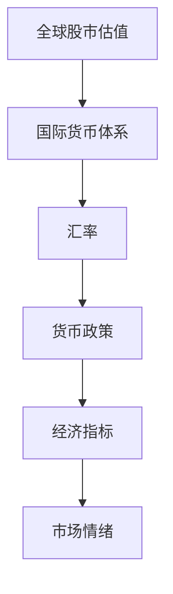

                 


```markdown
# 全球股市估值与国际货币体系演变的关系

> 关键词：全球股市估值，国际货币体系，汇率波动，货币政策，经济指标，股市分析

> 摘要：本文系统探讨全球股市估值与国际货币体系之间的复杂关系，分析股市估值的核心概念、影响因素以及国际货币体系的演变过程，揭示两者相互作用的机制和影响。通过构建数学模型和算法，本文深入解析了经济指标、货币政策和地缘政治等多重因素如何影响全球股市估值，同时探讨了汇率波动对股市估值的传导机制。文章最后结合实际案例，提出了构建全球股市估值分析系统的具体方法和注意事项，为投资者和研究者提供理论支持和实践指导。

---

## 第一章: 背景介绍

### 1.1 全球股市估值与国际货币体系的关系概述

#### 1.1.1 问题背景
全球股市估值是衡量市场健康状况的重要指标，而国际货币体系则是全球经济运行的基础框架。两者之间的关系错综复杂，尤其是在全球化背景下，汇率波动、货币政策和经济指标的变化对股市估值产生深远影响。

#### 1.1.2 问题描述
本文旨在探讨全球股市估值与国际货币体系之间的相互作用机制，分析影响股市估值的关键因素，揭示货币体系演变对股市估值的影响路径。

#### 1.1.3 问题解决
通过构建数学模型和算法，结合实际案例分析，本文提出了一种系统化的分析框架，帮助投资者和研究者更好地理解股市估值与货币体系之间的关系。

#### 1.1.4 边界与外延
本文的研究范围主要集中在主要经济体的股市估值和货币体系演变，不包括非主要经济体的特殊情况。同时，本文假设市场参与者理性决策，且不考虑黑天鹅事件。

#### 1.1.5 概念结构与核心要素组成



---

## 第二章: 全球股市估值的理论基础

### 2.1 全球股市估值的基本概念

#### 2.1.1 股市估值的定义
股市估值是通过对上市公司财务数据的分析，评估其股票的内在价值。常见的估值方法包括市盈率（P/E）、市净率（P/B）等。

#### 2.1.2 股市估值的主要方法
- 市盈率：$P/E = \frac{\text{股价}}{\text{每股收益}}$
- 市净率：$P/B = \frac{\text{股价}}{\text{每股净资产}}$
- 股息率：$\text{股息率} = \frac{\text{每股股息}}{\text{股价}} \times 100\%$

#### 2.1.3 股市估值的影响因素
- 经济指标：GDP、CPI、失业率等
- 公司财务数据：收入、利润、负债
- 市场情绪：投资者信心、市场流动性

---

## 第三章: 国际货币体系的演变

### 3.1 布雷顿森林体系

#### 3.1.1 布雷顿森林体系的建立
1944年布雷顿森林会议确立了美元与黄金挂钩的固定汇率制度。

#### 3.1.2 布雷顿森林体系的崩溃
1971年，美国宣布美元与黄金脱钩，布雷顿森林体系瓦解。

#### 3.1.3 布雷顿森林体系的历史影响
- 确立了美元的国际货币地位
- 为后续货币体系的演变奠定了基础

### 3.2 牙买加体系与浮动汇率制度

#### 3.2.1 牙买加体系的建立
1976年牙买加会议确立了浮动汇率制度的合法化。

#### 3.2.2 浮动汇率制度的特点
- 汇率由市场供求决定
- 各国货币政策相对独立

#### 3.2.3 浮动汇率制度的优缺点
- 优点：灵活性强，能够适应经济变化
- 缺点：汇率波动剧烈，容易引发货币危机

### 3.3 当前国际货币体系的现状

#### 3.3.1 主要货币的国际地位
- 美元：全球主要储备货币
- 欧元：第二大国际货币
- 日元：重要贸易货币

#### 3.3.2 汇率波动对股市估值的影响
- 汇率波动直接影响出口企业的盈利能力和股价
- 汇率波动通过影响外资流动间接影响股市估值

#### 3.3.3 国际货币体系的未来发展趋势
- 多极化趋势明显
- 数字货币可能改变现有货币体系

---

## 第四章: 股市估值与国际货币体系的相互作用

### 4.1 股市估值与国际货币体系的相互影响

#### 4.1.1 货币政策对股市估值的影响
- 宽松货币政策：降低借贷成本，刺激投资
- 紧缩货币政策：抑制通胀，可能抑制股市估值

#### 4.1.2 汇率波动对股市估值的影响
- 本币贬值：出口企业受益，股价上升
- 本币升值：进口企业受益，股价可能下降

### 4.2 股市估值与国际货币体系的传导机制

#### 4.2.1 经济指标的传导路径
1. 经济指标变化 → 货币政策调整
2. 货币政策调整 → 汇率变动
3. 汇率变动 → 股市估值变化

#### 4.2.2 案例分析
- 美联储加息对美股和新兴市场的影响
- 欧洲央行降息对欧元区股市的影响

---

## 第五章: 全球股市估值与国际货币体系演变的影响因素

### 5.1 经济指标的影响

#### 5.1.1 GDP与股市估值
GDP增长通常伴随着企业盈利增长，进而推动股市估值上升。

#### 5.1.2 CPI与股市估值
通货膨胀率上升可能导致货币政策收紧，从而抑制股市估值。

### 5.2 货币政策的影响

#### 5.2.1 利率政策
- 利率下降：降低企业融资成本，利好股市
- 利率上升：增加企业融资成本，可能抑制股市

### 5.3 地缘政治的影响

#### 5.3.1 地缘政治风险对股市估值的影响
地缘政治风险可能导致投资者避险情绪上升，资金流向避险资产，抑制股市估值。

---

## 第六章: 全球股市估值与国际货币体系的系统分析

### 6.1 系统分析与架构设计

#### 6.1.1 领域模型


#### 6.1.2 系统架构


---

## 第七章: 项目实战

### 7.1 构建全球股市估值分析系统

#### 7.1.1 环境安装
- 数据库：MySQL
- 编程语言：Python
- 库：pandas, numpy, matplotlib

#### 7.1.2 核心代码实现
```python
import pandas as pd
import numpy as np

def calculate_pe_ratio(df):
    df['P/E'] = df['股价'] / df['每股收益']
    return df

# 示例数据
data = {
    '股价': [100, 200, 300],
    '每股收益': [10, 20, 30]
}
df = pd.DataFrame(data)
calculate_pe_ratio(df)
print(df)
```

#### 7.1.3 案例分析
以美国纳斯达克指数为例，分析货币政策变化对股市估值的影响。

---

## 第八章: 总结与展望

### 8.1 最佳实践 tips
- 定期更新数据，保持模型准确性
- 结合多种指标进行综合分析

### 8.2 小结
本文系统探讨了全球股市估值与国际货币体系之间的关系，揭示了两者相互作用的机制和影响因素。

### 8.3 注意事项
- 数据来源的可靠性
- 模型的适用性
- 风险提示

### 8.4 拓展阅读
- 国际货币基金组织（IMF）的报告
- 《货币战争》等书籍

---

作者：AI天才研究院/AI Genius Institute & 禅与计算机程序设计艺术 /Zen And The Art of Computer Programming
```

