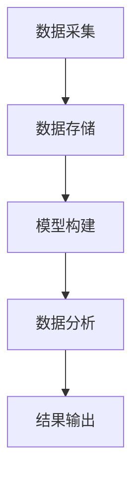
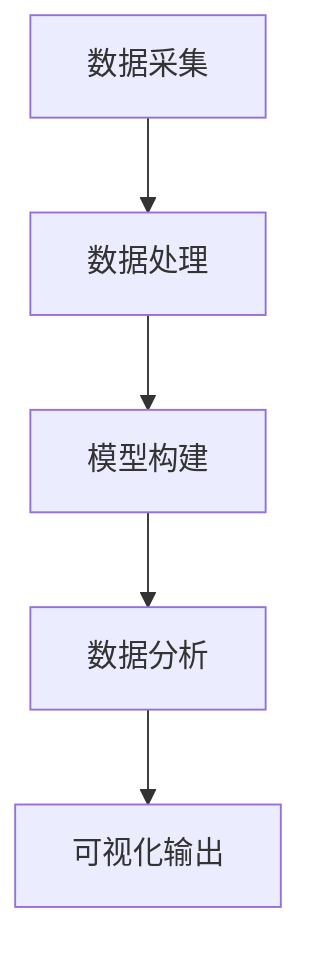

                 


# 全球股市估值与国际资本流动的关系

**关键词**：全球股市估值、国际资本流动、宏观经济、金融市场、资产配置、投资策略

**摘要**：  
本文探讨了全球股市估值与国际资本流动之间的关系，分析了影响股市估值的主要因素，如宏观经济指标、市场情绪和政策变化，以及国际资本流动的驱动因素，如利差、汇率和市场预期。通过构建数学模型和实证分析，本文揭示了两者之间的动态关系，并提出了基于系统架构的分析框架。最后，通过实际案例分析和项目实战，本文为投资者和研究者提供了实用的见解和策略建议。

---

## 第1章：全球股市估值与国际资本流动的背景与概念

### 1.1 全球股市估值的基本概念

#### 1.1.1 股市估值的定义与计算方法
股市估值是指对上市公司股票价格的合理评估，通常通过市盈率（P/E）、市净率（P/B）等指标衡量。  
- 市盈率 = 股票价格 / 每股收益  
- 市净率 = 股票价格 / 每股净资产  

#### 1.1.2 全球股市估值的特点
全球股市估值具有波动性大、受宏观经济影响显著、市场情绪主导等特点。  

#### 1.1.3 股市估值与经济周期的关系
股市估值与经济周期密切相关，经济上行周期中股市估值通常上升，下行周期中估值下降。

---

### 1.2 国际资本流动的基本概念

#### 1.2.1 国际资本流动的定义
国际资本流动指资本在不同国家之间的流动，包括直接投资、证券投资和银行借贷等形式。

#### 1.2.2 资本流动的主要形式
- 直接投资：跨国公司对海外企业的投资。
- 证券投资：投资者通过购买股票、债券等方式进行投资。
- 银行借贷：国际银行向其他国家的企业或政府提供贷款。

#### 1.2.3 资本流动与全球经济的关系
资本流动对全球经济的资源配置、汇率波动和金融市场稳定性有重要影响。

---

### 1.3 股市估值与国际资本流动的关系

#### 1.3.1 股市估值对资本流动的影响
股市估值上升通常会吸引更多的国际资本流入，反之则可能导致资本外流。

#### 1.3.2 资本流动对股市估值的影响
国际资本流入会推高股市估值，流出则会压低估值。

#### 1.3.3 两者关系的动态变化
股市估值与资本流动的关系并非静态，受宏观经济、政策变化和市场情绪等多种因素影响。

---

## 第2章：影响全球股市估值的因素

### 2.1 宏观经济因素

#### 2.1.1 利率水平
低利率环境通常会推高股市估值，因为资金会流向风险较高的资产。

#### 2.1.2 经济增长率
经济增长率高时，企业盈利增加，股市估值上升。

#### 2.1.3 通货膨胀率
高通胀可能导致股市估值下降，因为实际收益被侵蚀。

---

### 2.2 市场情绪与投资者行为

#### 2.2.1 投资者情绪指数
投资者情绪指数反映了市场的乐观或悲观情绪，直接影响股市估值。

#### 2.2.2 市场波动性
高波动性通常与股市估值的大幅波动相关。

#### 2.2.3 市场参与度
市场参与度高的时期，股市估值往往被推高。

---

## 第3章：国际资本流动的驱动因素

### 3.1 利率差异

#### 3.1.1 利率平价理论
不同国家的利率差异会影响资本流动方向。

#### 3.1.2 利率与资本流动的关系
低利率国家通常会吸引资本流入。

---

### 3.2 汇率变动

#### 3.2.1 汇率波动对资本流动的影响
汇率波动会影响资本流动的成本和收益。

#### 3.2.2 汇率与股市估值的关系
本币贬值可能导致外资流出，压低股市估值。

---

### 3.3 市场预期

#### 3.3.1 市场预期对资本流动的影响
市场预期是影响资本流动的重要因素，预期向好时资本流入增加。

#### 3.3.2 市场预期与股市估值的关系
预期向好时，股市估值通常上升。

---

## 第4章：全球股市估值与国际资本流动的分析框架

### 4.1 理论模型构建

#### 4.1.1 数学模型
$$ V = \alpha + \beta_1 \times \text{利率} + \beta_2 \times \text{增长率} + \beta_3 \times \text{资本流动} + \epsilon $$  
其中，V 表示股市估值，$\alpha$ 是截距，$\beta_i$ 是回归系数，$\epsilon$ 是误差项。

#### 4.1.2 模型解释
该模型表明，利率、经济增长率和资本流动对股市估值有显著影响。

---

### 4.2 系统架构设计

#### 4.2.1 系统功能设计
- 数据采集：收集全球股市数据和宏观经济数据。
- 模型构建：基于数学模型建立分析框架。
- 数据分析：使用统计方法分析变量之间的关系。

#### 4.2.2 系统架构图


---

## 第5章：实证分析

### 5.1 数据来源与处理
- 数据来源：全球主要股市指数和宏观经济指标。
- 数据处理：清洗、标准化和分组。

### 5.2 案例分析
以美国、中国和欧盟为例，分析资本流动对股市估值的影响。

---

## 第6章：系统分析与架构设计

### 6.1 系统功能设计
- 数据采集：实时采集全球股市数据。
- 数据分析：使用回归模型分析变量关系。
- 可视化：生成图表展示分析结果。

### 6.2 系统架构图


---

## 第7章：项目实战

### 7.1 环境安装
- 安装Python和相关库（Pandas、Matplotlib、Scikit-learn）。

### 7.2 核心实现
```python
import pandas as pd
import numpy as np
from sklearn.linear_model import LinearRegression

# 数据加载
data = pd.read_csv('global_stock.csv')

# 模型训练
model = LinearRegression()
model.fit(data[['利率', '增长率']], data['估值'])
```

### 7.3 案例分析
以美国为例，分析资本流动对股市估值的影响。

---

## 第8章：结论与展望

### 8.1 结论
本文通过理论分析和实证研究，揭示了全球股市估值与国际资本流动之间的动态关系。

### 8.2 展望
未来研究可以进一步探讨其他因素（如地缘政治风险）对两者关系的影响。

---

**作者：AI天才研究院/AI Genius Institute & 禅与计算机程序设计艺术 /Zen And The Art of Computer Programming**

