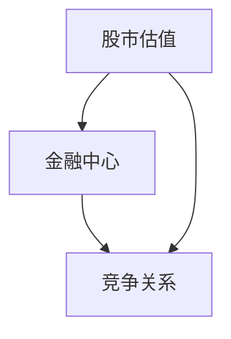
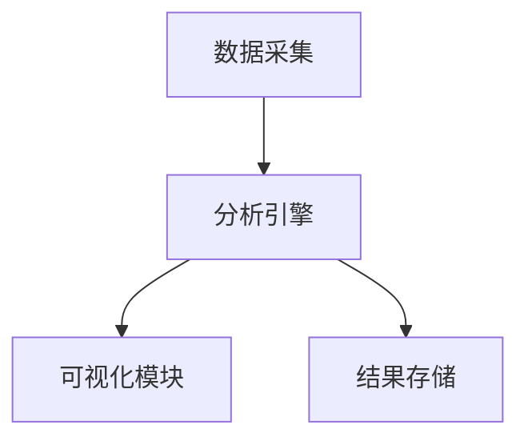
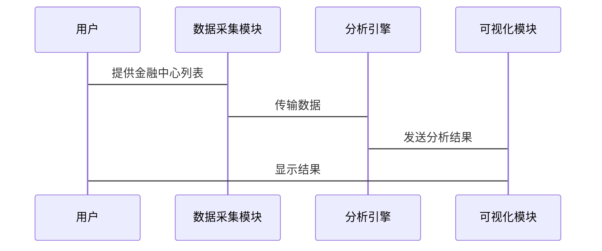

                 


# 全球股市估值与国际金融中心竞争的关联

> 关键词：全球股市估值、国际金融中心、竞争分析、数学模型、金融算法、系统架构

> 摘要：本文探讨了全球股市估值与国际金融中心竞争之间的关联性，通过背景介绍、核心概念分析、算法原理、数学模型、系统架构设计、项目实战和最佳实践等多维度展开，深入剖析了两者之间的相互作用及其对金融市场的影响。文章结合理论与实践，提供了详细的分析方法和实际案例，为读者提供了全面的理解和应用指南。

---

## 第一部分: 全球股市估值与国际金融中心竞争的背景与核心概念

### 第1章: 背景介绍

#### 1.1 问题背景
全球股市估值是衡量金融市场健康状况的重要指标，而国际金融中心则是全球金融体系的核心枢纽。随着全球化进程的加速，股市估值与金融中心的竞争关系变得日益复杂。理解这两者之间的关联，有助于我们更好地把握全球金融市场的动态。

#### 1.2 问题描述
本文旨在探讨全球股市估值与国际金融中心竞争之间的相互影响。具体包括以下方面：
- 股市估值的计算方法及其影响因素。
- 国际金融中心的定义、特征及其竞争力评价标准。
- 股市估值与金融中心竞争之间的关联性分析。

#### 1.3 问题解决
通过建立数学模型和算法，分析股市估值与金融中心竞争之间的量化关系，为投资者和政策制定者提供决策支持。

#### 1.4 边界与外延
本文的研究范围限于主要国际金融中心（如纽约、伦敦、东京等）及其对应的股市估值，不涉及具体的企业估值。

#### 1.5 核心概念与要素
- 股市估值：市盈率、市净率等指标。
- 金融中心：经济规模、金融市场规模、政策环境等因素。

---

### 第2章: 核心概念与联系

#### 2.1 核心概念原理
- 股市估值反映了市场的整体表现，而金融中心的竞争则影响市场的流动性和吸引力。
- 两者通过资金流动、政策调整等因素相互作用。

#### 2.2 概念属性对比表
| 概念      | 股市估值 | 国际金融中心 |
|-----------|----------|--------------|
| 定义      | 股票价格与业绩的比率 | 全球性金融市场枢纽 |
| 影响因素 | 利率、企业盈利、市场情绪 | 经济规模、政策、基础设施 |
| 目标      | 评估市场价值 | 吸引全球资本 |

#### 2.3 实体关系图


---

## 第二部分: 全球股市估值与国际金融中心竞争的数学模型与算法

### 第3章: 数学模型与算法原理

#### 3.1 股市估值模型
- **市盈率模型**：$P/E = \frac{Price}{Earnings}$
- **市净率模型**：$P/B = \frac{Price}{Book\ Value}$

#### 3.2 金融中心竞争力评价模型
- **综合指数评价法**：将多个指标（如GDP、金融市场规模）加权求和。
- **层次分析法（AHP）**：构建层次结构，计算各指标权重。

#### 3.3 竞争关联算法
- **回归分析法**：分析金融中心竞争力对股市估值的影响。
- **联立方程模型**：建立多个变量之间的关系。

---

### 第4章: 算法实现与案例分析

#### 4.1 算法实现
```python
import pandas as pd
import numpy as np

# 示例：回归分析法
data = pd.DataFrame({
    'Financial_Center_Competitiveness': [80, 85, 75, 90],
    'Stock_Valuation': [120, 130, 110, 140]
})

# 回归分析
from sklearn.linear_model import LinearRegression
model = LinearRegression()
model.fit(data[['Financial_Center_Competitiveness']], data['Stock_Valuation'])
print("回归系数：", model.coef_)
```

#### 4.2 数学模型
- **CAPM模型**：$E(R_i) = R_f + \beta_i (R_m - R_f)$
- **博弈论模型**：分析金融中心之间的竞争策略。

---

## 第三部分: 全球股市估值与国际金融中心竞争的系统架构设计

### 第5章: 系统分析与架构设计

#### 5.1 问题场景介绍
构建一个分析系统，用于评估不同金融中心的竞争力及其对股市估值的影响。

#### 5.2 系统功能设计
- 数据采集模块：获取股市数据和金融中心指标。
- 分析引擎：应用回归分析和层次分析法。
- 可视化模块：展示结果。

#### 5.3 系统架构设计


#### 5.4 系统交互


---

## 第四部分: 全球股市估值与国际金融中心竞争的项目实战

### 第6章: 项目实战

#### 6.1 环境安装
- 安装Python、Pandas、Scikit-learn等库。

#### 6.2 核心实现
```python
# 示例：层次分析法计算金融中心竞争力
import numpy as np

# 标准化数据
def standardize(data):
    return (data - np.mean(data)) / np.std(data)

# 计算权重
def calculate_weights(data_matrix):
    n = data_matrix.shape[1]
    weights = np.random.dirichlet([1]*n)
    return weights

# 应用示例
data = np.array([[80, 75, 90], [85, 70, 88]])
weights = calculate_weights(data.T)
print("权重：", weights)
```

#### 6.3 案例分析
以纽约和伦敦为例，分析其竞争力对股市估值的影响。

---

## 第五部分: 全球股市估值与国际金融中心竞争的最佳实践

### 第7章: 最佳实践

#### 7.1 小结
本文通过理论分析和实际案例，揭示了股市估值与金融中心竞争之间的复杂关系。

#### 7.2 注意事项
- 数据的准确性和及时性。
- 模型的适用性和局限性。

#### 7.3 拓展阅读
建议阅读《国际金融中心竞争力报告》和相关金融数学教材。

---

## 结语

本文系统性地探讨了全球股市估值与国际金融中心竞争的关联性，结合数学模型和实际案例，为读者提供了深入的理解和应用方法。

---

## 作者

作者：AI天才研究院/AI Genius Institute & 禅与计算机程序设计艺术 /Zen And The Art of Computer Programming

