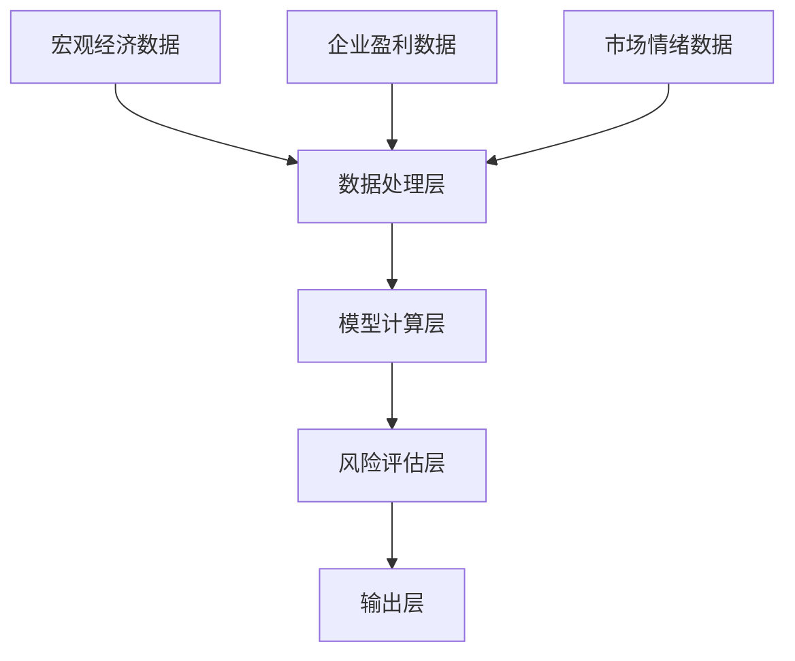
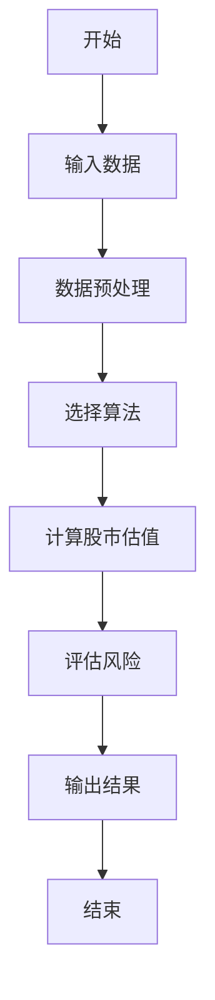

                 


# 全球股市估值与国际金融体系改革的互动

> 关键词：全球股市估值、国际金融体系、金融改革、股市波动、系统性风险

> 摘要：本文探讨了全球股市估值与国际金融体系改革之间的互动关系，分析了股市估值波动对金融体系稳定性的影响，以及金融体系改革对股市估值的反馈作用。通过系统性风险的形成机制、改革路径的分析，结合实际案例，提出了未来金融体系改革的方向和策略。

---

## 第一部分：全球股市估值与国际金融体系改革的背景与核心概念

### 第1章：全球股市估值的现状与挑战

#### 1.1 股市估值的基本概念

股市估值是衡量企业价值的重要指标，通常通过市盈率（P/E）、市净率（P/B）等指标来评估。股市估值的波动性受到宏观经济、企业盈利、市场情绪等多种因素的影响。本文将从这些核心因素入手，分析股市估值的形成机制及其与国际金融体系改革的互动关系。

- **1.1.1 股市估值的基本概念**
  - 股市估值是投资者对上市公司未来盈利能力的预期，反映了市场对企业的价值判断。
  - 核心指标包括市盈率、市净率、股息率等，这些指标帮助投资者评估企业的投资价值。

- **1.1.2 全球股市估值的多样性与差异性**
  - 不同国家和地区的股市估值受本地经济、政策、文化等因素影响，表现出显著差异。
  - 例如，新兴市场通常市盈率较高，而成熟市场更注重市净率等指标。

- **1.1.3 股市估值的核心驱动因素**
  - 宏观经济环境：GDP增长、利率水平、通货膨胀等。
  - 企业盈利：净利润、营业收入、利润率等。
  - 市场情绪：投资者信心、市场流动性、新闻事件等。

#### 1.2 国际金融体系的结构与功能

国际金融体系是全球经济运行的重要支柱，包括银行、证券交易所、中央银行等机构。其功能包括资金融通、风险管理、价格发现等。本文将分析国际金融体系的结构及其对股市估值的影响。

- **1.2.1 国际金融体系的组成与层次**
  - 上层机构：国际货币基金组织（IMF）、世界银行、国际清算银行（BIS）。
  - 中间机构：各国中央银行、商业银行、证券交易所。
  - 基础机构：企业和个人投资者。

- **1.2.2 主要国际金融机构的角色与功能**
  - 中央银行：货币政策制定、维护金融稳定。
  - 证券交易所：提供股票交易和融资平台。
  - 投资银行：帮助企业融资、并购重组。

- **1.2.3 全球金融市场一体化的现状与趋势**
  - 金融全球化使得各国市场相互关联，股市波动可以迅速传导至全球。
  - 例如，2008年金融危机中，美国次贷危机引发了全球股市的剧烈波动。

#### 1.3 全球股市估值与国际金融体系改革的互动背景

- **1.3.1 当前全球经济环境的复杂性**
  - 经济全球化带来市场高度关联，同时也加剧了系统性风险。
  - 例如，2020年新冠疫情对全球股市造成了巨大冲击，凸显了金融体系改革的迫切性。

- **1.3.2 股市估值与金融体系改革的关联性**
  - 股市估值的波动性影响金融体系的稳定性，反过来，金融体系的改革又会影响股市估值。
  - 例如，监管政策的放松或收紧直接影响股市估值。

- **1.3.3 问题背景与研究意义**
  - 当前金融体系存在系统性风险，需要通过改革来降低风险。
  - 股市估值与金融体系改革的互动关系是理解这一过程的关键。

---

### 第2章：全球股市估值与国际金融体系改革的核心机制

#### 2.1 全球股市估值的形成机制

- **2.1.1 股市估值的主要影响因素**
  - 宏观经济因素：GDP增长率、利率水平、通货膨胀率。
  - 企业基本面：盈利能力、成长性、财务状况。
  - 市场情绪：投资者信心、市场流动性、新闻事件。

- **2.1.2 股市估值的动态调整过程**
  - 股价反映市场对企业的预期，随着信息的变化不断调整。
  - 例如，某公司发布优异的财报，市场预期向好，股价上升。

- **2.1.3 不同市场环境下的估值差异**
  - 成熟市场：投资者理性，估值较为稳定。
  - 新兴市场：投资者情绪化，估值波动较大。

#### 2.2 国际金融体系改革的关键领域

- **2.2.1 金融监管框架的优化**
  - 加强对金融机构的监管，防止系统性风险。
  - 例如，2008年后，巴塞尔协议III要求银行提高资本充足率。

- **2.2.2 金融市场基础设施的完善**
  - 建立健全的清算、结算系统，提高市场效率。
  - 例如，高频交易需要高效的交易系统支持。

- **2.2.3 金融创新与风险防控的平衡**
  - 金融创新提高了市场效率，但也带来了新的风险。
  - 例如，衍生品的过度使用导致2008年金融危机。

#### 2.3 股市估值与金融体系改革的互动关系

- **2.3.1 股市估值对金融体系改革的反馈作用**
  - 股市波动对金融机构的稳定性产生影响，迫使监管机构采取措施。
  - 例如，2008年金融危机后，各国加强了对银行资本的监管。

- **2.3.2 金融体系改革对股市估值的影响路径**
  - 改革措施直接影响市场参与者的信心和行为，从而影响股市估值。
  - 例如，放松监管可能短期提升市场情绪，但长期可能增加风险。

- **2.3.3 互动机制的系统性分析**
  - 股市估值与金融体系改革之间存在双向反馈机制。
  - 改革措施调整市场结构，影响股市估值；股市估值的变化又推动改革的深化。

---

## 第二部分：全球股市估值与国际金融体系改革的互动机制

### 第3章：股市估值与金融体系改革的相互影响

#### 3.1 股市波动对金融体系稳定性的冲击

- **3.1.1 股市泡沫与金融危机的典型案例**
  - 2000年互联网泡沫：纳斯达克指数从高点下跌超过80%。
  - 2008年金融危机：次贷危机引发股市大幅下跌。

- **3.1.2 股市波动对金融机构的影响**
  - 银行、保险公司等金融机构持有大量股票资产，股市波动直接影响其资本状况。
  - 例如，2020年新冠疫情导致的股市崩盘，许多银行的资本充足率下降。

- **3.1.3 股市波动对货币政策传导机制的干扰**
  - 股市波动影响企业投资和消费行为，进而影响整体经济。
  - 中央银行在制定货币政策时需要考虑股市波动的影响。

#### 3.2 金融体系改革对股市估值的影响

- **3.2.1 监管政策对股市估值的直接影响**
  - 监管放松可能短期内提升市场情绪，推动股价上涨。
  - 监管加强可能抑制市场过度波动，长期有利于股市稳定。

- **3.2.2 金融市场基础设施对股市估值的支持**
  - 高效的交易系统减少市场摩擦，促进价格发现。
  - 例如，高频交易技术提高了市场的流动性，有助于稳定股价。

- **3.2.3 金融创新对股市估值的双重影响**
  - 创新工具如ETF、期权等为投资者提供更多选择，可能提升市场活跃度。
  - 过度创新可能导致市场泡沫，增加系统性风险。

#### 3.3 互动机制的系统性分析

- **3.3.1 系统性风险的形成机制**
  - 单一市场的波动可能通过全球化传播至全球，形成系统性风险。
  - 例如，2008年金融危机中，美国次贷危机通过金融衍生品影响全球股市。

- **3.3.2 改革措施对系统性风险的缓解**
  - 加强监管、提高透明度、建立防火墙等措施有助于降低系统性风险。
  - 例如，巴塞尔协议III要求银行提高资本充足率，降低杠杆率。

---

### 第4章：系统性风险与金融体系改革路径

#### 4.1 系统性风险的形成机制

- **4.1.1 金融体系的相互关联性**
  - 各国金融市场高度关联，风险在市场间传播迅速。
  - 例如，新兴市场股市下跌可能影响全球投资者信心。

- **4.1.2 系统性风险的传导路径**
  - 从单个金融机构到整个金融体系的连锁反应。
  - 例如，一家银行的破产可能引发连锁反应，导致整个金融体系崩溃。

- **4.1.3 系统性风险的预警与防范**
  - 监测市场波动、识别系统重要性金融机构、建立早期预警机制。
  - 例如，国际清算银行（BIS）定期发布全球金融稳定性报告。

#### 4.2 改革路径与政策建议

- **4.2.1 优化金融监管框架**
  - 加强对系统重要性金融机构的监管，防止“太大而不能倒”的问题。
  - 例如，对全球系统重要性银行（G-SIBs）实施更高的资本要求。

- **4.2.2 完善金融市场基础设施**
  - 建立统一的清算和结算系统，提高市场效率和安全性。
  - 例如，中国的沪深交易所引入了集中清算系统，降低结算风险。

- **4.2.3 推动金融创新与风险管理**
  - 鼓励有益的金融创新，同时加强对创新工具的监管。
  - 例如，监管机构对加密货币实施严格的监管措施，防范金融风险。

#### 4.3 实施中的挑战与对策

- **4.3.1 改革的协调性问题**
  - 全球性问题需要国际合作，但各国利益不同，协调困难。
  - 例如，国际金融监管协调需要各国央行和监管机构的共同努力。

- **4.3.2 市场参与者行为的复杂性**
  - 市场参与者的行为可能抵消监管措施的效果。
  - 例如，某些机构可能通过复杂的金融工具绕开监管，增加系统性风险。

- **4.3.3 改革效果的不确定性**
  - 改革措施的效果需要经过时间检验，存在一定的不确定性。
  - 例如，监管放松可能短期内提升市场活跃度，但长期可能导致风险积累。

---

## 第三部分：案例分析与未来趋势

### 第5章：典型案例分析

#### 5.1 2008年金融危机的启示

- **5.1.1 金融危机对全球股市的影响**
  - 美国次贷危机引发全球股市大幅下跌，许多金融机构破产或被接管。
  - 例如，雷曼兄弟破产导致全球金融市场陷入混乱。

- **5.1.2 金融危机对金融体系改革的推动**
  - 推动了巴塞尔协议III的制定和实施，加强了对银行资本的监管。
  - 例如，各国央行提高了对系统重要性银行的资本要求。

#### 5.2 新兴市场与发展中国家的案例

- **5.2.1 新兴市场股市波动的特点**
  - 新兴市场股市波动较大，容易受到外部冲击。
  - 例如，2018年中美贸易摩擦导致新兴市场股市大幅下跌。

- **5.2.2 金融危机对新兴市场的影响**
  - 新兴市场容易受到全球金融危机的冲击，导致股市大幅波动。
  - 例如，2008年金融危机期间，许多新兴市场国家的股市跌幅超过50%。

#### 5.3 机构投资者行为分析

- **5.3.1 机构投资者在股市中的作用**
  - 机构投资者是股市的重要参与者，其行为影响股市估值。
  - 例如，机构投资者的集中抛售可能导致股市大幅下跌。

- **5.3.2 机构投资者与系统性风险**
  - 机构投资者的集中交易可能导致市场流动性风险。
  - 例如，高频交易算法可能导致市场的“闪电崩盘”。

### 第6章：未来趋势

#### 6.1 全球化与金融监管的挑战

- **6.1.1 全球化带来的机遇与挑战**
  - 全球化促进了市场的互联互通，但也增加了系统性风险。
  - 例如，跨国公司的倒闭可能引发全球连锁反应。

- **6.1.2 金融监管的国际合作与协调**
  - 需要建立全球性的监管框架，协调各国监管政策。
  - 例如，国际金融监管协调需要各国央行和监管机构的合作。

#### 6.2 数字化与金融创新的影响

- **6.2.1 数字技术对金融体系的改变**
  - 数字技术（如区块链、人工智能）改变了金融交易和监管方式。
  - 例如，区块链技术可以提高金融交易的透明度和安全性。

- **6.2.2 金融创新的机遇与风险**
  - 创新工具如加密货币、智能合约等带来新的投资机会。
  - 但同时也可能引发新的系统性风险，例如加密货币的波动性较大。

#### 6.3 投资者行为变化与市场趋势

- **6.3.1 投资者行为的演变**
  - 投资者更加注重长期价值，社会责任投资（ESG）逐渐兴起。
  - 例如，越来越多的投资者关注企业的环境和社会责任表现。

- **6.3.2 市场趋势与投资策略**
  - 全球股市估值的变化将影响投资者的资产配置策略。
  - 例如，投资者可能增加对新兴市场的配置，以分散风险。

---

## 第四部分：系统性分析与架构设计

### 第7章：系统模型构建

#### 7.1 系统架构设计

- **7.1.1 系统组件**
  - 输入：宏观经济数据、企业盈利数据、市场情绪数据。
  - 处理层：数据处理、模型计算、风险评估。
  - 输出：股市估值预测、风险预警。

- **7.1.2 系统功能**
  - 数据采集与处理：收集和清洗相关数据。
  - 模型构建：基于机器学习或统计模型预测股市估值。
  - 风险评估：评估系统性风险并提出应对措施。

#### 7.2 机制分析

- **7.2.1 数据流分析**
  - 数据从输入层进入系统，经过处理层计算，最终输出结果。
  - 例如，宏观经济数据输入后，模型计算出股市估值预测。

- **7.2.2 互动机制**
  - 系统通过模型模拟股市估值与金融体系改革的互动关系。
  - 例如，模型可以模拟监管放松对股市估值的影响。

#### 7.3 实证分析与案例模拟

- **7.3.1 实证分析方法**
  - 使用历史数据验证模型的有效性。
  - 例如，使用2008年金融危机的数据验证模型的预测能力。

- **7.3.2 案例模拟**
  - 模拟不同改革措施对股市估值的影响。
  - 例如，模拟监管加强对股市波动的影响。

### 第8章：系统架构设计与算法实现

#### 8.1 系统架构图



#### 8.2 算法流程图



#### 8.3 核心算法代码实现

```python
import numpy as np
import pandas as pd
from sklearn.linear_model import LinearRegression

# 示例数据
data = {
    'GDP增长率': [2.5, 3.1, 2.8, 3.2, 2.9],
    '企业盈利': [100, 120, 110, 130, 125],
    '市场情绪': [70, 65, 75, 60, 80]
}

df = pd.DataFrame(data)

# 定义目标变量和特征变量
target = df['股市估值']
features = df[['GDP增长率', '企业盈利', '市场情绪']]

# 建立线性回归模型
model = LinearRegression()
model.fit(features, target)

# 预测股市估值
predicted = model.predict(features)

# 输出结果
print("预测的股市估值:", predicted)
print("模型系数:", model.coef_)
print("模型截距:", model.intercept_)
```

---

## 第五部分：结论与展望

### 第9章：总结与建议

#### 9.1 研究总结

- 全球股市估值与国际金融体系改革之间存在复杂的互动关系。
- 系统性风险的形成机制需要通过深化改革和加强监管来应对。
- 未来，随着数字化和全球化的深入，金融体系改革将面临新的挑战和机遇。

#### 9.2 政策建议与投资策略

- **政策建议**
  - 加强国际合作，推动全球金融监管协调。
  - 优化金融监管框架，提高透明度和风险管理能力。
  - 推动金融创新，同时加强监管和风险防控。

- **投资策略**
  - 投资者应关注系统性风险，分散投资以降低风险。
  - 长期投资者应关注企业的基本面和可持续发展能力。

#### 9.3 未来研究方向

- **未来研究方向**
  - 研究数字化技术对金融体系的影响，探索新技术在金融监管中的应用。
  - 探讨全球经济不确定性对股市估值的影响机制。
  - 分析不同市场环境下金融体系改革的路径和效果。

---

## 结语

全球股市估值与国际金融体系改革的互动是一个复杂而重要的议题。通过本文的分析，我们不仅了解了股市估值与金融体系改革的基本概念和互动机制，还探讨了系统性风险的形成机制和应对策略。未来，随着全球经济的不断发展和变化，金融体系改革将面临新的挑战和机遇，需要我们持续关注和研究。

---

**作者：AI天才研究院/AI Genius Institute & 禅与计算机程序设计艺术 /Zen And The Art of Computer Programming**

