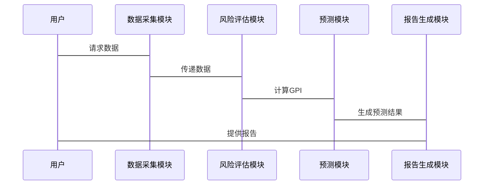

                 


```markdown
# 全球股市估值与地缘政治风险的关系

## 关键词：地缘政治风险、股市估值、影响机制、量化分析、系统架构、项目实战

## 摘要：  
本文探讨了全球股市估值与地缘政治风险之间的关系，分析了地缘政治风险如何影响股市估值，包括影响机制、数学模型构建、系统架构设计以及实际案例分析。通过量化分析和系统设计，本文为投资者和研究者提供了应对地缘政治风险的有效策略。

## 第一部分：背景介绍

### 第1章：问题背景与研究意义
#### 1.1 问题背景
- 1.1.1 全球化经济与股市估值的重要性  
  股市估值是衡量经济发展的重要指标，反映了企业的盈利能力、市场预期和经济状况。随着全球化的发展，股市的波动性受到多种因素的影响，包括地缘政治风险。

- 1.1.2 地缘政治风险的定义与特征  
  地缘政治风险是指因国家间的政治、经济和军事冲突而产生的风险，包括战争、贸易摩擦、政策变化等。这些风险往往会导致市场不确定性增加，进而影响股市估值。

- 1.1.3 地缘政治风险对股市估值的影响  
  地缘政治风险通过多种渠道影响股市，如供应链中断、投资信心下降和政策不确定性增加等，从而导致股市估值的波动。

#### 1.2 问题描述
- 1.2.1 地缘政治风险如何影响股市估值  
  地缘政治风险可能导致市场恐慌，投资者抛售资产，从而引发股市估值的下降。

- 1.2.2 地缘政治风险的分类与表现形式  
  地缘政治风险可以分为直接风险和间接风险。直接风险包括战争、恐怖袭击等直接影响市场的行为；间接风险包括政策变化、贸易摩擦等通过经济活动间接影响市场的行为。

- 1.2.3 地缘政治风险与股市估值的关联性  
  地缘政治风险的加剧通常伴随着股市估值的下降，尤其是在风险偏好下降的情况下，投资者更倾向于避险资产，导致股市估值承压。

#### 1.3 研究意义
- 1.3.1 理论意义：地缘政治风险对股市估值的系统性研究  
  本文通过系统性研究地缘政治风险对股市估值的影响，为学术界提供了新的视角和研究方法。

- 1.3.2 实践意义：投资者如何应对地缘政治风险  
  本文为投资者提供了应对地缘政治风险的策略，帮助其在不确定的市场环境中做出更明智的投资决策。

- 1.3.3 政策意义：政府如何通过股市估值反映地缘政治风险  
  政府可以通过监控股市估值的变化，及时发现和应对地缘政治风险，维护金融市场的稳定。

---

## 第二部分：核心概念与联系

### 第2章：核心概念原理
#### 2.1 地缘政治风险的核心要素
- 2.1.1 地缘政治风险的来源  
  地缘政治风险主要来源于国家间的冲突、政策变化、恐怖主义活动等。

- 2.1.2 地缘政治风险的度量方法  
  地缘政治风险可以通过政治风险评估模型（如PRIM模型）进行量化，考虑政治稳定性、政策风险等因素。

- 2.1.3 地缘政治风险的传播机制  
  地缘政治风险通过国际贸易、金融市场和信息传播等渠道影响股市估值。

#### 2.2 股市估值的核心要素
- 2.2.1 股市估值的定义与计算方法  
  股市估值是基于公司基本面和市场预期，通过市盈率、市净率等指标进行评估。

- 2.2.2 影响股市估值的主要因素  
  包括宏观经济指标、企业盈利状况、市场情绪、政策变化等。

- 2.2.3 股市估值的波动性与周期性  
  股市估值受多种因素影响，具有明显的波动性和周期性特征。

#### 2.3 地缘政治风险与股市估值的关系
- 2.3.1 地缘政治风险对股市估值的直接影响  
  地缘政治风险通过影响市场情绪和企业盈利状况，直接导致股市估值的变化。

- 2.3.2 地缘政治风险对股市估值的间接影响  
  地缘政治风险通过影响供应链、国际贸易和政策环境，间接影响股市估值。

- 2.3.3 地缘政治风险与股市估值的相互作用  
  地缘政治风险加剧可能导致股市估值下降，而股市估值的变化又可能反过来影响市场参与者的行为。

---

### 第3章：核心概念对比与联系
#### 3.1 地缘政治风险与股市估值的属性对比
- 3.1.1 地缘政治风险的属性分析  
  | 属性 | 描述 |
  |------|------|
  | 来源 | 国家间冲突、政策变化等 |
  | 影响范围 | 全球或地区性 |
  | 可预测性 | 部分可预测 |

- 3.1.2 股市估值的属性分析  
  | 属性 | 描述 |
  |------|------|
  | 计算方式 | 基于基本面和市场预期 |
  | 波动性 | 高波动性 |
  | 影响因素 | 经济指标、政策变化等 |

- 3.1.3 地缘政治风险与股市估值的联系  
  地缘政治风险是影响股市估值的重要外部因素，两者之间存在显著的关联性。

#### 3.2 地缘政治风险与股市估值的ER实体关系图
```mermaid
erDiagram
    customer[投资者] {
        id : integer
        name : string
    }
    risk[地缘政治风险] {
        id : integer
        type : string
        intensity : integer
    }
    stock_market[股市] {
        id : integer
        index : float
        date : date
    }
    customer --> risk : 受影响
    risk --> stock_market : 影响
```

---

## 第三部分：算法原理讲解

### 第4章：地缘政治风险对股市估值的量化分析
#### 4.1 算法原理
- 4.1.1 地缘政治风险指数构建  
  通过加权平均的方法，构建地缘政治风险指数（GPI），权重包括政治稳定性、政策风险等因素。

- 4.1.2 股市估值预测模型  
  使用线性回归模型，将地缘政治风险指数作为自变量，股市估值作为因变量，建立预测模型。

#### 4.2 数学模型
- 4.2.1 地缘政治风险指数（GPI）的计算  
  $$ GPI = \sum_{i=1}^{n} w_i \cdot r_i $$
  其中，$w_i$ 是第i个风险因素的权重，$r_i$ 是第i个风险因素的评分。

- 4.2.2 股市估值预测模型  
  $$ V = \beta_0 + \beta_1 \cdot GPI + \epsilon $$
  其中，$V$ 是股市估值，$\beta_0$ 是截距，$\beta_1$ 是 GPI 的回归系数，$\epsilon$ 是误差项。

#### 4.3 算法实现
```python
import numpy as np
import pandas as pd
from sklearn.linear_model import LinearRegression

# 示例数据
data = {
    'GPI': [70, 65, 80, 75, 85],
    'Stock_Valuation': [100, 90, 110, 105, 120]
}
df = pd.DataFrame(data)

# 线性回归模型
model = LinearRegression()
model.fit(df[['GPI']], df['Stock_Valuation'])

# 预测
GPI_new = 80
predicted_valuation = model.predict([[GPI_new]])
print(f"Predicted Stock Valuation: {predicted_valuation[0]:.2f}")
```

#### 4.4 实际案例分析
- 以2022年俄乌冲突为例，分析地缘政治风险对股市估值的具体影响。

---

## 第四部分：系统分析与架构设计方案

### 第5章：系统架构设计
#### 5.1 问题场景介绍
- 构建一个实时监测地缘政治风险对股市估值影响的系统，帮助投资者及时应对风险。

#### 5.2 系统功能设计
- 数据采集模块：实时采集地缘政治事件和股市数据。
- 风险评估模块：计算地缘政治风险指数（GPI）。
- 预测模块：基于GPI和历史数据，预测股市估值。
- 报告生成模块：生成风险评估报告。

#### 5.3 系统架构设计


#### 5.4 系统接口设计
- 数据接口：与数据源（如金融数据库）对接，获取实时数据。
- 用户接口：提供可视化界面，供投资者查看风险评估结果。

#### 5.5 系统交互流程


---

## 第五部分：项目实战

### 第6章：项目实战
#### 6.1 环境安装
- 安装Python、Pandas、Scikit-learn等库。

#### 6.2 系统核心实现源代码
```python
import numpy as np
import pandas as pd
from sklearn.linear_model import LinearRegression

# 数据准备
data = {
    'GPI': [70, 65, 80, 75, 85],
    'Stock_Valuation': [100, 90, 110, 105, 120]
}
df = pd.DataFrame(data)

# 模型训练
model = LinearRegression()
model.fit(df[['GPI']], df['Stock_Valuation'])

# 功能实现
def predict_valuation(GPI):
    return model.predict([[GPI]])[0]

# 使用示例
print(predict_valuation(80))
```

#### 6.3 代码应用解读与分析
- 数据准备：构建包含GPI和股市估值的数据集。
- 模型训练：使用线性回归模型训练数据。
- 功能实现：定义一个函数，根据输入的GPI值预测股市估值。
- 使用示例：输入GPI=80，输出预测的股市估值。

#### 6.4 实际案例分析
- 以2022年俄乌冲突为例，分析地缘政治风险对股市估值的具体影响。

---

## 第六部分：结论与建议

### 第7章：结论与建议
#### 7.1 研究结论
- 地缘政治风险对股市估值有显著影响，尤其是在市场不确定性增加的情况下。

#### 7.2 最佳实践 tips
- 投资者应关注地缘政治风险的动态，及时调整投资策略。
- 政府应加强国际合作，减少地缘政治冲突对全球经济的负面影响。

#### 7.3 小结
- 地缘政治风险是影响股市估值的重要外部因素，投资者和政策制定者需高度重视。

#### 7.4 注意事项
- 数据的准确性和及时性对模型的预测能力至关重要。
- 模型的适用性需根据具体情况进行调整。

#### 7.5 拓展阅读
- 推荐阅读相关领域的学术论文和行业报告，进一步深入研究地缘政治风险对股市估值的影响。

---

## 作者信息

作者：AI天才研究院/AI Genius Institute & 禅与计算机程序设计艺术 /Zen And The Art of Computer Programming
```

