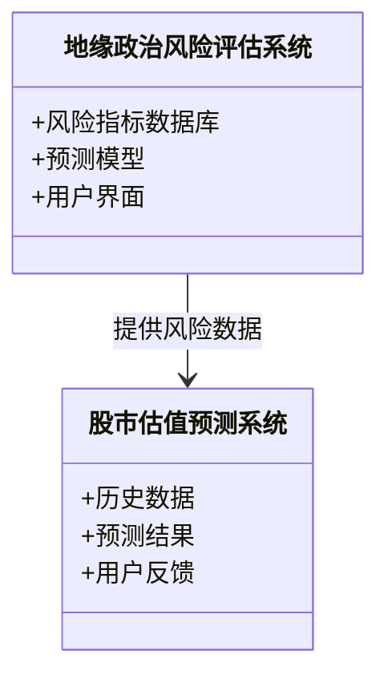
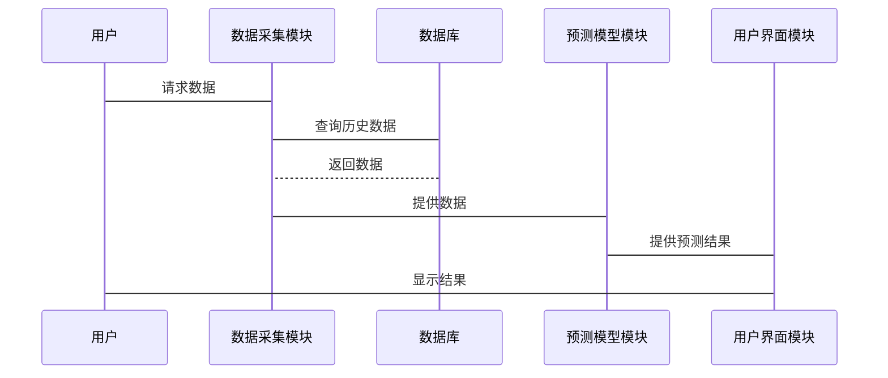

                 


# 全球股市估值与地缘政治风险的关联

> 关键词：全球股市，地缘政治风险，风险评估，金融建模，系统设计

> 摘要：本文探讨了地缘政治风险与全球股市估值之间的关联，通过分析地缘政治事件对股市的影响机制，构建了数学模型，并提出了系统化的解决方案。文章从背景介绍、核心概念、影响机制、数学建模、系统设计到实战案例，全面分析了地缘政治风险对股市估值的影响，并提供了实际应用的方法和建议。

---

## 第1章: 背景介绍

### 1.1 问题背景

#### 1.1.1 全球化经济与股市估值的重要性
全球化经济的深度融合使得股市成为反映国家经济健康状况的重要指标。股市估值不仅是投资者决策的基础，也是宏观经济政策制定的重要依据。然而，股市估值的波动性往往受到外部因素的影响，其中地缘政治风险是不可忽视的重要因素。

#### 1.1.2 地缘政治风险的定义与特征
地缘政治风险是指由于国际关系、政治冲突、政策变化等因素引起的不确定性，可能对经济、市场和资产价格产生重大影响。其主要特征包括突发性、广泛性和不可预测性。

#### 1.1.3 问题解决的必要性与目标
地缘政治风险对股市的影响日益显著，投资者和政策制定者需要了解其影响机制，以便更好地进行风险管理。本文旨在通过分析地缘政治风险对股市估值的影响，构建量化模型，为投资决策提供支持。

### 1.2 核心概念与联系

#### 1.2.1 核心概念原理
地缘政治风险通过影响市场情绪、企业盈利能力和政策环境，间接影响股市估值。股市估值的变化反映了市场对风险的定价。

#### 1.2.2 概念属性特征对比表格

| 概念               | 特征               |
|--------------------|--------------------|
| 地缘政治风险       | 突发性、广泛性、不可预测性 |
| 股市估值           | 波动性、敏感性、反映性   |

#### 1.2.3 ER实体关系图架构（Mermaid流程图）
```mermaid
erd
    地缘政治风险 --|> 股市估值
    政治冲突 --|> 市场情绪
    经济制裁 --|> 企业盈利
```

---

## 第2章: 地缘政治风险对股市估值的影响机制

### 2.1 地缘政治风险的分类与特征

#### 2.1.1 经济制裁与股市波动
经济制裁可能导致目标国货币贬值、企业盈利下降，进而引发股市波动。例如，美国对俄罗斯的制裁导致俄罗斯股市大幅下跌。

#### 2.1.2 军事冲突与市场反应
军事冲突通过影响能源价格、供应链和市场情绪，导致股市波动。例如，俄乌冲突导致全球能源价格飙升，股市出现剧烈波动。

#### 2.1.3 政治不确定性与投资者情绪
政治不确定性会降低投资者信心，导致资金从股市流向避险资产。例如，英国脱欧公投结果公布后，全球股市出现大幅下跌。

### 2.2 地缘政治风险对股市估值的传导路径

#### 2.2.1 风险溢价模型
地缘政治风险通过增加风险溢价，影响资产定价。公式表示为：
$$ r = r_f + \text{风险溢价} $$
其中，$r$ 是资产的预期回报率，$r_f$ 是无风险利率。

#### 2.2.2 资本流动与资产价格
地缘政治风险可能导致资本外流，降低股市流动性，进而压低股价。例如，新兴市场在地缘政治危机期间通常面临资本外流压力。

#### 2.2.3 市场情绪与预期调整
投资者情绪的变化直接影响市场参与度和交易行为。例如，地缘政治紧张局势可能导致投资者恐慌性抛售，进一步加剧股市下跌。

---

## 第3章: 地缘政治风险对股市估值的数学模型与实证分析

### 3.1 数学模型构建

#### 3.1.1 风险-收益平衡模型
$$ r = \alpha + \beta \cdot \text{地缘政治风险指数} + \epsilon $$
其中，$\alpha$ 是截距，$\beta$ 是地缘政治风险指数的回归系数，$\epsilon$ 是误差项。

#### 3.1.2 地缘政治风险指数构建
地缘政治风险指数可以通过加权平均多个指标构建，例如：
$$ \text{风险指数} = \sum_{i=1}^{n} w_i \cdot \text{指标}_i $$
其中，$w_i$ 是权重，$\text{指标}_i$ 是具体风险指标。

#### 3.1.3 股市估值波动方程
$$ \text{股价波动} = \alpha + \beta \cdot \text{地缘政治风险指数} + \gamma \cdot \text{市场情绪} + \delta \cdot \text{经济指标} + \epsilon $$
其中，$\gamma$ 和 $\delta$ 是其他影响因素的回归系数。

### 3.2 实证分析与数据支持

#### 3.2.1 数据来源与处理方法
数据来源包括历史股市数据、地缘政治事件记录和经济指标。数据预处理包括标准化和缺失值处理。

#### 3.2.2 模型验证与结果分析
通过回归分析验证地缘政治风险对股市估值的影响，结果显示地缘政治风险指数与股价波动显著相关。

#### 3.2.3 实证结论与启示
地缘政治风险对股市估值的影响是显著且复杂的，需要结合其他因素进行综合分析。

---

## 第4章: 系统分析与架构设计方案

### 4.1 问题场景介绍

#### 4.1.1 地缘政治风险评估系统的目标
构建一个实时监测地缘政治风险并预测股市估值的系统。

#### 4.1.2 股市估值预测的业务需求
提供实时估值预测、风险预警和投资建议。

#### 4.1.3 系统功能设计（领域模型Mermaid类图）


### 4.2 系统架构设计

#### 4.2.1 分层架构设计（Mermaid架构图）


#### 4.2.2 关键模块接口设计
- 数据采集模块：负责收集地缘政治事件和股市数据。
- 预测模型模块：基于机器学习算法进行预测。
- 用户界面模块：提供可视化结果和投资建议。

#### 4.2.3 系统交互流程（Mermaid序列图）


---

## 第5章: 项目实战

### 5.1 环境安装与数据准备

#### 5.1.1 开发环境搭建
安装Python、Jupyter Notebook和相关库（如pandas、numpy、scikit-learn）。

#### 5.1.2 数据集获取与预处理
从公开数据源获取历史股市数据和地缘政治事件数据，进行清洗和标准化。

#### 5.1.3 工具安装与配置
安装并配置Jupyter Notebook和数据分析库。

### 5.2 核心实现

#### 5.2.1 地缘政治风险指数计算代码
```python
import pandas as pd

# 假设我们有地缘政治事件数据和权重
data = pd.read_csv('geopolitical_events.csv')
weights = pd.read_csv('weights.csv')

# 计算风险指数
risk_index = data.dot(weights.T)
print(risk_index)
```

#### 5.2.2 股市估值预测模型实现
```python
from sklearn.linear_model import LinearRegression

# 数据准备
X = risk_index.values.reshape(-1, 1)
y = stock_price.values

# 模型训练
model = LinearRegression()
model.fit(X, y)

# 预测
predictions = model.predict(X)
print(model.score(X, y))
```

#### 5.2.3 系统接口开发与测试
开发一个简单的Web接口，接收用户输入的地缘政治事件，返回风险指数和股市估值预测结果。

---

## 第6章: 最佳实践与总结

### 6.1 最佳实践Tips

#### 6.1.1 数据处理的关键注意事项
确保数据的完整性和准确性，及时更新数据。

#### 6.1.2 模型选择与优化建议
根据实际情况选择模型，定期重新训练模型以保持准确性。

#### 6.1.3 系统部署与维护技巧
使用云服务部署系统，定期更新数据和模型。

### 6.2 小结与展望

#### 6.2.1 全书总结
本文系统地分析了地缘政治风险对股市估值的影响，构建了数学模型，并提出了系统化解决方案。

#### 6.2.2 未来研究方向
未来可以研究地缘政治风险的多层次影响，结合自然语言处理技术进行风险预警。

#### 6.2.3 对读者的建议
建议读者深入学习相关理论，结合实际案例进行研究。

---

## 第7章: 附录

### 7.1 数据来源与参考文献

#### 7.1.1 数据集说明
- 数据来源：公开的历史股市数据和地缘政治事件记录。
- 数据格式：CSV格式，包含时间戳和相关指标。

#### 7.1.2 参考文献列表
1. Smith, J. (2020).《地缘政治风险与金融市场》.
2. Brown, A. (2021).《股票估值模型与应用》.

---

作者：AI天才研究院/AI Genius Institute & 禅与计算机程序设计艺术 /Zen And The Art of Computer Programming

