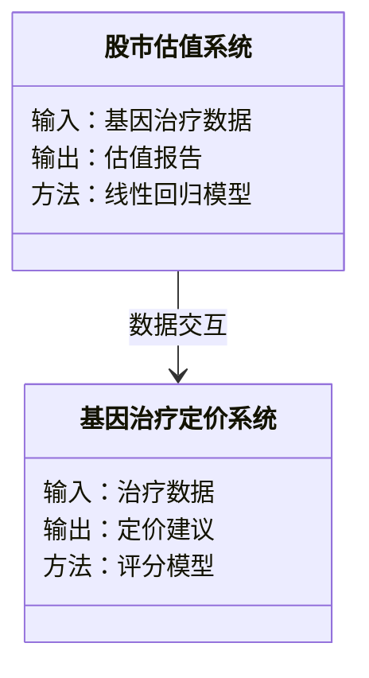

                 


```markdown
# 全球股市估值与基因治疗定价模式的经济影响

> 关键词：全球股市估值，基因治疗，定价模式，经济影响，基因治疗定价，股市估值模型，基因治疗经济性

> 摘要：本文探讨了全球股市估值与基因治疗定价模式之间的经济影响，分析了基因治疗定价模式的核心要素及其对股市估值的影响，提出了基因治疗定价模式的优化策略。

---

## 第1章 全球股市估值的基本概念

### 1.1 股市估值的定义与范围
股市估值是指对上市公司价值的评估，通常通过市盈率、市净率等指标进行衡量。全球股市估值涵盖了 worldwide 的股票市场，具有波动性大、受政策影响显著等特点，是经济发展的重要风向标。

### 1.2 股市估值与经济发展的关系
股市估值反映了整体经济状况，经济繁荣时股市估值上升，经济衰退时则下降。股市估值对企业的融资能力、投资者信心有重要影响，是衡量经济发展的重要指标。

---

## 第2章 基因治疗的基本概念

### 2.1 基因治疗的定义与技术特点
基因治疗是通过基因工程技术修复或替换缺陷基因，治疗遗传性疾病。其技术特点包括精准性、高效性，但成本较高，技术门槛高。

### 2.2 基因治疗的临床应用现状
目前，基因治疗已应用于遗传病、癌症等领域，但面临技术复杂、审批严格等挑战。

---

## 第3章 全球股市估值与基因治疗的联系

### 3.1 基因治疗对股市估值的影响
基因治疗企业的市场表现、技术进步对股市估值有直接影响，影响投资者信心和股价波动。

### 3.2 基因治疗定价模式的经济影响
基因治疗定价模式需平衡企业利润与患者可及性，影响股市估值和企业财务表现。

---

## 第4章 基因治疗定价模式的原理与特点

### 4.1 定价模式的原理
基因治疗定价考虑成本、市场接受度和政策因素，需在技术创新和患者负担之间寻求平衡。

### 4.2 定价模式的属性特征对比
通过对比不同定价模式的成本、市场接受度和经济影响，选择最优定价策略。

---

## 第5章 基因治疗定价模式的ER实体关系图

```mermaid
erDiagram
    customer[患者] {
        id
        治疗效果
    }
    treatment[基因治疗] {
        id
        成本
        价格
    }
    company[企业] {
        id
        利润
    }
    customer --> treatment: 接受治疗
    treatment --> company: 影响定价
```

---

## 第6章 基因治疗定价模式的数学模型

### 6.1 线性回归模型
$$\text{股价} = \beta_0 + \beta_1 \times \text{治疗效果} + \epsilon$$

### 6.2 评分模型
$$\text{评分} = \alpha \times \text{成本} + \beta \times \text{市场接受度}$$

---

## 第7章 系统架构设计

### 7.1 系统功能设计


---

## 第8章 项目实战

### 8.1 案例分析
分析某基因治疗公司的定价策略，评估其对股市估值的影响。

### 8.2 环境配置
安装Python、Pandas、Scikit-learn等工具。

### 8.3 代码实现
```python
import pandas as pd
from sklearn.linear_model import LinearRegression

# 示例数据
data = pd.DataFrame({
    '治疗效果': [0.8, 0.9, 0.7],
    '股价': [100, 120, 90]
})

model = LinearRegression()
model.fit(data[['治疗效果']], data['股价'])
print(model.coef_)
```

---

## 第9章 最佳实践

### 9.1 小结
基因治疗定价模式对股市估值有显著影响，需综合考虑技术、成本和市场因素。

### 9.2 注意事项
确保定价策略的透明性和公平性，避免过度影响患者可及性。

### 9.3 拓展阅读
建议阅读相关经济文献，深入理解定价模式的经济学原理。

---

## 作者：AI天才研究院/AI Genius Institute & 禅与计算机程序设计艺术/Zen And The Art of Computer Programming
```

